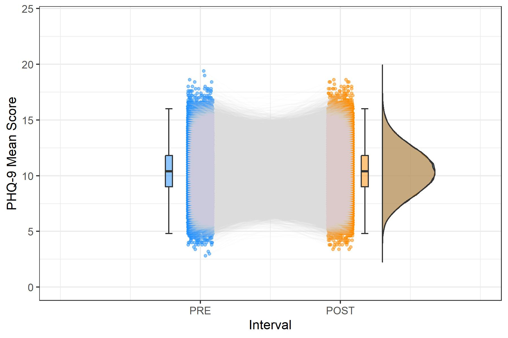

# Comparison of False-Positive Rates Between Classification Methods in a Zero-Effect Dataset

## Vorbereitung

```{r setup, message = FALSE,	warning = FALSE, include = FALSE}
knitr::opts_chunk$set(echo = TRUE)

setwd(
  "C:/Users/steph/OneDrive/Desktop/Psychologie/Masterstudium Psychologie/3. Semester/1. Master-Konversatorium/Preprocessing und Berechnungen"
)

pacman::p_load(plyr, dplyr, tidyverse, bootstrap, sjmisc, lattice, Rmisc, devtools, psych, DescTools, summarytools, kableExtra, lubridate, timetk, overlapping, ggplot2, gghalves, plot.matrix, caret)

EMA_5.5 = read.delim("cor_04_k62/cor_04_dataset_k62.txt", row.names=NULL) %>% 
  select(PRE0_1:POST0_5) %>% 
  add_column(., .before = "PRE0_1", ID = 1:nrow(.)) %>%
  as_tibble()

#EMA_1.1 = EMA_5.5 %>% 
#  select(ID, PRE0_1, POST0_1) %>% 
#  dplyr::rename(PRE = PRE0_1, POST = POST0_1)
#save(EMA_1.1, file = "cor_04_k62/EMA_1.1.RData")
#load("cor_04_k62/EMA_1.1.RData") #< einzelnes 1.1-dataset nur für pre-post-plot nötig

pre_5mzp = c("PRE0_1","PRE0_2","PRE0_3","PRE0_4","PRE0_5")
post_5mzp = c("POST0_1","POST0_2","POST0_3","POST0_4","POST0_5")

EMA_5.5$PRE_Mean = apply(EMA_5.5[pre_5mzp], 1, mean)
EMA_5.5$POST_Mean = apply(EMA_5.5[post_5mzp], 1, mean)
EMA_5.5$MeanDiff = EMA_5.5$PRE_Mean - EMA_5.5$POST_Mean
EMA_5.5$ind.pretestSD = apply(EMA_5.5[pre_5mzp], 1, sd)
EMA_5.5$ind.posttestSD = apply(EMA_5.5[post_5mzp], 1, sd)
EMA_5.5$Diff_1.1 = EMA_5.5$PRE0_1 - EMA_5.5$POST0_1

#EMA_1.1$Diff = as.numeric(EMA_1.1$PRE - EMA_1.1$POST) #< einzelnes 1.1-dataset nur für pre-post-plot nötig
```

***

## Ausschluss von n = 36 Fällen mit Intervall-SDs == 0, danach N = 99964

```{r}
#length(which(EMA_5.5$ind.pretestSD == 0)) #20
#length(which(EMA_5.5$ind.posttestSD == 0)) #16

EMA_5.5 = EMA_5.5 %>% 
  filter(ind.pretestSD != 0 & ind.posttestSD != 0)

#EMA_1.1 = EMA_1.1 %>% 
#  filter(ID %in% EMA_5.5$ID) #< einzelnes 1.1-dataset nur für pre-post-plot nötig

#sum(EMA_5.5$ID == EMA_1.1$ID) #99964 - also IDs absolut gleich
EMA_5.5$ID = 1:nrow(EMA_5.5)
#EMA_1.1$ID = 1:nrow(EMA_1.1) #< einzelnes 1.1-dataset nur für pre-post-plot nötig
```

***

## Überblick

```{r eval=FALSE}
# don´t run this section (code for extremely computation-intense plots that I already stored as .RData and .jpg)
# repeated-measures scatter-boxplot-violin-histograms for individual PRE and POST means
# from van Langen (2020) Open-visualizations tutorial for repeated measures in R

# EMA_5.5
# converting my dataframes to use in the same ggplot structure:
EMA_5.5_ts = EMA_5.5 %>% 
  select(ID, PRE_Mean, POST_Mean) %>% 
  pivot_longer(!ID, names_to = "Interval", values_to = "Mean") %>% 
  mutate(ID = as.factor(ID),
         Interval = rep(c(1,2), times = nrow(EMA_5.5)))

save(EMA_5.5_ts, file = "Time Series Dataframes/k62_EMA_5.5_ts.RData")

###

load("Time Series Dataframes/k62_EMA_5.5_ts.RData")

# Repeated measures with box− and violin plots
EMA_5.5_ts$jit = jitter(EMA_5.5_ts$Interval, amount = .09)

Pre_Post_Box_Violin = ggplot(data = EMA_5.5_ts, aes(y = Mean)) +
  geom_point(data = EMA_5.5_ts %>% filter(Interval == "1"), aes(x = jit), color = "dodgerblue", size = 1,
             alpha = .5) +
  geom_point(data = EMA_5.5_ts %>% filter(Interval == "2"), aes(x = jit), color = "darkorange", size = 1,
             alpha = .5) +
  geom_line(aes(x = jit, group = ID), color = "lightgray", alpha = .05) +
  geom_half_boxplot(
    data = EMA_5.5_ts %>% filter(Interval == "1"), aes(x = Interval, y = Mean), position = position_nudge(x = -.25),
    side = "r", outlier.shape = NA, center = TRUE, errorbar.draw = TRUE, width = .1,
    fill = "dodgerblue", alpha = .5) +
  geom_half_boxplot(
    data = EMA_5.5_ts %>% filter(Interval == "2"), aes(x = Interval, y = Mean), position = position_nudge(x = .15),
    side = "r", outlier.shape = NA, center = TRUE, errorbar.draw = TRUE, width = .1,
    fill = "darkorange", alpha = .5) +
  geom_half_violin(
    data = EMA_5.5_ts %>% filter(Interval == "1"), aes(x = Interval, y = Mean), position = position_nudge(x = 1.3),
    side = "r", fill = "dodgerblue", alpha = .5, trim = FALSE) +
  geom_half_violin(
    data = EMA_5.5_ts %>% filter(Interval == "2"), aes(x = Interval, y = Mean), position = position_nudge(x = .3),
    side = "r", fill = "darkorange", alpha = .5, trim = FALSE) +
  scale_x_continuous(breaks = c(1,2), labels = c("PRE", "POST"), limits = c(0, 3)) +
  xlab("Interval") + ylab("PHQ-9 Mean Score") +
  #ggtitle("EMA Data (5+5 Timepoints): Individual Pre-Post Means") +
  #theme_classic() +
  theme_bw() +
  coord_cartesian(ylim = c(0, 24))

ggsave("Time Series Dataframes/k62_EMA_5.5_Pre-Post_Box_Violin.jpg", plot = Pre_Post_Box_Violin, width = 6, height = 4)
save(Pre_Post_Box_Violin, file = "Time Series Dataframes/k62_EMA_5.5_Pre_Post_Box_Violin.RData")


# Repeated measures with box− and violin plots and means + CIs
score_mean_1 = EMA_5.5_ts %>% filter(Interval == "1") %>% summarise(mean(Mean)) %>% as.numeric()
score_mean_2 = EMA_5.5_ts %>% filter(Interval == "2") %>% summarise(mean(Mean)) %>% as.numeric()
score_median1 = EMA_5.5_ts %>% filter(Interval == "1") %>% summarise(median(Mean)) %>% as.numeric()
score_median2 = EMA_5.5_ts %>% filter(Interval == "2") %>% summarise(median(Mean)) %>% as.numeric()
score_sd_1 = EMA_5.5_ts %>% filter(Interval == "1") %>% summarise(sd(Mean)) %>% as.numeric()
score_sd_2 = EMA_5.5_ts %>% filter(Interval == "2") %>% summarise(sd(Mean)) %>% as.numeric()
score_se_1 = score_sd_1/sqrt(nrow(EMA_5.5))
score_se_2 = score_sd_2/sqrt(nrow(EMA_5.5))
score_ci_1 = EMA_5.5_ts %>% filter(Interval == "1") %>% pull(Mean) %>% CI(., ci = 0.95)
score_ci_2 = EMA_5.5_ts %>% filter(Interval == "2") %>% pull(Mean) %>% CI(., ci = 0.95)
#Create data frame with 2 rows and 7 columns containing the descriptives
group = c("PRE", "POST")
N = c(nrow(EMA_5.5), nrow(EMA_5.5))
score_mean = c(score_mean_1, score_mean_2)
score_median = c(score_median1, score_median2)
sd = c(score_sd_1, score_sd_2)
se = c(score_se_1, score_se_2)
ci = c(as.numeric(score_ci_1[1] - score_ci_1[3]), as.numeric(score_ci_2[1] - score_ci_2[3]))
summary_df = data.frame(group, N, score_mean, score_median, sd, se, ci)

# EMA_5.5_ts$jit = jitter(EMA_5.5_ts$Interval, amount = .09)     #already created above
x_tick_means = c(.87, 2.13)

Pre_Post_Box_Violin_Mean_CI = ggplot(data = EMA_5.5_ts, aes(y = Mean)) +
  geom_point(data = EMA_5.5_ts %>% filter(Interval == "1"), aes(x = jit), color = "dodgerblue", size = 1,
             alpha = .6) +
  geom_point(data = EMA_5.5_ts %>% filter(Interval == "2"), aes(x = jit), color = "darkorange", size = 1,
             alpha = .6) +
  geom_line(aes(x = jit, group = ID), color = "lightgray", alpha = .05) +
  geom_half_boxplot(
    data = EMA_5.5_ts %>% filter(Interval == "1"), aes(x = Interval, y = Mean), position = position_nudge(x = -.28),
    side = "r", outlier.shape = NA, center = TRUE, errorbar.draw = FALSE, width = .2,
    fill = "dodgerblue") +
  geom_half_boxplot(
    data = EMA_5.5_ts %>% filter(Interval == "2"), aes(x = Interval, y = Mean), position = position_nudge(x = .18),
    side = "r", outlier.shape = NA, center = TRUE, errorbar.draw = FALSE, width = .2,
    fill = "darkorange") +
  geom_half_violin(
    data = EMA_5.5_ts %>% filter(Interval == "1"), aes(x = Interval, y = Mean), position = position_nudge(x = -.3),
    side = "l", fill = "dodgerblue") +
  geom_half_violin(
    data = EMA_5.5_ts %>% filter(Interval == "2"),aes(x = Interval, y = Mean), position = position_nudge(x = .3),
    side = "r", fill = "darkorange") +
  geom_point(data = EMA_5.5_ts %>% filter(Interval == "1"), aes(x = Interval, y = score_mean[1]),
             position = position_nudge(x = -.13), color = "dodgerblue", alpha = .6, size = 1.5) +
  geom_errorbar(data = EMA_5.5_ts %>% filter(Interval == "1"), aes(x = Interval, y = score_mean[1],
                                                 ymin = score_mean[1]-ci[1], ymax = score_mean[1]+ci[1]),
                position = position_nudge(-.13), color = "dodgerblue", width = 0.05, size = 0.4, alpha = .6) +
  geom_point(data = EMA_5.5_ts %>% filter(Interval == "2"), aes(x = Interval, y = score_mean[2]),
             position = position_nudge(x = .13), color = "darkorange", alpha = .6, size = 1.5)+
  geom_errorbar(data = EMA_5.5_ts %>% filter(Interval == "2"), aes(x = Interval, y = score_mean[2],
                                                 ymin = score_mean[2]-ci[2], ymax = score_mean[2]+ci[2]), 
                position = position_nudge(.13), color = "darkorange", width = 0.05, size = 0.4, alpha = .6) +
  geom_line(data = summary_df, aes(x = x_tick_means, y = score_mean), color = "gray", size = 1) +
  scale_x_continuous(breaks = c(1,2), labels = c("PRE", "POST"), limits = c(0, 3)) +
  xlab("Interval") + ylab("PHQ-9 Mean Score") +
  #ggtitle("EMA Data (5+5 Timepoints): Individual Pre-Post Means") +
  #theme_classic() +
  theme_bw() +
  coord_cartesian(ylim = c(0, 24))

ggsave("Time Series Dataframes/k62_EMA_5.5_Pre-Post_Box_Violin_Mean+CI.jpg", plot = Pre_Post_Box_Violin_Mean_CI, width = 6, height = 4)
save(Pre_Post_Box_Violin_Mean_CI, file = "Time Series Dataframes/k62_EMA_5.5_Pre_Post_Box_Violin_Mean_CI.RData")
```

```{r fig.align="center", out.width="75%"}
#

```

```{r eval=FALSE}
# don´t run this section (code for extremely computation-intense plots that I already stored as .RData and .jpg)
# repeated-measures scatter-boxplot-violin-histograms for individual PRE and POST means
# from van Langen (2020) Open-visualizations tutorial for repeated measures in R

# EMA_1.1
# converting my dataframes to use in the same ggplot structure:
EMA_1.1_ts = EMA_1.1 %>% 
  select(ID, PRE, POST) %>% 
  pivot_longer(!ID, names_to = "Timepoint", values_to = "Score") %>% 
  mutate(ID = as.factor(ID),
         Timepoint = rep(c(1,2), times = nrow(EMA_1.1)))

save(EMA_1.1_ts, file = "Time Series Dataframes/k62_EMA_1.1_ts.RData")

###

load("Time Series Dataframes/k62_EMA_1.1_ts.RData")

# Repeated measures with box− and violin plots
EMA_1.1_ts$jit = jitter(EMA_1.1_ts$Timepoint, amount = .09)

Pre_Post_Box_Violin = ggplot(data = EMA_1.1_ts, aes(y = Score)) +
  geom_point(data = EMA_1.1_ts %>% filter(Timepoint == "1"), aes(x = jit), color = "dodgerblue", size = 1,
             alpha = .5) +
  geom_point(data = EMA_1.1_ts %>% filter(Timepoint == "2"), aes(x = jit), color = "darkorange", size = 1,
             alpha = .5) +
  geom_line(aes(x = jit, group = ID), color = "lightgray", alpha = .05) +
  geom_half_boxplot(
    data = EMA_1.1_ts %>% filter(Timepoint == "1"), aes(x = Timepoint, y = Score), position = position_nudge(x = -.25),
    side = "r", outlier.shape = NA, center = TRUE, errorbar.draw = TRUE, width = .1,
    fill = "dodgerblue", alpha = .5) +
  geom_half_boxplot(
    data = EMA_1.1_ts %>% filter(Timepoint == "2"), aes(x = Timepoint, y = Score), position = position_nudge(x = .15),
    side = "r", outlier.shape = NA, center = TRUE, errorbar.draw = TRUE, width = .1,
    fill = "darkorange", alpha = .5) +
  geom_half_violin(
    data = EMA_1.1_ts %>% filter(Timepoint == "1"), aes(x = Timepoint, y = Score), position = position_nudge(x = 1.3),
    side = "r", fill = "dodgerblue", alpha = .5, trim = FALSE) +
  geom_half_violin(
    data = EMA_1.1_ts %>% filter(Timepoint == "2"), aes(x = Timepoint, y = Score), position = position_nudge(x = .3),
    side = "r", fill = "darkorange", alpha = .5, trim = FALSE) +
  scale_x_continuous(breaks = c(1,2), labels = c("PRE", "POST"), limits = c(0, 3)) +
  xlab("Single Assessment") + ylab("PHQ-9 Score") +
  #ggtitle("EMA Data (1+1 Timepoints): Individual Pre-Post Means") +
  #theme_classic() +
  theme_bw() +
  coord_cartesian(ylim = c(0, 24))

ggsave("Time Series Dataframes/k62_EMA_1.1_Pre-Post_Box_Violin.jpg", plot = Pre_Post_Box_Violin, width = 6, height = 4)
save(Pre_Post_Box_Violin, file = "Time Series Dataframes/k62_EMA_1.1_Pre_Post_Box_Violin.RData")


# Repeated measures with box− and violin plots and means + CIs
score_mean_1 = EMA_1.1_ts %>% filter(Timepoint == "1") %>% summarise(mean(Score)) %>% as.numeric()
score_mean_2 = EMA_1.1_ts %>% filter(Timepoint == "2") %>% summarise(mean(Score)) %>% as.numeric()
score_median1 = EMA_1.1_ts %>% filter(Timepoint == "1") %>% summarise(median(Score)) %>% as.numeric()
score_median2 = EMA_1.1_ts %>% filter(Timepoint == "2") %>% summarise(median(Score)) %>% as.numeric()
score_sd_1 = EMA_1.1_ts %>% filter(Timepoint == "1") %>% summarise(sd(Score)) %>% as.numeric()
score_sd_2 = EMA_1.1_ts %>% filter(Timepoint == "2") %>% summarise(sd(Score)) %>% as.numeric()
score_se_1 = score_sd_1/sqrt(nrow(EMA_1.1))
score_se_2 = score_sd_2/sqrt(nrow(EMA_1.1))
score_ci_1 = EMA_1.1_ts %>% filter(Timepoint == "1") %>% pull(Score) %>% CI(., ci = 0.95)
score_ci_2 = EMA_1.1_ts %>% filter(Timepoint == "2") %>% pull(Score) %>% CI(., ci = 0.95)
#Create data frame with 2 rows and 7 columns containing the descriptives
group = c("PRE", "POST")
N = c(nrow(EMA_1.1), nrow(EMA_1.1))
score_mean = c(score_mean_1, score_mean_2)
score_median = c(score_median1, score_median2)
sd = c(score_sd_1, score_sd_2)
se = c(score_se_1, score_se_2)
ci = c((score_ci_1[1] - score_ci_1[3]), (score_ci_2[1] - score_ci_2[3]))
summary_df = data.frame(group, N, score_mean, score_median, sd, se, ci)

# EMA_1.1_ts$jit = jitter(EMA_1.1_ts$Timepoint, amount = .09)     #already created above
x_tick_means = c(.87, 2.13)

Pre_Post_Box_Violin_Mean_CI = ggplot(data = EMA_1.1_ts, aes(y = Score)) +
  geom_point(data = EMA_1.1_ts %>% filter(Timepoint == "1"), aes(x = jit), color = "dodgerblue", size = 1,
             alpha = .6) +
  geom_point(data = EMA_1.1_ts %>% filter(Timepoint == "2"), aes(x = jit), color = "darkorange", size = 1,
             alpha = .6) +
  geom_line(aes(x = jit, group = ID), color = "lightgray", alpha = .05) +
  geom_half_boxplot(
    data = EMA_1.1_ts %>% filter(Timepoint == "1"), aes(x = Timepoint, y = Score), position = position_nudge(x = -.28),
    side = "r", outlier.shape = NA, center = TRUE, errorbar.draw = FALSE, width = .2,
    fill = "dodgerblue") +
  geom_half_boxplot(
    data = EMA_1.1_ts %>% filter(Timepoint == "2"), aes(x = Timepoint, y = Score), position = position_nudge(x = .18),
    side = "r", outlier.shape = NA, center = TRUE, errorbar.draw = FALSE, width = .2,
    fill = "darkorange") +
  geom_half_violin(
    data = EMA_1.1_ts %>% filter(Timepoint == "1"), aes(x = Timepoint, y = Score), position = position_nudge(x = -.3),
    side = "l", fill = "dodgerblue") +
  geom_half_violin(
    data = EMA_1.1_ts %>% filter(Timepoint == "2"),aes(x = Timepoint, y = Score), position = position_nudge(x = .3),
    side = "r", fill = "darkorange") +
  geom_point(data = EMA_1.1_ts %>% filter(Timepoint == "1"), aes(x = Timepoint, y = score_mean[1]),
             position = position_nudge(x = -.13), color = "dodgerblue", alpha = .6, size = 1.5) +
  geom_errorbar(data = EMA_1.1_ts %>% filter(Timepoint == "1"), aes(x = Timepoint, y = score_mean[1],
                                                 ymin = score_mean[1]-ci[1], ymax = score_mean[1]+ci[1]),
                position = position_nudge(-.13), color = "dodgerblue", width = 0.05, size = 0.4, alpha = .6) +
  geom_point(data = EMA_1.1_ts %>% filter(Timepoint == "2"), aes(x = Timepoint, y = score_mean[2]),
             position = position_nudge(x = .13), color = "darkorange", alpha = .6, size = 1.5)+
  geom_errorbar(data = EMA_1.1_ts %>% filter(Timepoint == "2"), aes(x = Timepoint, y = score_mean[2],
                                                 ymin = score_mean[2]-ci[2], ymax = score_mean[2]+ci[2]), 
                position = position_nudge(.13), color = "darkorange", width = 0.05, size = 0.4, alpha = .6) +
  geom_line(data = summary_df, aes(x = x_tick_means, y = score_mean), color = "gray", size = 1) +
  scale_x_continuous(breaks = c(1,2), labels = c("PRE", "POST"), limits = c(0, 3)) +
  xlab("Single Assessment") + ylab("PHQ-9 Score") +
  #ggtitle("EMA Data (1+1 Timepoints): Individual Pre-Post Means") +
  #theme_classic() +
  theme_bw() +
  coord_cartesian(ylim = c(0, 24))

ggsave("Time Series Dataframes/k62_EMA_1.1_Pre-Post_Box_Violin_Mean+CI.jpg", plot = Pre_Post_Box_Violin_Mean_CI, width = 6, height = 4)
save(Pre_Post_Box_Violin_Mean_CI, file = "Time Series Dataframes/k62_EMA_1.1_Pre_Post_Box_Violin_Mean_CI.RData")
```

```{r fig.align="center", out.width="75%"}
#

```

```{r message=FALSE, warning=FALSE}
print(dfSummary(EMA_5.5[,12:17], varnumbers = FALSE, plain.ascii = FALSE, style = 'grid', graph.magnif = 0.75, 
                valid.col = FALSE, na.col = FALSE, display.labels = FALSE, silent = FALSE, headers = FALSE, 
                footnote = NA, tmp.img.dir = "/tmp"), method = 'render')
```

***

## Reliabilitäten und Inter-Item-Korrelationen

```{r}
# Korrelationsmatrix von PRE- und POST-MZP:
EMA_5.5_KorMat = cor(EMA_5.5[, c(pre_5mzp, post_5mzp)]) %>% 
  round(., digits = 2)

# durchschnittliche paarweise Korrelation zwischen aufeinanderfolgenden MZP (Fisher-Z-transformiert):
pre_inter_item_rtt = 0L
for (i in 1:4) {
  pre_inter_item_rtt = pre_inter_item_rtt + FisherZ(EMA_5.5_KorMat[i,i+1])
}
(pre_inter_item_rtt = FisherZInv(pre_inter_item_rtt / 4))

post_inter_item_rtt = 0L
for (i in 5:9) {
  post_inter_item_rtt = post_inter_item_rtt + FisherZ(EMA_5.5_KorMat[i,i+1])
}
(post_inter_item_rtt = FisherZInv(post_inter_item_rtt / 4))


for (i in 1:9) {
  EMA_5.5_KorMat[i, i+1] = cell_spec(EMA_5.5_KorMat[i, i+1], "html", bold = TRUE)
}

rownames(EMA_5.5_KorMat) = cell_spec(rownames(EMA_5.5_KorMat), "html", bold = TRUE)

EMA_5.5_KorMat %>%
  kable(., format = "html", escape = FALSE) %>%
  kable_styling(bootstrap_options = c("striped", "hover", "condensed"),
                full_width = FALSE, fixed_thead = T)

# mittleres Cronbach´s Alpha zwischen Pre-MZP und Post-MZP:
PRE_alpha = CronbachAlpha(EMA_5.5[pre_5mzp])
POST_alpha = CronbachAlpha(EMA_5.5[post_5mzp])
(EMA_5.5_Alpha = FisherZInv(mean(c(FisherZ(PRE_alpha), FisherZ(POST_alpha)))))
```

***

## Pre-Post-Veränderungen

```{r message=FALSE, message=FALSE, warning=FALSE, fig.align="center", out.width="75%"}
temp = tibble(Score_Diff = c(EMA_5.5$MeanDiff, EMA_5.5$Diff_1.1), 
              Type = rep(c("MeanDiff", "Diff_1.1"), each = length(EMA_5.5$MeanDiff)))

ggplot(temp, aes(x = Type, y = Score_Diff)) + 
  geom_boxplot() + 
  ggtitle("PHQ-9 PRE(-Mean)") +
  xlab("Calculation") +
  ylab("PHQ-9 Score Differences")

final.plot(list(EMA_5.5_PRE_Mean = EMA_5.5$PRE_Mean, EMA_5.5_POST_Mean = EMA_5.5$POST_Mean), 
           overlap(list(EMA_5.5_PRE_Mean = EMA_5.5$PRE_Mean, EMA_5.5_POST_Mean = EMA_5.5$POST_Mean))$OV)

scatter.hist(EMA_5.5$Diff_1.1, EMA_5.5$MeanDiff, xlab = "EMA_5.5$Diff_1.1 (blue)",
             ylab = "EMA_5.5$MeanDiff (orange)", ellipse = FALSE, grid = TRUE, col = c("dodgerblue", "darkorange"))
```

### Cohen´s d

```{r}
EMA_5.5$Cohen_d = (EMA_5.5$PRE_Mean - EMA_5.5$POST_Mean) / sqrt(0.5 * (EMA_5.5$ind.pretestSD^2 + EMA_5.5$ind.posttestSD^2))
summary(EMA_5.5$Cohen_d)

(cohen_d_5.5 = (mean(EMA_5.5$PRE_Mean) - mean(EMA_5.5$POST_Mean)) / 
    sqrt(0.5 * (mean(EMA_5.5$ind.pretestSD)^2 + mean(EMA_5.5$ind.posttestSD)^2)))
```

### PHQ-9-Interpretation

```{r}
EMA_5.5 = EMA_5.5 %>% 
  mutate(PRE_Mean_klass = case_when(
    PRE_Mean <= 4 ~ 0,
    PRE_Mean > 4 & PRE_Mean < 10 ~ 1,
    PRE_Mean >= 10 & PRE_Mean < 15 ~ 2,
    PRE_Mean >= 15 & PRE_Mean < 20 ~ 3,
    PRE_Mean >= 20 ~ 4,
    TRUE ~ PRE_Mean))

EMA_5.5 = EMA_5.5 %>% 
  mutate(POST_Mean_klass = case_when(
    POST_Mean <= 4 ~ 0,
    POST_Mean > 4 & POST_Mean < 10 ~ 1,
    POST_Mean >= 10 & POST_Mean < 15 ~ 2,
    POST_Mean >= 15 & POST_Mean < 20 ~ 3,
    POST_Mean >= 20 ~ 4,
    TRUE ~ POST_Mean))

EMA_5.5 = EMA_5.5 %>% 
  mutate(PRE_klass = case_when(
    PRE0_1 <= 4 ~ 0,
    PRE0_1 > 4 & PRE0_1 < 10 ~ 1,
    PRE0_1 >= 10 & PRE0_1 < 15 ~ 2,
    PRE0_1 >= 15 & PRE0_1 < 20 ~ 3,
    PRE0_1 >= 20 ~ 4,
    TRUE ~ as.numeric(PRE0_1)))

EMA_5.5 = EMA_5.5 %>% 
  mutate(POST_klass = case_when(
    POST0_1 <= 4 ~ 0,
    POST0_1 > 4 & POST0_1 < 10 ~ 1,
    POST0_1 >= 10 & POST0_1 < 15 ~ 2,
    POST0_1 >= 15 & POST0_1 < 20 ~ 3,
    POST0_1 >= 20 ~ 4,
    TRUE ~ as.numeric(POST0_1)))
```

### Percentage Change

```{r}
EMA_5.5$Mean_PC = (1-(EMA_5.5$POST_Mean / EMA_5.5$PRE_Mean)) * 100

# Sollen Mean_PC %in% c(-Inf,Inf) ein-/ausgeschlossen werden?
#EMA_5.5 = EMA_5.5 %>% 
#  within(., {Mean_PC[Mean_PC %in% c(-Inf,Inf)] = NA})

EMA_5.5 = EMA_5.5 %>% 
  mutate(Mean_PC_klass = case_when(
    Mean_PC <= -50 ~ -2,
    Mean_PC > -50 & Mean_PC <= -25 ~ -1,
    Mean_PC > -25 & Mean_PC < 25 ~ 0,
    Mean_PC >= 25 & Mean_PC < 50 ~ 1,
    Mean_PC >= 50 ~ 2,
    TRUE ~ Mean_PC))

EMA_5.5$PC = (1 - (EMA_5.5$POST0_1 / EMA_5.5$PRE0_1)) * 100

# Sollen PC %in% c(-Inf,Inf) ein-/ausgeschlossen werden?
#EMA_5.5 = EMA_5.5 %>% 
#  within(., {PC[PC %in% c(-Inf,Inf)] = NA})

EMA_5.5 = EMA_5.5 %>% 
  mutate(PC_klass = case_when(
    PC <= -50 ~ -2,
    PC > -50 & PC <= -25 ~ -1,
    PC > -25 & PC < 25 ~ 0,
    PC >= 25 & PC < 50 ~ 1,
    PC >= 50 ~ 2,
    TRUE ~ as.numeric(PC)))
```

### Reliable Change Index (JT)

```{r}
EMA_5.5$RCI_JT = (EMA_5.5$POST0_1 - EMA_5.5$PRE0_1) / sqrt(2 * (sd(EMA_5.5$PRE0_1) * sqrt(1 - EMA_5.5_Alpha)) ^ 2)

EMA_5.5 = EMA_5.5 %>% 
  mutate(RCI_JT_klass = case_when(
    #RCI_JT < -1.96 ~ -1,
    #RCI_JT >= -1.96 & RCI_JT < 1.96 ~ 0,
    #RCI_JT > 1.96 ~ 1,
    #TRUE ~ RCI_JT
    PRE0_1 >= 10 & POST0_1 <= 9 & RCI_JT < -1.96 ~ -1, #<------------- Cutoff-Kriterium hinzugefügt#
    PRE0_1 <= 9 & POST0_1 >= 10 & RCI_JT > 1.96 ~ 1, #<------------- Cutoff-Kriterium hinzugefügt#
    TRUE ~ 0 #<------------- Cutoff-Kriterium hinzugefügt#
    ))
```

### Individual Reliable Change Index (ind)

> auf Intervall-SDs == 0 achten! (produzieren RCIs = NA)
> z.B. testen mit which(is.nan(EMA_5.5$RCI_ind_preSD_klass))

#### RCI(ind) nur mit SD aus dem individuellen Pre-Intervall

```{r}
EMA_5.5$SEd_pre = sqrt(2 * (EMA_5.5$ind.pretestSD * sqrt(1 - EMA_5.5_Alpha)) ^ 2)
EMA_5.5$RCI_ind_preSD = (EMA_5.5$POST_Mean - EMA_5.5$PRE_Mean) / EMA_5.5$SEd_pre

EMA_5.5 = EMA_5.5 %>% 
  mutate(RCI_ind_preSD_klass = case_when(
    #RCI_ind_preSD < -1.96 ~ -1,
    #RCI_ind_preSD >= -1.96 & RCI_ind_preSD < 1.96 ~ 0,
    #RCI_ind_preSD > 1.96 ~ 1,
    #TRUE ~ RCI_ind_preSD
    PRE_Mean >= 10 & POST_Mean <= 9 & RCI_ind_preSD < -1.96 ~ -1, #<------------- Cutoff-Kriterium hinzugefügt#
    PRE_Mean <= 9 & POST_Mean >= 10 & RCI_ind_preSD > 1.96 ~ 1, #<------------- Cutoff-Kriterium hinzugefügt#
    TRUE ~ 0 #<------------- Cutoff-Kriterium hinzugefügt#
    ))
```

#### RCI(ind) mit pooled SDs aus beiden individuellen Intervallen

```{r}
EMA_5.5$SEd_pooled = sqrt((EMA_5.5$ind.pretestSD ^ 2 + EMA_5.5$ind.posttestSD ^ 2) * (1 - EMA_5.5_Alpha))
EMA_5.5$RCI_ind_pooledSD = (EMA_5.5$POST_Mean - EMA_5.5$PRE_Mean) / EMA_5.5$SEd_pooled

EMA_5.5 = EMA_5.5 %>% 
  mutate(RCI_ind_pooledSD_klass = case_when(
    #RCI_ind_pooledSD < -1.96 ~ -1,
    #RCI_ind_pooledSD >= -1.96 & RCI_ind_pooledSD < 1.96 ~ 0,
    #RCI_ind_pooledSD > 1.96 ~ 1,
    #TRUE ~ RCI_ind_pooledSD
    PRE_Mean >= 10 & POST_Mean <= 9 & RCI_ind_pooledSD < -1.96 ~ -1, #<------------- Cutoff-Kriterium hinzugefügt#
    PRE_Mean <= 9 & POST_Mean >= 10 & RCI_ind_pooledSD > 1.96 ~ 1, #<------------- Cutoff-Kriterium hinzugefügt#
    TRUE ~ 0 #<------------- Cutoff-Kriterium hinzugefügt#
    ))
```

### Edwards-Nunnally-Methode (EN) nach Speer (1992)

```{r}
EMA_5.5$EN_5.5_min = (EMA_5.5_Alpha * (EMA_5.5$PRE_Mean - mean(EMA_5.5$PRE_Mean)) + 
                       mean(EMA_5.5$PRE_Mean)) - 2 * mean(EMA_5.5$ind.pretestSD) * sqrt(1 - EMA_5.5_Alpha)
EMA_5.5$EN_5.5_max = (EMA_5.5_Alpha * (EMA_5.5$PRE_Mean - mean(EMA_5.5$PRE_Mean)) + 
                       mean(EMA_5.5$PRE_Mean)) + 2 * mean(EMA_5.5$ind.pretestSD) * sqrt(1 - EMA_5.5_Alpha)

EMA_5.5 = EMA_5.5 %>% 
  mutate(EN_5.5_klass = case_when(
    POST_Mean > EN_5.5_max ~ 1,
    POST_Mean <= EN_5.5_max & POST_Mean >= EN_5.5_min ~ 0,
    POST_Mean < EN_5.5_min ~ -1,
    TRUE ~ POST_Mean))

EMA_5.5$EN_1.1_min = (EMA_5.5_Alpha * (EMA_5.5$PRE0_1 - mean(EMA_5.5$PRE0_1)) + 
                       mean(EMA_5.5$PRE0_1)) - 2 * sd(EMA_5.5$PRE0_1) * sqrt(1 - EMA_5.5_Alpha)
EMA_5.5$EN_1.1_max = (EMA_5.5_Alpha * (EMA_5.5$PRE0_1 - mean(EMA_5.5$PRE0_1)) + 
                       mean(EMA_5.5$PRE0_1)) + 2 * sd(EMA_5.5$PRE0_1) * sqrt(1 - EMA_5.5_Alpha)

EMA_5.5 = EMA_5.5 %>% 
  mutate(EN_1.1_klass = case_when(
    POST0_1 > EN_1.1_max ~ 1,
    POST0_1 <= EN_1.1_max & POST0_1 >= EN_1.1_min ~ 0,
    POST0_1 < EN_1.1_min ~ -1,
    TRUE ~ as.numeric(POST0_1)))
```

### Clinically Significant Improvement (CSI)

```{r}
EMA_5.5 = EMA_5.5 %>% 
  mutate(CSI_5.5_klass = case_when(
    PRE_Mean >= 10 & POST_Mean <= 9 & Mean_PC >= 50 ~ -1,
    PRE_Mean <= 9 & POST_Mean >= 10 & Mean_PC <= -50 ~ 1,
    TRUE ~ 0))

EMA_5.5 = EMA_5.5 %>% 
  mutate(CSI_1.1_klass = case_when(
    PRE_Mean >= 10 & POST_Mean <= 9 & Mean_PC >= 50 ~ -1,
    PRE_Mean <= 9 & POST_Mean >= 10 & Mean_PC <= -50 ~ 1,
    TRUE ~ 0))
```

***

## Übereinstimmung der Klassifikationen

```{r message=FALSE, warning=FALSE}
# einheitliche Kodierung von Verbesserung (-1), keiner Veränderung (0) und Verschlechterung (1):

temp = EMA_5.5 %>% 
  select(Mean_PC_klass, PC_klass, RCI_JT_klass, RCI_ind_preSD_klass, RCI_ind_pooledSD_klass, EN_5.5_klass, 
         EN_1.1_klass, CSI_5.5_klass, CSI_1.1_klass) %>% 
  dplyr::rename(Mean_PC_5.5 = Mean_PC_klass, PC_1.1 = PC_klass, RCI_JT_1.1 = RCI_JT_klass, 
         RCI_ind_preSD_5.5 = RCI_ind_preSD_klass, RCI_ind_pooledSD_5.5 = RCI_ind_pooledSD_klass,
         EN_5.5 = EN_5.5_klass, EN_1.1 = EN_1.1_klass, CSI_5.5 = CSI_5.5_klass, CSI_1.1 = CSI_1.1_klass) %>% 
  mutate(Mean_PC_5.5 = recode(Mean_PC_5.5, '-2' = 1L, '-1' = 0L, '0' = 0L, '1' = 0L, '2' = -1L),
         PC_1.1 = recode(PC_1.1, '-2' = 1L, '-1' = 0L, '0' = 0L, '1' = 0L, '2' = -1L)) %>% 
  mutate(across(.cols = everything(), as.factor))

rnames = names(temp)

print(dfSummary(temp, varnumbers = FALSE, plain.ascii = FALSE, style = 'grid', graph.magnif = 0.75, 
                valid.col = FALSE, na.col = FALSE, display.labels = FALSE, silent = FALSE, headers = FALSE, 
                footnote = NA, tmp.img.dir = "/tmp"), method = 'render')
```

### Gesamt-Übereinstimmung

> Cohen´s Kappa

```{r fig.align="center", message=FALSE, warning=FALSE}
Agreement = matrix(ncol = 9, nrow = 9, dimnames = list(rnames, rnames))

for (i in 1:nrow(Agreement)) {
  for (j in 1:ncol(Agreement)) {
    x = eval(parse(text = paste0("temp$", names(temp[,i]))))
    y = eval(parse(text = paste0("temp$", names(temp[,j]))))
    
    Agreement[i,j] = CohenKappa(x = x, y = y)
  }
}

par(mar = c(5.1, 4.1, 4.1, 4.1)) # default c(5.1, 4.1, 4.1, 2.1)
plot(Agreement, col = heat.colors(n=5, rev=TRUE), fmt.cell = "%.2f", cex.axis = 0.5, cex = 0.7, las = 2, 
     key = list(cex.axis=0.6), ann = FALSE, breaks = c(0, 0.21, 0.41, 0.61, 0.81, 1));
title(main = "Übereinstimmung (Cohen´s Kappa) der Klassifikationen")
```

> Prozentuale Übereinstimmung

```{r fig.align="center", message=FALSE, warning=FALSE}
Percentage_Agreement = matrix(ncol = 9, nrow = 9, dimnames = list(rnames, rnames))

for (i in 1:nrow(Percentage_Agreement)) {
  for (j in 1:ncol(Percentage_Agreement)) {
    x = eval(parse(text = paste0("temp$", names(temp[,i]))))
    y = eval(parse(text = paste0("temp$", names(temp[,j]))))
    
    Percentage_Agreement[i,j] = Agree(cbind(x, y), na.rm = TRUE)[1]
  }
}

par(mar = c(5.1, 4.1, 4.1, 4.1)) # default c(5.1, 4.1, 4.1, 2.1)
plot(Percentage_Agreement, col = heat.colors(n=4, rev=TRUE), fmt.cell = "%.2f", cex.axis = 0.5, cex = 0.7, las = 2, 
     key = list(cex.axis=0.6), ann = FALSE, breaks = c(0, 0.26, 0.51, 0.76, 1));
title(main = "Prozentuale Übereinstimmung der Klassifikationen")
```

### Übereinstimmung nur für Verbesserung (-1)

> Cohen´s Kappa

```{r fig.align="center", message=FALSE, warning=FALSE}
Agreement = matrix(ncol = 9, nrow = 9, dimnames = list(rnames, rnames))

for (i in 1:nrow(Agreement)) {
  for (j in 1:ncol(Agreement)) {
    x = eval(parse(text = paste0("temp$", names(temp[,i])))) %>% 
      dplyr::recode_factor(., '-1' = -1L, 'NaN' = as.integer(NA))
    y = eval(parse(text = paste0("temp$", names(temp[,j])))) %>% 
      dplyr::recode_factor(., '-1' = -1L, 'NaN' = as.integer(NA))
    
    Agreement[i,j] = CohenKappa(x = x, y = y, useNA = "ifany")
  }
}

par(mar = c(5.1, 4.1, 4.1, 4.1)) # default c(5.1, 4.1, 4.1, 2.1)
plot(Agreement, col = heat.colors(n=5, rev=TRUE), fmt.cell = "%.2f", cex.axis = 0.5, cex = 0.7, las = 2, 
     key = list(cex.axis=0.6), ann = FALSE, breaks = c(0, 0.21, 0.41, 0.61, 0.81, 1));
title(main = "Übereinstimmung (Cohen´s Kappa): Verbesserung (-1)")
```

> Prozentuale Übereinstimmung

```{r fig.align="center", message=FALSE, warning=FALSE}
Percentage_Agreement = matrix(ncol = 9, nrow = 9, dimnames = list(rnames, rnames))

for (i in 1:nrow(Percentage_Agreement)) {
  for (j in 1:ncol(Percentage_Agreement)) {
    x = eval(parse(text = paste0("temp$", names(temp[,i]))))
    y = eval(parse(text = paste0("temp$", names(temp[,j]))))
    
    Percentage_Agreement[i,j] = length(which(x == -1L & y == -1L)) / 
      length(which(x == -1L | y == -1L))
  }
}

par(mar = c(5.1, 4.1, 4.1, 4.1)) # default c(5.1, 4.1, 4.1, 2.1)
plot(Percentage_Agreement, col = heat.colors(n=4, rev=TRUE), fmt.cell = "%.2f", cex.axis = 0.5, cex = 0.7, las = 2, 
     key = list(cex.axis=0.6), ann = FALSE, breaks = c(0, 0.26, 0.51, 0.76, 1));
title(main = "Prozentuale Übereinstimmung: Verbesserung (-1)")
```

### Übereinstimmung nur für Verschlechterung (1)

> Cohen´s Kappa

```{r fig.align="center", message=FALSE, warning=FALSE}
Agreement = matrix(ncol = 9, nrow = 9, dimnames = list(rnames, rnames))

for (i in 1:nrow(Agreement)) {
  for (j in 1:ncol(Agreement)) {
    x = eval(parse(text = paste0("temp$", names(temp[,i])))) %>% 
      recode_factor(., '1' = 1L, 'NaN' = as.integer(NA))
    y = eval(parse(text = paste0("temp$", names(temp[,j])))) %>% 
      recode_factor(., '1' = 1L, 'NaN' = as.integer(NA))
    
    Agreement[i,j] = CohenKappa(x = x, y = y, useNA = "ifany")
  }
}

par(mar = c(5.1, 4.1, 4.1, 4.1)) # default c(5.1, 4.1, 4.1, 2.1)
plot(Agreement, col = heat.colors(n=5, rev=TRUE), fmt.cell = "%.2f", cex.axis = 0.5, cex = 0.7, las = 2, 
     key = list(cex.axis=0.6), ann = FALSE, breaks = c(0, 0.21, 0.41, 0.61, 0.81, 1));
title(main = "Übereinstimmung (Cohen´s Kappa): Verschlechterung (1)")
```

> Prozentuale Übereinstimmung

```{r fig.align="center", message=FALSE, warning=FALSE}
Percentage_Agreement = matrix(ncol = 9, nrow = 9, dimnames = list(rnames, rnames))

for (i in 1:nrow(Percentage_Agreement)) {
  for (j in 1:ncol(Percentage_Agreement)) {
    x = eval(parse(text = paste0("temp$", names(temp[,i]))))
    y = eval(parse(text = paste0("temp$", names(temp[,j]))))
    
    Percentage_Agreement[i,j] = length(which(x == 1L & y == 1L)) / 
      length(which(x == 1L | y == 1L))
  }
}

par(mar = c(5.1, 4.1, 4.1, 4.1)) # default c(5.1, 4.1, 4.1, 2.1)
plot(Percentage_Agreement, col = heat.colors(n=4, rev=TRUE), fmt.cell = "%.2f", cex.axis = 0.5, cex = 0.7, las = 2, 
     key = list(cex.axis=0.6), ann = FALSE, breaks = c(0, 0.26, 0.51, 0.76, 1));
title(main = "Prozentuale Übereinstimmung: Verschlechterung (1)")
```

***

## Sensitivität und Spezifität der Klassifikationsmethoden

> Diagnostische Sensitivität und Spezifität einer "neuen" Testmethode im Vergleich zu einer "Goldstandard"-Testmethode:  
> Sensitivität = Wahrscheinlichkeit für ein richtig-positives Testergebnis   
> Spezifität = Wahrscheinlichkeit für ein richtig-negatives Testergebnis   

\[
Sensitivity = \frac{\sum{\text{True Positives}}} {\sum{\text{True Positives}} + \sum{\text{False Negatives}}}
\]

\[
Specificity = \frac{\sum{\text{True Negatives}}} {\sum{\text{True Negatives}} + \sum{\text{False Positives}}}
\]
<br>

> Sensitivität und Spezifität der Methoden unter der Annahme, dass sich 0 Personen tatsächlich verbessert oder verschlechtert haben (im Datenset ohne Effekt, N = 100.000):

```{r fig.align="center", out.width="75%"}

SenSpez = tibble(Method = colnames(temp),
                 n_Changed = as.integer(NA),
                 n_Unchanged = as.integer(NA),
                 Total = as.integer(NA),
                 Sensitivity = as.numeric(NA),
                 Specificity = as.numeric(NA))

for (i in 1:nrow(SenSpez)) {
  x = eval(parse(text = paste0("temp$", names(temp[,i]))))
  SenSpez[i,"n_Changed"] = temp %>% summarise(., sum(x %in% c(-1,1), na.rm = TRUE)) %>% as.integer()
}

for (i in 1:nrow(SenSpez)) {
  x = eval(parse(text = paste0("temp$", names(temp[,i]))))
  SenSpez[i,"n_Unchanged"] = temp %>% summarise(., sum(x == 0, na.rm = TRUE)) %>% as.integer()
}

for (i in 1:nrow(SenSpez)) {
  x = eval(parse(text = paste0("temp$", names(temp[,i]))))
  SenSpez[i,"Total"] = temp %>% summarise(., sum(!is.na(x))) %>% as.integer()
}

SenSpez$TruePositives = rep(0, times = nrow(SenSpez))
SenSpez$FalsePositives = SenSpez$n_Changed
SenSpez$TrueNegatives = SenSpez$n_Unchanged
SenSpez$FalseNegatives = rep(0, times = nrow(SenSpez))

SenSpez$Sensitivity = round(SenSpez$TruePositives / (SenSpez$TruePositives + SenSpez$FalseNegatives), digits = 3)
SenSpez$Specificity = round(SenSpez$TrueNegatives / (SenSpez$TrueNegatives + SenSpez$FalsePositives), digits = 3)

SenSpez %>% 
  kable() %>%
  kable_styling(bootstrap_options = c("striped", "hover", "condensed"), full_width = FALSE)

graphics::barplot(SenSpez$Specificity ~ SenSpez$Method, col = "dodgerblue", las = 2, cex.names = 0.7,
                  main = "Specificity to Change (Improvement & Deterioration)")

```

***
