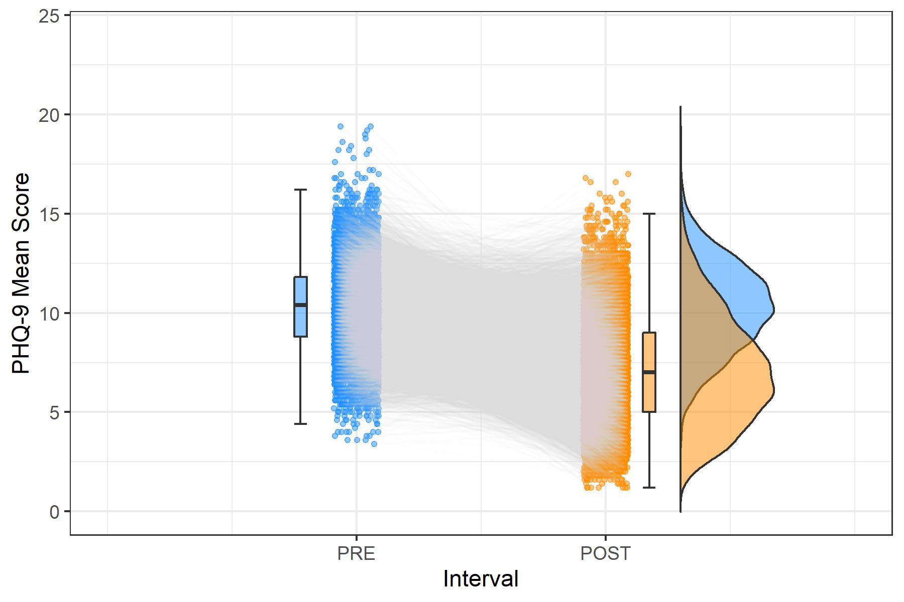

# Vergleich von Klassifikationsmethoden in simulierten EMA-Daten

<br>

> **"EMA_5.5"** besteht aus je 5 MZP im Pre- und im Post-Intervall. Dies sind die ursprünglich simulierten EMA-Daten von N = 8040 Personen (ursprünglich N = 100.000).  

> **"EMA_30.30"** besteht aus je 30 MZP im Pre- und im Post-Intervall. Diese wurden aus den ursprünglichen Simulationsdaten erweitert und umfassen dieselben N = 8040 Personen.  

> **"EMA_5.5_Window"** besteht aus je 5 MZP im Pre- und im Post-Intervall, wobei diese (pro Person) jeweils als zusammenhängendes Intervall (Window) zufällig aus den Gesamt-Intervallen ausgewählt wurden. Die Stichprobe umfasst dieselben N = 8040 Personen.  

> **"EMA_5.5_Days"** besteht aus je 5 MZP im Pre- und im Post-Intervall, wobei diese pro Person jeweils unzusammenhängend zufällig aus den Gesamt-Intervallen ausgewählt wurden. Die Stichprobe umfasst dieselben N = 8040 Personen.  

```{r setup, message = FALSE,	warning = FALSE, include = FALSE}
knitr::opts_chunk$set(echo = TRUE)

# für Umwandlung RMD -> R Script:
#knitr::purl("C:/Users/steph/OneDrive/Desktop/Psychologie/Masterstudium Psychologie/3. Semester/1. Master-Konversatorium/Preprocessing und Berechnungen/EMA_Stichprobenvergleiche_d0.88.Rmd", output = "EMA_Stichprobenvergleiche_d0.88.R", documentation = 2)
# für automatische Benennung von Chunks:
#remedy::chunknamer()

setwd(
  "C:/Users/steph/OneDrive/Desktop/Psychologie/Masterstudium Psychologie/3. Semester/1. Master-Konversatorium/Preprocessing und Berechnungen"
)

pacman::p_load(plyr, dplyr, tidyverse, bootstrap, sjmisc, lattice, Rmisc, devtools, psych, DescTools, summarytools, kableExtra, lubridate, timetk, overlapping, ggplot2, gghalves, plot.matrix, caret)

set.seed(42)


load("cor_04_k20/EMA_30.30.RData")
EMA_30.30 = EMA_30.30 %>%
  as_tibble()


#EMA_5.5 = read.delim("cor_04_k20/cor_04_dataset_k20.txt", row.names=NULL) %>% 
#  select(PRE1_1:POST1_5) %>% 
#  add_column(., .before = "PRE1_1", ID = 1:nrow(.)) %>% 
#  filter(ID %in% EMA_30.30$ID1_PRE) %>% 
#  as_tibble()
#save(EMA_5.5, file = "cor_04_k20/EMA_5.5.RData")
load("cor_04_k20/EMA_5.5.RData")
EMA_5.5 = EMA_5.5 %>% 
  dplyr::rename(ID_orig = ID) %>% 
  filter(ID_orig %in% EMA_30.30$ID1_PRE)


pre_30mzp = c("PRE1_1","PRE1_2","PRE1_3","PRE1_4","PRE1_5",
            "PRE1_6","PRE1_7","PRE1_8","PRE1_9","PRE1_10",
            "PRE1_11","PRE1_12","PRE1_13","PRE1_14","PRE1_15",
            "PRE1_16","PRE1_17","PRE1_18","PRE1_19","PRE1_20",
            "PRE1_21","PRE1_22","PRE1_23","PRE1_24","PRE1_25",
            "PRE1_26","PRE1_27","PRE1_28","PRE1_29","PRE1_30")

post_30mzp = c("POST1_1","POST1_2","POST1_3","POST1_4","POST1_5",
             "POST1_6","POST1_7","POST1_8","POST1_9","POST1_10",
             "POST1_11","POST1_12","POST1_13","POST1_14","POST1_15",
             "POST1_16","POST1_17","POST1_18","POST1_19","POST1_20",
             "POST1_21","POST1_22","POST1_23","POST1_24","POST1_25",
             "POST1_26","POST1_27","POST1_28","POST1_29","POST1_30")

pre_5mzp = c("PRE1_1","PRE1_2","PRE1_3","PRE1_4","PRE1_5")
post_5mzp = c("POST1_1","POST1_2","POST1_3","POST1_4","POST1_5")

EMA_5.5$PRE_Mean = apply(EMA_5.5[pre_5mzp], 1, mean)
EMA_5.5$POST_Mean = apply(EMA_5.5[post_5mzp], 1, mean)
EMA_5.5$MeanDiff = EMA_5.5$PRE_Mean - EMA_5.5$POST_Mean
EMA_5.5$ind.pretestSD = apply(EMA_5.5[pre_5mzp], 1, sd)
EMA_5.5$ind.posttestSD = apply(EMA_5.5[post_5mzp], 1, sd)
```

```{r remedy01}
# Ausschluss von Personen ohne Varianz in min. einem MZP-Intervall

# sd(c(1,1,1,1,2)) = 0.4472136 = min. SD bei 5 (nicht gleichen) MZP
# sd(c(1,1,1,1,1,1,1,1,1,1,1,1,1,1,1,1,1,1,1,1,1,1,1,1,1,1,1,1,1,2)) = 0.1825742 = min. SD bei 30 (nicht gleichen) MZP

EMA_5.5 = EMA_5.5 %>% 
  filter(ind.pretestSD != 0 & ind.posttestSD != 0)

EMA_30.30 = EMA_30.30 %>% 
  filter(ind.pretestSD != 0 & ind.posttestSD != 0)


EMA_5.5 = EMA_5.5 %>% 
  filter(ID_orig %in% EMA_30.30$ID1_PRE)

EMA_30.30 = EMA_30.30 %>% 
  filter(ID1_PRE %in% EMA_5.5$ID_orig)

EMA_5.5 = EMA_5.5 %>% 
  add_column(., .before = "ID_orig", ID = 1:nrow(.))

EMA_30.30 = EMA_30.30 %>% 
  add_column(., .before = "ID1_PRE", ID = 1:nrow(.))
```

```{r remedy02, eval=FALSE, include=FALSE}
### Zufallsauswahl von je 5 MZP PRE und POST
# je ein zufälliges Intervall von 5 aufeinanderfolgenden MZP (random window)
set.seed(42)

EMA_5.5_Window = data.frame(
  ID = c(),
  Pre_MZP1 = c(),
  Pre_MZP2 = c(),
  Pre_MZP3 = c(),
  Pre_MZP4 = c(),
  Pre_MZP5 = c(),
  Post_MZP1 = c(),
  Post_MZP2 = c(),
  Post_MZP3 = c(),
  Post_MZP4 = c(),
  Post_MZP5 = c(),
  PRE1_1 = c(),
  PRE1_2 = c(),
  PRE1_3 = c(),
  PRE1_4 = c(),
  PRE1_5 = c(),
  POST1_1 = c(),
  POST1_2 = c(),
  POST1_3 = c(),
  POST1_4 = c(),
  POST1_5 = c()
)

for (i in EMA_30.30$ID) {
  a = sample(1:26, 1)
  EMA_5.5_pre_Window = pre_30mzp[seq(from = a, to = a+4)]
  b = sample(1:26, 1)
  EMA_5.5_post_Window = post_30mzp[seq(from = b, to = b+4)]
  
  EMA_5.5_Window[i,"ID"] = i
  EMA_5.5_Window[i,"Pre_MZP1"] = EMA_5.5_pre_Window[1]
  EMA_5.5_Window[i,"Pre_MZP2"] = EMA_5.5_pre_Window[2]
  EMA_5.5_Window[i,"Pre_MZP3"] = EMA_5.5_pre_Window[3]
  EMA_5.5_Window[i,"Pre_MZP4"] = EMA_5.5_pre_Window[4]
  EMA_5.5_Window[i,"Pre_MZP5"] = EMA_5.5_pre_Window[5]
  
  EMA_5.5_Window[i,"Post_MZP1"] = EMA_5.5_post_Window[1]
  EMA_5.5_Window[i,"Post_MZP2"] = EMA_5.5_post_Window[2]
  EMA_5.5_Window[i,"Post_MZP3"] = EMA_5.5_post_Window[3]
  EMA_5.5_Window[i,"Post_MZP4"] = EMA_5.5_post_Window[4]
  EMA_5.5_Window[i,"Post_MZP5"] = EMA_5.5_post_Window[5]
  
  EMA_5.5_Window[i,"PRE1_1"] = EMA_30.30[i,EMA_5.5_pre_Window[1]]
  EMA_5.5_Window[i,"PRE1_2"] = EMA_30.30[i,EMA_5.5_pre_Window[2]]
  EMA_5.5_Window[i,"PRE1_3"] = EMA_30.30[i,EMA_5.5_pre_Window[3]]
  EMA_5.5_Window[i,"PRE1_4"] = EMA_30.30[i,EMA_5.5_pre_Window[4]]
  EMA_5.5_Window[i,"PRE1_5"] = EMA_30.30[i,EMA_5.5_pre_Window[5]]
  
  EMA_5.5_Window[i,"POST1_1"] = EMA_30.30[i,EMA_5.5_post_Window[1]]
  EMA_5.5_Window[i,"POST1_2"] = EMA_30.30[i,EMA_5.5_post_Window[2]]
  EMA_5.5_Window[i,"POST1_3"] = EMA_30.30[i,EMA_5.5_post_Window[3]]
  EMA_5.5_Window[i,"POST1_4"] = EMA_30.30[i,EMA_5.5_post_Window[4]]
  EMA_5.5_Window[i,"POST1_5"] = EMA_30.30[i,EMA_5.5_post_Window[5]]
  message(i)
}

EMA_5.5_Window = EMA_5.5_Window %>% as_tibble()
save(EMA_5.5_Window, file = "cor_04_k20/EMA_5.5_Window.RData")


# je 5 zufällig ausgewählte (nicht zwingend aufeinanderfolgende) MZP (random days)
set.seed(42)

EMA_5.5_Days = data.frame(
  ID = c(),
  Pre_MZP1 = c(),
  Pre_MZP2 = c(),
  Pre_MZP3 = c(),
  Pre_MZP4 = c(),
  Pre_MZP5 = c(),
  Post_MZP1 = c(),
  Post_MZP2 = c(),
  Post_MZP3 = c(),
  Post_MZP4 = c(),
  Post_MZP5 = c(),
  PRE1_1 = c(),
  PRE1_2 = c(),
  PRE1_3 = c(),
  PRE1_4 = c(),
  PRE1_5 = c(),
  POST1_1 = c(),
  POST1_2 = c(),
  POST1_3 = c(),
  POST1_4 = c(),
  POST1_5 = c()
)

for (i in EMA_30.30$ID) {
  EMA_5.5_pre_Days = pre_30mzp[sort(sample(1:30, 5))]
  EMA_5.5_post_Days = post_30mzp[sort(sample(1:30, 5))]
  
  EMA_5.5_Days[i,"ID"] = i
  EMA_5.5_Days[i,"Pre_MZP1"] = EMA_5.5_pre_Days[1]
  EMA_5.5_Days[i,"Pre_MZP2"] = EMA_5.5_pre_Days[2]
  EMA_5.5_Days[i,"Pre_MZP3"] = EMA_5.5_pre_Days[3]
  EMA_5.5_Days[i,"Pre_MZP4"] = EMA_5.5_pre_Days[4]
  EMA_5.5_Days[i,"Pre_MZP5"] = EMA_5.5_pre_Days[5]
  
  EMA_5.5_Days[i,"Post_MZP1"] = EMA_5.5_post_Days[1]
  EMA_5.5_Days[i,"Post_MZP2"] = EMA_5.5_post_Days[2]
  EMA_5.5_Days[i,"Post_MZP3"] = EMA_5.5_post_Days[3]
  EMA_5.5_Days[i,"Post_MZP4"] = EMA_5.5_post_Days[4]
  EMA_5.5_Days[i,"Post_MZP5"] = EMA_5.5_post_Days[5]
  
  EMA_5.5_Days[i,"PRE1_1"] = EMA_30.30[i,EMA_5.5_pre_Days[1]]
  EMA_5.5_Days[i,"PRE1_2"] = EMA_30.30[i,EMA_5.5_pre_Days[2]]
  EMA_5.5_Days[i,"PRE1_3"] = EMA_30.30[i,EMA_5.5_pre_Days[3]]
  EMA_5.5_Days[i,"PRE1_4"] = EMA_30.30[i,EMA_5.5_pre_Days[4]]
  EMA_5.5_Days[i,"PRE1_5"] = EMA_30.30[i,EMA_5.5_pre_Days[5]]
  
  EMA_5.5_Days[i,"POST1_1"] = EMA_30.30[i,EMA_5.5_post_Days[1]]
  EMA_5.5_Days[i,"POST1_2"] = EMA_30.30[i,EMA_5.5_post_Days[2]]
  EMA_5.5_Days[i,"POST1_3"] = EMA_30.30[i,EMA_5.5_post_Days[3]]
  EMA_5.5_Days[i,"POST1_4"] = EMA_30.30[i,EMA_5.5_post_Days[4]]
  EMA_5.5_Days[i,"POST1_5"] = EMA_30.30[i,EMA_5.5_post_Days[5]]
  message(i)
}

EMA_5.5_Days = EMA_5.5_Days %>% as_tibble()
save(EMA_5.5_Days, file = "cor_04_k20/EMA_5.5_Days.RData")
```

```{r remedy03}
load("cor_04_k20/EMA_5.5_Window.RData")
load("cor_04_k20/EMA_5.5_Days.RData")

EMA_5.5_Window$PRE_Mean = apply(EMA_5.5_Window[pre_5mzp], 1, mean)
EMA_5.5_Window$POST_Mean = apply(EMA_5.5_Window[post_5mzp], 1, mean)
EMA_5.5_Window$MeanDiff = EMA_5.5_Window$PRE_Mean - EMA_5.5_Window$POST_Mean
EMA_5.5_Window$ind.pretestSD = apply(EMA_5.5_Window[pre_5mzp], 1, sd)
EMA_5.5_Window$ind.posttestSD = apply(EMA_5.5_Window[post_5mzp], 1, sd)

EMA_5.5_Days$PRE_Mean = apply(EMA_5.5_Days[pre_5mzp], 1, mean)
EMA_5.5_Days$POST_Mean = apply(EMA_5.5_Days[post_5mzp], 1, mean)
EMA_5.5_Days$MeanDiff = EMA_5.5_Days$PRE_Mean - EMA_5.5_Days$POST_Mean
EMA_5.5_Days$ind.pretestSD = apply(EMA_5.5_Days[pre_5mzp], 1, sd)
EMA_5.5_Days$ind.posttestSD = apply(EMA_5.5_Days[post_5mzp], 1, sd)
```

```{r remedy04}
# Ausschluss von Personen ohne Varianz in min. einem MZP-Intervall

EMA_5.5_Window = EMA_5.5_Window %>% 
  filter(ind.pretestSD != 0 & ind.posttestSD != 0)

EMA_5.5_Days = EMA_5.5_Days %>% 
  filter(ind.pretestSD != 0 & ind.posttestSD != 0)

EMA_5.5 = EMA_5.5 %>% 
  filter(ID %in% EMA_30.30$ID & ID %in% EMA_5.5_Window$ID & ID %in% EMA_5.5_Days$ID)

EMA_30.30 = EMA_30.30 %>% 
  filter(ID %in% EMA_5.5$ID & ID %in% EMA_5.5_Window$ID & ID %in% EMA_5.5_Days$ID)

EMA_5.5_Window = EMA_5.5_Window %>% 
  filter(ID %in% EMA_5.5$ID & ID %in% EMA_30.30$ID & ID %in% EMA_5.5_Days$ID)

EMA_5.5_Days = EMA_5.5_Days %>% 
  filter(ID %in% EMA_5.5$ID & ID %in% EMA_30.30$ID & ID %in% EMA_5.5_Window$ID)

EMA_5.5$ID = 1:nrow(EMA_5.5)
EMA_30.30$ID = 1:nrow(EMA_30.30)
EMA_5.5_Window$ID = 1:nrow(EMA_5.5_Window)
EMA_5.5_Days$ID = 1:nrow(EMA_5.5_Days)
```

***


## Überblick über die simulierten Daten {.tabset .tabset-pills}

> Beispiel-Verläufe in den 4 untersuchten Datensets

### Original-Simulationsdaten (je 5 MZP)

```{r remedy05, warning=FALSE}
EMA_5.5 %>%
  within(., {ind.pretestSD = round(ind.pretestSD, digits = 2)
            ind.posttestSD = round(ind.posttestSD, digits = 2)}) %>% 
  head() %>% 
  kable() %>% 
  kable_styling(bootstrap_options = c("striped", "hover", "condensed"), full_width = FALSE) %>% 
  scroll_box(width = "100%")
```
<br>

> Pre-Post-Verläufe für 9 zufällig gezogene Personen

```{r remedy06, message=FALSE, warning=FALSE}
rand = sample(EMA_5.5$ID, 9)

x = tibble(ID = c(rep(rand[1],times=11),
                  rep(rand[2],times=11),
                  rep(rand[3],times=11),
                  rep(rand[4],times=11),
                  rep(rand[5],times=11),
                  rep(rand[6],times=11),
                  rep(rand[7],times=11),
                  rep(rand[8],times=11),
                  rep(rand[9],times=11)),
           MZP = rep(seq(as.Date("2020-01-01"), length.out=11, by="1 day"), times=9),
           Score = c(as.numeric(EMA_5.5[rand[1],pre_5mzp]), NA, as.numeric(EMA_5.5[rand[1],post_5mzp]),
                     as.numeric(EMA_5.5[rand[2],pre_5mzp]), NA, as.numeric(EMA_5.5[rand[2],post_5mzp]),
                     as.numeric(EMA_5.5[rand[3],pre_5mzp]), NA, as.numeric(EMA_5.5[rand[3],post_5mzp]),
                     as.numeric(EMA_5.5[rand[4],pre_5mzp]), NA, as.numeric(EMA_5.5[rand[4],post_5mzp]),
                     as.numeric(EMA_5.5[rand[5],pre_5mzp]), NA, as.numeric(EMA_5.5[rand[5],post_5mzp]),
                     as.numeric(EMA_5.5[rand[6],pre_5mzp]), NA, as.numeric(EMA_5.5[rand[6],post_5mzp]),
                     as.numeric(EMA_5.5[rand[7],pre_5mzp]), NA, as.numeric(EMA_5.5[rand[7],post_5mzp]),
                     as.numeric(EMA_5.5[rand[8],pre_5mzp]), NA, as.numeric(EMA_5.5[rand[8],post_5mzp]),
                     as.numeric(EMA_5.5[rand[9],pre_5mzp]), NA, as.numeric(EMA_5.5[rand[9],post_5mzp])))

x %>%
  group_by(ID) %>% 
  plot_time_series(MZP, Score,
    #.color_var = ID,           # for multiple lines in one plot
    #.color_lab = "ID",
    .facet_ncol = 3,
    .facet_scales = "fixed",
    .interactive = TRUE,
    .facet_collapse = FALSE,
    .smooth = TRUE,
    .smooth_degree = 2,
    .smooth_alpha = 0.5,
    .smooth_size = 0.2
  )
```

```{r remedy07, eval=FALSE}
# don´t run this section (code for extremely computation-intense plots that I already stored as .RData and .jpg)
# repeated-measures scatter-boxplot-violin-histograms for individual PRE and POST means
# from van Langen (2020) Open-visualizations tutorial for repeated measures in R

# EMA_5.5
# converting my dataframes to use in the same ggplot structure:
EMA_5.5_ts = EMA_5.5 %>% 
  select(ID, PRE_Mean, POST_Mean) %>% 
  pivot_longer(!ID, names_to = "Interval", values_to = "Mean") %>% 
  mutate(ID = as.factor(ID),
         Interval = rep(c(1,2), times = nrow(EMA_5.5)))

save(EMA_5.5_ts, file = "Time Series Dataframes/k20_EMA_5.5_ts.RData")

###

load("Time Series Dataframes/k20_EMA_5.5_ts.RData")

# Repeated measures with box− and violin plots
EMA_5.5_ts$jit = jitter(EMA_5.5_ts$Interval, amount = .09)

Pre_Post_Box_Violin = ggplot(data = EMA_5.5_ts, aes(y = Mean)) +
  geom_point(data = EMA_5.5_ts %>% filter(Interval == "1"), aes(x = jit), color = "dodgerblue", size = 1,
             alpha = .5) +
  geom_point(data = EMA_5.5_ts %>% filter(Interval == "2"), aes(x = jit), color = "darkorange", size = 1,
             alpha = .5) +
  geom_line(aes(x = jit, group = ID), color = "lightgray", alpha = .05) +
  geom_half_boxplot(
    data = EMA_5.5_ts %>% filter(Interval == "1"), aes(x = Interval, y = Mean), position = position_nudge(x = -.25),
    side = "r", outlier.shape = NA, center = TRUE, errorbar.draw = TRUE, width = .1,
    fill = "dodgerblue", alpha = .5) +
  geom_half_boxplot(
    data = EMA_5.5_ts %>% filter(Interval == "2"), aes(x = Interval, y = Mean), position = position_nudge(x = .15),
    side = "r", outlier.shape = NA, center = TRUE, errorbar.draw = TRUE, width = .1,
    fill = "darkorange", alpha = .5) +
  geom_half_violin(
    data = EMA_5.5_ts %>% filter(Interval == "1"), aes(x = Interval, y = Mean), position = position_nudge(x = 1.3),
    side = "r", fill = "dodgerblue", alpha = .5, trim = FALSE) +
  geom_half_violin(
    data = EMA_5.5_ts %>% filter(Interval == "2"), aes(x = Interval, y = Mean), position = position_nudge(x = .3),
    side = "r", fill = "darkorange", alpha = .5, trim = FALSE) +
  scale_x_continuous(breaks = c(1,2), labels = c("PRE", "POST"), limits = c(0, 3)) +
  xlab("Interval") + ylab("PHQ-9 Mean Score") +
  #ggtitle("EMA Data (5+5 Timepoints): Individual Pre-Post Means") +
  #theme_classic() +
  theme_bw() +
  coord_cartesian(ylim = c(0, 24))

ggsave("Time Series Dataframes/k20_EMA_5.5_Pre-Post_Box_Violin.jpg", plot = Pre_Post_Box_Violin, width = 6, height = 4)
save(Pre_Post_Box_Violin, file = "Time Series Dataframes/k20_EMA_5.5_Pre_Post_Box_Violin.RData")


# Repeated measures with box− and violin plots and means + CIs
score_mean_1 = EMA_5.5_ts %>% filter(Interval == "1") %>% summarise(mean(Mean)) %>% as.numeric()
score_mean_2 = EMA_5.5_ts %>% filter(Interval == "2") %>% summarise(mean(Mean)) %>% as.numeric()
score_median1 = EMA_5.5_ts %>% filter(Interval == "1") %>% summarise(median(Mean)) %>% as.numeric()
score_median2 = EMA_5.5_ts %>% filter(Interval == "2") %>% summarise(median(Mean)) %>% as.numeric()
score_sd_1 = EMA_5.5_ts %>% filter(Interval == "1") %>% summarise(sd(Mean)) %>% as.numeric()
score_sd_2 = EMA_5.5_ts %>% filter(Interval == "2") %>% summarise(sd(Mean)) %>% as.numeric()
score_se_1 = score_sd_1/sqrt(nrow(EMA_5.5))
score_se_2 = score_sd_2/sqrt(nrow(EMA_5.5))
score_ci_1 = EMA_5.5_ts %>% filter(Interval == "1") %>% pull(Mean) %>% CI(., ci = 0.95)
score_ci_2 = EMA_5.5_ts %>% filter(Interval == "2") %>% pull(Mean) %>% CI(., ci = 0.95)
#Create data frame with 2 rows and 7 columns containing the descriptives
group = c("PRE", "POST")
N = c(nrow(EMA_5.5), nrow(EMA_5.5))
score_mean = c(score_mean_1, score_mean_2)
score_median = c(score_median1, score_median2)
sd = c(score_sd_1, score_sd_2)
se = c(score_se_1, score_se_2)
ci = c(as.numeric(score_ci_1[1] - score_ci_1[3]), as.numeric(score_ci_2[1] - score_ci_2[3]))
summary_df = data.frame(group, N, score_mean, score_median, sd, se, ci)

# EMA_5.5_ts$jit = jitter(EMA_5.5_ts$Interval, amount = .09)     #already created above
x_tick_means = c(.87, 2.13)

Pre_Post_Box_Violin_Mean_CI = ggplot(data = EMA_5.5_ts, aes(y = Mean)) +
  geom_point(data = EMA_5.5_ts %>% filter(Interval == "1"), aes(x = jit), color = "dodgerblue", size = 1,
             alpha = .6) +
  geom_point(data = EMA_5.5_ts %>% filter(Interval == "2"), aes(x = jit), color = "darkorange", size = 1,
             alpha = .6) +
  geom_line(aes(x = jit, group = ID), color = "lightgray", alpha = .05) +
  geom_half_boxplot(
    data = EMA_5.5_ts %>% filter(Interval == "1"), aes(x = Interval, y = Mean), position = position_nudge(x = -.28),
    side = "r", outlier.shape = NA, center = TRUE, errorbar.draw = FALSE, width = .2,
    fill = "dodgerblue") +
  geom_half_boxplot(
    data = EMA_5.5_ts %>% filter(Interval == "2"), aes(x = Interval, y = Mean), position = position_nudge(x = .18),
    side = "r", outlier.shape = NA, center = TRUE, errorbar.draw = FALSE, width = .2,
    fill = "darkorange") +
  geom_half_violin(
    data = EMA_5.5_ts %>% filter(Interval == "1"), aes(x = Interval, y = Mean), position = position_nudge(x = -.3),
    side = "l", fill = "dodgerblue") +
  geom_half_violin(
    data = EMA_5.5_ts %>% filter(Interval == "2"),aes(x = Interval, y = Mean), position = position_nudge(x = .3),
    side = "r", fill = "darkorange") +
  geom_point(data = EMA_5.5_ts %>% filter(Interval == "1"), aes(x = Interval, y = score_mean[1]),
             position = position_nudge(x = -.13), color = "dodgerblue", alpha = .6, size = 1.5) +
  geom_errorbar(data = EMA_5.5_ts %>% filter(Interval == "1"), aes(x = Interval, y = score_mean[1],
                                                 ymin = score_mean[1]-ci[1], ymax = score_mean[1]+ci[1]),
                position = position_nudge(-.13), color = "dodgerblue", width = 0.05, size = 0.4, alpha = .6) +
  geom_point(data = EMA_5.5_ts %>% filter(Interval == "2"), aes(x = Interval, y = score_mean[2]),
             position = position_nudge(x = .13), color = "darkorange", alpha = .6, size = 1.5)+
  geom_errorbar(data = EMA_5.5_ts %>% filter(Interval == "2"), aes(x = Interval, y = score_mean[2],
                                                 ymin = score_mean[2]-ci[2], ymax = score_mean[2]+ci[2]), 
                position = position_nudge(.13), color = "darkorange", width = 0.05, size = 0.4, alpha = .6) +
  geom_line(data = summary_df, aes(x = x_tick_means, y = score_mean), color = "gray", size = 1) +
  scale_x_continuous(breaks = c(1,2), labels = c("PRE", "POST"), limits = c(0, 3)) +
  xlab("Interval") + ylab("PHQ-9 Mean Score") +
  #ggtitle("EMA Data (5+5 Timepoints): Individual Pre-Post Means") +
  #theme_classic() +
  theme_bw() +
  coord_cartesian(ylim = c(0, 24))

ggsave("Time Series Dataframes/k20_EMA_5.5_Pre-Post_Box_Violin_Mean+CI.jpg", plot = Pre_Post_Box_Violin_Mean_CI, width = 6, height = 4)
save(Pre_Post_Box_Violin_Mean_CI, file = "Time Series Dataframes/k20_EMA_5.5_Pre_Post_Box_Violin_Mean_CI.RData")
```

```{r remedy08, fig.align="center", out.width="75%"}
#

```

***


### Erweiterte Intervall-Daten (je 30 MZP)

```{r remedy09, warning=FALSE}
EMA_30.30 %>% 
  select(-(ID1_PRE:ID6_POST)) %>% 
  within(., {ind.pretestSD = round(ind.pretestSD, digits = 2)
            ind.posttestSD = round(ind.posttestSD, digits = 2)}) %>% 
  head() %>% 
  kable() %>%
  kable_styling(bootstrap_options = c("striped", "hover", "condensed"), full_width = FALSE) %>% 
  scroll_box(width = "100%")
```
<br>

> Pre-Post-Verläufe für 9 zufällig gezogene Personen

```{r remedy10, message=FALSE, warning=FALSE}
rand = sample(EMA_30.30$ID, 9)

x = tibble(ID = c(rep(rand[1],times=61),
                     rep(rand[2],times=61),
                     rep(rand[3],times=61),
                     rep(rand[4],times=61),
                     rep(rand[5],times=61),
                     rep(rand[6],times=61),
                     rep(rand[7],times=61),
                     rep(rand[8],times=61),
                     rep(rand[9],times=61)),
              MZP = rep(seq(as.Date("2020-01-01"), length.out=61, by="1 day"), times=9),
              Score = c(as.numeric(EMA_30.30[rand[1],pre_30mzp]), NA, as.numeric(EMA_30.30[rand[1],post_30mzp]),
                        as.numeric(EMA_30.30[rand[2],pre_30mzp]), NA, as.numeric(EMA_30.30[rand[2],post_30mzp]),
                        as.numeric(EMA_30.30[rand[3],pre_30mzp]), NA, as.numeric(EMA_30.30[rand[3],post_30mzp]),
                        as.numeric(EMA_30.30[rand[4],pre_30mzp]), NA, as.numeric(EMA_30.30[rand[4],post_30mzp]),
                        as.numeric(EMA_30.30[rand[5],pre_30mzp]), NA, as.numeric(EMA_30.30[rand[5],post_30mzp]),
                        as.numeric(EMA_30.30[rand[6],pre_30mzp]), NA, as.numeric(EMA_30.30[rand[6],post_30mzp]),
                        as.numeric(EMA_30.30[rand[7],pre_30mzp]), NA, as.numeric(EMA_30.30[rand[7],post_30mzp]),
                        as.numeric(EMA_30.30[rand[8],pre_30mzp]), NA, as.numeric(EMA_30.30[rand[8],post_30mzp]),
                        as.numeric(EMA_30.30[rand[9],pre_30mzp]), NA, as.numeric(EMA_30.30[rand[9],post_30mzp])))

x %>%
  group_by(ID) %>% 
  plot_time_series(MZP, Score,
    #.color_var = ID,           # for multiple lines in one plot
    #.color_lab = "ID",
    .facet_ncol = 3,
    .facet_scales = "fixed",
    .interactive = TRUE,
    .facet_collapse = FALSE,
    .smooth = TRUE,
    .smooth_degree = 2,
    .smooth_alpha = 0.5,
    .smooth_size = 0.2
  )
```

```{r remedy11, eval=FALSE}
# don´t run this section (code for extremely computation-intense plots that I already stored as .RData and .jpg)
# repeated-measures scatter-boxplot-violin-histograms for individual PRE and POST means
# from van Langen (2020) Open-visualizations tutorial for repeated measures in R

# EMA_30.30
# converting my dataframes to use in the same ggplot structure:
EMA_30.30_ts = EMA_30.30 %>% 
  select(ID, PRE_Mean, POST_Mean) %>% 
  pivot_longer(!ID, names_to = "Interval", values_to = "Mean") %>% 
  mutate(ID = as.factor(ID),
         Interval = rep(c(1,2), times = nrow(EMA_30.30)))

save(EMA_30.30_ts, file = "Time Series Dataframes/k20_EMA_30.30_ts.RData")

###

load("Time Series Dataframes/k20_EMA_30.30_ts.RData")

# Repeated measures with box− and violin plots
EMA_30.30_ts$jit = jitter(EMA_30.30_ts$Interval, amount = .09)

Pre_Post_Box_Violin = ggplot(data = EMA_30.30_ts, aes(y = Mean)) +
  geom_point(data = EMA_30.30_ts %>% filter(Interval == "1"), aes(x = jit), color = "dodgerblue", size = 1,
             alpha = .5) +
  geom_point(data = EMA_30.30_ts %>% filter(Interval == "2"), aes(x = jit), color = "darkorange", size = 1,
             alpha = .5) +
  geom_line(aes(x = jit, group = ID), color = "lightgray", alpha = .05) +
  geom_half_boxplot(
    data = EMA_30.30_ts %>% filter(Interval == "1"), aes(x = Interval, y = Mean), position = position_nudge(x = -.25),
    side = "r", outlier.shape = NA, center = TRUE, errorbar.draw = TRUE, width = .1,
    fill = "dodgerblue", alpha = .5) +
  geom_half_boxplot(
    data = EMA_30.30_ts %>% filter(Interval == "2"), aes(x = Interval, y = Mean), position = position_nudge(x = .15),
    side = "r", outlier.shape = NA, center = TRUE, errorbar.draw = TRUE, width = .1,
    fill = "darkorange", alpha = .5) +
  geom_half_violin(
    data = EMA_30.30_ts %>% filter(Interval == "1"), aes(x = Interval, y = Mean), position = position_nudge(x = 1.3),
    side = "r", fill = "dodgerblue", alpha = .5, trim = FALSE) +
  geom_half_violin(
    data = EMA_30.30_ts %>% filter(Interval == "2"), aes(x = Interval, y = Mean), position = position_nudge(x = .3),
    side = "r", fill = "darkorange", alpha = .5, trim = FALSE) +
  scale_x_continuous(breaks = c(1,2), labels = c("PRE", "POST"), limits = c(0, 3)) +
  xlab("Interval") + ylab("PHQ-9 Mean Score") +
  #ggtitle("EMA Data (30+30 Timepoints): Individual Pre-Post Means") +
  #theme_classic() +
  theme_bw() +
  coord_cartesian(ylim = c(0, 24))

ggsave("Time Series Dataframes/k20_EMA_30.30_Pre-Post_Box_Violin.jpg", plot = Pre_Post_Box_Violin, width = 6, height = 4)
save(Pre_Post_Box_Violin, file = "Time Series Dataframes/k20_EMA_30.30_Pre_Post_Box_Violin.RData")


# Repeated measures with box− and violin plots and means + CIs
score_mean_1 = EMA_30.30_ts %>% filter(Interval == "1") %>% summarise(mean(Mean)) %>% as.numeric()
score_mean_2 = EMA_30.30_ts %>% filter(Interval == "2") %>% summarise(mean(Mean)) %>% as.numeric()
score_median1 = EMA_30.30_ts %>% filter(Interval == "1") %>% summarise(median(Mean)) %>% as.numeric()
score_median2 = EMA_30.30_ts %>% filter(Interval == "2") %>% summarise(median(Mean)) %>% as.numeric()
score_sd_1 = EMA_30.30_ts %>% filter(Interval == "1") %>% summarise(sd(Mean)) %>% as.numeric()
score_sd_2 = EMA_30.30_ts %>% filter(Interval == "2") %>% summarise(sd(Mean)) %>% as.numeric()
score_se_1 = score_sd_1/sqrt(nrow(EMA_30.30))
score_se_2 = score_sd_2/sqrt(nrow(EMA_30.30))
score_ci_1 = EMA_30.30_ts %>% filter(Interval == "1") %>% pull(Mean) %>% CI(., ci = 0.95)
score_ci_2 = EMA_30.30_ts %>% filter(Interval == "2") %>% pull(Mean) %>% CI(., ci = 0.95)
#Create data frame with 2 rows and 7 columns containing the descriptives
group = c("PRE", "POST")
N = c(nrow(EMA_30.30), nrow(EMA_30.30))
score_mean = c(score_mean_1, score_mean_2)
score_median = c(score_median1, score_median2)
sd = c(score_sd_1, score_sd_2)
se = c(score_se_1, score_se_2)
ci = c(as.numeric(score_ci_1[1] - score_ci_1[3]), as.numeric(score_ci_2[1] - score_ci_2[3]))
summary_df = data.frame(group, N, score_mean, score_median, sd, se, ci)

# EMA_30.30_ts$jit = jitter(EMA_30.30_ts$Interval, amount = .09)     #already created above
x_tick_means = c(.87, 2.13)

Pre_Post_Box_Violin_Mean_CI = ggplot(data = EMA_30.30_ts, aes(y = Mean)) +
  geom_point(data = EMA_30.30_ts %>% filter(Interval == "1"), aes(x = jit), color = "dodgerblue", size = 1,
             alpha = .6) +
  geom_point(data = EMA_30.30_ts %>% filter(Interval == "2"), aes(x = jit), color = "darkorange", size = 1,
             alpha = .6) +
  geom_line(aes(x = jit, group = ID), color = "lightgray", alpha = .05) +
  geom_half_boxplot(
    data = EMA_30.30_ts %>% filter(Interval == "1"), aes(x = Interval, y = Mean), position = position_nudge(x = -.28),
    side = "r", outlier.shape = NA, center = TRUE, errorbar.draw = FALSE, width = .2,
    fill = "dodgerblue") +
  geom_half_boxplot(
    data = EMA_30.30_ts %>% filter(Interval == "2"), aes(x = Interval, y = Mean), position = position_nudge(x = .18),
    side = "r", outlier.shape = NA, center = TRUE, errorbar.draw = FALSE, width = .2,
    fill = "darkorange") +
  geom_half_violin(
    data = EMA_30.30_ts %>% filter(Interval == "1"), aes(x = Interval, y = Mean), position = position_nudge(x = -.3),
    side = "l", fill = "dodgerblue") +
  geom_half_violin(
    data = EMA_30.30_ts %>% filter(Interval == "2"),aes(x = Interval, y = Mean), position = position_nudge(x = .3),
    side = "r", fill = "darkorange") +
  geom_point(data = EMA_30.30_ts %>% filter(Interval == "1"), aes(x = Interval, y = score_mean[1]),
             position = position_nudge(x = -.13), color = "dodgerblue", alpha = .6, size = 1.5) +
  geom_errorbar(data = EMA_30.30_ts %>% filter(Interval == "1"), aes(x = Interval, y = score_mean[1],
                                                 ymin = score_mean[1]-ci[1], ymax = score_mean[1]+ci[1]),
                position = position_nudge(-.13), color = "dodgerblue", width = 0.05, size = 0.4, alpha = .6) +
  geom_point(data = EMA_30.30_ts %>% filter(Interval == "2"), aes(x = Interval, y = score_mean[2]),
             position = position_nudge(x = .13), color = "darkorange", alpha = .6, size = 1.5)+
  geom_errorbar(data = EMA_30.30_ts %>% filter(Interval == "2"), aes(x = Interval, y = score_mean[2],
                                                 ymin = score_mean[2]-ci[2], ymax = score_mean[2]+ci[2]), 
                position = position_nudge(.13), color = "darkorange", width = 0.05, size = 0.4, alpha = .6) +
  geom_line(data = summary_df, aes(x = x_tick_means, y = score_mean), color = "gray", size = 1) +
  scale_x_continuous(breaks = c(1,2), labels = c("PRE", "POST"), limits = c(0, 3)) +
  xlab("Interval") + ylab("PHQ-9 Mean Score") +
  #ggtitle("EMA Data (30+30 Timepoints): Individual Pre-Post Means") +
  #theme_classic() +
  theme_bw() +
  coord_cartesian(ylim = c(0, 24))

ggsave("Time Series Dataframes/k20_EMA_30.30_Pre-Post_Box_Violin_Mean+CI.jpg", plot = Pre_Post_Box_Violin_Mean_CI, width = 6, height = 4)
save(Pre_Post_Box_Violin_Mean_CI, file = "Time Series Dataframes/k20_EMA_30.30_Pre_Post_Box_Violin_Mean_CI.RData")
```

```{r remedy12, fig.align="center", out.width="75%"}
#

```

***


### Zufallsauswahl: Random Window (je 5 MZP)

```{r remedy13, warning=FALSE}
EMA_5.5_Window %>%
  within(., {ind.pretestSD = round(ind.pretestSD, digits = 2)
            ind.posttestSD = round(ind.posttestSD, digits = 2)}) %>% 
  head() %>% 
  kable() %>% 
  kable_styling(bootstrap_options = c("striped", "hover", "condensed"), full_width = FALSE) %>% 
  scroll_box(width = "100%")
```
<br>

> Pre-Post-Verläufe für 9 zufällig gezogene Personen

```{r remedy14, message=FALSE, warning=FALSE}
rand = sample(EMA_5.5_Window$ID, 9)

x = tibble(ID = c(rep(rand[1],times=11),
                  rep(rand[2],times=11),
                  rep(rand[3],times=11),
                  rep(rand[4],times=11),
                  rep(rand[5],times=11),
                  rep(rand[6],times=11),
                  rep(rand[7],times=11),
                  rep(rand[8],times=11),
                  rep(rand[9],times=11)),
           MZP = rep(seq(as.Date("2020-01-01"), length.out=11, by="1 day"), times=9),
           Score = c(as.numeric(EMA_5.5_Window[rand[1],pre_5mzp]), NA, as.numeric(EMA_5.5_Window[rand[1],post_5mzp]),
                     as.numeric(EMA_5.5_Window[rand[2],pre_5mzp]), NA, as.numeric(EMA_5.5_Window[rand[2],post_5mzp]),
                     as.numeric(EMA_5.5_Window[rand[3],pre_5mzp]), NA, as.numeric(EMA_5.5_Window[rand[3],post_5mzp]),
                     as.numeric(EMA_5.5_Window[rand[4],pre_5mzp]), NA, as.numeric(EMA_5.5_Window[rand[4],post_5mzp]),
                     as.numeric(EMA_5.5_Window[rand[5],pre_5mzp]), NA, as.numeric(EMA_5.5_Window[rand[5],post_5mzp]),
                     as.numeric(EMA_5.5_Window[rand[6],pre_5mzp]), NA, as.numeric(EMA_5.5_Window[rand[6],post_5mzp]),
                     as.numeric(EMA_5.5_Window[rand[7],pre_5mzp]), NA, as.numeric(EMA_5.5_Window[rand[7],post_5mzp]),
                     as.numeric(EMA_5.5_Window[rand[8],pre_5mzp]), NA, as.numeric(EMA_5.5_Window[rand[8],post_5mzp]),
                     as.numeric(EMA_5.5_Window[rand[9],pre_5mzp]), NA, as.numeric(EMA_5.5_Window[rand[9],post_5mzp])))

x %>%
  group_by(ID) %>% 
  plot_time_series(MZP, Score,
    #.color_var = ID,           # for multiple lines in one plot
    #.color_lab = "ID",
    .facet_ncol = 3,
    .facet_scales = "fixed",
    .interactive = TRUE,
    .facet_collapse = FALSE,
    .smooth = TRUE,
    .smooth_degree = 2,
    .smooth_alpha = 0.5,
    .smooth_size = 0.2
  )
```

```{r remedy15, eval=FALSE}
# don´t run this section (code for extremely computation-intense plots that I already stored as .RData and .jpg)
# repeated-measures scatter-boxplot-violin-histograms for individual PRE and POST means
# from van Langen (2020) Open-visualizations tutorial for repeated measures in R

# EMA_5.5_Window
# converting my dataframes to use in the same ggplot structure:
EMA_5.5_Window_ts = EMA_5.5_Window %>% 
  select(ID, PRE_Mean, POST_Mean) %>% 
  pivot_longer(!ID, names_to = "Interval", values_to = "Mean") %>% 
  mutate(ID = as.factor(ID),
         Interval = rep(c(1,2), times = nrow(EMA_5.5_Window)))

save(EMA_5.5_Window_ts, file = "Time Series Dataframes/k20_EMA_5.5_Window_ts.RData")

###

load("Time Series Dataframes/k20_EMA_5.5_Window_ts.RData")

# Repeated measures with box− and violin plots
EMA_5.5_Window_ts$jit = jitter(EMA_5.5_Window_ts$Interval, amount = .09)

Pre_Post_Box_Violin = ggplot(data = EMA_5.5_Window_ts, aes(y = Mean)) +
  geom_point(data = EMA_5.5_Window_ts %>% filter(Interval == "1"), aes(x = jit), color = "dodgerblue", size = 1,
             alpha = .5) +
  geom_point(data = EMA_5.5_Window_ts %>% filter(Interval == "2"), aes(x = jit), color = "darkorange", size = 1,
             alpha = .5) +
  geom_line(aes(x = jit, group = ID), color = "lightgray", alpha = .05) +
  geom_half_boxplot(
    data = EMA_5.5_Window_ts %>% filter(Interval == "1"), aes(x = Interval, y = Mean), position = position_nudge(x = -.25),
    side = "r", outlier.shape = NA, center = TRUE, errorbar.draw = TRUE, width = .1,
    fill = "dodgerblue", alpha = .5) +
  geom_half_boxplot(
    data = EMA_5.5_Window_ts %>% filter(Interval == "2"), aes(x = Interval, y = Mean), position = position_nudge(x = .15),
    side = "r", outlier.shape = NA, center = TRUE, errorbar.draw = TRUE, width = .1,
    fill = "darkorange", alpha = .5) +
  geom_half_violin(
    data = EMA_5.5_Window_ts %>% filter(Interval == "1"), aes(x = Interval, y = Mean), position = position_nudge(x = 1.3),
    side = "r", fill = "dodgerblue", alpha = .5, trim = FALSE) +
  geom_half_violin(
    data = EMA_5.5_Window_ts %>% filter(Interval == "2"), aes(x = Interval, y = Mean), position = position_nudge(x = .3),
    side = "r", fill = "darkorange", alpha = .5, trim = FALSE) +
  scale_x_continuous(breaks = c(1,2), labels = c("PRE", "POST"), limits = c(0, 3)) +
  xlab("Interval") + ylab("PHQ-9 Mean Score") +
  #ggtitle("EMA Data (5+5 Timepoint Random Windows): Individual Pre-Post Means") +
  #theme_classic() +
  theme_bw() +
  coord_cartesian(ylim = c(0, 24))

ggsave("Time Series Dataframes/k20_EMA_5.5_Window_Pre-Post_Box_Violin.jpg", plot = Pre_Post_Box_Violin, width = 6, height = 4)
save(Pre_Post_Box_Violin, file = "Time Series Dataframes/k20_EMA_5.5_Window_Pre_Post_Box_Violin.RData")


# Repeated measures with box− and violin plots and means + CIs
score_mean_1 = EMA_5.5_Window_ts %>% filter(Interval == "1") %>% summarise(mean(Mean)) %>% as.numeric()
score_mean_2 = EMA_5.5_Window_ts %>% filter(Interval == "2") %>% summarise(mean(Mean)) %>% as.numeric()
score_median1 = EMA_5.5_Window_ts %>% filter(Interval == "1") %>% summarise(median(Mean)) %>% as.numeric()
score_median2 = EMA_5.5_Window_ts %>% filter(Interval == "2") %>% summarise(median(Mean)) %>% as.numeric()
score_sd_1 = EMA_5.5_Window_ts %>% filter(Interval == "1") %>% summarise(sd(Mean)) %>% as.numeric()
score_sd_2 = EMA_5.5_Window_ts %>% filter(Interval == "2") %>% summarise(sd(Mean)) %>% as.numeric()
score_se_1 = score_sd_1/sqrt(nrow(EMA_5.5_Window))
score_se_2 = score_sd_2/sqrt(nrow(EMA_5.5_Window))
score_ci_1 = EMA_5.5_Window_ts %>% filter(Interval == "1") %>% pull(Mean) %>% CI(., ci = 0.95)
score_ci_2 = EMA_5.5_Window_ts %>% filter(Interval == "2") %>% pull(Mean) %>% CI(., ci = 0.95)
#Create data frame with 2 rows and 7 columns containing the descriptives
group = c("PRE", "POST")
N = c(nrow(EMA_5.5_Window), nrow(EMA_5.5_Window))
score_mean = c(score_mean_1, score_mean_2)
score_median = c(score_median1, score_median2)
sd = c(score_sd_1, score_sd_2)
se = c(score_se_1, score_se_2)
ci = c(as.numeric(score_ci_1[1] - score_ci_1[3]), as.numeric(score_ci_2[1] - score_ci_2[3]))
summary_df = data.frame(group, N, score_mean, score_median, sd, se, ci)

# EMA_5.5_Window_ts$jit = jitter(EMA_5.5_Window_ts$Interval, amount = .09)     #already created above
x_tick_means = c(.87, 2.13)

Pre_Post_Box_Violin_Mean_CI = ggplot(data = EMA_5.5_Window_ts, aes(y = Mean)) +
  geom_point(data = EMA_5.5_Window_ts %>% filter(Interval == "1"), aes(x = jit), color = "dodgerblue", size = 1,
             alpha = .6) +
  geom_point(data = EMA_5.5_Window_ts %>% filter(Interval == "2"), aes(x = jit), color = "darkorange", size = 1,
             alpha = .6) +
  geom_line(aes(x = jit, group = ID), color = "lightgray", alpha = .05) +
  geom_half_boxplot(
    data = EMA_5.5_Window_ts %>% filter(Interval == "1"), aes(x = Interval, y = Mean), position = position_nudge(x = -.28),
    side = "r", outlier.shape = NA, center = TRUE, errorbar.draw = FALSE, width = .2,
    fill = "dodgerblue") +
  geom_half_boxplot(
    data = EMA_5.5_Window_ts %>% filter(Interval == "2"), aes(x = Interval, y = Mean), position = position_nudge(x = .18),
    side = "r", outlier.shape = NA, center = TRUE, errorbar.draw = FALSE, width = .2,
    fill = "darkorange") +
  geom_half_violin(
    data = EMA_5.5_Window_ts %>% filter(Interval == "1"), aes(x = Interval, y = Mean), position = position_nudge(x = -.3),
    side = "l", fill = "dodgerblue") +
  geom_half_violin(
    data = EMA_5.5_Window_ts %>% filter(Interval == "2"),aes(x = Interval, y = Mean), position = position_nudge(x = .3),
    side = "r", fill = "darkorange") +
  geom_point(data = EMA_5.5_Window_ts %>% filter(Interval == "1"), aes(x = Interval, y = score_mean[1]),
             position = position_nudge(x = -.13), color = "dodgerblue", alpha = .6, size = 1.5) +
  geom_errorbar(data = EMA_5.5_Window_ts %>% filter(Interval == "1"), aes(x = Interval, y = score_mean[1],
                                                 ymin = score_mean[1]-ci[1], ymax = score_mean[1]+ci[1]),
                position = position_nudge(-.13), color = "dodgerblue", width = 0.05, size = 0.4, alpha = .6) +
  geom_point(data = EMA_5.5_Window_ts %>% filter(Interval == "2"), aes(x = Interval, y = score_mean[2]),
             position = position_nudge(x = .13), color = "darkorange", alpha = .6, size = 1.5)+
  geom_errorbar(data = EMA_5.5_Window_ts %>% filter(Interval == "2"), aes(x = Interval, y = score_mean[2],
                                                 ymin = score_mean[2]-ci[2], ymax = score_mean[2]+ci[2]), 
                position = position_nudge(.13), color = "darkorange", width = 0.05, size = 0.4, alpha = .6) +
  geom_line(data = summary_df, aes(x = x_tick_means, y = score_mean), color = "gray", size = 1) +
  scale_x_continuous(breaks = c(1,2), labels = c("PRE", "POST"), limits = c(0, 3)) +
  xlab("Interval") + ylab("PHQ-9 Mean Score") +
  #ggtitle("EMA Data (5+5 Timepoint Random Windows): Individual Pre-Post Means") +
  #theme_classic() +
  theme_bw() +
  coord_cartesian(ylim = c(0, 24))

ggsave("Time Series Dataframes/k20_EMA_5.5_Window_Pre-Post_Box_Violin_Mean+CI.jpg", plot = Pre_Post_Box_Violin_Mean_CI, width = 6, height = 4)
save(Pre_Post_Box_Violin_Mean_CI, file = "Time Series Dataframes/k20_EMA_5.5_Window_Pre_Post_Box_Violin_Mean_CI.RData")
```

```{r remedy16, fig.align="center", out.width="75%"}
#

```

***


### Zufallsauswahl: Random Days (je 5 MZP)

```{r remedy17, warning=FALSE}
EMA_5.5_Days %>%
  within(., {ind.pretestSD = round(ind.pretestSD, digits = 2)
            ind.posttestSD = round(ind.posttestSD, digits = 2)}) %>% 
  head() %>% 
  kable() %>% 
  kable_styling(bootstrap_options = c("striped", "hover", "condensed"), full_width = FALSE) %>% 
  scroll_box(width = "100%")
```
<br>

> Pre-Post-Verläufe für 9 zufällig gezogene Personen

```{r remedy18, message=FALSE, warning=FALSE}
rand = sample(EMA_5.5_Days$ID, 9)

x = tibble(ID = c(rep(rand[1],times=11),
                  rep(rand[2],times=11),
                  rep(rand[3],times=11),
                  rep(rand[4],times=11),
                  rep(rand[5],times=11),
                  rep(rand[6],times=11),
                  rep(rand[7],times=11),
                  rep(rand[8],times=11),
                  rep(rand[9],times=11)),
           MZP = rep(seq(as.Date("2020-01-01"), length.out=11, by="1 day"), times=9),
           Score = c(as.numeric(EMA_5.5_Days[rand[1],pre_5mzp]), NA, as.numeric(EMA_5.5_Days[rand[1],post_5mzp]),
                     as.numeric(EMA_5.5_Days[rand[2],pre_5mzp]), NA, as.numeric(EMA_5.5_Days[rand[2],post_5mzp]),
                     as.numeric(EMA_5.5_Days[rand[3],pre_5mzp]), NA, as.numeric(EMA_5.5_Days[rand[3],post_5mzp]),
                     as.numeric(EMA_5.5_Days[rand[4],pre_5mzp]), NA, as.numeric(EMA_5.5_Days[rand[4],post_5mzp]),
                     as.numeric(EMA_5.5_Days[rand[5],pre_5mzp]), NA, as.numeric(EMA_5.5_Days[rand[5],post_5mzp]),
                     as.numeric(EMA_5.5_Days[rand[6],pre_5mzp]), NA, as.numeric(EMA_5.5_Days[rand[6],post_5mzp]),
                     as.numeric(EMA_5.5_Days[rand[7],pre_5mzp]), NA, as.numeric(EMA_5.5_Days[rand[7],post_5mzp]),
                     as.numeric(EMA_5.5_Days[rand[8],pre_5mzp]), NA, as.numeric(EMA_5.5_Days[rand[8],post_5mzp]),
                     as.numeric(EMA_5.5_Days[rand[9],pre_5mzp]), NA, as.numeric(EMA_5.5_Days[rand[9],post_5mzp])))

x %>%
  group_by(ID) %>% 
  plot_time_series(MZP, Score,
    #.color_var = ID,           # for multiple lines in one plot
    #.color_lab = "ID",
    .facet_ncol = 3,
    .facet_scales = "fixed",
    .interactive = TRUE,
    .facet_collapse = FALSE,
    .smooth = TRUE,
    .smooth_degree = 2,
    .smooth_alpha = 0.5,
    .smooth_size = 0.2
  )
```

```{r remedy19, eval=FALSE}
# don´t run this section (code for extremely computation-intense plots that I already stored as .RData and .jpg)
# repeated-measures scatter-boxplot-violin-histograms for individual PRE and POST means
# from van Langen (2020) Open-visualizations tutorial for repeated measures in R

# EMA_5.5_Days
# converting my dataframes to use in the same ggplot structure:
EMA_5.5_Days_ts = EMA_5.5_Days %>% 
  select(ID, PRE_Mean, POST_Mean) %>% 
  pivot_longer(!ID, names_to = "Interval", values_to = "Mean") %>% 
  mutate(ID = as.factor(ID),
         Interval = rep(c(1,2), times = nrow(EMA_5.5_Days)))

save(EMA_5.5_Days_ts, file = "Time Series Dataframes/k20_EMA_5.5_Days_ts.RData")

###

load("Time Series Dataframes/k20_EMA_5.5_Days_ts.RData")

# Repeated measures with box− and violin plots
EMA_5.5_Days_ts$jit = jitter(EMA_5.5_Days_ts$Interval, amount = .09)

Pre_Post_Box_Violin = ggplot(data = EMA_5.5_Days_ts, aes(y = Mean)) +
  geom_point(data = EMA_5.5_Days_ts %>% filter(Interval == "1"), aes(x = jit), color = "dodgerblue", size = 1,
             alpha = .5) +
  geom_point(data = EMA_5.5_Days_ts %>% filter(Interval == "2"), aes(x = jit), color = "darkorange", size = 1,
             alpha = .5) +
  geom_line(aes(x = jit, group = ID), color = "lightgray", alpha = .05) +
  geom_half_boxplot(
    data = EMA_5.5_Days_ts %>% filter(Interval == "1"), aes(x = Interval, y = Mean), position = position_nudge(x = -.25),
    side = "r", outlier.shape = NA, center = TRUE, errorbar.draw = TRUE, width = .1,
    fill = "dodgerblue", alpha = .5) +
  geom_half_boxplot(
    data = EMA_5.5_Days_ts %>% filter(Interval == "2"), aes(x = Interval, y = Mean), position = position_nudge(x = .15),
    side = "r", outlier.shape = NA, center = TRUE, errorbar.draw = TRUE, width = .1,
    fill = "darkorange", alpha = .5) +
  geom_half_violin(
    data = EMA_5.5_Days_ts %>% filter(Interval == "1"), aes(x = Interval, y = Mean), position = position_nudge(x = 1.3),
    side = "r", fill = "dodgerblue", alpha = .5, trim = FALSE) +
  geom_half_violin(
    data = EMA_5.5_Days_ts %>% filter(Interval == "2"), aes(x = Interval, y = Mean), position = position_nudge(x = .3),
    side = "r", fill = "darkorange", alpha = .5, trim = FALSE) +
  scale_x_continuous(breaks = c(1,2), labels = c("PRE", "POST"), limits = c(0, 3)) +
  xlab("Interval") + ylab("PHQ-9 Mean Score") +
  #ggtitle("EMA Data (5+5 Timepoint Random Days): Individual Pre-Post Means") +
  #theme_classic() +
  theme_bw() +
  coord_cartesian(ylim = c(0, 24))

ggsave("Time Series Dataframes/k20_EMA_5.5_Days_Pre-Post_Box_Violin.jpg", plot = Pre_Post_Box_Violin, width = 6, height = 4)
save(Pre_Post_Box_Violin, file = "Time Series Dataframes/k20_EMA_5.5_Days_Pre_Post_Box_Violin.RData")


# Repeated measures with box− and violin plots and means + CIs
score_mean_1 = EMA_5.5_Days_ts %>% filter(Interval == "1") %>% summarise(mean(Mean)) %>% as.numeric()
score_mean_2 = EMA_5.5_Days_ts %>% filter(Interval == "2") %>% summarise(mean(Mean)) %>% as.numeric()
score_median1 = EMA_5.5_Days_ts %>% filter(Interval == "1") %>% summarise(median(Mean)) %>% as.numeric()
score_median2 = EMA_5.5_Days_ts %>% filter(Interval == "2") %>% summarise(median(Mean)) %>% as.numeric()
score_sd_1 = EMA_5.5_Days_ts %>% filter(Interval == "1") %>% summarise(sd(Mean)) %>% as.numeric()
score_sd_2 = EMA_5.5_Days_ts %>% filter(Interval == "2") %>% summarise(sd(Mean)) %>% as.numeric()
score_se_1 = score_sd_1/sqrt(nrow(EMA_5.5_Days))
score_se_2 = score_sd_2/sqrt(nrow(EMA_5.5_Days))
score_ci_1 = EMA_5.5_Days_ts %>% filter(Interval == "1") %>% pull(Mean) %>% CI(., ci = 0.95)
score_ci_2 = EMA_5.5_Days_ts %>% filter(Interval == "2") %>% pull(Mean) %>% CI(., ci = 0.95)
#Create data frame with 2 rows and 7 columns containing the descriptives
group = c("PRE", "POST")
N = c(nrow(EMA_5.5_Days), nrow(EMA_5.5_Days))
score_mean = c(score_mean_1, score_mean_2)
score_median = c(score_median1, score_median2)
sd = c(score_sd_1, score_sd_2)
se = c(score_se_1, score_se_2)
ci = c(as.numeric(score_ci_1[1] - score_ci_1[3]), as.numeric(score_ci_2[1] - score_ci_2[3]))
summary_df = data.frame(group, N, score_mean, score_median, sd, se, ci)

# EMA_5.5_Days_ts$jit = jitter(EMA_5.5_Days_ts$Interval, amount = .09)     #already created above
x_tick_means = c(.87, 2.13)

Pre_Post_Box_Violin_Mean_CI = ggplot(data = EMA_5.5_Days_ts, aes(y = Mean)) +
  geom_point(data = EMA_5.5_Days_ts %>% filter(Interval == "1"), aes(x = jit), color = "dodgerblue", size = 1,
             alpha = .6) +
  geom_point(data = EMA_5.5_Days_ts %>% filter(Interval == "2"), aes(x = jit), color = "darkorange", size = 1,
             alpha = .6) +
  geom_line(aes(x = jit, group = ID), color = "lightgray", alpha = .05) +
  geom_half_boxplot(
    data = EMA_5.5_Days_ts %>% filter(Interval == "1"), aes(x = Interval, y = Mean), position = position_nudge(x = -.28),
    side = "r", outlier.shape = NA, center = TRUE, errorbar.draw = FALSE, width = .2,
    fill = "dodgerblue") +
  geom_half_boxplot(
    data = EMA_5.5_Days_ts %>% filter(Interval == "2"), aes(x = Interval, y = Mean), position = position_nudge(x = .18),
    side = "r", outlier.shape = NA, center = TRUE, errorbar.draw = FALSE, width = .2,
    fill = "darkorange") +
  geom_half_violin(
    data = EMA_5.5_Days_ts %>% filter(Interval == "1"), aes(x = Interval, y = Mean), position = position_nudge(x = -.3),
    side = "l", fill = "dodgerblue") +
  geom_half_violin(
    data = EMA_5.5_Days_ts %>% filter(Interval == "2"),aes(x = Interval, y = Mean), position = position_nudge(x = .3),
    side = "r", fill = "darkorange") +
  geom_point(data = EMA_5.5_Days_ts %>% filter(Interval == "1"), aes(x = Interval, y = score_mean[1]),
             position = position_nudge(x = -.13), color = "dodgerblue", alpha = .6, size = 1.5) +
  geom_errorbar(data = EMA_5.5_Days_ts %>% filter(Interval == "1"), aes(x = Interval, y = score_mean[1],
                                                 ymin = score_mean[1]-ci[1], ymax = score_mean[1]+ci[1]),
                position = position_nudge(-.13), color = "dodgerblue", width = 0.05, size = 0.4, alpha = .6) +
  geom_point(data = EMA_5.5_Days_ts %>% filter(Interval == "2"), aes(x = Interval, y = score_mean[2]),
             position = position_nudge(x = .13), color = "darkorange", alpha = .6, size = 1.5)+
  geom_errorbar(data = EMA_5.5_Days_ts %>% filter(Interval == "2"), aes(x = Interval, y = score_mean[2],
                                                 ymin = score_mean[2]-ci[2], ymax = score_mean[2]+ci[2]), 
                position = position_nudge(.13), color = "darkorange", width = 0.05, size = 0.4, alpha = .6) +
  geom_line(data = summary_df, aes(x = x_tick_means, y = score_mean), color = "gray", size = 1) +
  scale_x_continuous(breaks = c(1,2), labels = c("PRE", "POST"), limits = c(0, 3)) +
  xlab("Interval") + ylab("PHQ-9 Mean Score") +
  #ggtitle("EMA Data (5+5 Timepoint Random Days): Individual Pre-Post Means") +
  #theme_classic() +
  theme_bw() +
  coord_cartesian(ylim = c(0, 24))

ggsave("Time Series Dataframes/k20_EMA_5.5_Days_Pre-Post_Box_Violin_Mean+CI.jpg", plot = Pre_Post_Box_Violin_Mean_CI, width = 6, height = 4)
save(Pre_Post_Box_Violin_Mean_CI, file = "Time Series Dataframes/k20_EMA_5.5_Days_Pre_Post_Box_Violin_Mean_CI.RData")
```

```{r remedy20, fig.align="center", out.width="75%"}
#

```

***


## Deskriptive Statistiken der Datensets

```{r remedy21, warning=FALSE}
tibble(Descriptives = c("mean_PRE_Mean","mean_POST_Mean","mean_MeanDiff","mean_ind.pretestSD","mean_ind.posttestSD"),
       EMA_5.5 = round(c(mean(EMA_5.5$PRE_Mean),mean(EMA_5.5$POST_Mean),mean(EMA_5.5$MeanDiff),
                        mean(EMA_5.5$ind.pretestSD),mean(EMA_5.5$ind.posttestSD)), digits = 3),
       EMA_30.30 = round(c(mean(EMA_30.30$PRE_Mean),mean(EMA_30.30$POST_Mean),mean(EMA_30.30$MeanDiff),
                          mean(EMA_30.30$ind.pretestSD),mean(EMA_30.30$ind.posttestSD)), digits = 3),
       EMA_5.5_Window = round(c(mean(EMA_5.5_Window$PRE_Mean),mean(EMA_5.5_Window$POST_Mean),
                             mean(EMA_5.5_Window$MeanDiff),mean(EMA_5.5_Window$ind.pretestSD),
                             mean(EMA_5.5_Window$ind.posttestSD)), digits = 3),
       EMA_5.5_Days = round(c(mean(EMA_5.5_Days$PRE_Mean),mean(EMA_5.5_Days$POST_Mean),mean(EMA_5.5_Days$MeanDiff),
                           mean(EMA_5.5_Days$ind.pretestSD),mean(EMA_5.5_Days$ind.posttestSD)), digits = 3)) %>%
  kable() %>%
  kable_styling(bootstrap_options = c("striped", "hover", "condensed"), full_width = FALSE)
```

> Boxplots der Pre- und Post-Mittelwerte

```{r remedy22, message=FALSE, warning=FALSE, fig.align="center", out.width="75%"}
# ein Boxplot mit Pre- und Post-Verteilungen
#temp = tibble(Scores = c(EMA_5.5$PRE_Mean, EMA_5.5$POST_Mean, EMA_30.30$PRE_Mean, EMA_30.30$POST_Mean, 
#                         EMA_5.5_Window$PRE_Mean, EMA_5.5_Window$POST_Mean, EMA_5.5_Days$PRE_Mean, EMA_5.5_Days$POST_Mean),
#              Datasets = rep(as_factor(c("EMA_5.5", "EMA_30.30", "EMA_5.5_Window", "EMA_5.5_Days")), each = 2*length(EMA_5.5$PRE_Mean)),
#              Assessment = rep(as_factor(c("PRE", "POST", "PRE", "POST", "PRE", "POST", "PRE", "POST")), each = length(EMA_5.5$PRE_Mean)))#<<

temp = tibble(Scores = c(EMA_30.30$PRE_Mean, EMA_30.30$POST_Mean, EMA_5.5_Window$PRE_Mean, EMA_5.5_Window$POST_Mean, 
                         EMA_5.5_Days$PRE_Mean, EMA_5.5_Days$POST_Mean),
              Datasets = rep(as_factor(c("EMA_30.30", "EMA_5.5_Window", "EMA_5.5_Days")), each = 2*length(EMA_30.30$PRE_Mean)),
              Assessment = rep(as_factor(c("PRE", "POST", "PRE", "POST", "PRE", "POST")), each = length(EMA_30.30$PRE_Mean)))#<<

ggplot(temp, aes(x = Datasets, y = Scores, fill = Assessment)) + 
  geom_boxplot() + 
  ylim(0, 27) +
  xlab("Dataset") +
  ylab("PHQ-9 Interval Means")#<<

#ggsave("Plots/k20_EMA-Datasets_Pre-Post_Boxplots_mit_EMA_5.5.jpg", width = 6, height = 4)#<<
#ggsave("Plots/k20_EMA-Datasets_Pre-Post_Boxplots.jpg", width = 6, height = 4)#<<
```

> Prozentuale Überlappung der Pre-Mittelwerte

```{r remedy23, fig.show="hold", message=FALSE, warning=FALSE, out.width="50%"}
# Overlap-Plots zum Vergleich
final.plot(list(EMA_5.5_PRE_Mean = EMA_5.5$PRE_Mean, EMA_30.30_PRE_Mean = EMA_30.30$PRE_Mean), 
           overlap(list(EMA_5.5_PRE_Mean = EMA_5.5$PRE_Mean, EMA_30.30_PRE_Mean = EMA_30.30$PRE_Mean))$OV)

final.plot(list(EMA_5.5_PRE_Mean = EMA_5.5$PRE_Mean, EMA_5.5_Window_PRE_Mean = EMA_5.5_Window$PRE_Mean), 
           overlap(list(EMA_5.5_PRE_Mean = EMA_5.5$PRE_Mean, EMA_5.5_Window_PRE_Mean =
                          EMA_5.5_Window$PRE_Mean))$OV)

final.plot(list(EMA_5.5_PRE_Mean = EMA_5.5$PRE_Mean, EMA_5.5_Days_PRE_Mean = EMA_5.5_Days$PRE_Mean), 
           overlap(list(EMA_5.5_PRE_Mean = EMA_5.5$PRE_Mean, EMA_5.5_Days_PRE_Mean =
                          EMA_5.5_Days$PRE_Mean))$OV)
```

> Prozentuale Überlappung der Post-Mittelwerte

```{r remedy24, fig.show="hold", message=FALSE, warning=FALSE, out.width="50%"}
# Overlap-Plots zum Vergleich
final.plot(list(EMA_5.5_POST_Mean = EMA_5.5$POST_Mean, EMA_30MZP_POST_Mean = EMA_30.30$POST_Mean), 
           overlap(list(EMA_5.5_POST_Mean = EMA_5.5$POST_Mean, EMA_30MZP_POST_Mean =
                          EMA_30.30$POST_Mean))$OV)

final.plot(list(EMA_5.5_POST_Mean = EMA_5.5$POST_Mean, EMA_Window_POST_Mean = EMA_5.5_Window$POST_Mean), 
           overlap(list(EMA_5.5_POST_Mean = EMA_5.5$POST_Mean, EMA_Window_POST_Mean =
                          EMA_5.5_Window$POST_Mean))$OV)

final.plot(list(EMA_5.5_POST_Mean = EMA_5.5$POST_Mean, EMA_Days_POST_Mean = EMA_5.5_Days$POST_Mean), 
           overlap(list(EMA_5.5_POST_Mean = EMA_5.5$POST_Mean, EMA_Days_POST_Mean = EMA_5.5_Days$POST_Mean))$OV)
```

***


## Reliabilitäten und Inter-Item-Korrelationen {.tabset .tabset-pills}

### EMA_5.5 (je 5 MZP)

```{r remedy25}
# Korrelationsmatrix von PRE- und POST-MZP:
EMA_5.5_KorMat = cor(EMA_5.5[, c(pre_5mzp, post_5mzp)]) %>% 
  round(., digits = 2)

# durchschnittliche paarweise Korrelation zwischen aufeinanderfolgenden MZP (beachte: ohne Fisher-Z-Transformation):
pre_inter_item_rtt = 0L
for (i in 1:4) {
  pre_inter_item_rtt = pre_inter_item_rtt + FisherZ(EMA_5.5_KorMat[i,i+1])
}
pre_inter_item_rtt = FisherZInv(pre_inter_item_rtt / 4)

post_inter_item_rtt = 0L
for (i in 5:9) {
  post_inter_item_rtt = post_inter_item_rtt + FisherZ(EMA_5.5_KorMat[i,i+1])
}
post_inter_item_rtt = FisherZInv(post_inter_item_rtt / 4)


for (i in 1:9) {
  EMA_5.5_KorMat[i, i+1] = cell_spec(EMA_5.5_KorMat[i, i+1], "html", bold = TRUE)
}

rownames(EMA_5.5_KorMat) = cell_spec(rownames(EMA_5.5_KorMat), "html", bold = TRUE)

EMA_5.5_KorMat %>%
  kable(., format = "html", escape = FALSE) %>%
  kable_styling(bootstrap_options = c("striped", "hover", "condensed"),
                full_width = FALSE, fixed_thead = T)


# mittleres Cronbach´s Alpha zwischen Pre-MZP und Post-MZP:
PRE_alpha = CronbachAlpha(EMA_5.5[pre_5mzp])
POST_alpha = CronbachAlpha(EMA_5.5[post_5mzp])
EMA_5.5_Alpha = FisherZInv(mean(c(FisherZ(PRE_alpha), FisherZ(POST_alpha))))
```

Korrelation zwischen den Pre- und Post-Intervall-Mittelwerten = `r round(cor(EMA_5.5$PRE_Mean, EMA_5.5$POST_Mean, use = "complete.obs"), digits = 3)`.  
Durchschnittliche paarweise Korrelation zwischen aufeinanderfolgenden Pre-MZP (Fisher-Z-transformiert): r = `r round(pre_inter_item_rtt, digits = 2)`.  
Durchschnittliche paarweise Korrelation zwischen aufeinanderfolgenden Post-MZP (Fisher-Z-transformiert): r = `r round(post_inter_item_rtt, digits = 2)`.  
Mittleres Cronbach´s Alpha zwischen Pre-MZP und Post-MZP = `r round(EMA_5.5_Alpha, digits = 3)`.  

***

### EMA_30.30 (je 30 MZP)

```{r remedy26}
# Korrelationsmatrix von PRE- und POST-MZP:
EMA_30.30_KorMat = cor(EMA_30.30[, c(pre_30mzp, post_30mzp)]) %>% 
  round(., digits = 2)

# durchschnittliche paarweise Korrelation zwischen aufeinanderfolgenden MZP (beachte: ohne Fisher-Z-Transformation):
pre_inter_item_rtt = 0L
for (i in 1:29) {
  pre_inter_item_rtt = pre_inter_item_rtt + FisherZ(EMA_30.30_KorMat[i,i+1])
}
pre_inter_item_rtt = FisherZInv(pre_inter_item_rtt / 29)

post_inter_item_rtt = 0L
for (i in 31:59) {
  post_inter_item_rtt = post_inter_item_rtt + FisherZ(EMA_30.30_KorMat[i,i+1])
}
post_inter_item_rtt = FisherZInv(post_inter_item_rtt / 29)


for (i in 1:59) {
  EMA_30.30_KorMat[i, i+1] = cell_spec(EMA_30.30_KorMat[i, i+1], "html", bold = TRUE)
}

rownames(EMA_30.30_KorMat) = cell_spec(rownames(EMA_30.30_KorMat), "html", bold = TRUE)

EMA_30.30_KorMat %>%
  kable(., format = "html", escape = FALSE) %>%
  kable_styling(bootstrap_options = c("striped", "hover", "condensed"),
                full_width = FALSE, fixed_thead = T) %>%
  scroll_box(height = "800px")


# mittleres Cronbach´s Alpha zwischen Pre-MZP und Post-MZP:
PRE_alpha = CronbachAlpha(EMA_30.30[pre_30mzp])
POST_alpha = CronbachAlpha(EMA_30.30[post_30mzp])
EMA_30.30_Alpha = FisherZInv(mean(c(FisherZ(PRE_alpha), FisherZ(POST_alpha))))
```

Korrelation zwischen den Pre- und Post-Intervall-Mittelwerten = `r round(cor(EMA_30.30$PRE_Mean, EMA_30.30$POST_Mean, use = "complete.obs"), digits = 3)`.  
Durchschnittliche paarweise Korrelation zwischen aufeinanderfolgenden Pre-MZP (Fisher-Z-transformiert): r = `r round(pre_inter_item_rtt, digits = 2)`.  
Durchschnittliche paarweise Korrelation zwischen aufeinanderfolgenden Post-MZP (Fisher-Z-transformiert): r = `r round(post_inter_item_rtt, digits = 2)`.  
Mittleres Cronbach´s Alpha zwischen Pre-MZP und Post-MZP = `r round(EMA_30.30_Alpha, digits = 3)`.  

***

### EMA_5.5_Window (je 5 MZP)

```{r remedy27}
# Korrelationsmatrix von PRE- und POST-MZP:
EMA_5.5_Window_KorMat = cor(EMA_5.5_Window[, c(pre_5mzp, post_5mzp)]) %>% 
  round(., digits = 2)

# durchschnittliche paarweise Korrelation zwischen aufeinanderfolgenden MZP (beachte: ohne Fisher-Z-Transformation):
pre_inter_item_rtt = 0L
for (i in 1:4) {
  pre_inter_item_rtt = pre_inter_item_rtt + FisherZ(EMA_5.5_Window_KorMat[i,i+1])
}
pre_inter_item_rtt = FisherZInv(pre_inter_item_rtt / 4)

post_inter_item_rtt = 0L
for (i in 5:9) {
  post_inter_item_rtt = post_inter_item_rtt + FisherZ(EMA_5.5_Window_KorMat[i,i+1])
}
post_inter_item_rtt = FisherZInv(post_inter_item_rtt / 4)


for (i in 1:9) {
  EMA_5.5_Window_KorMat[i, i+1] = cell_spec(EMA_5.5_Window_KorMat[i, i+1], "html", bold = TRUE)
}

rownames(EMA_5.5_Window_KorMat) = cell_spec(rownames(EMA_5.5_Window_KorMat), "html", bold = TRUE)

EMA_5.5_Window_KorMat %>%
  kable(., format = "html", escape = FALSE) %>%
  kable_styling(bootstrap_options = c("striped", "hover", "condensed"),
                full_width = FALSE, fixed_thead = T)


# mittleres Cronbach´s Alpha zwischen Pre-MZP und Post-MZP:
PRE_alpha = CronbachAlpha(EMA_5.5_Window[pre_5mzp])
POST_alpha = CronbachAlpha(EMA_5.5_Window[post_5mzp])
EMA_5.5_Window_Alpha = FisherZInv(mean(c(FisherZ(PRE_alpha), FisherZ(POST_alpha))))
```

Korrelation zwischen den Pre- und Post-Intervall-Mittelwerten = `r round(cor(EMA_5.5_Window$PRE_Mean, EMA_5.5_Window$POST_Mean, use = "complete.obs"), digits = 3)`.  
Durchschnittliche paarweise Korrelation zwischen aufeinanderfolgenden Pre-MZP (Fisher-Z-transformiert): r = `r round(pre_inter_item_rtt, digits = 2)`.  
Durchschnittliche paarweise Korrelation zwischen aufeinanderfolgenden Post-MZP (Fisher-Z-transformiert): r = `r round(post_inter_item_rtt, digits = 2)`.  
Mittleres Cronbach´s Alpha zwischen Pre-MZP und Post-MZP = `r round(EMA_5.5_Window_Alpha, digits = 3)`.  

***

### EMA_5.5_Days (je 5 MZP)

```{r remedy28}
# Korrelationsmatrix von PRE- und POST-MZP:
EMA_5.5_Days_KorMat = cor(EMA_5.5_Days[, c(pre_5mzp, post_5mzp)]) %>% 
  round(., digits = 2)

# durchschnittliche paarweise Korrelation zwischen aufeinanderfolgenden MZP (beachte: ohne Fisher-Z-Transformation):
pre_inter_item_rtt = 0L
for (i in 1:4) {
  pre_inter_item_rtt = pre_inter_item_rtt + FisherZ(EMA_5.5_Days_KorMat[i,i+1])
}
pre_inter_item_rtt = FisherZInv(pre_inter_item_rtt / 4)

post_inter_item_rtt = 0L
for (i in 5:9) {
  post_inter_item_rtt = post_inter_item_rtt + FisherZ(EMA_5.5_Days_KorMat[i,i+1])
}
post_inter_item_rtt = FisherZInv(post_inter_item_rtt / 4)


for (i in 1:9) {
  EMA_5.5_Days_KorMat[i, i+1] = cell_spec(EMA_5.5_Days_KorMat[i, i+1], "html", bold = TRUE)
}

rownames(EMA_5.5_Days_KorMat) = cell_spec(rownames(EMA_5.5_Days_KorMat), "html", bold = TRUE)

EMA_5.5_Days_KorMat %>%
  kable(., format = "html", escape = FALSE) %>%
  kable_styling(bootstrap_options = c("striped", "hover", "condensed"),
                full_width = FALSE, fixed_thead = T)


# mittleres Cronbach´s Alpha zwischen Pre-MZP und Post-MZP:
PRE_alpha = CronbachAlpha(EMA_5.5_Days[pre_5mzp])
POST_alpha = CronbachAlpha(EMA_5.5_Days[post_5mzp])
EMA_5.5_Days_Alpha = FisherZInv(mean(c(FisherZ(PRE_alpha), FisherZ(POST_alpha))))
```

Korrelation zwischen den Pre- und Post-Intervall-Mittelwerten = `r round(cor(EMA_5.5_Days$PRE_Mean, EMA_5.5_Days$POST_Mean, use = "complete.obs"), digits = 3)`.  
Durchschnittliche paarweise Korrelation zwischen aufeinanderfolgenden Pre-MZP (Fisher-Z-transformiert): r = `r round(pre_inter_item_rtt, digits = 2)`.  
Durchschnittliche paarweise Korrelation zwischen aufeinanderfolgenden Post-MZP (Fisher-Z-transformiert): r = `r round(post_inter_item_rtt, digits = 2)`.  
Mittleres Cronbach´s Alpha zwischen Pre-MZP und Post-MZP = `r round(EMA_5.5_Days_Alpha, digits = 3)`.  

***


## Pre-Post-Differenz

> Verteilungen der Pre-Post-Mittelwerts-Veränderungen

```{r remedy29, fig.align="center", out.width="75%"}
temp = tibble(MeanDiffs = c(EMA_5.5$MeanDiff, EMA_30.30$MeanDiff, EMA_5.5_Window$MeanDiff, EMA_5.5_Days$MeanDiff),
              Datasets = rep(as_factor(c("EMA_5.5", "EMA_30.30", "EMA_5.5_Window", "EMA_5.5_Days")), each = length(EMA_5.5$MeanDiff)))#<<

temp %>%
  ggplot(aes(x = MeanDiffs, fill = Datasets)) +
    geom_histogram(alpha = 0.2, binwidth = 1, position = "identity") +
    labs(x = "PHQ-9 Pre-Post Difference", y = "")#<<

#ggsave("Plots/k20_PP-Datasets_Pre-Post-Diff_Histogram.jpg", width = 6, height = 4)#<<

scatter.hist(EMA_5.5$MeanDiff, EMA_30.30$MeanDiff, xlab = "EMA_5.5$MeanDiff",
  ylab = "EMA_30.30$MeanDiff", ellipse = FALSE, grid = TRUE, col = c("dodgerblue", "darkorange"))

scatter.hist(EMA_5.5$MeanDiff, EMA_5.5_Window$MeanDiff, xlab = "EMA_5.5$MeanDiff",
  ylab = "EMA_5.5_Window$MeanDiff", ellipse = FALSE, grid = TRUE, col = c("dodgerblue", "darkorange"))

scatter.hist(EMA_5.5$MeanDiff, EMA_5.5_Days$MeanDiff, xlab = "EMA_5.5$MeanDiff",
  ylab = "EMA_5.5_Days$MeanDiff", ellipse = FALSE, grid = TRUE, col = c("dodgerblue", "darkorange"))

scatter.hist(EMA_5.5_Window$MeanDiff, EMA_5.5_Days$MeanDiff, xlab = "EMA_5.5_Window$MeanDiff",
  ylab = "EMA_5.5_Days$MeanDiff", ellipse = FALSE, grid = TRUE, col = c("dodgerblue", "darkorange"))
```

Korrelation zwischen den Pre-Post-Differenzen in EMA_5.5 und EMA_30.30 = `r round(cor(EMA_5.5$MeanDiff, EMA_30.30$MeanDiff, use = "complete.obs"), digits = 3)`.  
Korrelation zwischen den Pre-Post-Differenzen in EMA_5.5_Window und EMA_30.30 = `r round(cor(EMA_5.5_Window$MeanDiff, EMA_30.30$MeanDiff, use = "complete.obs"), digits = 3)`.  
Korrelation zwischen den Pre-Post-Differenzen in EMA_5.5_Days und EMA_30.30 = `r round(cor(EMA_5.5_Days$MeanDiff, EMA_30.30$MeanDiff, use = "complete.obs"), digits = 3)`.

> Prozentuale Überlappung der Pre-Post-Mittelwerts-Veränderungen

```{r remedy30, fig.align="center", message=FALSE, warning=FALSE, out.width="75%"}
# Overlap-Plots zum Vergleich
final.plot(list(EMA_5.5_MeanDiff = EMA_5.5$MeanDiff, EMA_30.30_MeanDiff = EMA_30.30$MeanDiff), 
           overlap(list(EMA_5.5_MeanDiff = EMA_5.5$MeanDiff, EMA_30.30_MeanDiff = EMA_30.30$MeanDiff))$OV)

final.plot(list(EMA_5.5_Window_MeanDiff = EMA_5.5_Window$MeanDiff, EMA_30.30_MeanDiff = EMA_30.30$MeanDiff), 
           overlap(list(EMA_5.5_Window_MeanDiff = EMA_5.5_Window$MeanDiff, EMA_30.30_MeanDiff = EMA_30.30$MeanDiff))$OV)

final.plot(list(EMA_5.5_Days_MeanDiff = EMA_5.5_Days$MeanDiff, EMA_30.30_MeanDiff = EMA_30.30$MeanDiff), 
           overlap(list(EMA_5.5_Days_MeanDiff = EMA_5.5_Days$MeanDiff, EMA_30.30_MeanDiff = EMA_30.30$MeanDiff))$OV)

final.plot(list(EMA_5.5_Window_MeanDiff = EMA_5.5_Window$MeanDiff, EMA_5.5_Days_MeanDiff = EMA_5.5_Days$MeanDiff), 
           overlap(list(EMA_5.5_Window_MeanDiff = EMA_5.5_Window$MeanDiff, EMA_5.5_Days_MeanDiff = EMA_5.5_Days$MeanDiff))$OV)
```

***

### Cohen´s d

> Cohen´s d (mit gepoolten SDs) vom Pre- zum Post-Intervall in EMA_5.5 (je 5 MZP)

\[
d = \frac{\overline{x_{1}} - \overline{x_{2}}}  {\sqrt{0.5 \cdot (s_{x}^2 + s_{y}^2)}}
\]

$\overline{x_{1}}$ = mean of subject´s pretest scores, 
$\overline{x_{2}}$ = mean of subject´s posttest scores, 
$s_{x}$ = individual standard deviation of pretest time points, 
$s_{y}$ = individual standard deviation of posttest time points
<br>

```{r remedy31, fig.align="center", message=FALSE, warning=FALSE, out.width="75%"}
EMA_5.5$Cohen_d = (EMA_5.5$PRE_Mean - EMA_5.5$POST_Mean) / sqrt(0.5 * (EMA_5.5$ind.pretestSD^2 + EMA_5.5$ind.posttestSD^2))

# Sollen Cohen_d %in% c(-Inf,Inf) ein-/ausgeschlossen werden?
#EMA_5.5 = EMA_5.5 %>% 
#  within(., {Cohen_d[Cohen_d %in% c(-Inf,Inf)] = NA})

#hist(EMA_5.5$Cohen_d, col = "lightblue1", main = "EMA_5.5$Cohen_d")

cohen_d_5.5 = (mean(EMA_5.5$PRE_Mean) - mean(EMA_5.5$POST_Mean)) / sqrt(0.5 * (mean(EMA_5.5$ind.pretestSD)^2 +
  mean(EMA_5.5$ind.posttestSD)^2))

final.plot(list(EMA_5.5_PRE_Mean = EMA_5.5$PRE_Mean, EMA_5.5_POST_Mean = EMA_5.5$POST_Mean), 
           overlap(list(EMA_5.5_PRE_Mean = EMA_5.5$PRE_Mean, EMA_5.5_POST_Mean = EMA_5.5$POST_Mean))$OV)
```

Gepoolte Varianz zwischen Pre- und Post-Intervall-Mittelwerten in EMA_5.5 = `r round(as.numeric(sqrt(var(EMA_5.5$PRE_Mean) + var(EMA_5.5$POST_Mean))), digits = 3)`.  
Durchschnittliches Cohen´s d zwischen Pre- und Post-Mittelwerten (für jede Person einzeln berechnet) in EMA_5.5 = `r round(mean(EMA_5.5$Cohen_d), digits = 3)`.  
Durchschnittliches Cohen´s d zwischen Pre- und Post-Mittelwerten in EMA_5.5 = `r round(cohen_d_5.5, digits = 3)`.

***

> Cohen´s d (mit gepoolten SDs) vom Pre- zum Post-Intervall in den erweiterten Intervall-Daten (je 30 MZP)

```{r remedy32, fig.align="center", message=FALSE, warning=FALSE, out.width="75%"}
EMA_30.30$Cohen_d = (EMA_30.30$PRE_Mean - EMA_30.30$POST_Mean) / sqrt(0.5 * (EMA_30.30$ind.pretestSD^2 + EMA_30.30$ind.posttestSD^2))

# Sollen Cohen_d %in% c(-Inf,Inf) ein-/ausgeschlossen werden?
#EMA_30.30 = EMA_30.30 %>% 
#  within(., {Cohen_d[Cohen_d %in% c(-Inf,Inf)] = NA})

#hist(EMA_30.30$Cohen_d, col = "lightblue1", main = "EMA_30.30$Cohen_d")

cohen_d_30.30 = (mean(EMA_30.30$PRE_Mean) - mean(EMA_30.30$POST_Mean)) / sqrt(0.5 * (mean(EMA_30.30$ind.pretestSD)^2 +
  mean(EMA_30.30$ind.posttestSD)^2))

final.plot(list(EMA_30.30_PRE_Mean = EMA_30.30$PRE_Mean, EMA_30.30_POST_Mean = EMA_30.30$POST_Mean), 
           overlap(list(EMA_30.30_PRE_Mean = EMA_30.30$PRE_Mean, EMA_30.30_POST_Mean = EMA_30.30$POST_Mean))$OV)
```

Gepoolte Varianz zwischen Pre- und Post-Intervall-Mittelwerten in EMA_30.30 = `r round(as.numeric(sqrt(var(EMA_30.30$PRE_Mean) + var(EMA_30.30$POST_Mean))), digits = 3)`.  
Durchschnittliches Cohen´s d zwischen Pre- und Post-Mittelwerten (für jede Person einzeln berechnet) in EMA_30.30 = `r round(mean(EMA_30.30$Cohen_d), digits = 3)`.  
Durchschnittliches Cohen´s d zwischen Pre- und Post-Mittelwerten in EMA_30.30 = `r round(cohen_d_30.30, digits = 3)`.

***

> Cohen´s d (mit gepoolten SDs) vom Pre- zum Post-Intervall in EMA_5.5_Window (je 5 MZP)

```{r remedy33, fig.align="center", message=FALSE, warning=FALSE, out.width="75%"}
EMA_5.5_Window$Cohen_d = (EMA_5.5_Window$PRE_Mean - EMA_5.5_Window$POST_Mean) / sqrt(0.5 * (EMA_5.5_Window$ind.pretestSD^2 + EMA_5.5_Window$ind.posttestSD^2))

# Sollen Cohen_d %in% c(-Inf,Inf) ein-/ausgeschlossen werden?
#EMA_5.5_Window = EMA_5.5_Window %>% 
#  within(., {Cohen_d[Cohen_d %in% c(-Inf,Inf)] = NA})

#hist(EMA_5.5_Window$Cohen_d, col = "lightblue1", main = "EMA_5.5_Window$Cohen_d")

cohen_d_5.5_Window = (mean(EMA_5.5_Window$PRE_Mean) - mean(EMA_5.5_Window$POST_Mean)) / sqrt(0.5 * (mean(EMA_5.5_Window$ind.pretestSD)^2 + mean(EMA_5.5_Window$ind.posttestSD)^2))

final.plot(list(EMA_5.5_Window_PRE_Mean = EMA_5.5_Window$PRE_Mean, EMA_5.5_Window_POST_Mean = EMA_5.5_Window$POST_Mean),
    overlap(list(EMA_5.5_Window_PRE_Mean = EMA_5.5_Window$PRE_Mean, EMA_5.5_Window_POST_Mean = EMA_5.5_Window$POST_Mean))$OV)
```

Gepoolte Varianz zwischen Pre- und Post-Intervall-Mittelwerten in EMA_5.5_Window = `r round(as.numeric(sqrt(var(EMA_5.5_Window$PRE_Mean) + var(EMA_5.5_Window$POST_Mean))), digits = 3)`.  
Durchschnittliches Cohen´s d zwischen Pre- und Post-Mittelwerten (für jede Person einzeln berechnet) in EMA_5.5_Window = `r round(mean(EMA_5.5_Window$Cohen_d), digits = 3)`.  
Durchschnittliches Cohen´s d zwischen Pre- und Post-Mittelwerten in EMA_5.5_Window = `r round(cohen_d_5.5_Window, digits = 3)`.

***

> Cohen´s d (mit gepoolten SDs) vom Pre- zum Post-Intervall in EMA_5.5_Days (je 5 MZP)

```{r remedy34, fig.align="center", message=FALSE, warning=FALSE, out.width="75%"}
EMA_5.5_Days$Cohen_d = (EMA_5.5_Days$PRE_Mean - EMA_5.5_Days$POST_Mean) / sqrt(0.5 * (EMA_5.5_Days$ind.pretestSD^2 + EMA_5.5_Days$ind.posttestSD^2))

# Sollen Cohen_d %in% c(-Inf,Inf) ein-/ausgeschlossen werden?
#EMA_5.5_Days = EMA_5.5_Days %>% 
#  within(., {Cohen_d[Cohen_d %in% c(-Inf,Inf)] = NA})

#hist(EMA_5.5_Days$Cohen_d, col = "lightblue1", main = "EMA_5.5_Days$Cohen_d")

cohen_d_5.5_Days = (mean(EMA_5.5_Days$PRE_Mean) - mean(EMA_5.5_Days$POST_Mean)) / sqrt(0.5 * (mean(EMA_5.5_Days$ind.pretestSD)^2 + mean(EMA_5.5_Days$ind.posttestSD)^2))

final.plot(list(EMA_5.5_Days_PRE_Mean = EMA_5.5_Days$PRE_Mean, EMA_5.5_Days_POST_Mean = EMA_5.5_Days$POST_Mean),
    overlap(list(EMA_5.5_Days_PRE_Mean = EMA_5.5_Days$PRE_Mean, EMA_5.5_Days_POST_Mean = EMA_5.5_Days$POST_Mean))$OV)
```

Gepoolte Varianz zwischen Pre- und Post-Intervall-Mittelwerten in EMA_5.5_Days = `r round(as.numeric(sqrt(var(EMA_5.5_Days$PRE_Mean) + var(EMA_5.5_Days$POST_Mean))), digits = 3)`.  
Durchschnittliches Cohen´s d zwischen Pre- und Post-Mittelwerten (für jede Person einzeln berechnet) in EMA_5.5_Days = `r round(mean(EMA_5.5_Days$Cohen_d), digits = 3)`.  
Durchschnittliches Cohen´s d zwischen Pre- und Post-Mittelwerten in EMA_5.5_Days = `r round(cohen_d_5.5_Days, digits = 3)`.

***

> Ab hier nur noch Vergleiche in EMA_30.30, EMA_5.5_Window und EMA_5.5_Days:

***

## Klinische PHQ-9-Interpretation {.tabset .tabset-pills}

```{r remedy35}
PHQ_Int = tibble(PHQ_Score = c("0-4","5-9","10-14","15-19","20-27"),
       Klassifikation = c(0,1,2,3,4),
       Interpretation = c("Minimal or none","Mild","Moderate","Moderately severe","Severe"))
```

### EMA_30.30

```{r remedy36, fig.align="center", message=FALSE, warning=FALSE, out.width="75%"}
EMA_30.30 = EMA_30.30 %>% 
  mutate(PRE_Mean_klass = case_when(
    PRE_Mean <= 4 ~ 0,
    PRE_Mean > 4 & PRE_Mean < 10 ~ 1,
    PRE_Mean >= 10 & PRE_Mean < 15 ~ 2,
    PRE_Mean >= 15 & PRE_Mean < 20 ~ 3,
    PRE_Mean >= 20 ~ 4,
    TRUE ~ PRE_Mean
  )
)

temp = EMA_30.30 %>% 
  count(PRE_Mean_klass) %>% 
  mutate(Percentage = round(((n / sum(n)) * 100), digits = 2))

PHQ_Int %>%
  dplyr::rename(PRE_Mean_klass = Klassifikation) %>%
  full_join(., temp) %>% 
  kable() %>%
  kable_styling(bootstrap_options = c("striped", "hover", "condensed"), full_width = FALSE)


EMA_30.30 = EMA_30.30 %>% 
  mutate(POST_Mean_klass = case_when(
    POST_Mean <= 4 ~ 0,
    POST_Mean > 4 & POST_Mean < 10 ~ 1,
    POST_Mean >= 10 & POST_Mean < 15 ~ 2,
    POST_Mean >= 15 & POST_Mean < 20 ~ 3,
    POST_Mean >= 20 ~ 4,
    TRUE ~ POST_Mean
  )
)

temp = EMA_30.30 %>% 
  count(POST_Mean_klass) %>% 
  mutate(Percentage = round(((n / sum(n)) * 100), digits = 2))

PHQ_Int %>%
  dplyr::rename(POST_Mean_klass = Klassifikation) %>%
  full_join(., temp) %>% 
  kable() %>%
  kable_styling(bootstrap_options = c("striped", "hover", "condensed"), full_width = FALSE)


temp = tibble(Classification = c(EMA_30.30$PRE_Mean_klass, EMA_30.30$POST_Mean_klass),
              Assessment = rep(as_factor(c("PRE Interval Mean", "POST Interval Mean")), each = length(EMA_30.30$PRE_Mean_klass)))#<<

temp %>%
  ggplot(aes(x = Classification, fill = Assessment)) +
    geom_histogram(alpha = 0.2, binwidth = 1, position = "identity") +
    labs(x = "PHQ-9 Classification", y = "")#<<

#ggsave("Plots/k20_EMA_30.30_PHQ-Class_Histogram.jpg", width = 6, height = 4)#<<
```

### EMA_5.5_Window

```{r remedy37, fig.align="center", message=FALSE, warning=FALSE, out.width="75%"}
EMA_5.5_Window = EMA_5.5_Window %>% 
  mutate(PRE_Mean_klass = case_when(
    PRE_Mean <= 4 ~ 0,
    PRE_Mean > 4 & PRE_Mean < 10 ~ 1,
    PRE_Mean >= 10 & PRE_Mean < 15 ~ 2,
    PRE_Mean >= 15 & PRE_Mean < 20 ~ 3,
    PRE_Mean >= 20 ~ 4,
    TRUE ~ PRE_Mean
  )
)

temp = EMA_5.5_Window %>% 
  count(PRE_Mean_klass) %>% 
  mutate(Percentage = round(((n / sum(n)) * 100), digits = 2))

PHQ_Int %>%
  dplyr::rename(PRE_Mean_klass = Klassifikation) %>%
  full_join(., temp) %>% 
  kable() %>%
  kable_styling(bootstrap_options = c("striped", "hover", "condensed"), full_width = FALSE)


EMA_5.5_Window = EMA_5.5_Window %>% 
  mutate(POST_Mean_klass = case_when(
    POST_Mean <= 4 ~ 0,
    POST_Mean > 4 & POST_Mean < 10 ~ 1,
    POST_Mean >= 10 & POST_Mean < 15 ~ 2,
    POST_Mean >= 15 & POST_Mean < 20 ~ 3,
    POST_Mean >= 20 ~ 4,
    TRUE ~ POST_Mean
  )
)

temp = EMA_5.5_Window %>% 
  count(POST_Mean_klass) %>% 
  mutate(Percentage = round(((n / sum(n)) * 100), digits = 2))

PHQ_Int %>%
  dplyr::rename(POST_Mean_klass = Klassifikation) %>%
  full_join(., temp) %>% 
  kable() %>%
  kable_styling(bootstrap_options = c("striped", "hover", "condensed"), full_width = FALSE)


temp = tibble(Classification = c(EMA_5.5_Window$PRE_Mean_klass, EMA_5.5_Window$POST_Mean_klass),
              Assessment = rep(as_factor(c("PRE Interval Mean", "POST Interval Mean")), each = length(EMA_5.5_Window$PRE_Mean_klass)))#<<

temp %>%
  ggplot(aes(x = Classification, fill = Assessment)) +
    geom_histogram(alpha = 0.2, binwidth = 1, position = "identity") +
    labs(x = "PHQ-9 Classification", y = "")#<<

#ggsave("Plots/k20_EMA_5.5_Window_PHQ-Class_Histogram.jpg", width = 6, height = 4)#<<
```

### EMA_5.5_Days

```{r remedy38, fig.align="center", message=FALSE, warning=FALSE, out.width="75%"}
EMA_5.5_Days = EMA_5.5_Days %>% 
  mutate(PRE_Mean_klass = case_when(
    PRE_Mean <= 4 ~ 0,
    PRE_Mean > 4 & PRE_Mean < 10 ~ 1,
    PRE_Mean >= 10 & PRE_Mean < 15 ~ 2,
    PRE_Mean >= 15 & PRE_Mean < 20 ~ 3,
    PRE_Mean >= 20 ~ 4,
    TRUE ~ PRE_Mean
  )
)

temp = EMA_5.5_Days %>% 
  count(PRE_Mean_klass) %>% 
  mutate(Percentage = round(((n / sum(n)) * 100), digits = 2))

PHQ_Int %>%
  dplyr::rename(PRE_Mean_klass = Klassifikation) %>%
  full_join(., temp) %>% 
  kable() %>%
  kable_styling(bootstrap_options = c("striped", "hover", "condensed"), full_width = FALSE)


EMA_5.5_Days = EMA_5.5_Days %>% 
  mutate(POST_Mean_klass = case_when(
    POST_Mean <= 4 ~ 0,
    POST_Mean > 4 & POST_Mean < 10 ~ 1,
    POST_Mean >= 10 & POST_Mean < 15 ~ 2,
    POST_Mean >= 15 & POST_Mean < 20 ~ 3,
    POST_Mean >= 20 ~ 4,
    TRUE ~ POST_Mean
  )
)

temp = EMA_5.5_Days %>% 
  count(POST_Mean_klass) %>% 
  mutate(Percentage = round(((n / sum(n)) * 100), digits = 2))

PHQ_Int %>%
  dplyr::rename(POST_Mean_klass = Klassifikation) %>%
  full_join(., temp) %>% 
  kable() %>%
  kable_styling(bootstrap_options = c("striped", "hover", "condensed"), full_width = FALSE)


temp = tibble(Classification = c(EMA_5.5_Days$PRE_Mean_klass, EMA_5.5_Days$POST_Mean_klass),
              Assessment = rep(as_factor(c("PRE Interval Mean", "POST Interval Mean")), each = length(EMA_5.5_Days$PRE_Mean_klass)))#<<

temp %>%
  ggplot(aes(x = Classification, fill = Assessment)) +
    geom_histogram(alpha = 0.2, binwidth = 1, position = "identity") +
    labs(x = "PHQ-9 Classification", y = "")#<<

#ggsave("Plots/k20_EMA_5.5_Days_PHQ-Class_Histogram.jpg", width = 6, height = 4)#<<
```

***


## Percentage Change (PC) {.tabset .tabset-pills}

<br>
\[
PC = \Bigl(1 - \frac{\overline{x_{2}}} {\overline{x_{1}}}\Bigr) \cdot 100
\]

$\overline{x_{2}}$ = mean of subject´s posttest scores,
$\overline{x_{1}}$ = mean of subject´s pretest scores

> Interpretation des Percentage Change:  

```{r remedy39}
PC_Int = tibble(PC = c("PC <= -50","-50 < PC <= -25","-25 < PC < 25","25 <= PC < 50","PC >= 50"),
                Klassifikation = c(-2,-1,0,1,2),
                Interpretation = c("starke Verschlechterung","Verschlechterung","keine Veränderung",
                                   "Verbesserung","starke Verbesserung"))
```

### EMA_30.30

```{r remedy40, message=FALSE, warning=FALSE, fig.align = "center", out.width="75%"}
EMA_30.30$Mean_PC = (1-(EMA_30.30$POST_Mean / EMA_30.30$PRE_Mean)) * 100

# Sollen Mean_PC %in% c(-Inf,Inf) ein-/ausgeschlossen werden?
#EMA_30.30 = EMA_30.30 %>% 
#  within(., {Mean_PC[Mean_PC %in% c(-Inf,Inf)] = NA})

EMA_30.30 = EMA_30.30 %>% 
  mutate(Mean_PC_klass = case_when(
    Mean_PC <= -50 ~ -2,
    Mean_PC > -50 & Mean_PC <= -25 ~ -1,
    Mean_PC > -25 & Mean_PC < 25 ~ 0,
    Mean_PC >= 25 & Mean_PC < 50 ~ 1,
    Mean_PC >= 50 ~ 2,
    TRUE ~ Mean_PC
  )
)


temp = EMA_30.30 %>% 
  dplyr::count(Mean_PC_klass) %>% 
  mutate(Percentage = round(((n / sum(n)) * 100), digits = 2))

PC_Int %>%
  dplyr::rename(Mean_PC_klass = Klassifikation) %>%
  full_join(., temp) %>% 
  kable() %>%
  kable_styling(bootstrap_options = c("striped", "hover", "condensed"), full_width = FALSE)


scatter.hist(EMA_30.30$PRE_Mean, EMA_30.30$Mean_PC, xlab = "EMA_30.30$PRE_Mean", ylab = "EMA_30.30$Mean_PC", ellipse = FALSE, grid = TRUE, col = c("dodgerblue", "darkorange"))
```

Korrelation Mean Percentage Change (je 30 MZP) mit PHQ-Baseline (Pre-Intervall-Mean) = `r round(cor(EMA_30.30$PRE_Mean, EMA_30.30$Mean_PC, use = "complete.obs"), digits = 3)[1]`.

***

### EMA_5.5_Window

```{r remedy41, message=FALSE, warning=FALSE, fig.align = "center", out.width="75%"}
EMA_5.5_Window$Mean_PC = (1-(EMA_5.5_Window$POST_Mean / EMA_5.5_Window$PRE_Mean)) * 100

# Sollen Mean_PC %in% c(-Inf,Inf) ein-/ausgeschlossen werden?
#EMA_5.5_Window = EMA_5.5_Window %>% 
#  within(., {Mean_PC[Mean_PC %in% c(-Inf,Inf)] = NA})

EMA_5.5_Window = EMA_5.5_Window %>% 
  mutate(Mean_PC_klass = case_when(
    Mean_PC <= -50 ~ -2,
    Mean_PC > -50 & Mean_PC <= -25 ~ -1,
    Mean_PC > -25 & Mean_PC < 25 ~ 0,
    Mean_PC >= 25 & Mean_PC < 50 ~ 1,
    Mean_PC >= 50 ~ 2,
    TRUE ~ Mean_PC
  )
)


temp = EMA_5.5_Window %>% 
  dplyr::count(Mean_PC_klass) %>% 
  mutate(Percentage = round(((n / sum(n)) * 100), digits = 2))

PC_Int %>%
  dplyr::rename(Mean_PC_klass = Klassifikation) %>%
  full_join(., temp) %>% 
  kable() %>%
  kable_styling(bootstrap_options = c("striped", "hover", "condensed"), full_width = FALSE)


scatter.hist(EMA_5.5_Window$PRE_Mean, EMA_5.5_Window$Mean_PC, xlab = "EMA_5.5_Window$PRE_Mean", ylab = "EMA_5.5_Window$Mean_PC", ellipse = FALSE, grid = TRUE, col = c("dodgerblue", "darkorange"))
```

Korrelation Mean Percentage Change (je 5 MZP) mit PHQ-Baseline (Pre-Intervall-Mean) = `r round(cor(EMA_5.5_Window$PRE_Mean, EMA_5.5_Window$Mean_PC, use = "complete.obs"), digits = 3)[1]`.

***

### EMA_5.5_Days

```{r remedy42, message=FALSE, warning=FALSE, fig.align = "center", out.width="75%"}
EMA_5.5_Days$Mean_PC = (1-(EMA_5.5_Days$POST_Mean / EMA_5.5_Days$PRE_Mean)) * 100

# Sollen Mean_PC %in% c(-Inf,Inf) ein-/ausgeschlossen werden?
#EMA_5.5_Days = EMA_5.5_Days %>% 
#  within(., {Mean_PC[Mean_PC %in% c(-Inf,Inf)] = NA})

EMA_5.5_Days = EMA_5.5_Days %>% 
  mutate(Mean_PC_klass = case_when(
    Mean_PC <= -50 ~ -2,
    Mean_PC > -50 & Mean_PC <= -25 ~ -1,
    Mean_PC > -25 & Mean_PC < 25 ~ 0,
    Mean_PC >= 25 & Mean_PC < 50 ~ 1,
    Mean_PC >= 50 ~ 2,
    TRUE ~ Mean_PC
  )
)


temp = EMA_5.5_Days %>% 
  dplyr::count(Mean_PC_klass) %>% 
  mutate(Percentage = round(((n / sum(n)) * 100), digits = 2))

PC_Int %>%
  dplyr::rename(Mean_PC_klass = Klassifikation) %>%
  full_join(., temp) %>% 
  kable() %>%
  kable_styling(bootstrap_options = c("striped", "hover", "condensed"), full_width = FALSE)


scatter.hist(EMA_5.5_Days$PRE_Mean, EMA_5.5_Days$Mean_PC, xlab = "EMA_5.5_Days$PRE_Mean", ylab = "EMA_5.5_Days$Mean_PC", ellipse = FALSE, grid = TRUE, col = c("dodgerblue", "darkorange"))
```

Korrelation Mean Percentage Change (je 5 MZP) mit PHQ-Baseline (Pre-Intervall-Mean) = `r round(cor(EMA_5.5_Days$PRE_Mean, EMA_5.5_Days$Mean_PC, use = "complete.obs"), digits = 3)[1]`.

***

### Zusammenhang im Scatter-Histogramm

```{r remedy43, message=FALSE, warning=FALSE, fig.show="hold", out.width="50%"}
scatter.hist(EMA_30.30$Mean_PC, EMA_5.5_Window$Mean_PC, xlab = "EMA_30.30$Mean_PC", ylab = "EMA_5.5_Window$Mean_PC", ellipse = FALSE, grid = TRUE, col = c("dodgerblue", "darkorange"))

scatter.hist(EMA_30.30$Mean_PC, EMA_5.5_Days$Mean_PC, xlab = "EMA_30.30$Mean_PC", ylab = "EMA_5.5_Days$Mean_PC", ellipse = FALSE, grid = TRUE, col = c("dodgerblue", "darkorange"))

scatter.hist(EMA_5.5_Window$Mean_PC, EMA_5.5_Days$Mean_PC, xlab = "EMA_5.5_Window$Mean_PC", ylab = "EMA_5.5_Days$Mean_PC", ellipse = FALSE, grid = TRUE, col = c("dodgerblue", "darkorange"))
```

***


## Individual Reliable Change Index (ind)

### RCI(ind) nur mit SD aus dem individuellen Pre-Intervall

<br>
\[
RCI_{ind,preSD} = \frac{\overline{x_{2}} - \overline{x_{1}}}  {SE_{D,pre}}
\]

\[
SE_{D,pre} = \sqrt{2 \cdot (s_{x} \cdot (1 - r_{xy})^2)}
\]

\[
\text{significance cutoff} = 1.96 \cdot SE_{D,pre} = 1.96 \cdot \sqrt{2 \cdot (s_{x} \cdot (1 - r_{xy})^2)}
\]

$\overline{x_{2}}$ = mean of subject´s posttest scores, 
$\overline{x_{1}}$ = mean of subject´s pretest scores, 
$SE_{D,pre}$ = standard error of difference between the test scores in the individual´s pre interval 
$s_{x}$ = individual standard deviation of pretest time points, 
$r_{xy}$ = reliability (internal consistency Cronbach´s $\alpha$) of the measure, 
$\text{significance cutoff}$ = (absolute) cutoff score for reliable change (95%-criterion)
<br>

> EMA_30.30

```{r remedy44, fig.align="center", out.width="75%"}
EMA_30.30$SEd_pre = sqrt(2 * (EMA_30.30$ind.pretestSD * sqrt(1 - EMA_5.5_Alpha)) ^ 2)
EMA_30.30$RCI_ind_preSD = (EMA_30.30$POST_Mean - EMA_30.30$PRE_Mean) / EMA_30.30$SEd_pre
EMA_30.30$RCI_ind_preSD_Cutoff =  1.96 * EMA_30.30$SEd_pre

# Sollen SEd_pre, RCI_ind_preSD und RCI_ind_preSD_Cutoff %in% c(-Inf,Inf) ein-/ausgeschlossen werden?
#EMA_30.30 = EMA_30.30 %>% 
#  within(., {SEd_pre[SEd_pre %in% c(-Inf,Inf)] = NA
#            	RCI_ind_preSD[RCI_ind_preSD %in% c(-Inf,Inf)] = NA
#	            RCI_ind_preSD_Cutoff[RCI_ind_preSD_Cutoff %in% c(-Inf,Inf)] = NA})

scatter.hist(EMA_30.30$PRE_Mean, EMA_30.30$RCI_ind_preSD, xlab = "EMA_30.30$PRE_Mean", ylab = "EMA_30.30$RCI_ind_preSD", ellipse = FALSE, grid = TRUE, col = c("dodgerblue", "darkorange"))
```

Durchschnittlicher RCI(ind)-Cutoff für reliable Veränderung in EMA_30.30 = `r round(mean(EMA_30.30$RCI_ind_preSD_Cutoff), digits = 3)`.  
Korrelation RCI(ind) nur mit Pre-SD (je 30 MZP) mit PHQ-Baseline (Pre-Intervall-Mean) = `r round(cor(EMA_30.30$RCI_ind_preSD, EMA_30.30$PRE_Mean), digits = 3)`.
<br>

> EMA_5.5_Window

```{r remedy45, fig.align="center", out.width="75%"}
EMA_5.5_Window$SEd_pre = sqrt(2 * (EMA_5.5_Window$ind.pretestSD * sqrt(1 - EMA_5.5_Alpha)) ^ 2)
EMA_5.5_Window$RCI_ind_preSD = (EMA_5.5_Window$POST_Mean - EMA_5.5_Window$PRE_Mean) / EMA_5.5_Window$SEd_pre
EMA_5.5_Window$RCI_ind_preSD_Cutoff =  1.96 * EMA_5.5_Window$SEd_pre

# Sollen SEd_pre, RCI_ind_preSD und RCI_ind_preSD_Cutoff %in% c(-Inf,Inf) ein-/ausgeschlossen werden?
#EMA_5.5_Window = EMA_5.5_Window %>% 
#  within(., {SEd_pre[SEd_pre %in% c(-Inf,Inf)] = NA
#            	RCI_ind_preSD[RCI_ind_preSD %in% c(-Inf,Inf)] = NA
#	            RCI_ind_preSD_Cutoff[RCI_ind_preSD_Cutoff %in% c(-Inf,Inf)] = NA})

scatter.hist(EMA_5.5_Window$PRE_Mean, EMA_5.5_Window$RCI_ind_preSD, xlab = "EMA_5.5_Window$PRE_Mean", ylab = "EMA_5.5_Window$RCI_ind_preSD", ellipse = FALSE, grid = TRUE, col = c("dodgerblue", "darkorange"))
```

Durchschnittlicher RCI(ind)-Cutoff für reliable Veränderung in EMA_5.5_Window = `r round(mean(EMA_5.5_Window$RCI_ind_preSD_Cutoff), digits = 3)`.  
Korrelation RCI(ind) nur mit Pre-SD (je 5 MZP) mit PHQ-Baseline (Pre-Intervall-Mean) = `r round(cor(EMA_5.5_Window$RCI_ind_preSD, EMA_5.5_Window$PRE_Mean), digits = 3)`.
<br>

> EMA_5.5_Days

```{r remedy46, fig.align="center", out.width="75%"}
EMA_5.5_Days$SEd_pre = sqrt(2 * (EMA_5.5_Days$ind.pretestSD * sqrt(1 - EMA_5.5_Alpha)) ^ 2)
EMA_5.5_Days$RCI_ind_preSD = (EMA_5.5_Days$POST_Mean - EMA_5.5_Days$PRE_Mean) / EMA_5.5_Days$SEd_pre
EMA_5.5_Days$RCI_ind_preSD_Cutoff =  1.96 * EMA_5.5_Days$SEd_pre

# Sollen SEd_pre, RCI_ind_preSD und RCI_ind_preSD_Cutoff %in% c(-Inf,Inf) ein-/ausgeschlossen werden?
#EMA_5.5_Days = EMA_5.5_Days %>% 
#  within(., {SEd_pre[SEd_pre %in% c(-Inf,Inf)] = NA
#            	RCI_ind_preSD[RCI_ind_preSD %in% c(-Inf,Inf)] = NA
#	            RCI_ind_preSD_Cutoff[RCI_ind_preSD_Cutoff %in% c(-Inf,Inf)] = NA})

scatter.hist(EMA_5.5_Days$PRE_Mean, EMA_5.5_Days$RCI_ind_preSD, xlab = "EMA_5.5_Days$PRE_Mean", ylab = "EMA_5.5_Days$RCI_ind_preSD", ellipse = FALSE, grid = TRUE, col = c("dodgerblue", "darkorange"))
```

Durchschnittlicher RCI(ind)-Cutoff für reliable Veränderung in EMA_5.5_Days = `r round(mean(EMA_5.5_Days$RCI_ind_preSD_Cutoff), digits = 3)`.  
Korrelation RCI(ind) nur mit Pre-SD (je 5 MZP) mit PHQ-Baseline (Pre-Intervall-Mean) = `r round(cor(EMA_5.5_Days$RCI_ind_preSD, EMA_5.5_Days$PRE_Mean), digits = 3)`.

***


### RCI(ind) mit pooled SD aus beiden individuellen Intervallen

<br>
\[
RCI_{ind} = \frac{\overline{x_{2}} - \overline{x_{1}}}  {SE_{D}}
\]

\[
SE_{D} = \sqrt{(s_{x}^2 + s_{y}^2) \cdot (1 - r_{xy})}
\]

\[
\text{significance cutoff} = 1.96 \cdot SE_{D} = 1.96 \cdot \sqrt{(s_{x}^2 + s_{y}^2) \cdot (1 - r_{xy})}
\]

$\overline{x_{2}}$ = mean of subject´s posttest scores, 
$\overline{x_{1}}$ = mean of subject´s pretest scores, 
$SE_{D}$ = pooled standard error of difference between the test scores 
$s_{x}$ = individual standard deviation of pretest time points, 
$s_{y}$ = individual standard deviation of pretest time points, 
$r_{xy}$ = reliability (internal consistency Cronbach´s $\alpha$) of the measure, 
$\text{significance cutoff}$ = (absolute) cutoff score for reliable change (95%-criterion)
<br>

> EMA_30.30

```{r remedy47, fig.align="center", out.width="75%"}
EMA_30.30$SEd_pooled = sqrt((EMA_30.30$ind.pretestSD ^ 2 + EMA_30.30$ind.posttestSD ^ 2) * (1 - EMA_5.5_Alpha))
EMA_30.30$RCI_ind_pooledSD = (EMA_30.30$POST_Mean - EMA_30.30$PRE_Mean) / EMA_30.30$SEd_pooled
EMA_30.30$RCI_ind_pooledSD_Cutoff =  1.96 * EMA_30.30$SEd_pooled

# Sollen SEd_pooled, RCI_ind_pooledSD und RCI_ind_pooledSD_Cutoff %in% c(-Inf,Inf) ein-/ausgeschlossen werden?
#EMA_30.30 = EMA_30.30 %>% 
#  within(., {SEd_pooled[SEd_pooled %in% c(-Inf,Inf)] = NA
#            	RCI_ind_pooledSD[RCI_ind_pooledSD %in% c(-Inf,Inf)] = NA
#	            RCI_ind_pooledSD_Cutoff[RCI_ind_pooledSD_Cutoff %in% c(-Inf,Inf)] = NA})

scatter.hist(EMA_30.30$PRE_Mean, EMA_30.30$RCI_ind_pooledSD, xlab = "EMA_30.30$PRE_Mean", ylab = "EMA_30.30$RCI_ind_pooledSD", ellipse = FALSE, grid = TRUE, col = c("dodgerblue", "darkorange"))
```

Durchschnittlicher RCI(ind)-Cutoff für reliable Veränderung in EMA_30.30 = `r round(mean(EMA_30.30$RCI_ind_pooledSD_Cutoff), digits = 3)`.  
Korrelation RCI(ind) mit pooled SDs (je 30 MZP) mit PHQ-Baseline (Pre-Intervall-Mean) = `r round(cor(EMA_30.30$RCI_ind_pooledSD, EMA_30.30$PRE_Mean), digits = 3)`.
<br>

> EMA_5.5_Window

```{r remedy48, fig.align="center", out.width="75%"}
EMA_5.5_Window$SEd_pooled = sqrt((EMA_5.5_Window$ind.pretestSD ^ 2 + EMA_5.5_Window$ind.posttestSD ^ 2) * (1 - EMA_5.5_Alpha))
EMA_5.5_Window$RCI_ind_pooledSD = (EMA_5.5_Window$POST_Mean - EMA_5.5_Window$PRE_Mean) / EMA_5.5_Window$SEd_pooled
EMA_5.5_Window$RCI_ind_pooledSD_Cutoff =  1.96 * EMA_5.5_Window$SEd_pooled

# Sollen SEd_pooled, RCI_ind_pooledSD und RCI_ind_pooledSD_Cutoff %in% c(-Inf,Inf) ein-/ausgeschlossen werden?
#EMA_5.5_Window = EMA_5.5_Window %>% 
#  within(., {SEd_pooled[SEd_pooled %in% c(-Inf,Inf)] = NA
#            	RCI_ind_pooledSD[RCI_ind_pooledSD %in% c(-Inf,Inf)] = NA
#	            RCI_ind_pooledSD_Cutoff[RCI_ind_pooledSD_Cutoff %in% c(-Inf,Inf)] = NA})

scatter.hist(EMA_5.5_Window$PRE_Mean, EMA_5.5_Window$RCI_ind_pooledSD, xlab = "EMA_5.5_Window$PRE_Mean", ylab = "EMA_5.5_Window$RCI_ind_pooledSD", ellipse = FALSE, grid = TRUE, col = c("dodgerblue", "darkorange"))
```

Durchschnittlicher RCI(ind)-Cutoff für reliable Veränderung in EMA_5.5_Window = `r round(mean(EMA_5.5_Window$RCI_ind_pooledSD_Cutoff), digits = 3)`.  
Korrelation RCI(ind) mit pooled SDs (je 5 MZP) mit PHQ-Baseline (Pre-Intervall-Mean) = `r round(cor(EMA_5.5_Window$RCI_ind_pooledSD, EMA_5.5_Window$PRE_Mean), digits = 3)`.
<br>

> EMA_5.5_Days

```{r remedy49, fig.align="center", out.width="75%"}
EMA_5.5_Days$SEd_pooled = sqrt((EMA_5.5_Days$ind.pretestSD ^ 2 + EMA_5.5_Days$ind.posttestSD ^ 2) * (1 - EMA_5.5_Alpha))
EMA_5.5_Days$RCI_ind_pooledSD = (EMA_5.5_Days$POST_Mean - EMA_5.5_Days$PRE_Mean) / EMA_5.5_Days$SEd_pooled
EMA_5.5_Days$RCI_ind_pooledSD_Cutoff =  1.96 * EMA_5.5_Days$SEd_pooled

# Sollen SEd_pooled, RCI_ind_pooledSD und RCI_ind_pooledSD_Cutoff %in% c(-Inf,Inf) ein-/ausgeschlossen werden?
#EMA_5.5_Days = EMA_5.5_Days %>% 
#  within(., {SEd_pooled[SEd_pooled %in% c(-Inf,Inf)] = NA
#            	RCI_ind_pooledSD[RCI_ind_pooledSD %in% c(-Inf,Inf)] = NA
#	            RCI_ind_pooledSD_Cutoff[RCI_ind_pooledSD_Cutoff %in% c(-Inf,Inf)] = NA})

scatter.hist(EMA_5.5_Days$PRE_Mean, EMA_5.5_Days$RCI_ind_pooledSD, xlab = "EMA_5.5_Days$PRE_Mean", ylab = "EMA_5.5_Days$RCI_ind_pooledSD", ellipse = FALSE, grid = TRUE, col = c("dodgerblue", "darkorange"))
```

Durchschnittlicher RCI(ind)-Cutoff für reliable Veränderung in EMA_5.5_Days = `r round(mean(EMA_5.5_Days$RCI_ind_pooledSD_Cutoff), digits = 3)`.  
Korrelation RCI(ind) mit pooled SDs (je 5 MZP) mit PHQ-Baseline (Pre-Intervall-Mean) = `r round(cor(EMA_5.5_Days$RCI_ind_pooledSD, EMA_5.5_Days$PRE_Mean), digits = 3)`.

***


## Vergleich RCI(ind) (nur Pre-SD) - RCI(ind) (pooled SDs)

```{r remedy50, fig.show="hold", out.width=c("50%","50%")}
scatter.hist(EMA_30.30$RCI_ind_preSD, EMA_30.30$RCI_ind_pooledSD, xlab = "EMA_30.30$RCI_ind_preSD", ylab =
               "EMA_30.30$RCI_ind_pooledSD", ellipse = FALSE, grid = TRUE, col = c("dodgerblue",  "darkorange"))

scatter.hist(EMA_5.5_Window$RCI_ind_preSD, EMA_5.5_Window$RCI_ind_pooledSD, xlab = "EMA_5.5_Window$RCI_ind_preSD", ylab =
               "EMA_5.5_Window$RCI_ind_pooledSD", ellipse = FALSE, grid = TRUE, col = c("dodgerblue",  "darkorange"))

scatter.hist(EMA_5.5_Days$RCI_ind_preSD, EMA_5.5_Days$RCI_ind_pooledSD, xlab = "EMA_5.5_Days$RCI_ind_preSD", ylab =
               "EMA_5.5_Days$RCI_ind_pooledSD", ellipse = FALSE, grid = TRUE, col = c("dodgerblue",  "darkorange"))
```

***


## RCI-Klassifikationen (= RCI + Cutoff-Krit. nach JT)

> Clinically Significant Change im Sinne von Jacobson & Truax, also definiert durch einen RCI > |1.96| und die Überschreitung eines empirisch ermittelten Cutoff-Wertes, der die klinische von der gesunden Population von Testwerten trennt.

```{r remedy51}
RCI_Int = tibble(RCI = c("Pre-Score >= 10 & Post-Score <= 9 & RCI < -1,96","every other combination",
                         "Pre-Score <= 9 & Post-Score >= 10 & RCI > 1,96"),
                Klassifikation = c(-1,0,1),
                Interpretation = c("reliable Verbesserung","keine reliable Veränderung","reliable Verschlechterung"))
```

<!--
```{r, eval=FALSE}
RCI_Int = tibble(RCI = c("RCI < -1,96","-1,96 <= RCI <= 1,96","RCI > 1,96"),
                Klassifikation = c(-1,0,1),
                Interpretation = c("reliable Verbesserung","keine reliable Veränderung","reliable Verschlechterung"))
```
-->

> EMA_30.30: RCI(ind) nur mit Pre-SDs

```{r remedy52, message=FALSE, warning=FALSE, out.width="50%", fig.align="center"}
EMA_30.30 = EMA_30.30 %>% 
  mutate(RCI_ind_preSD_klass = case_when(
    #RCI_ind_preSD < -1.96 ~ -1,
    #RCI_ind_preSD >= -1.96 & RCI_ind_preSD < 1.96 ~ 0,
    #RCI_ind_preSD > 1.96 ~ 1,
    #TRUE ~ RCI_ind_preSD
    PRE_Mean >= 10 & POST_Mean <= 9 & RCI_ind_preSD < -1.96 ~ -1, #<------------- Cutoff-Kriterium hinzugefügt#
    PRE_Mean <= 9 & POST_Mean >= 10 & RCI_ind_preSD > 1.96 ~ 1, #<------------- Cutoff-Kriterium hinzugefügt#
    TRUE ~ 0 #<------------- Cutoff-Kriterium hinzugefügt#
  )
)

temp = EMA_30.30 %>% 
  count(RCI_ind_preSD_klass) %>% 
  mutate(Percentage = round(((n / sum(n)) * 100), digits = 2))

RCI_Int %>%
  dplyr::rename(RCI_ind_preSD_klass = Klassifikation) %>%
  full_join(., temp) %>% 
  kable() %>%
  kable_styling(bootstrap_options = c("striped", "hover", "condensed"), full_width = FALSE)
```

> EMA_30.30: RCI(ind) mit pooled SDs

```{r remedy53, message=FALSE, warning=FALSE, out.width="50%", fig.align="center"}
EMA_30.30 = EMA_30.30 %>% 
  mutate(RCI_ind_pooledSD_klass = case_when(
    #RCI_ind_pooledSD < -1.96 ~ -1,
    #RCI_ind_pooledSD >= -1.96 & RCI_ind_pooledSD < 1.96 ~ 0,
    #RCI_ind_pooledSD > 1.96 ~ 1,
    #TRUE ~ RCI_ind_pooledSD
    PRE_Mean >= 10 & POST_Mean <= 9 & RCI_ind_pooledSD < -1.96 ~ -1, #<------------- Cutoff-Kriterium hinzugefügt#
    PRE_Mean <= 9 & POST_Mean >= 10 & RCI_ind_pooledSD > 1.96 ~ 1, #<------------- Cutoff-Kriterium hinzugefügt#
    TRUE ~ 0 #<------------- Cutoff-Kriterium hinzugefügt#
  )
)

temp = EMA_30.30 %>% 
  count(RCI_ind_pooledSD_klass) %>% 
  mutate(Percentage = round(((n / sum(n)) * 100), digits = 2))

RCI_Int %>%
  dplyr::rename(RCI_ind_pooledSD_klass = Klassifikation) %>%
  full_join(., temp) %>% 
  kable() %>%
  kable_styling(bootstrap_options = c("striped", "hover", "condensed"), full_width = FALSE)
```

> EMA_5.5_Window: RCI(ind) nur mit Pre-SDs

```{r remedy54, message=FALSE, warning=FALSE, out.width="50%", fig.align="center"}
EMA_5.5_Window = EMA_5.5_Window %>% 
  mutate(RCI_ind_preSD_klass = case_when(
    #RCI_ind_preSD < -1.96 ~ -1,
    #RCI_ind_preSD >= -1.96 & RCI_ind_preSD < 1.96 ~ 0,
    #RCI_ind_preSD > 1.96 ~ 1,
    #TRUE ~ RCI_ind_preSD
    PRE_Mean >= 10 & POST_Mean <= 9 & RCI_ind_preSD < -1.96 ~ -1, #<------------- Cutoff-Kriterium hinzugefügt#
    PRE_Mean <= 9 & POST_Mean >= 10 & RCI_ind_preSD > 1.96 ~ 1, #<------------- Cutoff-Kriterium hinzugefügt#
    TRUE ~ 0 #<------------- Cutoff-Kriterium hinzugefügt#
  )
)

temp = EMA_5.5_Window %>% 
  count(RCI_ind_preSD_klass) %>% 
  mutate(Percentage = round(((n / sum(n)) * 100), digits = 2))

RCI_Int %>%
  dplyr::rename(RCI_ind_preSD_klass = Klassifikation) %>%
  full_join(., temp) %>% 
  kable() %>%
  kable_styling(bootstrap_options = c("striped", "hover", "condensed"), full_width = FALSE)
```

> EMA_5.5_Window: RCI(ind) mit pooled SDs

```{r remedy55, message=FALSE, warning=FALSE, out.width="50%", fig.align="center"}
EMA_5.5_Window = EMA_5.5_Window %>% 
  mutate(RCI_ind_pooledSD_klass = case_when(
    #RCI_ind_pooledSD < -1.96 ~ -1,
    #RCI_ind_pooledSD >= -1.96 & RCI_ind_pooledSD < 1.96 ~ 0,
    #RCI_ind_pooledSD > 1.96 ~ 1,
    #TRUE ~ RCI_ind_pooledSD
    PRE_Mean >= 10 & POST_Mean <= 9 & RCI_ind_pooledSD < -1.96 ~ -1, #<------------- Cutoff-Kriterium hinzugefügt#
    PRE_Mean <= 9 & POST_Mean >= 10 & RCI_ind_pooledSD > 1.96 ~ 1, #<------------- Cutoff-Kriterium hinzugefügt#
    TRUE ~ 0 #<------------- Cutoff-Kriterium hinzugefügt#
  )
)

temp = EMA_5.5_Window %>% 
  count(RCI_ind_pooledSD_klass) %>% 
  mutate(Percentage = round(((n / sum(n)) * 100), digits = 2))

RCI_Int %>%
  dplyr::rename(RCI_ind_pooledSD_klass = Klassifikation) %>%
  full_join(., temp) %>% 
  kable() %>%
  kable_styling(bootstrap_options = c("striped", "hover", "condensed"), full_width = FALSE)
```

> EMA_5.5_Days: RCI(ind) nur mit Pre-SDs

```{r remedy56, message=FALSE, warning=FALSE, out.width="50%", fig.align="center"}
EMA_5.5_Days = EMA_5.5_Days %>% 
  mutate(RCI_ind_preSD_klass = case_when(
    #RCI_ind_preSD < -1.96 ~ -1,
    #RCI_ind_preSD >= -1.96 & RCI_ind_preSD < 1.96 ~ 0,
    #RCI_ind_preSD > 1.96 ~ 1,
    #TRUE ~ RCI_ind_preSD
    PRE_Mean >= 10 & POST_Mean <= 9 & RCI_ind_preSD < -1.96 ~ -1, #<------------- Cutoff-Kriterium hinzugefügt#
    PRE_Mean <= 9 & POST_Mean >= 10 & RCI_ind_preSD > 1.96 ~ 1, #<------------- Cutoff-Kriterium hinzugefügt#
    TRUE ~ 0 #<------------- Cutoff-Kriterium hinzugefügt#
  )
)

temp = EMA_5.5_Days %>% 
  count(RCI_ind_preSD_klass) %>% 
  mutate(Percentage = round(((n / sum(n)) * 100), digits = 2))

RCI_Int %>%
  dplyr::rename(RCI_ind_preSD_klass = Klassifikation) %>%
  full_join(., temp) %>% 
  kable() %>%
  kable_styling(bootstrap_options = c("striped", "hover", "condensed"), full_width = FALSE)
```

> EMA_5.5_Days: RCI(ind) mit pooled SDs

```{r remedy57, message=FALSE, warning=FALSE, out.width="50%", fig.align="center"}
EMA_5.5_Days = EMA_5.5_Days %>% 
  mutate(RCI_ind_pooledSD_klass = case_when(
    #RCI_ind_pooledSD < -1.96 ~ -1,
    #RCI_ind_pooledSD >= -1.96 & RCI_ind_pooledSD < 1.96 ~ 0,
    #RCI_ind_pooledSD > 1.96 ~ 1,
    #TRUE ~ RCI_ind_pooledSD
    PRE_Mean >= 10 & POST_Mean <= 9 & RCI_ind_pooledSD < -1.96 ~ -1, #<------------- Cutoff-Kriterium hinzugefügt#
    PRE_Mean <= 9 & POST_Mean >= 10 & RCI_ind_pooledSD > 1.96 ~ 1, #<------------- Cutoff-Kriterium hinzugefügt#
    TRUE ~ 0 #<------------- Cutoff-Kriterium hinzugefügt#
  )
)

temp = EMA_5.5_Days %>% 
  count(RCI_ind_pooledSD_klass) %>% 
  mutate(Percentage = round(((n / sum(n)) * 100), digits = 2))

RCI_Int %>%
  dplyr::rename(RCI_ind_pooledSD_klass = Klassifikation) %>%
  full_join(., temp) %>% 
  kable() %>%
  kable_styling(bootstrap_options = c("striped", "hover", "condensed"), full_width = FALSE)
```

***


## Edwards-Nunnally-Methode (EN) nach Speer (1992)

<br>
\[
\bigl[ r_{xx} (X_{pre} - M_{pre}) + M_{pre} \bigr] \pm 2 \cdot S_{pre} \cdot \sqrt{1 - r_{xx}}
\]

$r_{xx}$ = reliability of the measure, 
$X_{pre}$ = individual´s raw score at pre-treatment, 
$M_{pre}$ = mean of the sample at pre-treatment, 
$S_{pre}$ = standard deviation of the sample at pre-treatment

> Interpretation der Post-Ausprägung nach EN-Intervall-Methode

```{r remedy58}
EN_Int = tibble(EN = c("PHQ POST < [EN-Intervall]","PHQ POST im [EN-Intervall]","PHQ POST > [EN-Intervall]"),
                Klassifikation = c(-1,0,1), Interpretation = c("signifikante Verbesserung",
                        "keine signifikante Veränderung","signifikante Verschlechterung"))
```

> EN-Intervalle in EMA_30.30

```{r remedy59, message=FALSE, warning=FALSE, out.width="50%", fig.align="center"}
EMA_30.30$EN_min = (EMA_5.5_Alpha * (EMA_30.30$PRE_Mean - mean(EMA_30.30$PRE_Mean)) + mean(EMA_30.30$PRE_Mean)) - 2 * mean(EMA_30.30$ind.pretestSD) * sqrt(1 - EMA_5.5_Alpha)

EMA_30.30$EN_max = (EMA_5.5_Alpha * (EMA_30.30$PRE_Mean - mean(EMA_30.30$PRE_Mean)) + mean(EMA_30.30$PRE_Mean)) + 2 * mean(EMA_30.30$ind.pretestSD) * sqrt(1 - EMA_5.5_Alpha)

EMA_30.30 = EMA_30.30 %>% 
  mutate(EN_klass = case_when(
    POST_Mean > EN_max ~ 1,
    POST_Mean <= EN_max & POST_Mean >= EN_min ~ 0,
    POST_Mean < EN_min ~ -1,
    TRUE ~ POST_Mean
  )
)

temp = EMA_30.30 %>% 
  count(EN_klass) %>% 
  mutate(Percentage = round(((n / sum(n)) * 100), digits = 2))

EN_Int %>%
  dplyr::rename(EN_klass = Klassifikation) %>%
  full_join(., temp) %>% 
  kable() %>%
  kable_styling(bootstrap_options = c("striped", "hover", "condensed"), full_width = FALSE)
```

> EN-Intervalle in EMA_5.5_Window

```{r remedy60, message=FALSE, warning=FALSE, out.width="50%", fig.align="center"}
EMA_5.5_Window$EN_min = (EMA_5.5_Alpha * (EMA_5.5_Window$PRE_Mean - mean(EMA_5.5_Window$PRE_Mean)) + 
                           mean(EMA_5.5_Window$PRE_Mean)) - 2 *  mean(EMA_5.5_Window$ind.pretestSD) * sqrt(1 - EMA_5.5_Alpha)

EMA_5.5_Window$EN_max = (EMA_5.5_Alpha * (EMA_5.5_Window$PRE_Mean - mean(EMA_5.5_Window$PRE_Mean)) + 
                           mean(EMA_5.5_Window$PRE_Mean)) + 2 * mean(EMA_5.5_Window$ind.pretestSD) * sqrt(1 - EMA_5.5_Alpha)

EMA_5.5_Window = EMA_5.5_Window %>% 
  mutate(EN_klass = case_when(
    POST_Mean > EN_max ~ 1,
    POST_Mean <= EN_max & POST_Mean >= EN_min ~ 0,
    POST_Mean < EN_min ~ -1,
    TRUE ~ POST_Mean
  )
)

temp = EMA_5.5_Window %>% 
  count(EN_klass) %>% 
  mutate(Percentage = round(((n / sum(n)) * 100), digits = 2))

EN_Int %>%
  dplyr::rename(EN_klass = Klassifikation) %>%
  full_join(., temp) %>% 
  kable() %>%
  kable_styling(bootstrap_options = c("striped", "hover", "condensed"), full_width = FALSE)
```

> EN-Intervalle in EMA_5.5_Days

```{r remedy61, message=FALSE, warning=FALSE, out.width="50%", fig.align="center"}
EMA_5.5_Days$EN_min = (EMA_5.5_Alpha * (EMA_5.5_Days$PRE_Mean - mean(EMA_5.5_Days$PRE_Mean)) + 
                           mean(EMA_5.5_Days$PRE_Mean)) - 2 *  mean(EMA_5.5_Days$ind.pretestSD) * sqrt(1 - EMA_5.5_Alpha)

EMA_5.5_Days$EN_max = (EMA_5.5_Alpha * (EMA_5.5_Days$PRE_Mean - mean(EMA_5.5_Days$PRE_Mean)) + 
                           mean(EMA_5.5_Days$PRE_Mean)) + 2 * mean(EMA_5.5_Days$ind.pretestSD) * sqrt(1 - EMA_5.5_Alpha)

EMA_5.5_Days = EMA_5.5_Days %>% 
  mutate(EN_klass = case_when(
    POST_Mean > EN_max ~ 1,
    POST_Mean <= EN_max & POST_Mean >= EN_min ~ 0,
    POST_Mean < EN_min ~ -1,
    TRUE ~ POST_Mean
  )
)

temp = EMA_5.5_Days %>% 
  count(EN_klass) %>% 
  mutate(Percentage = round(((n / sum(n)) * 100), digits = 2))

EN_Int %>%
  dplyr::rename(EN_klass = Klassifikation) %>%
  full_join(., temp) %>% 
  kable() %>%
  kable_styling(bootstrap_options = c("striped", "hover", "condensed"), full_width = FALSE)
```

***


## Clinically Significant Improvement (CSI) {.tabset .tabset-pills}

> Clinically Significant Improvement (CSI) vom Pre- zum Post-Intervall

> "The original validation study of the PHQ-9 defined clinically significant improvement as [a pre-treatment score >= 10 and] a post-treatment score of <= 9 combined with improvement of 50%." (McMillan, Gilbody, & Richards, 2010)

```{r remedy62}
CSI_Int = tibble(CSI = c("Pre-Score >= 10 & Post-Score <= 9 & PC >= 50", "every other combination", 
                         "Pre-Score <= 9 & Post-Score >= 10 & PC <= -50"),
                Klassifikation = c(-1,0,1),
                Interpretation = c("klinisch signifikante Verbesserung", "keine klinisch signifikante Veränderung", 
                                   "klinisch signifikante Verschlechterung"))
```

### CSI in EMA_30.30

```{r remedy63, message=FALSE, warning=FALSE, out.width="50%", fig.align="center"}
EMA_30.30 = EMA_30.30 %>% 
   mutate(CSI_klass = case_when(
     PRE_Mean >= 10 & POST_Mean <= 9 & Mean_PC >= 50 ~ -1,
     PRE_Mean <= 9 & POST_Mean >= 10 & Mean_PC <= -50 ~ 1,
     TRUE ~ 0
   )
)

temp = EMA_30.30 %>% 
  count(CSI_klass) %>% 
  mutate(Percentage = round(((n / sum(n)) * 100), digits = 2))

CSI_Int %>%
  dplyr::rename(CSI_klass = Klassifikation) %>%
  full_join(., temp) %>% 
  kable() %>%
  kable_styling(bootstrap_options = c("striped", "hover", "condensed"), full_width = FALSE)
```

***

### CSI in EMA_5.5_Window

```{r remedy64, message=FALSE, warning=FALSE, out.width="50%", fig.align="center"}
EMA_5.5_Window = EMA_5.5_Window %>% 
   mutate(CSI_klass = case_when(
     PRE_Mean >= 10 & POST_Mean <= 9 & Mean_PC >= 50 ~ -1,
     PRE_Mean <= 9 & POST_Mean >= 10 & Mean_PC <= -50 ~ 1,
     TRUE ~ 0
   )
)

temp = EMA_5.5_Window %>% 
  count(CSI_klass) %>% 
  mutate(Percentage = round(((n / sum(n)) * 100), digits = 2))

CSI_Int %>%
  dplyr::rename(CSI_klass = Klassifikation) %>%
  full_join(., temp) %>% 
  kable() %>%
  kable_styling(bootstrap_options = c("striped", "hover", "condensed"), full_width = FALSE)
```

***

### CSI in EMA_5.5_Days

```{r remedy65, message=FALSE, warning=FALSE, out.width="50%", fig.align="center"}
EMA_5.5_Days = EMA_5.5_Days %>% 
   mutate(CSI_klass = case_when(
     PRE_Mean >= 10 & POST_Mean <= 9 & Mean_PC >= 50 ~ -1,
     PRE_Mean <= 9 & POST_Mean >= 10 & Mean_PC <= -50 ~ 1,
     TRUE ~ 0
   )
)

temp = EMA_5.5_Days %>% 
  count(CSI_klass) %>% 
  mutate(Percentage = round(((n / sum(n)) * 100), digits = 2))

CSI_Int %>%
  dplyr::rename(CSI_klass = Klassifikation) %>%
  full_join(., temp) %>% 
  kable() %>%
  kable_styling(bootstrap_options = c("striped", "hover", "condensed"), full_width = FALSE)
```

***

<!--
## Sudden Gains {.tabset .tabset-pills}

> Sudden Gain/Loss-Klassifikation vom Pre- zum Post-Intervall mithilfe des R-Packages "suddengains"

> 3 Kriterien nach Tang & DeRubeis (1999):
  > bedeutende absolute Veränderung: Über-/Unterschreitung eines definierten Cutoff-Scores (z.B. RCI), hier PHQ-9-Score <= 9
  > bedeutende relative Veränderung: Reduktion/Zuwachs von Pre zu Post um >= 25%
  > bedeutende Veränderung relativ zur Symptom-Fluktuation: 

\[
M_{pre} - M_{post} > \text{critical value} \cdot \sqrt{\frac{\left(n_{pre} - 1 \right) \cdot SD^2_{pre} + \left(n_{post} - 1 \right) \cdot SD^2_{post}} {n_{pre} + n_{post} - 2}}
\]

$M_{pre}$ = mean of the subject´s scores before a potential gain/loss, 
$M_{post}$ = mean of the subject´s scores after a potential gain/loss, 
$\text{critical value}$ = 2.776 = two-tailed t statistic for $\alpha$ = 0.05 and df = 4, 
$n_{pre}$ = number of measurement points before a potential gain/loss, 
$n_{post}$ = number of measurement points after a potential gain/loss, 
$SD^2_{pre}$ = standard deviation of the subject´s scores before a potential gain/loss, 
$SD^2_{post}$ = standard deviation of the subject´s scores after a potential gain/loss

```{r remedy66}
SG_Int = tibble(SG = c("PHQ-9 Post-Mean <= 9 & (Mean) PC >= 25 & Mean Diff. > (absolute) critical fluctuation", 
                       "every other combination of conditions", 
                       "PHQ-9 Post-Mean > 9 & (Mean) PC <= -25 & Mean Diff. > (absolute) critical fluctuation"),
                Klassifikation = c(-1,0,1),
                Interpretation = c("sudden gain", "no sudden change", "sudden loss"))
```

### Sudden Gains/Losses in EMA_30.30

```{r remedy67}

```

### Sudden Gains/Losses in EMA_5.5_Window

```{r remedy68}

```

### Sudden Gains/Losses in EMA_5.5_Days

```{r remedy69}

```

***
-->


```{r, eval=FALSE}
# Speichern der Datasets inkl. aller Klassifikationsvariablen ----------- nötig?
EMA_30.30_final = EMA_30.30
EMA_5.5_Window_final = EMA_5.5_Window
EMA_5.5_Days_final = EMA_5.5_Days

save(EMA_30.30_final, file = "cor_04_k20/EMA_30.30_final.RData")#<<
save(EMA_5.5_Window_final, file = "cor_04_k20/EMA_5.5_Window_final.RData")#<<
save(EMA_5.5_Days_final, file = "cor_04_k20/EMA_5.5_Days_final.RData")#<<
# Für eine Tabelle der alleinigen Klassifikationen aus allen 3 Datensets im einheitlichen Format (-1,0,1) 
# siehe die Erstellung von EMA_Class.RData unten.
```


## Individuelle Übereinstimmung der Klassifikationen

> Übereinstimmung der Klassifikationen auf individueller Ebene zwischen EMA_30.30, EMA_5.5_Window und EMA_5.5_Days

> Interpretation von Cohen´s Kappa:

```{r remedy70}
tibble(Cohen_Kappa = c("k < .20",".21 <= k < .40",".41 <= k < .60",".61 <= k < .80","k > .80"),
       Interpretation = c("poor","fair","moderate","good","very good")) %>% 
  kable() %>%
  kable_styling(bootstrap_options = c("striped", "hover", "condensed"), full_width = FALSE)
```

### Klinische PHQ-9-Interpretation

> Übereinstimmung zwischen den klinischen Interpretationen der PHQ-9-Werte für Pre- und Post-Intervalle (je 30 MZP und je 5 MZP):

```{r remedy71, fig.align="center", message=FALSE, warning=FALSE}
# PRE
x = EMA_30.30 %>% 
  select(ID, PRE_Mean_klass) %>% 
  dplyr::rename(PRE_klass_30.30 = PRE_Mean_klass)

y = EMA_5.5_Window %>% 
  select(ID, PRE_Mean_klass) %>% 
  dplyr::rename(PRE_klass_5.5_Window = PRE_Mean_klass)

z = EMA_5.5_Days %>% 
  select(ID, PRE_Mean_klass) %>% 
  dplyr::rename(PRE_klass_5.5_Days = PRE_Mean_klass)

temp = full_join(x, y, by = "ID") %>% 
  full_join(., z, by = "ID") %>% 
  select(-ID) %>% 
  mutate(across(.cols = everything(), as.factor))

### Cohen´s Kappa
rnames = c("PRE_klass_30.30", "PRE_klass_5.5_Window", "PRE_klass_5.5_Days")

Agreement = matrix(ncol = 3, nrow = 3, dimnames = list(rnames, rnames))

for (i in 1:nrow(Agreement)) {
  for (j in 1:ncol(Agreement)) {
    x = eval(parse(text = paste0("temp$", names(temp[,i]))))
    y = eval(parse(text = paste0("temp$", names(temp[,j]))))
    
    Agreement[i,j] = CohenKappa(x = x, y = y)
  }
}

# mit plot.matrix::...
par(mar = c(5.1, 4.1, 4.1, 4.1)) # default c(5.1, 4.1, 4.1, 2.1)
plot(Agreement, col = heat.colors(n=5, rev=TRUE), fmt.cell = "%.2f", cex.axis = 0.7, cex = 0.8, las = 2, 
     key = list(cex.axis=0.7), ann = FALSE, breaks = c(0, 0.21, 0.41, 0.61, 0.81, 1));
  title(main = "Übereinstimmung (Cohen´s Kappa) der PHQ-PRE-Klassifikationen")


# POST
x = EMA_30.30 %>% 
  select(ID, POST_Mean_klass) %>% 
  dplyr::rename(POST_klass_30.30 = POST_Mean_klass)

y = EMA_5.5_Window %>% 
  select(ID, POST_Mean_klass) %>% 
  dplyr::rename(POST_klass_5.5_Window = POST_Mean_klass)

z = EMA_5.5_Days %>% 
  select(ID, POST_Mean_klass) %>% 
  dplyr::rename(POST_klass_5.5_Days = POST_Mean_klass)

temp = full_join(x, y, by = "ID") %>% 
  full_join(., z, by = "ID") %>% 
  select(-ID) %>% 
  mutate(across(.cols = everything(), as.factor))

### Cohen´s Kappa
rnames = c("POST_klass_30.30", "POST_klass_5.5_Window", "POST_klass_5.5_Days")

Agreement = matrix(ncol = 3, nrow = 3, dimnames = list(rnames, rnames))

for (i in 1:nrow(Agreement)) {
  for (j in 1:ncol(Agreement)) {
    x = eval(parse(text = paste0("temp$", names(temp[,i]))))
    y = eval(parse(text = paste0("temp$", names(temp[,j]))))
    
    Agreement[i,j] = CohenKappa(x = x, y = y)
  }
}

# mit plot.matrix::...
par(mar = c(5.1, 4.1, 4.1, 4.1)) # default c(5.1, 4.1, 4.1, 2.1)
plot(Agreement, col = heat.colors(n=5, rev=TRUE), fmt.cell = "%.2f", cex.axis = 0.7, cex = 0.8, las = 2, 
     key = list(cex.axis=0.7), ann = FALSE, breaks = c(0, 0.21, 0.41, 0.61, 0.81, 1));
  title(main = "Übereinstimmung (Cohen´s Kappa) der PHQ-POST-Klassifikationen")
```

***

### Zusammenfassung der Klassifikations-Häufigkeiten

```{r remedy72, message=FALSE, warning=FALSE}
# einheitliche Kodierung von Verbesserung (-1), keiner Veränderung (0) und Verschlechterung (1):

x = EMA_30.30 %>% 
  select(ID, Mean_PC_klass, RCI_ind_preSD_klass, RCI_ind_pooledSD_klass, EN_klass, CSI_klass) %>% 
  dplyr::rename(Mean_PC_30.30 = Mean_PC_klass, RCI_ind_preSD_30.30 = RCI_ind_preSD_klass, 
         RCI_ind_pooledSD_30.30 = RCI_ind_pooledSD_klass, EN_30.30 = EN_klass, CSI_30.30 = CSI_klass) %>% 
  mutate(Mean_PC_30.30 = recode(Mean_PC_30.30, '-2' = 1L, '-1' = 0L, '0' = 0L, '1' = 0L, '2' = -1L))

y = EMA_5.5_Window %>% 
  select(ID, Mean_PC_klass, RCI_ind_preSD_klass, RCI_ind_pooledSD_klass, EN_klass, CSI_klass) %>% 
  dplyr::rename(Mean_PC_5.5_Window = Mean_PC_klass, RCI_ind_preSD_5.5_Window = RCI_ind_preSD_klass, 
         RCI_ind_pooledSD_5.5_Window = RCI_ind_pooledSD_klass, EN_5.5_Window = EN_klass, CSI_5.5_Window = CSI_klass) %>% 
  mutate(Mean_PC_5.5_Window = recode(Mean_PC_5.5_Window, '-2' = 1L, '-1' = 0L, '0' = 0L, '1' = 0L, '2' = -1L))

z = EMA_5.5_Days %>% 
  select(ID, Mean_PC_klass, RCI_ind_preSD_klass, RCI_ind_pooledSD_klass, EN_klass, CSI_klass) %>% 
  dplyr::rename(Mean_PC_5.5_Days = Mean_PC_klass, RCI_ind_preSD_5.5_Days = RCI_ind_preSD_klass, 
         RCI_ind_pooledSD_5.5_Days = RCI_ind_pooledSD_klass, EN_5.5_Days = EN_klass, CSI_5.5_Days = CSI_klass) %>% 
  mutate(Mean_PC_5.5_Days = recode(Mean_PC_5.5_Days, '-2' = 1L, '-1' = 0L, '0' = 0L, '1' = 0L, '2' = -1L))

EMA_Class = full_join(x, y, by = "ID") %>% 
  full_join(., z, "ID") %>% 
  select(-ID) %>% 
  dplyr::mutate(across(.cols = everything(), as.factor))
#save(EMA_Class, file = "cor_04_k20/EMA_Class.RData")

rnames = names(EMA_Class)

#view(dfSummary(EMA_Class))
#dfSummary(EMA_Class, plain.ascii = FALSE, style = 'grid', graph.magnif = 0.75, valid.col = FALSE, tmp.img.dir = "/tmp")
#dfSummary(EMA_Class)
print(dfSummary(EMA_Class, varnumbers = FALSE, plain.ascii = FALSE, style = 'grid', graph.magnif = 0.75, valid.col = FALSE, na.col = FALSE, display.labels = FALSE, silent = FALSE, headers = FALSE, footnote = NA, tmp.img.dir = "/tmp"), method = 'render')
```

***

### Übereinstimmung der Klassifikations-Häufigkeiten

> Gesamt-Übereinstimmung

```{r remedy73, fig.align="center", message=FALSE, warning=FALSE}
### Cohen´s Kappa
Agreement = matrix(ncol = 15, nrow = 15, dimnames = list(rnames, rnames))

for (i in 1:nrow(Agreement)) {
  for (j in 1:ncol(Agreement)) {
    x = eval(parse(text = paste0("EMA_Class$", names(EMA_Class[,i]))))
    y = eval(parse(text = paste0("EMA_Class$", names(EMA_Class[,j]))))
    
    Agreement[i,j] = CohenKappa(x = x, y = y)
  }
}

# mit plot.matrix::...
par(mar = c(5.1, 4.1, 4.1, 4.1)) # default c(5.1, 4.1, 4.1, 2.1)
plot(Agreement, col = heat.colors(n=5, rev=TRUE), fmt.cell = "%.2f", cex.axis = 0.5, cex = 0.7, las = 2, 
     key = list(cex.axis=0.6), ann = FALSE, breaks = c(0, 0.21, 0.41, 0.61, 0.81, 1));
  title(main = "Übereinstimmung (Cohen´s Kappa) der Klassifikationen")


### Prozentuale Übereinstimmung
Percentage_Agreement = matrix(ncol = 15, nrow = 15, dimnames = list(rnames, rnames))

for (i in 1:nrow(Percentage_Agreement)) {
  for (j in 1:ncol(Percentage_Agreement)) {
    x = eval(parse(text = paste0("EMA_Class$", names(EMA_Class[,i]))))
    y = eval(parse(text = paste0("EMA_Class$", names(EMA_Class[,j]))))
    
    Percentage_Agreement[i,j] = Agree(cbind(x, y))[1]
  }
}

# mit plot.matrix::...
par(mar = c(5.1, 4.1, 4.1, 4.1)) # default c(5.1, 4.1, 4.1, 2.1)
plot(Percentage_Agreement, col = heat.colors(n=4, rev=TRUE), fmt.cell = "%.2f", cex.axis = 0.5, cex = 0.7, las = 2, 
     key = list(cex.axis=0.6), ann = FALSE, breaks = c(0, 0.26, 0.51, 0.76, 1));
  title(main = "Prozentuale Übereinstimmung der Klassifikationen")
```

> Übereinstimmung nur für Verbesserung (-1)

```{r remedy74, fig.align="center", message=FALSE, warning=FALSE}
### Cohen´s Kappa
Agreement = matrix(ncol = 15, nrow = 15, dimnames = list(rnames, rnames))

for (i in 1:nrow(Agreement)) {
  for (j in 1:ncol(Agreement)) {
    x = eval(parse(text = paste0("EMA_Class$", names(EMA_Class[,i])))) %>% 
      dplyr::recode_factor(., '-1' = -1L)
    y = eval(parse(text = paste0("EMA_Class$", names(EMA_Class[,j])))) %>% 
      dplyr::recode_factor(., '-1' = -1L)
    
    Agreement[i,j] = CohenKappa(x = x, y = y, useNA = "ifany")
  }
}

# mit plot.matrix::...
par(mar = c(5.1, 4.1, 4.1, 4.1)) # default c(5.1, 4.1, 4.1, 2.1)
plot(Agreement, col = heat.colors(n=5, rev=TRUE), fmt.cell = "%.2f", cex.axis = 0.5, cex = 0.7, las = 2, 
     key = list(cex.axis=0.6), ann = FALSE, breaks = c(0, 0.21, 0.41, 0.61, 0.81, 1));
  title(main = "Übereinstimmung (Cohen´s Kappa): Verbesserung (-1)")


### Prozentuale Übereinstimmung
Percentage_Agreement = matrix(ncol = 15, nrow = 15, dimnames = list(rnames, rnames))

for (i in 1:nrow(Percentage_Agreement)) {
  for (j in 1:ncol(Percentage_Agreement)) {
    x = eval(parse(text = paste0("EMA_Class$", names(EMA_Class[,i]))))
    y = eval(parse(text = paste0("EMA_Class$", names(EMA_Class[,j]))))
    
    Percentage_Agreement[i,j] = length(which(x == -1L & y == -1L)) / 
      length(which(x == -1L | y == -1L))
  }
}

# mit plot.matrix::...
par(mar = c(5.1, 4.1, 4.1, 4.1)) # default c(5.1, 4.1, 4.1, 2.1)
plot(Percentage_Agreement, col = heat.colors(n=4, rev=TRUE), fmt.cell = "%.2f", cex.axis = 0.5, cex = 0.7, las = 2, 
     key = list(cex.axis=0.6), ann = FALSE, breaks = c(0, 0.26, 0.51, 0.76, 1));
  title(main = "Prozentuale Übereinstimmung: Verbesserung (-1)")
```

> Übereinstimmung nur für Verschlechterung (1)

```{r remedy75, fig.align="center", message=FALSE, warning=FALSE}
### Cohen´s Kappa
Agreement = matrix(ncol = 15, nrow = 15, dimnames = list(rnames, rnames))

for (i in 1:nrow(Agreement)) {
  for (j in 1:ncol(Agreement)) {
    x = eval(parse(text = paste0("EMA_Class$", names(EMA_Class[,i])))) %>% 
      recode_factor(., '1' = 1L)
    y = eval(parse(text = paste0("EMA_Class$", names(EMA_Class[,j])))) %>% 
      recode_factor(., '1' = 1L)
    
    Agreement[i,j] = CohenKappa(x = x, y = y, useNA = "ifany")
  }
}

# mit plot.matrix::...
par(mar = c(5.1, 4.1, 4.1, 4.1)) # default c(5.1, 4.1, 4.1, 2.1)
plot(Agreement, col = heat.colors(n=5, rev=TRUE), fmt.cell = "%.2f", cex.axis = 0.5, cex = 0.7, las = 2, 
     key = list(cex.axis=0.6), ann = FALSE, breaks = c(0, 0.21, 0.41, 0.61, 0.81, 1));
  title(main = "Übereinstimmung (Cohen´s Kappa): Verschlechterung (1)")


### Prozentuale Übereinstimmung
Percentage_Agreement = matrix(ncol = 15, nrow = 15, dimnames = list(rnames, rnames))

for (i in 1:nrow(Percentage_Agreement)) {
  for (j in 1:ncol(Percentage_Agreement)) {
    x = eval(parse(text = paste0("EMA_Class$", names(EMA_Class[,i]))))
    y = eval(parse(text = paste0("EMA_Class$", names(EMA_Class[,j]))))
    
    Percentage_Agreement[i,j] = length(which(x == 1L & y == 1L)) / 
      length(which(x == 1L | y == 1L))
  }
}

# mit plot.matrix::...
par(mar = c(5.1, 4.1, 4.1, 4.1)) # default c(5.1, 4.1, 4.1, 2.1)
plot(Percentage_Agreement, col = heat.colors(n=4, rev=TRUE), fmt.cell = "%.2f", cex.axis = 0.5, cex = 0.7, las = 2, 
     key = list(cex.axis=0.6), ann = FALSE, breaks = c(0, 0.26, 0.51, 0.76, 1));
  title(main = "Prozentuale Übereinstimmung: Verschlechterung (1)")
```

***


## Sensitivität und Spezifität der Klassifikationsmethoden

> Diagnostische Sensitivität und Spezifität einer "neuen" Testmethode im Vergleich zu einer "Goldstandard"-Testmethode:  
> Sensitivität = Wahrscheinlichkeit für ein richtig-positives Testergebnis   
> Spezifität = Wahrscheinlichkeit für ein richtig-negatives Testergebnis   

\[
Sensitivity = Recall = TPR = \frac{\sum{\text{True Positives}}} {\sum{\text{True Positives}} + \sum{\text{False Negatives}}} = \frac{tp}{tp + fn}
\]

\[
Specificity = Selectivity = TNR = \frac{\sum{\text{True Negatives}}} {\sum{\text{True Negatives}} + \sum{\text{False Positives}}} = \frac{tn}{tn + fp}
\]

\[
\textit{Geometric Mean of Sensitivity and Specificity} = \sqrt{Sensitivity \cdot Specificity}
\]

\[
Sensitivity_{\textit{class-weighted average}} = Recall_{wgt} = \rho_{wgt} = \sum_{k=1}^{c} \frac{n_k}{n} \rho_k = \frac{1}{n} \sum_{k=1}^{c} tp^{(k)} = \frac{tp^{(deteriorated)}} {tp^{(deteriorated)} + fn^{(deteriorated)}} + \frac{tp^{(\textit{not changed})}} {tp^{(\textit{not changed})} + fn^{(\textit{not changed})}} + \frac{tp^{(improved)}} {tp^{(improved)} + fn^{(improved)}}
\]

$c$ = number of classes (i.e. 3: deteriorated; not changed; improved); $n_k$ = number of cases belonging to class $k$, with $k=1,...,c$; $n$ = total number of cases, with $n = \sum_{k=1}^{c} n_k$

> Sensitivität & Spezifität gegenüber Veränderung:  
> Evaluation der Veränderungs-Klassifikationen der Klassifikationsmethoden im Vergleich zur klinischen Signifikanz CSI (je 30 MZP) als "Goldstandard":

```{r remedy76, fig.show="hold", out.width="50%"}
ClassEval = list()
for (i in 1:ncol(EMA_Class)) {
  x = eval(parse(text = paste0("EMA_Class$", colnames(EMA_Class[,i]))))
  cm = confusionMatrix(x, reference = EMA_Class$CSI_30.30, 
                       dnn = c(paste0("EMA_Class$", names(EMA_Class[,i])), "CSI 30.30"), mode = "everything")
  cm$agreement = cm$overall[c("Accuracy","Kappa")]
  cm$senspez = cm$byClass %>% 
    as_tibble() %>% 
    select(Sensitivity, Specificity)
  
  cm$senspez_cwa = cm$senspez %>% 
    summarise(across(.cols = everything(), .fns = geometric.mean, .names = "{.col}_cwa")) %>% 
    mutate(GMean_SenSpez = geometric.mean(c(Sensitivity_cwa, Specificity_cwa)))
  
  ClassEval[[paste0(names(EMA_Class[,i]))]] = cm[c("table","agreement","senspez","senspez_cwa")]
}

#save(ClassEval, file = "cor_04_k20/EMA_ClassEval.RData")
#load("cor_04_k20/EMA_Class.RData")

SenSpezSumm = tibble(Frequency = as.factor(c(rep("30.30", 5), rep("5.5", 10))),
                 Method = colnames(EMA_Class),
                 Sens_imp = as.numeric(NA),
                 Sens_not = as.numeric(NA),
                 Sens_det = as.numeric(NA),
                 Spec_imp = as.numeric(NA),
                 Spec_not = as.numeric(NA),
                 Spec_det = as.numeric(NA),
                 Sensitivity_cwa = as.numeric(NA),
                 Specificity_cwa = as.numeric(NA),
                 SenSpec_mean = as.numeric(NA),
                 Accuracy_PercAgree = as.numeric(NA),
                 Kappa = as.numeric(NA))

for (i in 1:nrow(SenSpezSumm)) {
  SenSpezSumm[i,"Sens_imp"] = ClassEval[[i]][["senspez"]]$Sensitivity[1]
  SenSpezSumm[i,"Sens_not"] = ClassEval[[i]][["senspez"]]$Sensitivity[2]
  SenSpezSumm[i,"Sens_det"] = ClassEval[[i]][["senspez"]]$Sensitivity[3]
  
  SenSpezSumm[i,"Spec_imp"] = ClassEval[[i]][["senspez"]]$Specificity[1]
  SenSpezSumm[i,"Spec_not"] = ClassEval[[i]][["senspez"]]$Specificity[2]
  SenSpezSumm[i,"Spec_det"] = ClassEval[[i]][["senspez"]]$Specificity[3]
  
  SenSpezSumm[i,"Sensitivity_cwa"] = ClassEval[[i]][["senspez_cwa"]]$Sensitivity_cwa
  SenSpezSumm[i,"Specificity_cwa"] = ClassEval[[i]][["senspez_cwa"]]$Specificity_cwa
  SenSpezSumm[i,"SenSpec_mean"] = ClassEval[[i]][["senspez_cwa"]]$GMean_SenSpez
  
  SenSpezSumm[i,"Accuracy_PercAgree"] = ClassEval[[i]][["agreement"]][[1]]
  SenSpezSumm[i,"Kappa"] = ClassEval[[i]][["agreement"]][[2]]
}

#save(SenSpezSumm, file = "cor_04_k20/EMA_SenSpezSumm.RData")
#load("cor_04_k20/EMA_SenSpezSumm.RData")

SenSpezSumm %>% 
  mutate(across(.cols = where(is.numeric), .fns = round, digits = 2)) %>% 
  kable() %>%
  kable_styling(bootstrap_options = c("striped", "hover", "condensed"), full_width = FALSE)


SenSpezSumm %>% 
  ggplot(aes(x = Method, weight = Sensitivity_cwa)) + 
  geom_bar(fill = "#0c4c8a") + 
  coord_flip() + 
  theme_bw() + 
  labs(y = "Sensitivity to Change (Reference = CSI_30.30)")#<<
#ggsave("Plots/k20_EMA_Sensitivity_Barplot.jpg", width = 6, height = 4)#<<

SenSpezSumm %>% 
  ggplot(aes(x = Method, weight = Specificity_cwa)) + 
  geom_bar(fill = "#0c4c8a") + 
  coord_flip() + 
  theme_bw() + 
  labs(y = "Specificity to Change (Reference = CSI_30.30)")#<<
#ggsave("Plots/k20_EMA_Specificity_Barplot.jpg", width = 6, height = 4)#<<

SenSpezSumm %>% 
  ggplot(aes(x = Method, weight = SenSpec_mean)) + 
  geom_bar(fill = "#0c4c8a") + 
  coord_flip() + 
  theme_bw() + 
  labs(y = "Mean of Sensitivity and Specificity (Reference = CSI_30.30)")#<<
#ggsave("Plots/k20_EMA_SenSpec-Mean_Barplot.jpg", width = 6, height = 4)#<<

SenSpezSumm %>% 
  ggplot(aes(x = Method, weight = Accuracy_PercAgree)) + 
  geom_bar(fill = "#0c4c8a") + 
  coord_flip() + 
  theme_bw() + 
  labs(y = "Accuracy = Percentage Agreement (Reference = CSI_30.30)")#<<
#ggsave("Plots/k20_EMA_PercAgree_Barplot.jpg", width = 6, height = 4)#<<

SenSpezSumm %>% 
  ggplot(aes(x = Method, weight = Kappa)) + 
  geom_bar(fill = "#0c4c8a") + 
  coord_flip() + 
  theme_bw() + 
  labs(y = "Agreement: Cohen´s Kappa (Reference = CSI_30.30)")#<<
#ggsave("Plots/k20_EMA_Kappa_Barplot.jpg", width = 6, height = 4)#<<


df = SenSpezSumm %>% 
  pivot_longer(cols = Sens_imp:Kappa, names_to = "Index", values_to = "Estimate") %>% 
  mutate(Method = as_factor(Method), Index = as_factor(Index))#<<

#ggplot(df) +
# aes(x = Method, colour = Index, weight = Estimate) +
# geom_bar(position = "dodge", fill = "#0c4c8a") +
# scale_color_hue() +
# theme_gray()#<<
#ggsave("Plots/k20_EMA_Class_Evaluation_by_Methods.jpg", width = 6, height = 4)#<<
```

***

> Sensitivität & Spezifität gegenüber Veränderung:  
> Evaluation der Veränderungs-Klassifikationen der Klassifikationsmethoden within-method, between-frequencies, jeweils mit den Klassifikationen der Methode im 30-MZP-Szenario als Referenz:

```{r remedy77, fig.show="hold", out.width="50%"}
#load("cor_04_k20/EMA_Class.RData")

########## Agreement between Mean PCs in 30-fold, 5-fold Random Window and 5-fold Random Days assessment frequencies
EMA_Class_PC = EMA_Class %>% select(Mean_PC_30.30,Mean_PC_5.5_Window,Mean_PC_5.5_Days)
ClassEval_PC = list()
for (i in 1:ncol(EMA_Class_PC)) {
  x = eval(parse(text = paste0("EMA_Class_PC$", colnames(EMA_Class_PC[,i]))))
  cm = confusionMatrix(x, reference = EMA_Class_PC$Mean_PC_30.30, 
                       dnn = c(paste0("EMA_Class_PC$", names(EMA_Class_PC[,i])), "Mean PC 30.30"), mode = "everything")
  cm$agreement = cm$overall[c("Accuracy","Kappa")]
  cm$senspez = cm$byClass %>% 
    as_tibble() %>% 
    select(Sensitivity, Specificity)
  
  cm$senspez_cwa = cm$senspez %>% 
    summarise(across(.cols = everything(), .fns = geometric.mean, .names = "{.col}_cwa")) %>% 
    mutate(GMean_SenSpez = geometric.mean(c(Sensitivity_cwa, Specificity_cwa)))
  
  ClassEval_PC[[paste0(names(EMA_Class_PC[,i]))]] = cm[c("table","agreement","senspez","senspez_cwa")]
}

#save(ClassEval_PC, file = "cor_04_k20/EMA_ClassEval_PC.RData")
#load("cor_04_k20/EMA_ClassEval_PC.RData")

SenSpezSumm_PC = tibble(Frequency = as.factor(c("30.30","5.5 Window","5.5 Days")),
                 Method = colnames(EMA_Class_PC),
                 Sens_imp = as.numeric(NA),
                 Sens_not = as.numeric(NA),
                 Sens_det = as.numeric(NA),
                 Spec_imp = as.numeric(NA),
                 Spec_not = as.numeric(NA),
                 Spec_det = as.numeric(NA),
                 Sensitivity_cwa = as.numeric(NA),
                 Specificity_cwa = as.numeric(NA),
                 SenSpec_mean = as.numeric(NA),
                 Accuracy_PercAgree = as.numeric(NA),
                 Kappa = as.numeric(NA))

for (i in 1:nrow(SenSpezSumm_PC)) {
  SenSpezSumm_PC[i,"Sens_imp"] = ClassEval_PC[[i]][["senspez"]]$Sensitivity[1]
  SenSpezSumm_PC[i,"Sens_not"] = ClassEval_PC[[i]][["senspez"]]$Sensitivity[2]
  SenSpezSumm_PC[i,"Sens_det"] = ClassEval_PC[[i]][["senspez"]]$Sensitivity[3]
  
  SenSpezSumm_PC[i,"Spec_imp"] = ClassEval_PC[[i]][["senspez"]]$Specificity[1]
  SenSpezSumm_PC[i,"Spec_not"] = ClassEval_PC[[i]][["senspez"]]$Specificity[2]
  SenSpezSumm_PC[i,"Spec_det"] = ClassEval_PC[[i]][["senspez"]]$Specificity[3]
  
  SenSpezSumm_PC[i,"Sensitivity_cwa"] = ClassEval_PC[[i]][["senspez_cwa"]]$Sensitivity_cwa
  SenSpezSumm_PC[i,"Specificity_cwa"] = ClassEval_PC[[i]][["senspez_cwa"]]$Specificity_cwa
  SenSpezSumm_PC[i,"SenSpec_mean"] = ClassEval_PC[[i]][["senspez_cwa"]]$GMean_SenSpez
  
  SenSpezSumm_PC[i,"Accuracy_PercAgree"] = ClassEval_PC[[i]][["agreement"]][[1]]
  SenSpezSumm_PC[i,"Kappa"] = ClassEval_PC[[i]][["agreement"]][[2]]
}

#save(SenSpezSumm_PC, file = "cor_04_k20/EMA_SenSpezSumm_PC.RData")
#load("cor_04_k20/EMA_SenSpezSumm_PC.RData")

SenSpezSumm_PC %>% 
  mutate(across(.cols = where(is.numeric), .fns = round, digits = 2)) %>% 
  kable() %>%
  kable_styling(bootstrap_options = c("striped", "hover", "condensed"), full_width = FALSE)


########## Agreement between CSI(PC)s in 30-fold, 5-fold Random Window and 5-fold Random Days assessment frequencies
EMA_Class_CSI = EMA_Class %>% select(CSI_30.30,CSI_5.5_Window,CSI_5.5_Days)
ClassEval_CSI = list()
for (i in 1:ncol(EMA_Class_CSI)) {
  x = eval(parse(text = paste0("EMA_Class_CSI$", colnames(EMA_Class_CSI[,i]))))
  cm = confusionMatrix(x, reference = EMA_Class_CSI$CSI_30.30, 
                       dnn = c(paste0("EMA_Class_CSI$", names(EMA_Class_CSI[,i])), "CSI Mean PC 30.30"), mode = "everything")
  cm$agreement = cm$overall[c("Accuracy","Kappa")]
  cm$senspez = cm$byClass %>% 
    as_tibble() %>% 
    select(Sensitivity, Specificity)
  
  cm$senspez_cwa = cm$senspez %>% 
    summarise(across(.cols = everything(), .fns = geometric.mean, .names = "{.col}_cwa")) %>% 
    mutate(GMean_SenSpez = geometric.mean(c(Sensitivity_cwa, Specificity_cwa)))
  
  ClassEval_CSI[[paste0(names(EMA_Class_CSI[,i]))]] = cm[c("table","agreement","senspez","senspez_cwa")]
}

#save(ClassEval_CSI, file = "cor_04_k20/EMA_ClassEval_CSI.RData")
#load("cor_04_k20/EMA_ClassEval_CSI.RData")

SenSpezSumm_CSI = tibble(Frequency = as.factor(c("30.30","5.5 Window","5.5 Days")),
                 Method = colnames(EMA_Class_CSI),
                 Sens_imp = as.numeric(NA),
                 Sens_not = as.numeric(NA),
                 Sens_det = as.numeric(NA),
                 Spec_imp = as.numeric(NA),
                 Spec_not = as.numeric(NA),
                 Spec_det = as.numeric(NA),
                 Sensitivity_cwa = as.numeric(NA),
                 Specificity_cwa = as.numeric(NA),
                 SenSpec_mean = as.numeric(NA),
                 Accuracy_PercAgree = as.numeric(NA),
                 Kappa = as.numeric(NA))

for (i in 1:nrow(SenSpezSumm_CSI)) {
  SenSpezSumm_CSI[i,"Sens_imp"] = ClassEval_CSI[[i]][["senspez"]]$Sensitivity[1]
  SenSpezSumm_CSI[i,"Sens_not"] = ClassEval_CSI[[i]][["senspez"]]$Sensitivity[2]
  SenSpezSumm_CSI[i,"Sens_det"] = ClassEval_CSI[[i]][["senspez"]]$Sensitivity[3]
  
  SenSpezSumm_CSI[i,"Spec_imp"] = ClassEval_CSI[[i]][["senspez"]]$Specificity[1]
  SenSpezSumm_CSI[i,"Spec_not"] = ClassEval_CSI[[i]][["senspez"]]$Specificity[2]
  SenSpezSumm_CSI[i,"Spec_det"] = ClassEval_CSI[[i]][["senspez"]]$Specificity[3]
  
  SenSpezSumm_CSI[i,"Sensitivity_cwa"] = ClassEval_CSI[[i]][["senspez_cwa"]]$Sensitivity_cwa
  SenSpezSumm_CSI[i,"Specificity_cwa"] = ClassEval_CSI[[i]][["senspez_cwa"]]$Specificity_cwa
  SenSpezSumm_CSI[i,"SenSpec_mean"] = ClassEval_CSI[[i]][["senspez_cwa"]]$GMean_SenSpez
  
  SenSpezSumm_CSI[i,"Accuracy_PercAgree"] = ClassEval_CSI[[i]][["agreement"]][[1]]
  SenSpezSumm_CSI[i,"Kappa"] = ClassEval_CSI[[i]][["agreement"]][[2]]
}

#save(SenSpezSumm_CSI, file = "cor_04_k20/EMA_SenSpezSumm_CSI.RData")
#load("cor_04_k20/EMA_SenSpezSumm_CSI.RData")

SenSpezSumm_CSI %>% 
  mutate(across(.cols = where(is.numeric), .fns = round, digits = 2)) %>% 
  kable() %>%
  kable_styling(bootstrap_options = c("striped", "hover", "condensed"), full_width = FALSE)


########## Agreement between RCIs (ind.) in 30-fold, 5-fold Random Window and 5-fold Random Days assessment frequencies
EMA_Class_RCI = EMA_Class %>% select(RCI_ind_preSD_30.30,RCI_ind_preSD_5.5_Window,RCI_ind_preSD_5.5_Days)
ClassEval_RCI = list()
for (i in 1:ncol(EMA_Class_RCI)) {
  x = eval(parse(text = paste0("EMA_Class_RCI$", colnames(EMA_Class_RCI[,i]))))
  cm = confusionMatrix(x, reference = EMA_Class_RCI$RCI_ind_preSD_30.30, 
                       dnn = c(paste0("EMA_Class_RCI$", names(EMA_Class_RCI[,i])), "RCI ind pre-SD 30.30"), mode = "everything")
  cm$agreement = cm$overall[c("Accuracy","Kappa")]
  cm$senspez = cm$byClass %>% 
    as_tibble() %>% 
    select(Sensitivity, Specificity)
  
  cm$senspez_cwa = cm$senspez %>% 
    summarise(across(.cols = everything(), .fns = geometric.mean, .names = "{.col}_cwa")) %>% 
    mutate(GMean_SenSpez = geometric.mean(c(Sensitivity_cwa, Specificity_cwa)))
  
  ClassEval_RCI[[paste0(names(EMA_Class_RCI[,i]))]] = cm[c("table","agreement","senspez","senspez_cwa")]
}

#save(ClassEval_RCI, file = "cor_04_k20/EMA_ClassEval_RCI.RData")
#load("cor_04_k20/EMA_ClassEval_RCI.RData")

SenSpezSumm_RCI = tibble(Frequency = as.factor(c("30.30","5.5 Window","5.5 Days")),
                 Method = colnames(EMA_Class_RCI),
                 Sens_imp = as.numeric(NA),
                 Sens_not = as.numeric(NA),
                 Sens_det = as.numeric(NA),
                 Spec_imp = as.numeric(NA),
                 Spec_not = as.numeric(NA),
                 Spec_det = as.numeric(NA),
                 Sensitivity_cwa = as.numeric(NA),
                 Specificity_cwa = as.numeric(NA),
                 SenSpec_mean = as.numeric(NA),
                 Accuracy_PercAgree = as.numeric(NA),
                 Kappa = as.numeric(NA))

for (i in 1:nrow(SenSpezSumm_RCI)) {
  SenSpezSumm_RCI[i,"Sens_imp"] = ClassEval_RCI[[i]][["senspez"]]$Sensitivity[1]
  SenSpezSumm_RCI[i,"Sens_not"] = ClassEval_RCI[[i]][["senspez"]]$Sensitivity[2]
  SenSpezSumm_RCI[i,"Sens_det"] = ClassEval_RCI[[i]][["senspez"]]$Sensitivity[3]
  
  SenSpezSumm_RCI[i,"Spec_imp"] = ClassEval_RCI[[i]][["senspez"]]$Specificity[1]
  SenSpezSumm_RCI[i,"Spec_not"] = ClassEval_RCI[[i]][["senspez"]]$Specificity[2]
  SenSpezSumm_RCI[i,"Spec_det"] = ClassEval_RCI[[i]][["senspez"]]$Specificity[3]
  
  SenSpezSumm_RCI[i,"Sensitivity_cwa"] = ClassEval_RCI[[i]][["senspez_cwa"]]$Sensitivity_cwa
  SenSpezSumm_RCI[i,"Specificity_cwa"] = ClassEval_RCI[[i]][["senspez_cwa"]]$Specificity_cwa
  SenSpezSumm_RCI[i,"SenSpec_mean"] = ClassEval_RCI[[i]][["senspez_cwa"]]$GMean_SenSpez
  
  SenSpezSumm_RCI[i,"Accuracy_PercAgree"] = ClassEval_RCI[[i]][["agreement"]][[1]]
  SenSpezSumm_RCI[i,"Kappa"] = ClassEval_RCI[[i]][["agreement"]][[2]]
}

#save(SenSpezSumm_RCI, file = "cor_04_k20/EMA_SenSpezSumm_RCI.RData")
#load("cor_04_k20/EMA_SenSpezSumm_RCI.RData")

SenSpezSumm_RCI %>% 
  mutate(across(.cols = where(is.numeric), .fns = round, digits = 2)) %>% 
  kable() %>%
  kable_styling(bootstrap_options = c("striped", "hover", "condensed"), full_width = FALSE)
```

***

<!--
> Sensitivität & Spezifität gegenüber Veränderung:  
> Absolute Häufigkeiten der Veränderungs-Klassifikationen (verändert vs. nicht verändert) der Klassifikationsmethoden im Vergleich zur klinischen Signifikanz CSI (je 30 MZP) als "Goldstandard":

```{r, fig.show="hold", out.width="50%"}
SenSpez = tibble(Method = colnames(EMA_Class),
                 n_Changed = as.integer(NA),
                 n_Unchanged = as.integer(NA),
                 Total = as.integer(NA),
                 Sensitivity = as.numeric(NA),
                 Specificity = as.numeric(NA))

for (i in 1:nrow(SenSpez)) {
  x = eval(parse(text = paste0("EMA_Class$", names(EMA_Class[,i]))))
  SenSpez[i,"n_Changed"] = EMA_Class %>% summarise(., sum(x %in% c(-1,1))) %>% as.integer()
}

for (i in 1:nrow(SenSpez)) {
  x = eval(parse(text = paste0("EMA_Class$", names(EMA_Class[,i]))))
  SenSpez[i,"n_Unchanged"] = EMA_Class %>% summarise(., sum(x == 0)) %>% as.integer()
}

for (i in 1:nrow(SenSpez)) {
  x = eval(parse(text = paste0("EMA_Class$", names(EMA_Class[,i]))))
  SenSpez[i,"Total"] = EMA_Class %>% summarise(., sum(!is.na(x))) %>% as.integer()
}

for (i in 1:nrow(SenSpez)) {
  x = eval(parse(text = paste0("EMA_Class$", names(EMA_Class[,i]))))
  SenSpez[i,"Sensitivity"] = sum(x %in% c(-1,1) & EMA_Class$CSI_30.30 %in% c(-1,1)) /
                      (sum(x %in% c(-1,1) & EMA_Class$CSI_30.30 %in% c(-1,1)) + sum(x == 0 & EMA_Class$CSI_30.30 %in% c(-1,1)))
}

for (i in 1:nrow(SenSpez)) {
  x = eval(parse(text = paste0("EMA_Class$", names(EMA_Class[,i]))))
  SenSpez[i,"Specificity"] = sum(x == 0 & EMA_Class$CSI_30.30 == 0) /
                      (sum(x == 0 & EMA_Class$CSI_30.30 == 0) + sum(x %in% c(-1,1) & EMA_Class$CSI_30.30 == 0))
}

SenSpez$Sensitivity = round(SenSpez$Sensitivity, digits = 3)
SenSpez$Specificity = round(SenSpez$Specificity, digits = 3)

SenSpez %>% 
  kable() %>%
  kable_styling(bootstrap_options = c("striped", "hover", "condensed"), full_width = FALSE)

graphics::barplot(SenSpez$Sensitivity ~ SenSpez$Method, col = "dodgerblue", las = 2, cex.names = 0.7, 
                  main = "Sensitivity to Change (Improvement & Deterioration)")
graphics::barplot(SenSpez$Specificity ~ SenSpez$Method, col = "dodgerblue", las = 2, cex.names = 0.7,
                  main = "Specificity to Change (Improvement & Deterioration)")
```

***

> Sensitivität & Spezifität gegenüber Verbesserung:  
> Absolute Häufigkeiten der Veränderungs-Klassifikationen (verbessert vs. nicht verbessert) der Klassifikationsmethoden im Vergleich zur klinischen Signifikanz CSI (je 30 MZP) als "Goldstandard":

```{r, fig.show="hold", out.width="50%"}
SenSpez = tibble(Method = colnames(EMA_Class),
                 n_Improved = as.integer(NA),
                 n_NotImproved = as.integer(NA),
                 Total = as.integer(NA),
                 Sensitivity_Imp = as.numeric(NA),
                 Specificity_Imp = as.numeric(NA))

for (i in 1:nrow(SenSpez)) {
  x = eval(parse(text = paste0("EMA_Class$", names(EMA_Class[,i]))))
  SenSpez[i,"n_Improved"] = EMA_Class %>% summarise(., sum(x == -1)) %>% as.integer()
}

for (i in 1:nrow(SenSpez)) {
  x = eval(parse(text = paste0("EMA_Class$", names(EMA_Class[,i]))))
  SenSpez[i,"n_NotImproved"] = EMA_Class %>% summarise(., sum(x %in% c(-1,1))) %>% as.integer()
}

for (i in 1:nrow(SenSpez)) {
  x = eval(parse(text = paste0("EMA_Class$", names(EMA_Class[,i]))))
  SenSpez[i,"Total"] = EMA_Class %>% summarise(., sum(!is.na(x))) %>% as.integer()
}

for (i in 1:nrow(SenSpez)) {
  x = eval(parse(text = paste0("EMA_Class$", names(EMA_Class[,i]))))
  SenSpez[i,"Sensitivity_Imp"] = sum(x == -1 & EMA_Class$CSI_30.30 == -1) /
                      (sum(x == -1 & EMA_Class$CSI_30.30 == -1) + sum(x %in% c(0,1) & EMA_Class$CSI_30.30 == -1))
}

for (i in 1:nrow(SenSpez)) {
  x = eval(parse(text = paste0("EMA_Class$", names(EMA_Class[,i]))))
  SenSpez[i,"Specificity_Imp"] = sum(x %in% c(0,1) & EMA_Class$CSI_30.30 %in% c(0,1)) /
                      (sum(x %in% c(0,1) & EMA_Class$CSI_30.30 %in% c(0,1)) + sum(x == -1 & EMA_Class$CSI_30.30 %in% c(0,1)))
}

SenSpez$Sensitivity_Imp = round(SenSpez$Sensitivity_Imp, digits = 3)
SenSpez$Specificity_Imp = round(SenSpez$Specificity_Imp, digits = 3)

SenSpez %>% 
  kable() %>%
  kable_styling(bootstrap_options = c("striped", "hover", "condensed"), full_width = FALSE)

graphics::barplot(SenSpez$Sensitivity_Imp ~ SenSpez$Method, col = "dodgerblue", las = 2, cex.names = 0.7, 
                  main = "Sensitivity to Improvement")
graphics::barplot(SenSpez$Specificity_Imp ~ SenSpez$Method, col = "dodgerblue", las = 2, cex.names = 0.7,
                  main = "Specificity to Improvement")
```

***

> Sensitivität & Spezifität gegenüber Verschlechterung:  
> Absolute Häufigkeiten der Veränderungs-Klassifikationen (verschlechtert vs. nicht verschlechtert) der Klassifikationsmethoden im Vergleich zur klinischen Signifikanz CSI (je 30 MZP) als "Goldstandard":

```{r, fig.show="hold", out.width="50%"}
SenSpez = tibble(Method = colnames(EMA_Class),
                 n_Deteriorated = as.integer(NA),
                 n_NotDeteriorated = as.integer(NA),
                 Total = as.integer(NA),
                 Sensitivity_Det = as.numeric(NA),
                 Specificity_Det = as.numeric(NA))

for (i in 1:nrow(SenSpez)) {
  x = eval(parse(text = paste0("EMA_Class$", names(EMA_Class[,i]))))
  SenSpez[i,"n_Deteriorated"] = EMA_Class %>% summarise(., sum(x == 1)) %>% as.integer()
}

for (i in 1:nrow(SenSpez)) {
  x = eval(parse(text = paste0("EMA_Class$", names(EMA_Class[,i]))))
  SenSpez[i,"n_NotDeteriorated"] = EMA_Class %>% summarise(., sum(x %in% c(-1,0))) %>% as.integer()
}

for (i in 1:nrow(SenSpez)) {
  x = eval(parse(text = paste0("EMA_Class$", names(EMA_Class[,i]))))
  SenSpez[i,"Total"] = EMA_Class %>% summarise(., sum(!is.na(x))) %>% as.integer()
}

for (i in 1:nrow(SenSpez)) {
  x = eval(parse(text = paste0("EMA_Class$", names(EMA_Class[,i]))))
  SenSpez[i,"Sensitivity_Det"] = sum(x == 1 & EMA_Class$CSI_30.30 == 1) /
                      (sum(x == 1 & EMA_Class$CSI_30.30 == 1) + sum(x %in% c(-1,0) & EMA_Class$CSI_30.30 == 1))
}

for (i in 1:nrow(SenSpez)) {
  x = eval(parse(text = paste0("EMA_Class$", names(EMA_Class[,i]))))
  SenSpez[i,"Specificity_Det"] = sum(x %in% c(-1,0) & EMA_Class$CSI_30.30 %in% c(-1,0)) /
                      (sum(x %in% c(-1,0) & EMA_Class$CSI_30.30 %in% c(-1,0)) + sum(x == 1 & EMA_Class$CSI_30.30 %in% c(-1,0)))
}

SenSpez$Sensitivity_Det = round(SenSpez$Sensitivity_Det, digits = 3)
SenSpez$Specificity_Det = round(SenSpez$Specificity_Det, digits = 3)

SenSpez %>% 
  kable() %>%
  kable_styling(bootstrap_options = c("striped", "hover", "condensed"), full_width = FALSE)

graphics::barplot(SenSpez$Sensitivity_Det ~ SenSpez$Method, col = "dodgerblue", las = 2, cex.names = 0.7, 
                  main = "Sensitivity to Deterioration")
graphics::barplot(SenSpez$Specificity_Det ~ SenSpez$Method, col = "dodgerblue", las = 2, cex.names = 0.7,
                  main = "Specificity to Deterioration")
```

***
-->


## Jackknife-Methode zum Resampling von Messzeitpunkten

> Statt wenige zufällige MZP-Kombinationen zu ziehen und diese dann mit den "wahren" Schätzwerten und Klassifikationen (= berechnet anhand der gesamten Intervalle mit je 30 MZP) zu vergleichen, sollen die empirische Verteilung der Parameter und somit der Schätzfehler über Resampling-Methoden wie Jackknife-Verfahren und Bootstrapping berechnet werden.

> Percentage Change (PC)

```{r remedy79, eval=FALSE}
###### EMA_30.30
n = 30

Mean_PC = function(x, ID_df) {(1-((mean(ID_df[x,2])) / (mean(ID_df[x,1])))) * 100}

for (i in 1:nrow(EMA_30.30)) {
  df = data.frame(PRE = as.numeric(EMA_30.30[i,pre_30mzp]), POST = as.numeric(EMA_30.30[i,post_30mzp]))
  
  EMA_30.30[i,"Mean_PC_jse"] = jackknife(1:n, Mean_PC, df)$jack.se
  EMA_30.30[i,"Mean_PC_jbias"] = jackknife(1:n, Mean_PC, df)$jack.bias
  message(i)
}

EMA_30.30_Mean_PC_JK = EMA_30.30 %>% 
  select(ID, Mean_PC_jse, Mean_PC_jbias)
save(EMA_30.30_Mean_PC_JK, file = "Jackknife/EMA_30.30_Mean_PC_JK_k20.RData")

###### EMA_5.5_Window
n = 5

Mean_PC = function(x, ID_df) {(1-((mean(ID_df[x,2])) / (mean(ID_df[x,1])))) * 100}

for (i in 1:nrow(EMA_5.5_Window)) {
  df = data.frame(PRE = as.numeric(EMA_5.5_Window[i,pre_5mzp]), POST = as.numeric(EMA_5.5_Window[i,post_5mzp]))
  
  EMA_5.5_Window[i,"Mean_PC_jse"] = jackknife(1:n, Mean_PC, df)$jack.se
  EMA_5.5_Window[i,"Mean_PC_jbias"] = jackknife(1:n, Mean_PC, df)$jack.bias
  message(i)
}

EMA_5.5_Window_Mean_PC_JK = EMA_5.5_Window %>% 
  select(ID, Mean_PC_jse, Mean_PC_jbias)
save(EMA_5.5_Window_Mean_PC_JK, file = "Jackknife/EMA_5.5_Window_Mean_PC_JK_k20.RData")

###### EMA_5.5_Days
n = 5

Mean_PC = function(x, ID_df) {(1-((mean(ID_df[x,2])) / (mean(ID_df[x,1])))) * 100}

for (i in 1:nrow(EMA_5.5_Days)) {
  df = data.frame(PRE = as.numeric(EMA_5.5_Days[i,pre_5mzp]), POST = as.numeric(EMA_5.5_Days[i,post_5mzp]))
  
  EMA_5.5_Days[i,"Mean_PC_jse"] = jackknife(1:n, Mean_PC, df)$jack.se
  EMA_5.5_Days[i,"Mean_PC_jbias"] = jackknife(1:n, Mean_PC, df)$jack.bias
  message(i)
}

EMA_5.5_Days_Mean_PC_JK = EMA_5.5_Days %>% 
  select(ID, Mean_PC_jse, Mean_PC_jbias)
save(EMA_5.5_Days_Mean_PC_JK, file = "Jackknife/EMA_5.5_Days_Mean_PC_JK_k20.RData")
```

```{r remedy80, message=FALSE, warning=FALSE, fig.align="center", out.width="75%"}
load("Jackknife/EMA_30.30_Mean_PC_JK_k20.RData")
load("Jackknife/EMA_5.5_Window_Mean_PC_JK_k20.RData")
load("Jackknife/EMA_5.5_Days_Mean_PC_JK_k20.RData")

EMA_30.30 = full_join(EMA_30.30, EMA_30.30_Mean_PC_JK, by = "ID")
EMA_5.5_Window = full_join(EMA_5.5_Window, EMA_5.5_Window_Mean_PC_JK, by = "ID")
EMA_5.5_Days = full_join(EMA_5.5_Days, EMA_5.5_Days_Mean_PC_JK, by = "ID")

temp = tibble(Jackknife_SE = c(EMA_30.30$Mean_PC_jse, EMA_5.5_Window$Mean_PC_jse, EMA_5.5_Days$Mean_PC_jse),
              Datasets = as_factor(rep(c("EMA_30.30", "EMA_5.5_Window", "EMA_5.5_Days"), each = length(EMA_30.30$Mean_PC_jse))))#<<

temp %>%
  ggplot(aes(x = Jackknife_SE, fill = Datasets)) +
  geom_histogram(alpha = 0.2, position = "identity") +
  labs(x = "Jackknife SE of Mean Percentage Change", y = "Cases") +
  theme_gray()#<<
#ggsave("Plots/k20_EMA_Mean_PC_JK_SE.jpg", width = 6, height = 4)#<<

temp %>% 
  ggplot(aes(x = Datasets, y = Jackknife_SE)) +
  geom_boxplot(fill = "dodgerblue", na.rm = TRUE, outlier.size = 1) +
  labs(x = "Dataset", y = "Jackknife SE of Mean Percentage Change") +
  theme_gray()#<<
#ggsave("Plots/k20_EMA_Mean_PC_JK_SE_Box.jpg", width = 6, height = 4)#<<


temp = tibble(Jackknife_Bias = c(EMA_30.30$Mean_PC_jbias, EMA_5.5_Window$Mean_PC_jbias, EMA_5.5_Days$Mean_PC_jbias),
              Datasets = as_factor(rep(c("EMA_30.30", "EMA_5.5_Window", "EMA_5.5_Days"), each = length(EMA_30.30$Mean_PC_jbias))))#<<

temp %>%
  ggplot(aes(x = Jackknife_Bias, fill = Datasets)) +
  geom_histogram(alpha = 0.2, position = "identity") +
  labs(x = "Jackknife Bias of Mean Percentage Change", y = "Cases") +
  theme_gray()#<<
#ggsave("Plots/k20_EMA_Mean_PC_JK_Bias.jpg", width = 6, height = 4)#<<

#temp %>% 
#  ggplot(aes(x = Datasets, y = Jackknife_Bias)) +
#  geom_boxplot(fill = "dodgerblue", na.rm = TRUE, outlier.size = 1) +
#  labs(x = "Dataset", y = "Jackknife Bias of Mean Percentage Change") +
#  theme_gray()#<<
#ggsave("Plots/k20_EMA_Mean_PC_JK_Bias_Box.jpg", width = 6, height = 4)#<<
```

> RCI(ind) nur mit SD aus dem individuellen Pre-Intervall

```{r remedy81, eval=FALSE}
###### EMA_30.30
n = 30

RCI_ind_preSD = function(x, ID_df) {(mean(ID_df[x,2]) - mean(ID_df[x,1])) / 
    sqrt(2 * (sd(ID_df[x,1]) * sqrt(1 - EMA_5.5_Alpha))^2)}

for (i in 1:nrow(EMA_30.30)) {
  df = data.frame(PRE = as.numeric(EMA_30.30[i,pre_30mzp]), POST = as.numeric(EMA_30.30[i,post_30mzp]))
  
  EMA_30.30[i,"RCI_ind_preSD_jse"] = jackknife(1:n, RCI_ind_preSD, df)$jack.se
  EMA_30.30[i,"RCI_ind_preSD_jbias"] = jackknife(1:n, RCI_ind_preSD, df)$jack.bias
  message(i)
}

EMA_30.30_RCI_ind_preSD_JK = EMA_30.30 %>% 
  select(ID, RCI_ind_preSD_jse, RCI_ind_preSD_jbias)
save(EMA_30.30_RCI_ind_preSD_JK, file = "Jackknife/EMA_30.30_RCI_ind_preSD_JK_k20.RData")

###### EMA_5.5_Window
n = 5

RCI_ind_preSD = function(x, ID_df) {(mean(ID_df[x,2]) - mean(ID_df[x,1])) / 
    sqrt(2 * (sd(ID_df[x,1]) * sqrt(1 - EMA_5.5_Alpha))^2)}

for (i in 1:nrow(EMA_5.5_Window)) {
  df = data.frame(PRE = as.numeric(EMA_5.5_Window[i,pre_5mzp]), POST = as.numeric(EMA_5.5_Window[i,post_5mzp]))
  
  EMA_5.5_Window[i,"RCI_ind_preSD_jse"] = jackknife(1:n, RCI_ind_preSD, df)$jack.se
  EMA_5.5_Window[i,"RCI_ind_preSD_jbias"] = jackknife(1:n, RCI_ind_preSD, df)$jack.bias
  message(i)
}

EMA_5.5_Window_RCI_ind_preSD_JK = EMA_5.5_Window %>% 
  select(ID, RCI_ind_preSD_jse, RCI_ind_preSD_jbias)
save(EMA_5.5_Window_RCI_ind_preSD_JK, file = "Jackknife/EMA_5.5_Window_RCI_ind_preSD_JK_k20.RData")

###### EMA_5.5_Days
n = 5

RCI_ind_preSD = function(x, ID_df) {(mean(ID_df[x,2]) - mean(ID_df[x,1])) / 
    sqrt(2 * (sd(ID_df[x,1]) * sqrt(1 - EMA_5.5_Alpha))^2)}

for (i in 1:nrow(EMA_5.5_Days)) {
  df = data.frame(PRE = as.numeric(EMA_5.5_Days[i,pre_5mzp]), POST = as.numeric(EMA_5.5_Days[i,post_5mzp]))
  
  EMA_5.5_Days[i,"RCI_ind_preSD_jse"] = jackknife(1:n, RCI_ind_preSD, df)$jack.se
  EMA_5.5_Days[i,"RCI_ind_preSD_jbias"] = jackknife(1:n, RCI_ind_preSD, df)$jack.bias
  message(i)
}

EMA_5.5_Days_RCI_ind_preSD_JK = EMA_5.5_Days %>% 
  select(ID, RCI_ind_preSD_jse, RCI_ind_preSD_jbias)
save(EMA_5.5_Days_RCI_ind_preSD_JK, file = "Jackknife/EMA_5.5_Days_RCI_ind_preSD_JK_k20.RData")
```

```{r remedy82, message=FALSE, warning=FALSE, fig.align="center", out.width="75%"}
load("Jackknife/EMA_30.30_RCI_ind_preSD_JK_k20.RData")
load("Jackknife/EMA_5.5_Window_RCI_ind_preSD_JK_k20.RData")
load("Jackknife/EMA_5.5_Days_RCI_ind_preSD_JK_k20.RData")

EMA_30.30 = full_join(EMA_30.30, EMA_30.30_RCI_ind_preSD_JK, by = "ID")
EMA_5.5_Window = full_join(EMA_5.5_Window, EMA_5.5_Window_RCI_ind_preSD_JK, by = "ID")
EMA_5.5_Days = full_join(EMA_5.5_Days, EMA_5.5_Days_RCI_ind_preSD_JK, by = "ID")

temp = tibble(Jackknife_SE = c(EMA_30.30$RCI_ind_preSD_jse, EMA_5.5_Window$RCI_ind_preSD_jse, EMA_5.5_Days$RCI_ind_preSD_jse),
              Datasets = as_factor(rep(c("EMA_30.30", "EMA_5.5_Window", "EMA_5.5_Days"), each = length(EMA_30.30$RCI_ind_preSD_jse))))#<<

temp %>%
  ggplot(aes(x = Jackknife_SE, fill = Datasets)) +
  geom_histogram(alpha = 0.2, position = "identity") +
  labs(x = "Jackknife SE of RCI(ind) With Pre-SDs", y = "Cases") +
  theme_gray()#<<
#ggsave("Plots/k20_EMA_RCI_ind_preSD_JK_SE.jpg", width = 6, height = 4)#<<

temp %>% 
  ggplot(aes(x = Datasets, y = Jackknife_SE)) +
  geom_boxplot(fill = "dodgerblue", na.rm = TRUE, outlier.size = 1) +
  labs(x = "Dataset", y = "Jackknife SE of RCI(ind) With Pre-SDs") +
  theme_gray()#<<
#ggsave("Plots/k20_EMA_RCI_ind_preSD_JK_SE_Box.jpg", width = 6, height = 4)#<<


temp = tibble(Jackknife_Bias = c(EMA_30.30$RCI_ind_preSD_jbias, EMA_5.5_Window$RCI_ind_preSD_jbias,
                                 EMA_5.5_Days$RCI_ind_preSD_jbias),
              Datasets = as_factor(rep(c("EMA_30.30", "EMA_5.5_Window", "EMA_5.5_Days"), 
                                       each = length(EMA_30.30$RCI_ind_preSD_jbias))))#<<

temp %>%
  ggplot(aes(x = Jackknife_Bias, fill = Datasets)) +
  geom_histogram(alpha = 0.2, position = "identity") +
  labs(x = "Jackknife Bias of RCI(ind) With Pre-SDs", y = "Cases") +
  theme_gray()#<<
#ggsave("Plots/k20_EMA_RCI_ind_preSD_JK_Bias.jpg", width = 6, height = 4)#<<

#temp %>% 
#  ggplot(aes(x = Datasets, y = Jackknife_Bias)) +
#  geom_boxplot(fill = "dodgerblue", na.rm = TRUE, outlier.size = 1) +
#  labs(x = "Dataset", y = "Jackknife Bias of RCI(ind) With Pre-SDs") +
#  theme_gray()#<<
#ggsave("Plots/k20_EMA_RCI_ind_preSD_JK_Bias_Box.jpg", width = 6, height = 4)#<<
```

> RCI(ind) mit pooled SDs aus beiden individuellen Intervallen

```{r remedy83, eval=FALSE}
###### EMA_30.30
n = 30

RCI_ind_pooledSD = function(x, ID_df) {(mean(ID_df[x,2]) - mean(ID_df[x,1])) / 
    sqrt((sd(ID_df[x,1])^ 2 + sd(ID_df[x,2])^ 2) * (1 - EMA_5.5_Alpha))}

for (i in 1:nrow(EMA_30.30)) {
  df = data.frame(PRE = as.numeric(EMA_30.30[i,pre_30mzp]), POST = as.numeric(EMA_30.30[i,post_30mzp]))
  
  EMA_30.30[i,"RCI_ind_pooledSD_jse"] = jackknife(1:n, RCI_ind_pooledSD, df)$jack.se
  EMA_30.30[i,"RCI_ind_pooledSD_jbias"] = jackknife(1:n, RCI_ind_pooledSD, df)$jack.bias
  message(i)
}

EMA_30.30_RCI_ind_pooledSD_JK = EMA_30.30 %>% 
  select(ID, RCI_ind_pooledSD_jse, RCI_ind_pooledSD_jbias)
save(EMA_30.30_RCI_ind_pooledSD_JK, file = "Jackknife/EMA_30.30_RCI_ind_pooledSD_JK_k20.RData")

###### EMA_5.5_Window
n = 5

RCI_ind_pooledSD = function(x, ID_df) {(mean(ID_df[x,2]) - mean(ID_df[x,1])) / 
    sqrt((sd(ID_df[x,1])^ 2 + sd(ID_df[x,2])^ 2) * (1 - EMA_5.5_Alpha))}

for (i in 1:nrow(EMA_5.5_Window)) {
  df = data.frame(PRE = as.numeric(EMA_5.5_Window[i,pre_5mzp]), POST = as.numeric(EMA_5.5_Window[i,post_5mzp]))
  
  EMA_5.5_Window[i,"RCI_ind_pooledSD_jse"] = jackknife(1:n, RCI_ind_pooledSD, df)$jack.se
  EMA_5.5_Window[i,"RCI_ind_pooledSD_jbias"] = jackknife(1:n, RCI_ind_pooledSD, df)$jack.bias
  message(i)
}

EMA_5.5_Window_RCI_ind_pooledSD_JK = EMA_5.5_Window %>% 
  select(ID, RCI_ind_pooledSD_jse, RCI_ind_pooledSD_jbias)
save(EMA_5.5_Window_RCI_ind_pooledSD_JK, file = "Jackknife/EMA_5.5_Window_RCI_ind_pooledSD_JK_k20.RData")

###### EMA_5.5_Days
n = 5

RCI_ind_pooledSD = function(x, ID_df) {(mean(ID_df[x,2]) - mean(ID_df[x,1])) / 
    sqrt((sd(ID_df[x,1])^ 2 + sd(ID_df[x,2])^ 2) * (1 - EMA_5.5_Alpha))}

for (i in 1:nrow(EMA_5.5_Days)) {
  df = data.frame(PRE = as.numeric(EMA_5.5_Days[i,pre_5mzp]), POST = as.numeric(EMA_5.5_Days[i,post_5mzp]))
  
  EMA_5.5_Days[i,"RCI_ind_pooledSD_jse"] = jackknife(1:n, RCI_ind_pooledSD, df)$jack.se
  EMA_5.5_Days[i,"RCI_ind_pooledSD_jbias"] = jackknife(1:n, RCI_ind_pooledSD, df)$jack.bias
  message(i)
}

EMA_5.5_Days_RCI_ind_pooledSD_JK = EMA_5.5_Days %>% 
  select(ID, RCI_ind_pooledSD_jse, RCI_ind_pooledSD_jbias)
save(EMA_5.5_Days_RCI_ind_pooledSD_JK, file = "Jackknife/EMA_5.5_Days_RCI_ind_pooledSD_JK_k20.RData")
```

```{r remedy84, message=FALSE, warning=FALSE, fig.align="center", out.width="75%"}
load("Jackknife/EMA_30.30_RCI_ind_pooledSD_JK_k20.RData")
load("Jackknife/EMA_5.5_Window_RCI_ind_pooledSD_JK_k20.RData")
load("Jackknife/EMA_5.5_Days_RCI_ind_pooledSD_JK_k20.RData")

EMA_30.30 = full_join(EMA_30.30, EMA_30.30_RCI_ind_pooledSD_JK, by = "ID")
EMA_5.5_Window = full_join(EMA_5.5_Window, EMA_5.5_Window_RCI_ind_pooledSD_JK, by = "ID")
EMA_5.5_Days = full_join(EMA_5.5_Days, EMA_5.5_Days_RCI_ind_pooledSD_JK, by = "ID")

temp = tibble(Jackknife_SE = c(EMA_30.30$RCI_ind_pooledSD_jse, EMA_5.5_Window$RCI_ind_pooledSD_jse,
                               EMA_5.5_Days$RCI_ind_pooledSD_jse),
              Datasets = as_factor(rep(c("EMA_30.30", "EMA_5.5_Window", "EMA_5.5_Days"), 
                                       each = length(EMA_30.30$RCI_ind_pooledSD_jse))))#<<

temp %>%
  ggplot(aes(x = Jackknife_SE, fill = Datasets)) +
  geom_histogram(alpha = 0.2, position = "identity") +
  labs(x = "Jackknife SE of RCI(ind) With Pooled SDs", y = "Cases") +
  theme_gray()#<<
#ggsave("Plots/k20_EMA_RCI_ind_pooledSD_JK_SE.jpg", width = 6, height = 4)#<<

temp %>% 
  ggplot(aes(x = Datasets, y = Jackknife_SE)) +
  geom_boxplot(fill = "dodgerblue", na.rm = TRUE, outlier.size = 1) +
  labs(x = "Dataset", y = "Jackknife SE of RCI(ind) With Pooled SDs") +
  theme_gray()#<<
#ggsave("Plots/k20_EMA_RCI_ind_pooledSD_JK_SE_Box.jpg", width = 6, height = 4)#<<


temp = tibble(Jackknife_Bias = c(EMA_30.30$RCI_ind_pooledSD_jbias, EMA_5.5_Window$RCI_ind_pooledSD_jbias,
                               EMA_5.5_Days$RCI_ind_pooledSD_jbias),
              Datasets = as_factor(rep(c("EMA_30.30", "EMA_5.5_Window", "EMA_5.5_Days"), 
                                       each = length(EMA_30.30$RCI_ind_pooledSD_jbias))))#<<

temp %>%
  ggplot(aes(x = Jackknife_Bias, fill = Datasets)) +
  geom_histogram(alpha = 0.2, position = "identity") +
  labs(x = "Jackknife Bias of RCI(ind) With Pooled SDs", y = "Cases") +
  theme_gray()#<<
#ggsave("Plots/k20_EMA_RCI_ind_pooledSD_JK_Bias.jpg", width = 6, height = 4)#<<

#temp %>% 
#  ggplot(aes(x = Datasets, y = Jackknife_Bias)) +
#  geom_boxplot(fill = "dodgerblue", na.rm = TRUE, outlier.size = 1) +
#  labs(x = "Dataset", y = "Jackknife Bias of RCI(ind) With Pooled SDs") +
#  theme_gray()#<<
#ggsave("Plots/k20_EMA_RCI_ind_pooledSD_JK_Bias_Box.jpg", width = 6, height = 4)#<<
```

***
