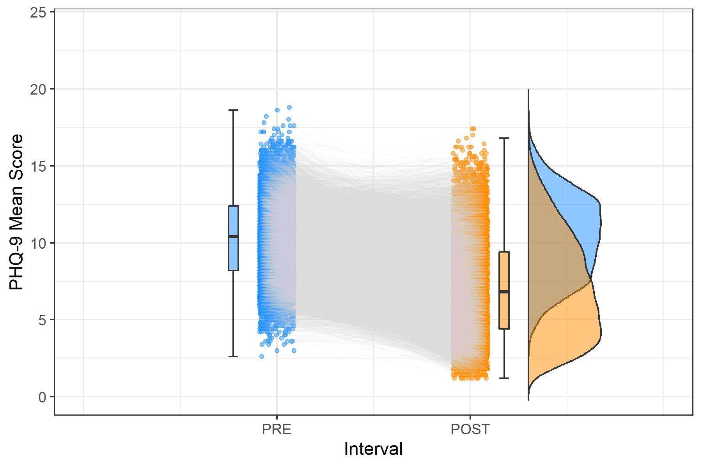
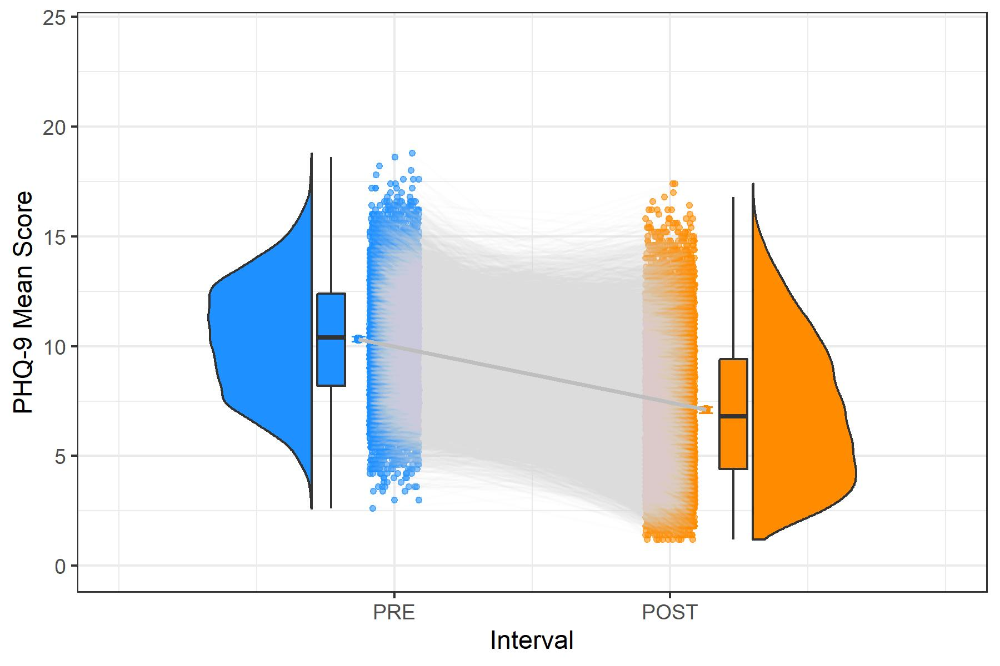
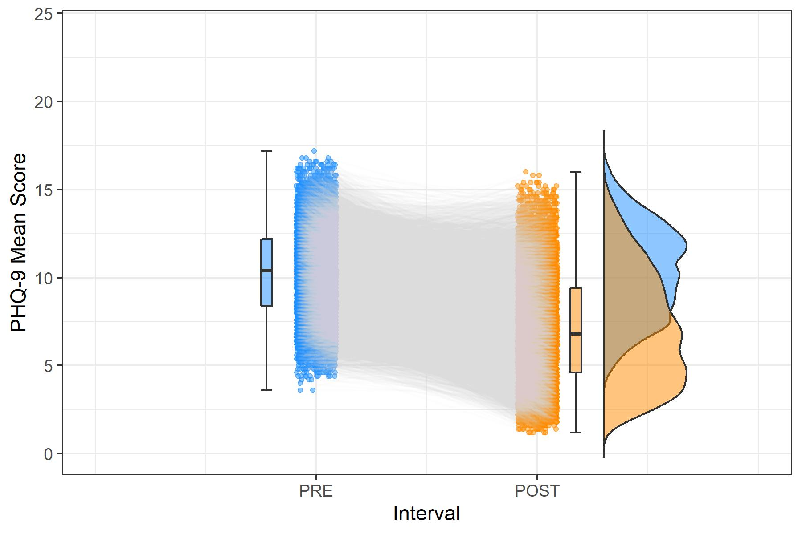
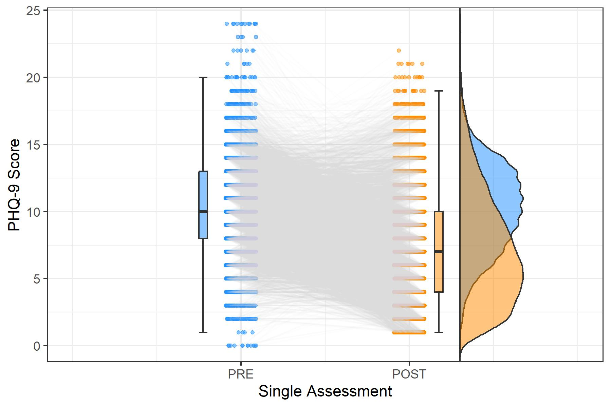
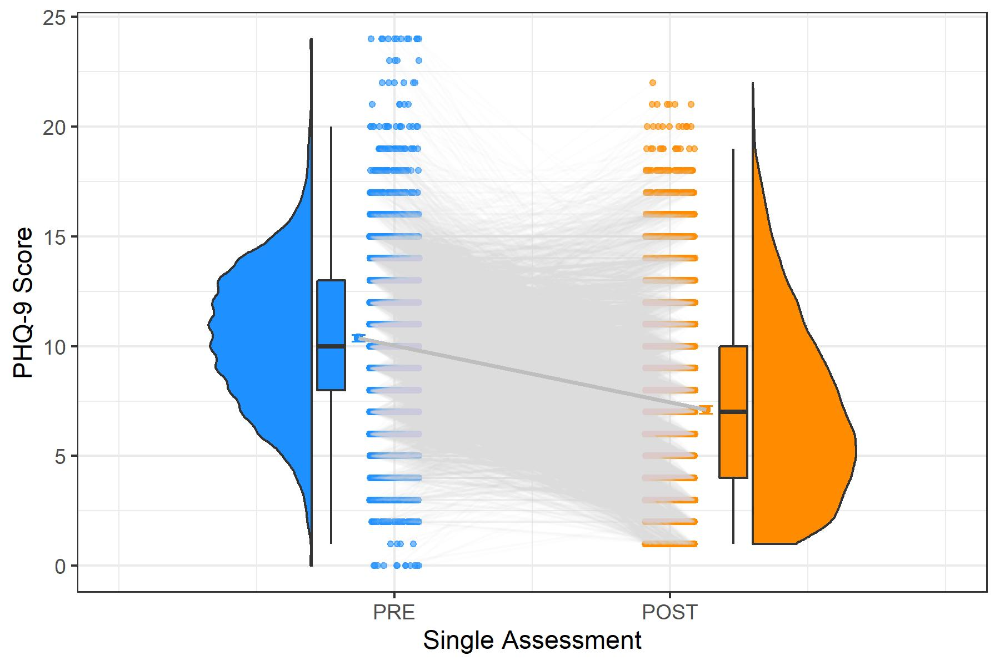

# Vergleich von Klassifikationsmethoden in simulierten Fragebogen-Daten

<br>

> Vergleich von Methoden zur Veränderungsklassifikation in simulierten Fragebogen-Daten für verschiedene Messzeitpunkt-Intervalle:  

> **"PP_5.5"** besteht aus je 5 MZP im Pre- und im Post-Intervall, wobei diese (pro Person) jeweils als zusammenhängendes Intervall (Window) zufällig aus den Gesamt-Intervallen ausgewählt wurden. Die Stichprobe umfasst dieselben N = 8180 Personen.  

> **"PP_30.30"** besteht aus je 30 Messzeitpunkten im Pre- und im Post-Intervall. Diese wurden aus den ursprünglichen Simulationsdaten erweitert und umfassen dieselben N = 8180 Personen.  

> **"PP_1.1"** besteht aus jeweils einem für jede einzelne Person zufällig ausgewählten Messzeitpunkt im Pre- und im Post-Intervall (N = 8180).  

```{r setup, message = FALSE,	warning = FALSE, include = FALSE}
knitr::opts_chunk$set(echo = TRUE)

# für Umwandlung RMD -> R Script:
#knitr::purl("C:/Users/steph/OneDrive/Desktop/Psychologie/Masterstudium Psychologie/3. Semester/1. Master-Konversatorium/Preprocessing und Berechnungen/PP_Stichprobenvergleiche_d0.89.Rmd", output = "PP_Stichprobenvergleiche_d0.89.R", documentation = 2)
# für automatische Benennung von Chunks:
#remedy::chunknamer()

setwd(
  "C:/Users/steph/OneDrive/Desktop/Psychologie/Masterstudium Psychologie/3. Semester/1. Master-Konversatorium/Preprocessing und Berechnungen"
)

pacman::p_load(plyr, dplyr, tidyverse, bootstrap, sjmisc, lattice, Rmisc, devtools, psych, DescTools, summarytools, kableExtra, lubridate, timetk, overlapping, ggplot2, gghalves, plot.matrix, caret)

set.seed(42)

pre_30mzp = c("PRE1_1","PRE1_2","PRE1_3","PRE1_4","PRE1_5",
            "PRE1_6","PRE1_7","PRE1_8","PRE1_9","PRE1_10",
            "PRE1_11","PRE1_12","PRE1_13","PRE1_14","PRE1_15",
            "PRE1_16","PRE1_17","PRE1_18","PRE1_19","PRE1_20",
            "PRE1_21","PRE1_22","PRE1_23","PRE1_24","PRE1_25",
            "PRE1_26","PRE1_27","PRE1_28","PRE1_29","PRE1_30")

post_30mzp = c("POST1_1","POST1_2","POST1_3","POST1_4","POST1_5",
             "POST1_6","POST1_7","POST1_8","POST1_9","POST1_10",
             "POST1_11","POST1_12","POST1_13","POST1_14","POST1_15",
             "POST1_16","POST1_17","POST1_18","POST1_19","POST1_20",
             "POST1_21","POST1_22","POST1_23","POST1_24","POST1_25",
             "POST1_26","POST1_27","POST1_28","POST1_29","POST1_30")

pre_5mzp = c("PRE1_1","PRE1_2","PRE1_3","PRE1_4","PRE1_5")
post_5mzp = c("POST1_1","POST1_2","POST1_3","POST1_4","POST1_5")


###<!-- PP_30.30
load("cor_07_k20/PP_30.30.RData")
PP_30.30 = PP_30.30 %>%
  as_tibble()
###-->


###<!-- PP_5.5 aus den Original-Daten (je erste 5 MZP PRE und POST aus PP_30.30) ###
##PP_5.5 = read.delim("cor_07_k20/cor_07_dataset_k20.txt", row.names=NULL) %>% 
##  select(PRE1_1:POST1_5) %>% 
##  add_column(., .before = "PRE1_1", ID = 1:nrow(.)) %>% 
##  filter(ID %in% PP_30.30$ID1_PRE) %>% 
##  as_tibble()
##save(PP_5.5, file = "cor_07_k20/PP_5.5.RData")

#load("cor_07_k20/PP_5.5.RData")
#PP_5.5 = PP_5.5 %>% 
#  dplyr::rename(ID_orig = ID) %>% 
#  filter(ID_orig %in% PP_30.30$ID1_PRE)
#-->

###<!-- PP_5.5 als 5-fache Random Windows aus PP_30.30 ###
### Zufallsauswahl von je 5 MZP PRE und POST
# je ein zufälliges Intervall von 5 aufeinanderfolgenden MZP
#PP_5.5 = data.frame(ID = c(),
#  PRE1_1 = c(),PRE1_2 = c(),PRE1_3 = c(),PRE1_4 = c(),PRE1_5 = c(),
#  POST1_1 = c(),POST1_2 = c(),POST1_3 = c(),POST1_4 = c(),POST1_5 = c())
#
#for (i in 1:length(PP_30.30$ID1_PRE)) {
#  a = sample(1:26, 1)
#  PP_5.5_pre_Window = pre_30mzp[seq(from = a, to = a+4)]
#  b = sample(1:26, 1)
#  PP_5.5_post_Window = post_30mzp[seq(from = b, to = b+4)]
#  PP_5.5[i,"ID_orig"] = PP_30.30[i,"ID1_PRE"]
#  PP_5.5[i,"PRE1_1"] = PP_30.30[i,PP_5.5_pre_Window[1]]
#  PP_5.5[i,"PRE1_2"] = PP_30.30[i,PP_5.5_pre_Window[2]]
#  PP_5.5[i,"PRE1_3"] = PP_30.30[i,PP_5.5_pre_Window[3]]
#  PP_5.5[i,"PRE1_4"] = PP_30.30[i,PP_5.5_pre_Window[4]]
#  PP_5.5[i,"PRE1_5"] = PP_30.30[i,PP_5.5_pre_Window[5]]
#  PP_5.5[i,"POST1_1"] = PP_30.30[i,PP_5.5_post_Window[1]]
#  PP_5.5[i,"POST1_2"] = PP_30.30[i,PP_5.5_post_Window[2]]
#  PP_5.5[i,"POST1_3"] = PP_30.30[i,PP_5.5_post_Window[3]]
#  PP_5.5[i,"POST1_4"] = PP_30.30[i,PP_5.5_post_Window[4]]
#  PP_5.5[i,"POST1_5"] = PP_30.30[i,PP_5.5_post_Window[5]]
#}
#PP_5.5 = PP_5.5 %>% as_tibble()
##save(PP_5.5, file = "cor_07_k20/PP_5.5_Window.RData")
load("cor_07_k20/PP_5.5_Window.RData")
#-->


###<!-- PP_1.1 aus den jeweils 1. MZP PRE und POST von PP_5.5 (=erste 5 aus 30.30) ###
##PP_1.1 = PP_5.5 %>% 
##  select(ID_orig, PRE1_1, POST1_1) %>% 
##  dplyr::rename(PRE = PRE1_1, POST = POST1_1)
##save(PP_1.1, file = "cor_07_k20/PP_1.1.RData")
#load("cor_07_k20/PP_1.1.RData")
#-->

###<!-- PP_1.1 als zufällig ausgewählte Single-Point Assessments aus PP_30.30 ###
### Zufallsauswahl von je 1 MZP PRE und POST
#PP_1.1 = data.frame(ID = c(),PRE = c(),POST = c())
#for (i in 1:length(PP_30.30$ID1_PRE)) {
#  a = sample(1:30, 1)
#  PP_1.1_pre = pre_30mzp[a]
#  b = sample(1:30, 1)
#  PP_1.1_post = post_30mzp[b]
#  PP_1.1[i,"ID_orig"] = PP_30.30[i,"ID1_PRE"]
#  PP_1.1[i,"PRE"] = PP_30.30[i,PP_1.1_pre]
#  PP_1.1[i,"POST"] = PP_30.30[i,PP_1.1_post]
#}
#PP_1.1 = PP_1.1 %>% as_tibble()
##save(PP_1.1, file = "cor_07_k20/PP_1.1_Random_Days.RData")
load("cor_07_k20/PP_1.1_Random_Days.RData")
#-->


PP_5.5$PRE_Mean = apply(PP_5.5[pre_5mzp], 1, mean)
PP_5.5$POST_Mean = apply(PP_5.5[post_5mzp], 1, mean)
PP_5.5$MeanDiff = PP_5.5$PRE_Mean - PP_5.5$POST_Mean
PP_5.5$ind.pretestSD = apply(PP_5.5[pre_5mzp], 1, sd)
PP_5.5$ind.posttestSD = apply(PP_5.5[post_5mzp], 1, sd)

PP_1.1$Diff = as.numeric(PP_1.1$PRE - PP_1.1$POST)
```

```{r remedy01}
# Ausschluss von Personen ohne Varianz in min. einem MZP-Intervall

PP_5.5 = PP_5.5 %>% 
  filter(ind.pretestSD != 0 & ind.posttestSD != 0)

PP_30.30 = PP_30.30 %>% 
  filter(ind.pretestSD != 0 & ind.posttestSD != 0)


PP_5.5 = PP_5.5 %>% 
  filter(ID_orig %in% PP_30.30$ID1_PRE)

PP_30.30 = PP_30.30 %>% 
  filter(ID1_PRE %in% PP_5.5$ID_orig)

PP_1.1 = PP_1.1 %>% 
  filter(ID_orig %in% PP_5.5$ID_orig & ID_orig %in% PP_30.30$ID1_PRE)


PP_5.5 = PP_5.5 %>% 
  add_column(., .before = "ID_orig", ID = 1:nrow(.))

PP_30.30 = PP_30.30 %>% 
  add_column(., .before = "ID1_PRE", ID = 1:nrow(.))

PP_1.1 = PP_1.1 %>% 
  add_column(., .before = "ID_orig", ID = 1:nrow(.))
```

***


## Überblick über die simulierten Daten {.tabset .tabset-pills}

> Beispiel-Verläufe in den 3 untersuchten Datensets

### Original-Simulationsdaten (je 5 MZP)

```{r remedy02, warning=FALSE}
PP_5.5 %>%
  within(., {ind.pretestSD = round(ind.pretestSD, digits = 2)
            ind.posttestSD = round(ind.posttestSD, digits = 2)}) %>% 
  head() %>% 
  kable() %>% 
  kable_styling(bootstrap_options = c("striped", "hover", "condensed"), full_width = FALSE) %>% 
  scroll_box(width = "100%")
```
<br>

> Pre-Post-Verläufe für 9 zufällig gezogene Personen

```{r remedy03, message=FALSE, warning=FALSE}
rand = sample(PP_5.5$ID, 9)

x = tibble(ID = c(rep(rand[1],times=11),
                  rep(rand[2],times=11),
                  rep(rand[3],times=11),
                  rep(rand[4],times=11),
                  rep(rand[5],times=11),
                  rep(rand[6],times=11),
                  rep(rand[7],times=11),
                  rep(rand[8],times=11),
                  rep(rand[9],times=11)),
           MZP = rep(seq(as.Date("2020-01-01"), length.out=11, by="1 day"), times=9),
           Score = c(as.numeric(PP_5.5[rand[1],pre_5mzp]), NA, as.numeric(PP_5.5[rand[1],post_5mzp]),
                     as.numeric(PP_5.5[rand[2],pre_5mzp]), NA, as.numeric(PP_5.5[rand[2],post_5mzp]),
                     as.numeric(PP_5.5[rand[3],pre_5mzp]), NA, as.numeric(PP_5.5[rand[3],post_5mzp]),
                     as.numeric(PP_5.5[rand[4],pre_5mzp]), NA, as.numeric(PP_5.5[rand[4],post_5mzp]),
                     as.numeric(PP_5.5[rand[5],pre_5mzp]), NA, as.numeric(PP_5.5[rand[5],post_5mzp]),
                     as.numeric(PP_5.5[rand[6],pre_5mzp]), NA, as.numeric(PP_5.5[rand[6],post_5mzp]),
                     as.numeric(PP_5.5[rand[7],pre_5mzp]), NA, as.numeric(PP_5.5[rand[7],post_5mzp]),
                     as.numeric(PP_5.5[rand[8],pre_5mzp]), NA, as.numeric(PP_5.5[rand[8],post_5mzp]),
                     as.numeric(PP_5.5[rand[9],pre_5mzp]), NA, as.numeric(PP_5.5[rand[9],post_5mzp])))

x %>%
  group_by(ID) %>% 
  plot_time_series(MZP, Score,
    #.color_var = ID,           # for multiple lines in one plot
    #.color_lab = "ID",
    .facet_ncol = 3,
    .facet_scales = "fixed",
    .interactive = TRUE,
    .facet_collapse = FALSE,
    .smooth = TRUE,
    .smooth_degree = 2,
    .smooth_alpha = 0.5,
    .smooth_size = 0.2
  )
```

```{r remedy04, eval=FALSE}
# don´t run this section (code for extremely computation-intense plots that I already stored as .RData and .jpg)
# repeated-measures scatter-boxplot-violin-histograms for individual PRE and POST means
# from van Langen (2020) Open-visualizations tutorial for repeated measures in R

# PP_5.5
# converting my dataframes to use in the same ggplot structure:
PP_5.5_ts = PP_5.5 %>% 
  select(ID, PRE_Mean, POST_Mean) %>% 
  pivot_longer(!ID, names_to = "Interval", values_to = "Mean") %>% 
  mutate(ID = as.factor(ID),
         Interval = rep(c(1,2), times = nrow(PP_5.5)))

save(PP_5.5_ts, file = "Time Series Dataframes/k20_PP_5.5_ts.RData")

###

load("Time Series Dataframes/k20_PP_5.5_ts.RData")

# Repeated measures with box− and violin plots
PP_5.5_ts$jit = jitter(PP_5.5_ts$Interval, amount = .09)

Pre_Post_Box_Violin = ggplot(data = PP_5.5_ts, aes(y = Mean)) +
  geom_point(data = PP_5.5_ts %>% filter(Interval == "1"), aes(x = jit), color = "dodgerblue", size = 1,
             alpha = .5) +
  geom_point(data = PP_5.5_ts %>% filter(Interval == "2"), aes(x = jit), color = "darkorange", size = 1,
             alpha = .5) +
  geom_line(aes(x = jit, group = ID), color = "lightgray", alpha = .05) +
  geom_half_boxplot(
    data = PP_5.5_ts %>% filter(Interval == "1"), aes(x = Interval, y = Mean), position = position_nudge(x = -.25),
    side = "r", outlier.shape = NA, center = TRUE, errorbar.draw = TRUE, width = .1,
    fill = "dodgerblue", alpha = .5) +
  geom_half_boxplot(
    data = PP_5.5_ts %>% filter(Interval == "2"), aes(x = Interval, y = Mean), position = position_nudge(x = .15),
    side = "r", outlier.shape = NA, center = TRUE, errorbar.draw = TRUE, width = .1,
    fill = "darkorange", alpha = .5) +
  geom_half_violin(
    data = PP_5.5_ts %>% filter(Interval == "1"), aes(x = Interval, y = Mean), position = position_nudge(x = 1.3),
    side = "r", fill = "dodgerblue", alpha = .5, trim = FALSE) +
  geom_half_violin(
    data = PP_5.5_ts %>% filter(Interval == "2"), aes(x = Interval, y = Mean), position = position_nudge(x = .3),
    side = "r", fill = "darkorange", alpha = .5, trim = FALSE) +
  scale_x_continuous(breaks = c(1,2), labels = c("PRE", "POST"), limits = c(0, 3)) +
  xlab("Interval") + ylab("PHQ-9 Mean Score") +
  #ggtitle("Paper-Pencil Data (5+5 Timepoints): Individual Pre-Post Means") +
  #theme_classic() +
  theme_bw() +
  coord_cartesian(ylim = c(0, 24))

ggsave("Time Series Dataframes/k20_PP_5.5_Pre-Post_Box_Violin.jpg", plot = Pre_Post_Box_Violin, width = 6, height = 4)
save(Pre_Post_Box_Violin, file = "Time Series Dataframes/k20_PP_5.5_Pre_Post_Box_Violin.RData")


# Repeated measures with box− and violin plots and means + CIs
score_mean_1 = PP_5.5_ts %>% filter(Interval == "1") %>% summarise(mean(Mean)) %>% as.numeric()
score_mean_2 = PP_5.5_ts %>% filter(Interval == "2") %>% summarise(mean(Mean)) %>% as.numeric()
score_median1 = PP_5.5_ts %>% filter(Interval == "1") %>% summarise(median(Mean)) %>% as.numeric()
score_median2 = PP_5.5_ts %>% filter(Interval == "2") %>% summarise(median(Mean)) %>% as.numeric()
score_sd_1 = PP_5.5_ts %>% filter(Interval == "1") %>% summarise(sd(Mean)) %>% as.numeric()
score_sd_2 = PP_5.5_ts %>% filter(Interval == "2") %>% summarise(sd(Mean)) %>% as.numeric()
score_se_1 = score_sd_1/sqrt(nrow(PP_5.5))
score_se_2 = score_sd_2/sqrt(nrow(PP_5.5))
score_ci_1 = PP_5.5_ts %>% filter(Interval == "1") %>% pull(Mean) %>% CI(., ci = 0.95)
score_ci_2 = PP_5.5_ts %>% filter(Interval == "2") %>% pull(Mean) %>% CI(., ci = 0.95)
#Create data frame with 2 rows and 7 columns containing the descriptives
group = c("PRE", "POST")
N = c(nrow(PP_5.5), nrow(PP_5.5))
score_mean = c(score_mean_1, score_mean_2)
score_median = c(score_median1, score_median2)
sd = c(score_sd_1, score_sd_2)
se = c(score_se_1, score_se_2)
ci = c(as.numeric(score_ci_1[1] - score_ci_1[3]), as.numeric(score_ci_2[1] - score_ci_2[3]))
summary_df = data.frame(group, N, score_mean, score_median, sd, se, ci)

# PP_5.5_ts$jit = jitter(PP_5.5_ts$Interval, amount = .09)     #already created above
x_tick_means = c(.87, 2.13)

Pre_Post_Box_Violin_Mean_CI = ggplot(data = PP_5.5_ts, aes(y = Mean)) +
  geom_point(data = PP_5.5_ts %>% filter(Interval == "1"), aes(x = jit), color = "dodgerblue", size = 1,
             alpha = .6) +
  geom_point(data = PP_5.5_ts %>% filter(Interval == "2"), aes(x = jit), color = "darkorange", size = 1,
             alpha = .6) +
  geom_line(aes(x = jit, group = ID), color = "lightgray", alpha = .05) +
  geom_half_boxplot(
    data = PP_5.5_ts %>% filter(Interval == "1"), aes(x = Interval, y = Mean), position = position_nudge(x = -.28),
    side = "r", outlier.shape = NA, center = TRUE, errorbar.draw = FALSE, width = .2,
    fill = "dodgerblue") +
  geom_half_boxplot(
    data = PP_5.5_ts %>% filter(Interval == "2"), aes(x = Interval, y = Mean), position = position_nudge(x = .18),
    side = "r", outlier.shape = NA, center = TRUE, errorbar.draw = FALSE, width = .2,
    fill = "darkorange") +
  geom_half_violin(
    data = PP_5.5_ts %>% filter(Interval == "1"), aes(x = Interval, y = Mean), position = position_nudge(x = -.3),
    side = "l", fill = "dodgerblue") +
  geom_half_violin(
    data = PP_5.5_ts %>% filter(Interval == "2"),aes(x = Interval, y = Mean), position = position_nudge(x = .3),
    side = "r", fill = "darkorange") +
  geom_point(data = PP_5.5_ts %>% filter(Interval == "1"), aes(x = Interval, y = score_mean[1]),
             position = position_nudge(x = -.13), color = "dodgerblue", alpha = .6, size = 1.5) +
  geom_errorbar(data = PP_5.5_ts %>% filter(Interval == "1"), aes(x = Interval, y = score_mean[1],
                                                 ymin = score_mean[1]-ci[1], ymax = score_mean[1]+ci[1]),
                position = position_nudge(-.13), color = "dodgerblue", width = 0.05, size = 0.4, alpha = .6) +
  geom_point(data = PP_5.5_ts %>% filter(Interval == "2"), aes(x = Interval, y = score_mean[2]),
             position = position_nudge(x = .13), color = "darkorange", alpha = .6, size = 1.5)+
  geom_errorbar(data = PP_5.5_ts %>% filter(Interval == "2"), aes(x = Interval, y = score_mean[2],
                                                 ymin = score_mean[2]-ci[2], ymax = score_mean[2]+ci[2]), 
                position = position_nudge(.13), color = "darkorange", width = 0.05, size = 0.4, alpha = .6) +
  geom_line(data = summary_df, aes(x = x_tick_means, y = score_mean), color = "gray", size = 1) +
  scale_x_continuous(breaks = c(1,2), labels = c("PRE", "POST"), limits = c(0, 3)) +
  xlab("Interval") + ylab("PHQ-9 Mean Score") +
  #ggtitle("Paper-Pencil Data (5+5 Timepoints): Individual Pre-Post Means") +
  #theme_classic() +
  theme_bw() +
  coord_cartesian(ylim = c(0, 24))

ggsave("Time Series Dataframes/k20_PP_5.5_Pre-Post_Box_Violin_Mean+CI.jpg", plot = Pre_Post_Box_Violin_Mean_CI, width = 6, height = 4)
save(Pre_Post_Box_Violin_Mean_CI, file = "Time Series Dataframes/k20_PP_5.5_Pre_Post_Box_Violin_Mean_CI.RData")
```

```{r remedy05, fig.align="center", out.width="75%"}
#

```

***


### Erweiterte Intervall-Daten (je 30 MZP)

```{r remedy06, warning=FALSE}
PP_30.30 %>% 
  select(-(ID1_PRE:ID6_POST)) %>% 
  within(., {ind.pretestSD = round(ind.pretestSD, digits = 2)
            ind.posttestSD = round(ind.posttestSD, digits = 2)}) %>% 
  head() %>% 
  kable() %>%
  kable_styling(bootstrap_options = c("striped", "hover", "condensed"), full_width = FALSE) %>% 
  scroll_box(width = "100%")
```
<br>

> Pre-Post-Verläufe für 9 zufällig gezogene Personen

```{r remedy07, message=FALSE, warning=FALSE}
rand = sample(PP_30.30$ID, 9)

x = tibble(ID = c(rep(rand[1],times=61),
                     rep(rand[2],times=61),
                     rep(rand[3],times=61),
                     rep(rand[4],times=61),
                     rep(rand[5],times=61),
                     rep(rand[6],times=61),
                     rep(rand[7],times=61),
                     rep(rand[8],times=61),
                     rep(rand[9],times=61)),
              MZP = rep(seq(as.Date("2020-01-01"), length.out=61, by="1 day"), times=9),
              Score = c(as.numeric(PP_30.30[rand[1],pre_30mzp]), NA, as.numeric(PP_30.30[rand[1],post_30mzp]),
                        as.numeric(PP_30.30[rand[2],pre_30mzp]), NA, as.numeric(PP_30.30[rand[2],post_30mzp]),
                        as.numeric(PP_30.30[rand[3],pre_30mzp]), NA, as.numeric(PP_30.30[rand[3],post_30mzp]),
                        as.numeric(PP_30.30[rand[4],pre_30mzp]), NA, as.numeric(PP_30.30[rand[4],post_30mzp]),
                        as.numeric(PP_30.30[rand[5],pre_30mzp]), NA, as.numeric(PP_30.30[rand[5],post_30mzp]),
                        as.numeric(PP_30.30[rand[6],pre_30mzp]), NA, as.numeric(PP_30.30[rand[6],post_30mzp]),
                        as.numeric(PP_30.30[rand[7],pre_30mzp]), NA, as.numeric(PP_30.30[rand[7],post_30mzp]),
                        as.numeric(PP_30.30[rand[8],pre_30mzp]), NA, as.numeric(PP_30.30[rand[8],post_30mzp]),
                        as.numeric(PP_30.30[rand[9],pre_30mzp]), NA, as.numeric(PP_30.30[rand[9],post_30mzp])))

x %>%
  group_by(ID) %>% 
  plot_time_series(MZP, Score,
    #.color_var = ID,           # for multiple lines in one plot
    #.color_lab = "ID",
    .facet_ncol = 3,
    .facet_scales = "fixed",
    .interactive = TRUE,
    .facet_collapse = FALSE,
    .smooth = TRUE,
    .smooth_degree = 2,
    .smooth_alpha = 0.5,
    .smooth_size = 0.2
  )
```

```{r remedy08, eval=FALSE}
# don´t run this section (code for extremely computation-intense plots that I already stored as .RData and .jpg)
# repeated-measures scatter-boxplot-violin-histograms for individual PRE and POST means
# from van Langen (2020) Open-visualizations tutorial for repeated measures in R

# PP_30.30
# converting my dataframes to use in the same ggplot structure:
PP_30.30_ts = PP_30.30 %>% 
  select(ID, PRE_Mean, POST_Mean) %>% 
  pivot_longer(!ID, names_to = "Interval", values_to = "Mean") %>% 
  mutate(ID = as.factor(ID),
         Interval = rep(c(1,2), times = nrow(PP_30.30)))

save(PP_30.30_ts, file = "Time Series Dataframes/k20_PP_30.30_ts.RData")

###

load("Time Series Dataframes/k20_PP_30.30_ts.RData")

# Repeated measures with box− and violin plots
PP_30.30_ts$jit = jitter(PP_30.30_ts$Interval, amount = .09)

Pre_Post_Box_Violin = ggplot(data = PP_30.30_ts, aes(y = Mean)) +
  geom_point(data = PP_30.30_ts %>% filter(Interval == "1"), aes(x = jit), color = "dodgerblue", size = 1,
             alpha = .5) +
  geom_point(data = PP_30.30_ts %>% filter(Interval == "2"), aes(x = jit), color = "darkorange", size = 1,
             alpha = .5) +
  geom_line(aes(x = jit, group = ID), color = "lightgray", alpha = .05) +
  geom_half_boxplot(
    data = PP_30.30_ts %>% filter(Interval == "1"), aes(x = Interval, y = Mean), position = position_nudge(x = -.25),
    side = "r", outlier.shape = NA, center = TRUE, errorbar.draw = TRUE, width = .1,
    fill = "dodgerblue", alpha = .5) +
  geom_half_boxplot(
    data = PP_30.30_ts %>% filter(Interval == "2"), aes(x = Interval, y = Mean), position = position_nudge(x = .15),
    side = "r", outlier.shape = NA, center = TRUE, errorbar.draw = TRUE, width = .1,
    fill = "darkorange", alpha = .5) +
  geom_half_violin(
    data = PP_30.30_ts %>% filter(Interval == "1"), aes(x = Interval, y = Mean), position = position_nudge(x = 1.3),
    side = "r", fill = "dodgerblue", alpha = .5, trim = FALSE) +
  geom_half_violin(
    data = PP_30.30_ts %>% filter(Interval == "2"), aes(x = Interval, y = Mean), position = position_nudge(x = .3),
    side = "r", fill = "darkorange", alpha = .5, trim = FALSE) +
  scale_x_continuous(breaks = c(1,2), labels = c("PRE", "POST"), limits = c(0, 3)) +
  xlab("Interval") + ylab("PHQ-9 Mean Score") +
  #ggtitle("Paper-Pencil Data (30+30 Timepoints): Individual Pre-Post Means") +
  #theme_classic() +
  theme_bw() +
  coord_cartesian(ylim = c(0, 24))

ggsave("Time Series Dataframes/k20_PP_30.30_Pre-Post_Box_Violin.jpg", plot = Pre_Post_Box_Violin, width = 6, height = 4)
save(Pre_Post_Box_Violin, file = "Time Series Dataframes/k20_PP_30.30_Pre_Post_Box_Violin.RData")


# Repeated measures with box− and violin plots and means + CIs
score_mean_1 = PP_30.30_ts %>% filter(Interval == "1") %>% summarise(mean(Mean)) %>% as.numeric()
score_mean_2 = PP_30.30_ts %>% filter(Interval == "2") %>% summarise(mean(Mean)) %>% as.numeric()
score_median1 = PP_30.30_ts %>% filter(Interval == "1") %>% summarise(median(Mean)) %>% as.numeric()
score_median2 = PP_30.30_ts %>% filter(Interval == "2") %>% summarise(median(Mean)) %>% as.numeric()
score_sd_1 = PP_30.30_ts %>% filter(Interval == "1") %>% summarise(sd(Mean)) %>% as.numeric()
score_sd_2 = PP_30.30_ts %>% filter(Interval == "2") %>% summarise(sd(Mean)) %>% as.numeric()
score_se_1 = score_sd_1/sqrt(nrow(PP_30.30))
score_se_2 = score_sd_2/sqrt(nrow(PP_30.30))
score_ci_1 = PP_30.30_ts %>% filter(Interval == "1") %>% pull(Mean) %>% CI(., ci = 0.95)
score_ci_2 = PP_30.30_ts %>% filter(Interval == "2") %>% pull(Mean) %>% CI(., ci = 0.95)
#Create data frame with 2 rows and 7 columns containing the descriptives
group = c("PRE", "POST")
N = c(nrow(PP_30.30), nrow(PP_30.30))
score_mean = c(score_mean_1, score_mean_2)
score_median = c(score_median1, score_median2)
sd = c(score_sd_1, score_sd_2)
se = c(score_se_1, score_se_2)
ci = c((score_ci_1[1] - score_ci_1[3]), (score_ci_2[1] - score_ci_2[3]))
summary_df = data.frame(group, N, score_mean, score_median, sd, se, ci)

# PP_30.30_ts$jit = jitter(PP_30.30_ts$Interval, amount = .09)     #already created above
x_tick_means = c(.87, 2.13)

Pre_Post_Box_Violin_Mean_CI = ggplot(data = PP_30.30_ts, aes(y = Mean)) +
  geom_point(data = PP_30.30_ts %>% filter(Interval == "1"), aes(x = jit), color = "dodgerblue", size = 1,
             alpha = .6) +
  geom_point(data = PP_30.30_ts %>% filter(Interval == "2"), aes(x = jit), color = "darkorange", size = 1,
             alpha = .6) +
  geom_line(aes(x = jit, group = ID), color = "lightgray", alpha = .05) +
  geom_half_boxplot(
    data = PP_30.30_ts %>% filter(Interval == "1"), aes(x = Interval, y = Mean), position = position_nudge(x = -.28),
    side = "r", outlier.shape = NA, center = TRUE, errorbar.draw = FALSE, width = .2,
    fill = "dodgerblue") +
  geom_half_boxplot(
    data = PP_30.30_ts %>% filter(Interval == "2"), aes(x = Interval, y = Mean), position = position_nudge(x = .18),
    side = "r", outlier.shape = NA, center = TRUE, errorbar.draw = FALSE, width = .2,
    fill = "darkorange") +
  geom_half_violin(
    data = PP_30.30_ts %>% filter(Interval == "1"), aes(x = Interval, y = Mean), position = position_nudge(x = -.3),
    side = "l", fill = "dodgerblue") +
  geom_half_violin(
    data = PP_30.30_ts %>% filter(Interval == "2"),aes(x = Interval, y = Mean), position = position_nudge(x = .3),
    side = "r", fill = "darkorange") +
  geom_point(data = PP_30.30_ts %>% filter(Interval == "1"), aes(x = Interval, y = score_mean[1]),
             position = position_nudge(x = -.13), color = "dodgerblue", alpha = .6, size = 1.5) +
  geom_errorbar(data = PP_30.30_ts %>% filter(Interval == "1"), aes(x = Interval, y = score_mean[1],
                                                 ymin = score_mean[1]-ci[1], ymax = score_mean[1]+ci[1]),
                position = position_nudge(-.13), color = "dodgerblue", width = 0.05, size = 0.4, alpha = .6) +
  geom_point(data = PP_30.30_ts %>% filter(Interval == "2"), aes(x = Interval, y = score_mean[2]),
             position = position_nudge(x = .13), color = "darkorange", alpha = .6, size = 1.5)+
  geom_errorbar(data = PP_30.30_ts %>% filter(Interval == "2"), aes(x = Interval, y = score_mean[2],
                                                 ymin = score_mean[2]-ci[2], ymax = score_mean[2]+ci[2]), 
                position = position_nudge(.13), color = "darkorange", width = 0.05, size = 0.4, alpha = .6) +
  geom_line(data = summary_df, aes(x = x_tick_means, y = score_mean), color = "gray", size = 1) +
  scale_x_continuous(breaks = c(1,2), labels = c("PRE", "POST"), limits = c(0, 3)) +
  xlab("Interval") + ylab("PHQ-9 Mean Score") +
  #ggtitle("Paper-Pencil Data (30+30 Timepoints): Individual Pre-Post Means") +
  #theme_classic() +
  theme_bw() +
  coord_cartesian(ylim = c(0, 24))

ggsave("Time Series Dataframes/k20_PP_30.30_Pre-Post_Box_Violin_Mean+CI.jpg", plot = Pre_Post_Box_Violin_Mean_CI, width = 6, height = 4)
save(Pre_Post_Box_Violin_Mean_CI, file = "Time Series Dataframes/k20_PP_30.30_Pre_Post_Box_Violin_Mean_CI.RData")
```

```{r remedy09, fig.align="center", out.width="75%"}
#

```

***


### Stichprobe mit je 1 MZP

```{r remedy10, warning=FALSE}
kable(head(PP_1.1)) %>%
  kable_styling(bootstrap_options = c("striped", "hover", "condensed"), full_width = FALSE)
```
<br>

> Pre-Post-Verläufe für 9 zufällig gezogene Personen

```{r remedy11, message=FALSE, warning=FALSE}
rand = sample(PP_1.1$ID, 9)

x = tibble(ID = c(rep(rand[1],times=3),
                     rep(rand[2],times=3),
                     rep(rand[3],times=3),
                     rep(rand[4],times=3),
                     rep(rand[5],times=3),
                     rep(rand[6],times=3),
                     rep(rand[7],times=3),
                     rep(rand[8],times=3),
                     rep(rand[9],times=3)),
              MZP = rep(seq(as.Date("2020-01-01"), length.out=3, by="1 day"), times=9),
              Score = c(as.numeric(PP_1.1[rand[1],"PRE"]), NA, as.numeric(PP_1.1[rand[1],"POST"]),
                        as.numeric(PP_1.1[rand[2],"PRE"]), NA, as.numeric(PP_1.1[rand[2],"POST"]),
                        as.numeric(PP_1.1[rand[3],"PRE"]), NA, as.numeric(PP_1.1[rand[3],"POST"]),
                        as.numeric(PP_1.1[rand[4],"PRE"]), NA, as.numeric(PP_1.1[rand[4],"POST"]),
                        as.numeric(PP_1.1[rand[5],"PRE"]), NA, as.numeric(PP_1.1[rand[5],"POST"]),
                        as.numeric(PP_1.1[rand[6],"PRE"]), NA, as.numeric(PP_1.1[rand[6],"POST"]),
                        as.numeric(PP_1.1[rand[7],"PRE"]), NA, as.numeric(PP_1.1[rand[7],"POST"]),
                        as.numeric(PP_1.1[rand[8],"PRE"]), NA, as.numeric(PP_1.1[rand[8],"POST"]),
                        as.numeric(PP_1.1[rand[9],"PRE"]), NA, as.numeric(PP_1.1[rand[9],"POST"])))

x %>%
  group_by(ID) %>% 
  plot_time_series(MZP, Score,
    #.color_var = ID,           # for multiple lines in one plot
    #.color_lab = "ID",
    .facet_ncol = 3,
    .facet_scales = "fixed",
    .interactive = TRUE,
    .facet_collapse = FALSE,
    .smooth = TRUE,
    .smooth_degree = 2,
    .smooth_alpha = 0.5,
    .smooth_size = 0.2
  )
```

```{r remedy12, eval=FALSE}
# don´t run this section (code for extremely computation-intense plots that I already stored as .RData and .jpg)
# repeated-measures scatter-boxplot-violin-histograms for individual PRE and POST means
# from van Langen (2020) Open-visualizations tutorial for repeated measures in R

# PP_1.1
# converting my dataframes to use in the same ggplot structure:
PP_1.1_ts = PP_1.1 %>% 
  select(ID, PRE, POST) %>% 
  pivot_longer(!ID, names_to = "Timepoint", values_to = "Score") %>% 
  mutate(ID = as.factor(ID),
         Timepoint = rep(c(1,2), times = nrow(PP_1.1)))

save(PP_1.1_ts, file = "Time Series Dataframes/k20_PP_1.1_ts.RData")

###

load("Time Series Dataframes/k20_PP_1.1_ts.RData")

# Repeated measures with box− and violin plots
PP_1.1_ts$jit = jitter(PP_1.1_ts$Timepoint, amount = .09)

Pre_Post_Box_Violin = ggplot(data = PP_1.1_ts, aes(y = Score)) +
  geom_point(data = PP_1.1_ts %>% filter(Timepoint == "1"), aes(x = jit), color = "dodgerblue", size = 1,
             alpha = .5) +
  geom_point(data = PP_1.1_ts %>% filter(Timepoint == "2"), aes(x = jit), color = "darkorange", size = 1,
             alpha = .5) +
  geom_line(aes(x = jit, group = ID), color = "lightgray", alpha = .05) +
  geom_half_boxplot(
    data = PP_1.1_ts %>% filter(Timepoint == "1"), aes(x = Timepoint, y = Score), position = position_nudge(x = -.25),
    side = "r", outlier.shape = NA, center = TRUE, errorbar.draw = TRUE, width = .1,
    fill = "dodgerblue", alpha = .5) +
  geom_half_boxplot(
    data = PP_1.1_ts %>% filter(Timepoint == "2"), aes(x = Timepoint, y = Score), position = position_nudge(x = .15),
    side = "r", outlier.shape = NA, center = TRUE, errorbar.draw = TRUE, width = .1,
    fill = "darkorange", alpha = .5) +
  geom_half_violin(
    data = PP_1.1_ts %>% filter(Timepoint == "1"), aes(x = Timepoint, y = Score), position = position_nudge(x = 1.3),
    side = "r", fill = "dodgerblue", alpha = .5, trim = FALSE) +
  geom_half_violin(
    data = PP_1.1_ts %>% filter(Timepoint == "2"), aes(x = Timepoint, y = Score), position = position_nudge(x = .3),
    side = "r", fill = "darkorange", alpha = .5, trim = FALSE) +
  scale_x_continuous(breaks = c(1,2), labels = c("PRE", "POST"), limits = c(0, 3)) +
  xlab("Single Assessment") + ylab("PHQ-9 Score") +
  #ggtitle("Paper-Pencil Data (1+1 Timepoints): Individual Pre-Post Means") +
  #theme_classic() +
  theme_bw() +
  coord_cartesian(ylim = c(0, 24))

ggsave("Time Series Dataframes/k20_PP_1.1_Pre-Post_Box_Violin.jpg", plot = Pre_Post_Box_Violin, width = 6, height = 4)
save(Pre_Post_Box_Violin, file = "Time Series Dataframes/k20_PP_1.1_Pre_Post_Box_Violin.RData")


# Repeated measures with box− and violin plots and means + CIs
score_mean_1 = PP_1.1_ts %>% filter(Timepoint == "1") %>% summarise(mean(Score)) %>% as.numeric()
score_mean_2 = PP_1.1_ts %>% filter(Timepoint == "2") %>% summarise(mean(Score)) %>% as.numeric()
score_median1 = PP_1.1_ts %>% filter(Timepoint == "1") %>% summarise(median(Score)) %>% as.numeric()
score_median2 = PP_1.1_ts %>% filter(Timepoint == "2") %>% summarise(median(Score)) %>% as.numeric()
score_sd_1 = PP_1.1_ts %>% filter(Timepoint == "1") %>% summarise(sd(Score)) %>% as.numeric()
score_sd_2 = PP_1.1_ts %>% filter(Timepoint == "2") %>% summarise(sd(Score)) %>% as.numeric()
score_se_1 = score_sd_1/sqrt(nrow(PP_1.1))
score_se_2 = score_sd_2/sqrt(nrow(PP_1.1))
score_ci_1 = PP_1.1_ts %>% filter(Timepoint == "1") %>% pull(Score) %>% CI(., ci = 0.95)
score_ci_2 = PP_1.1_ts %>% filter(Timepoint == "2") %>% pull(Score) %>% CI(., ci = 0.95)
#Create data frame with 2 rows and 7 columns containing the descriptives
group = c("PRE", "POST")
N = c(nrow(PP_1.1), nrow(PP_1.1))
score_mean = c(score_mean_1, score_mean_2)
score_median = c(score_median1, score_median2)
sd = c(score_sd_1, score_sd_2)
se = c(score_se_1, score_se_2)
ci = c((score_ci_1[1] - score_ci_1[3]), (score_ci_2[1] - score_ci_2[3]))
summary_df = data.frame(group, N, score_mean, score_median, sd, se, ci)

# PP_1.1_ts$jit = jitter(PP_1.1_ts$Timepoint, amount = .09)     #already created above
x_tick_means = c(.87, 2.13)

Pre_Post_Box_Violin_Mean_CI = ggplot(data = PP_1.1_ts, aes(y = Score)) +
  geom_point(data = PP_1.1_ts %>% filter(Timepoint == "1"), aes(x = jit), color = "dodgerblue", size = 1,
             alpha = .6) +
  geom_point(data = PP_1.1_ts %>% filter(Timepoint == "2"), aes(x = jit), color = "darkorange", size = 1,
             alpha = .6) +
  geom_line(aes(x = jit, group = ID), color = "lightgray", alpha = .05) +
  geom_half_boxplot(
    data = PP_1.1_ts %>% filter(Timepoint == "1"), aes(x = Timepoint, y = Score), position = position_nudge(x = -.28),
    side = "r", outlier.shape = NA, center = TRUE, errorbar.draw = FALSE, width = .2,
    fill = "dodgerblue") +
  geom_half_boxplot(
    data = PP_1.1_ts %>% filter(Timepoint == "2"), aes(x = Timepoint, y = Score), position = position_nudge(x = .18),
    side = "r", outlier.shape = NA, center = TRUE, errorbar.draw = FALSE, width = .2,
    fill = "darkorange") +
  geom_half_violin(
    data = PP_1.1_ts %>% filter(Timepoint == "1"), aes(x = Timepoint, y = Score), position = position_nudge(x = -.3),
    side = "l", fill = "dodgerblue") +
  geom_half_violin(
    data = PP_1.1_ts %>% filter(Timepoint == "2"),aes(x = Timepoint, y = Score), position = position_nudge(x = .3),
    side = "r", fill = "darkorange") +
  geom_point(data = PP_1.1_ts %>% filter(Timepoint == "1"), aes(x = Timepoint, y = score_mean[1]),
             position = position_nudge(x = -.13), color = "dodgerblue", alpha = .6, size = 1.5) +
  geom_errorbar(data = PP_1.1_ts %>% filter(Timepoint == "1"), aes(x = Timepoint, y = score_mean[1],
                                                 ymin = score_mean[1]-ci[1], ymax = score_mean[1]+ci[1]),
                position = position_nudge(-.13), color = "dodgerblue", width = 0.05, size = 0.4, alpha = .6) +
  geom_point(data = PP_1.1_ts %>% filter(Timepoint == "2"), aes(x = Timepoint, y = score_mean[2]),
             position = position_nudge(x = .13), color = "darkorange", alpha = .6, size = 1.5)+
  geom_errorbar(data = PP_1.1_ts %>% filter(Timepoint == "2"), aes(x = Timepoint, y = score_mean[2],
                                                 ymin = score_mean[2]-ci[2], ymax = score_mean[2]+ci[2]), 
                position = position_nudge(.13), color = "darkorange", width = 0.05, size = 0.4, alpha = .6) +
  geom_line(data = summary_df, aes(x = x_tick_means, y = score_mean), color = "gray", size = 1) +
  scale_x_continuous(breaks = c(1,2), labels = c("PRE", "POST"), limits = c(0, 3)) +
  xlab("Single Assessment") + ylab("PHQ-9 Score") +
  #ggtitle("Paper-Pencil Data (1+1 Timepoints): Individual Pre-Post Means") +
  #theme_classic() +
  theme_bw() +
  coord_cartesian(ylim = c(0, 24))

ggsave("Time Series Dataframes/k20_PP_1.1_Pre-Post_Box_Violin_Mean+CI.jpg", plot = Pre_Post_Box_Violin_Mean_CI, width = 6, height = 4)
save(Pre_Post_Box_Violin_Mean_CI, file = "Time Series Dataframes/k20_PP_1.1_Pre_Post_Box_Violin_Mean_CI.RData")
```

```{r remedy13, fig.align="center", out.width="75%"}
#

```

***


## Deskriptive Statistiken der Datensets

```{r remedy14, warning=FALSE}
tibble(Descriptives = c("mean_PRE_Mean","mean_POST_Mean","mean_MeanDiff","mean_PRE_1MZP","mean_POST_1MZP",
                        "mean_Diff_1MZP","mean_ind.pretestSD","mean_ind.posttestSD","sd_PRE_1MZP","sd_POST_1MZP"),
       PP_5.5 = round(c(mean(PP_5.5$PRE_Mean),mean(PP_5.5$POST_Mean),mean(PP_5.5$MeanDiff),NA,NA,NA,
                       mean(PP_5.5$ind.pretestSD),mean(PP_5.5$ind.posttestSD),NA,NA), digits = 3),
       PP_30.30 = round(c(mean(PP_30.30$PRE_Mean),mean(PP_30.30$POST_Mean),mean(PP_30.30$MeanDiff),
                         NA,NA,NA,mean(PP_30.30$ind.pretestSD),mean(PP_30.30$ind.posttestSD),NA,NA), digits = 3),
       PP_1.1 = round(c(NA,NA,NA,mean(PP_1.1$PRE),mean(PP_1.1$POST),mean(PP_1.1$Diff),
                          NA,NA,sd(PP_1.1$PRE),sd(PP_1.1$POST)), digits = 3)) %>%
  kable() %>%
  kable_styling(bootstrap_options = c("striped", "hover", "condensed"), full_width = FALSE)
```

> Boxplots der Pre- und Post-(Mittel-)Werte

```{r remedy15, message=FALSE, warning=FALSE, fig.align="center", out.width="75%"}
# ein Boxplot mit Pre- und Post-Verteilungen
PP_5.5_Window = PP_5.5 #für eine aussagekräftigere x-Achsen-Beschriftung im Boxplot
temp = tibble(Scores = c(PP_30.30$PRE_Mean, PP_30.30$POST_Mean, 
                         PP_5.5_Window$PRE_Mean, PP_5.5_Window$POST_Mean, 
                         PP_1.1$PRE, PP_1.1$POST), 
              Datasets = rep(as_factor(c("PP_30.30", "PP_5.5_Window", "PP_1.1")), each = 2*length(PP_5.5_Window$PRE_Mean)),
              Assessment = rep(as_factor(c("PRE", "POST", "PRE", "POST", "PRE", "POST")), 
                               each = length(PP_5.5_Window$PRE_Mean)))#<<

ggplot(temp, aes(x = Datasets, y = Scores, fill = Assessment)) + 
  geom_boxplot() + 
  ylim(0, 27) +
  xlab("Dataset") +
  ylab("PHQ-9 Interval Means or Single Scores")#<<

#ggsave("Plots/k20_PP-Datasets_Pre-Post_Boxplots.jpg", width = 6, height = 4)#<<
```

> Prozentuale Überlappung der Pre-(Mittel-)Werte

```{r remedy16, fig.show="hold", message=FALSE, warning=FALSE, out.width="50%"}
# Overlap-Plots zum Vergleich
final.plot(list(PP_5.5_PRE_Mean = PP_5.5$PRE_Mean, PP_30.30_PRE_Mean = PP_30.30$PRE_Mean), 
           overlap(list(PP_5.5_PRE_Mean = PP_5.5$PRE_Mean, PP_30.30_PRE_Mean = PP_30.30$PRE_Mean))$OV)

final.plot(list(PP_5.5_PRE_Mean = PP_5.5$PRE_Mean, PP_1.1_PRE = PP_1.1$PRE), 
           overlap(list(PP_5.5_PRE_Mean = PP_5.5$PRE_Mean, PP_1.1_PRE = PP_1.1$PRE))$OV)

final.plot(list(PP_30.30_PRE_Mean = PP_30.30$PRE_Mean, PP_1.1_PRE = PP_1.1$PRE), 
           overlap(list(PP_30.30_PRE_Mean = PP_30.30$PRE_Mean, PP_1.1_PRE = PP_1.1$PRE))$OV)
```

> Prozentuale Überlappung der Post-(Mittel-)Werte

```{r remedy17, fig.show="hold", message=FALSE, warning=FALSE, out.width="50%"}
# Overlap-Plots zum Vergleich
final.plot(list(PP_5.5_POST_Mean = PP_5.5$POST_Mean, PP_30MZP_POST_Mean = PP_30.30$POST_Mean), 
           overlap(list(PP_5.5_POST_Mean = PP_5.5$POST_Mean, PP_30MZP_POST_Mean = PP_30.30$POST_Mean))$OV)

final.plot(list(PP_5.5_POST_Mean = PP_5.5$POST_Mean, PP_1.1_POST = PP_1.1$POST), 
           overlap(list(PP_5.5_POST_Mean = PP_5.5$POST_Mean, PP_1.1_POST = PP_1.1$POST))$OV)

final.plot(list(PP_30MZP_POST_Mean = PP_30.30$POST_Mean, PP_1.1_POST = PP_1.1$POST), 
           overlap(list(PP_30MZP_POST_Mean = PP_30.30$POST_Mean, PP_1.1_POST = PP_1.1$POST))$OV)
```

***


## Reliabilitäten und Inter-Item-Korrelationen {.tabset .tabset-pills}

### PP_5.5 (je 5 MZP)

```{r remedy18}
# Korrelationsmatrix von PRE- und POST-MZP:
PP_5.5_KorMat = cor(PP_5.5[, c(pre_5mzp, post_5mzp)]) %>% 
  round(., digits = 2)

# durchschnittliche paarweise Korrelation zwischen aufeinanderfolgenden MZP (Fisher-Z-transformiert):
pre_inter_item_rtt = 0L
for (i in 1:4) {
  pre_inter_item_rtt = pre_inter_item_rtt + FisherZ(PP_5.5_KorMat[i,i+1])
}
pre_inter_item_rtt = FisherZInv(pre_inter_item_rtt / 4)

post_inter_item_rtt = 0L
for (i in 5:9) {
  post_inter_item_rtt = post_inter_item_rtt + FisherZ(PP_5.5_KorMat[i,i+1])
}
post_inter_item_rtt = FisherZInv(post_inter_item_rtt / 4)


for (i in 1:9) {
  PP_5.5_KorMat[i, i+1] = cell_spec(PP_5.5_KorMat[i, i+1], "html", bold = TRUE)
}

rownames(PP_5.5_KorMat) = cell_spec(rownames(PP_5.5_KorMat), "html", bold = TRUE)

PP_5.5_KorMat %>%
  kable(., format = "html", escape = FALSE) %>%
  kable_styling(bootstrap_options = c("striped", "hover", "condensed"),
                full_width = FALSE, fixed_thead = T)


# mittleres Cronbach´s Alpha zwischen Pre-MZP und Post-MZP:
PRE_alpha = CronbachAlpha(PP_5.5[pre_5mzp])
POST_alpha = CronbachAlpha(PP_5.5[post_5mzp])
PP_5.5_Alpha = FisherZInv(mean(c(FisherZ(PRE_alpha), FisherZ(POST_alpha))))
```

Korrelation zwischen den Pre- und Post-Intervall-Mittelwerten = `r round(cor(PP_5.5$PRE_Mean, PP_5.5$POST_Mean, use = "complete.obs"), digits = 3)`.  
Durchschnittliche paarweise Korrelation zwischen aufeinanderfolgenden Pre-MZP (Fisher-Z-transformiert): r = `r round(pre_inter_item_rtt, digits = 2)`.  
Durchschnittliche paarweise Korrelation zwischen aufeinanderfolgenden Post-MZP (Fisher-Z-transformiert): r = `r round(post_inter_item_rtt, digits = 2)`.  
Mittleres Cronbach´s Alpha zwischen Pre-MZP und Post-MZP = `r round(PP_5.5_Alpha, digits = 3)`.  

***

### PP_30.30 (je 30 MZP)

```{r remedy19}
# Korrelationsmatrix von PRE- und POST-MZP:
PP_30.30_KorMat = cor(PP_30.30[, c(pre_30mzp, post_30mzp)]) %>% 
  round(., digits = 2)

# durchschnittliche paarweise Korrelation zwischen aufeinanderfolgenden MZP (Fisher-Z-transformiert):
pre_inter_item_rtt = 0L
for (i in 1:29) {
  pre_inter_item_rtt = pre_inter_item_rtt + FisherZ(PP_30.30_KorMat[i,i+1])
}
pre_inter_item_rtt = FisherZInv(pre_inter_item_rtt / 29)

post_inter_item_rtt = 0L
for (i in 31:59) {
  post_inter_item_rtt = post_inter_item_rtt + FisherZ(PP_30.30_KorMat[i,i+1])
}
post_inter_item_rtt = FisherZInv(post_inter_item_rtt / 29)


for (i in 1:59) {
  PP_30.30_KorMat[i, i+1] = cell_spec(PP_30.30_KorMat[i, i+1], "html", bold = TRUE)
}

rownames(PP_30.30_KorMat) = cell_spec(rownames(PP_30.30_KorMat), "html", bold = TRUE)

PP_30.30_KorMat %>%
  kable(., format = "html", escape = FALSE) %>%
  kable_styling(bootstrap_options = c("striped", "hover", "condensed"),
                full_width = FALSE, fixed_thead = T) %>%
  scroll_box(height = "800px")


# mittleres Cronbach´s Alpha zwischen Pre-MZP und Post-MZP:
PRE_alpha = CronbachAlpha(PP_30.30[pre_30mzp])
POST_alpha = CronbachAlpha(PP_30.30[post_30mzp])
PP_30.30_Alpha = FisherZInv(mean(c(FisherZ(PRE_alpha), FisherZ(POST_alpha))))
```

Korrelation zwischen den Pre- und Post-Intervall-Mittelwerten = `r round(cor(PP_30.30$PRE_Mean, PP_30.30$POST_Mean, use = "complete.obs"), digits = 3)`.  
Durchschnittliche paarweise Korrelation zwischen aufeinanderfolgenden Pre-MZP (Fisher-Z-transformiert): r = `r round(pre_inter_item_rtt, digits = 2)`.  
Durchschnittliche paarweise Korrelation zwischen aufeinanderfolgenden Post-MZP (Fisher-Z-transformiert): r = `r round(post_inter_item_rtt, digits = 2)`.  
Mittleres Cronbach´s Alpha zwischen Pre-MZP und Post-MZP = `r round(PP_30.30_Alpha, digits = 3)`.  

***

### PP_1.1 (je 1 MZP)

```{r remedy20}
PP_1.1_rtt = cor(PP_1.1$PRE, PP_1.1$POST)
PP_1.1_Alpha = CronbachAlpha(PP_1.1[c("PRE","POST")])
```

Korrelation zwischen den Pre- und Post-MZP (Retest-Reliabilität) = `r round(PP_1.1_rtt, digits = 3)`.  
Cronbach´s Alpha zwischen dem Pre- und dem Post-MZP = `r round(PP_1.1_Alpha, digits = 3)`.  

***


## Pre-Post-Differenz

> Verteilungen der Pre-Post-(Mittelwerts-)Veränderungen

```{r remedy21, fig.show="hold", out.width="50%"}
#hist(PP_5.5$MeanDiff, col = "lightblue1", main = paste0("Mittlere Pre-Post-Intervall-Differenz in PP_5.5 = ",
#  round(mean(PP_5.5$MeanDiff), digits = 3)))

#hist(PP_30.30$MeanDiff, col = "lightblue1", main = paste0("Mittlere Pre-Post-Intervall-Differenz in PP_30.30 = ",
#  round(mean(PP_30.30$MeanDiff), digits = 3)))

#hist(PP_1.1$Diff, col = "lightblue1", main = paste0("Mittlere Pre-Post-Differenz in PP_1.1 = ", 
#  round(mean(PP_1.1$Diff), digits = 3)))

temp = tibble(MeanDiffs = c(PP_5.5$MeanDiff, PP_30.30$MeanDiff, PP_1.1$Diff),
              Datasets = rep(as_factor(c("PP_5.5", "PP_30.30", "PP_1.1")), each = length(PP_5.5$MeanDiff)))#<<

temp %>%
  ggplot(aes(x = MeanDiffs, fill = Datasets)) +
    geom_histogram(alpha = 0.2, binwidth = 1, position = "identity") +
    labs(x = "PHQ-9 Pre-Post Difference", y = "")#<<

#ggsave("Plots/k20_PP-Datasets_Pre-Post-Diff_Histogram.jpg", width = 6, height = 4)#<<

scatter.hist(PP_1.1$Diff, PP_30.30$MeanDiff, xlab = "PP_1.1$Diff",
  ylab = "PP_30.30$MeanDiff", ellipse = FALSE, grid = TRUE, col = c("dodgerblue", "darkorange"))
```

Korrelation zwischen den Pre-Post-Differenzen in PP_1.1 und PP_30.30 = `r round(cor(PP_1.1$Diff, PP_30.30$MeanDiff, use = "complete.obs"), digits = 3)`.

> Prozentuale Überlappung der Pre-Post-(Mittelwerts-)Veränderungen

```{r remedy22, fig.show="hold", message=FALSE, warning=FALSE, out.width="50%"}
# Overlap-Plots zum Vergleich
final.plot(list(PP_5.5_MeanDiff = PP_5.5$MeanDiff, PP_30.30_MeanDiff = PP_30.30$MeanDiff), 
           overlap(list(PP_5.5_MeanDiff = PP_5.5$MeanDiff, PP_30.30_MeanDiff = PP_30.30$MeanDiff))$OV)

final.plot(list(PP_5.5_MeanDiff = PP_5.5$MeanDiff, PP_1.1_Diff = PP_1.1$Diff), 
           overlap(list(PP_5.5_MeanDiff = PP_5.5$MeanDiff, PP_1.1_Diff = PP_1.1$Diff))$OV)

final.plot(list(PP_30.30_MeanDiff = PP_30.30$MeanDiff, PP_1.1_Diff = PP_1.1$Diff), 
           overlap(list(PP_30.30_MeanDiff = PP_30.30$MeanDiff, PP_1.1_Diff = PP_1.1$Diff))$OV)
```

***

### Cohen´s d  

> Cohen´s d (mit gepoolten SDs) vom Pre- zum Post-Intervall in den Original-Simulationsdaten (je 5 MZP)

\[
d = \frac{\overline{x_{1}} - \overline{x_{2}}}  {\sqrt{0.5 \cdot (s_{x}^2 + s_{y}^2)}}
\]

$\overline{x_{1}}$ = mean of subject´s pretest scores, 
$\overline{x_{2}}$ = mean of subject´s posttest scores, 
$s_{x}$ = individual standard deviation of pretest time points, 
$s_{y}$ = individual standard deviation of posttest time points
<br>

```{r remedy23, fig.show="hold", message=FALSE, warning=FALSE, out.width="50%"}
PP_5.5$Cohen_d = (PP_5.5$PRE_Mean - PP_5.5$POST_Mean) / sqrt(0.5 * (PP_5.5$ind.pretestSD^2 + PP_5.5$ind.posttestSD^2))

# Sollen Cohen_d %in% c(-Inf,Inf) ein-/ausgeschlossen werden?
#PP_5.5 = PP_5.5 %>% 
#  within(., {Cohen_d[Cohen_d %in% c(-Inf,Inf)] = NA})

hist(PP_5.5$Cohen_d, col = "lightblue1", main = "PP_5.5$Cohen_d")

cohen_d_5.5 = (mean(PP_5.5$PRE_Mean) - mean(PP_5.5$POST_Mean)) / sqrt(0.5 * (mean(PP_5.5$ind.pretestSD)^2 +
  mean(PP_5.5$ind.posttestSD)^2))

final.plot(list(PP_5.5_PRE_Mean = PP_5.5$PRE_Mean, PP_5.5_POST_Mean = PP_5.5$POST_Mean), 
           overlap(list(PP_5.5_PRE_Mean = PP_5.5$PRE_Mean, PP_5.5_POST_Mean = PP_5.5$POST_Mean))$OV)
```

Gepoolte Varianz zwischen Pre- und Post-Intervall-Mittelwerten in PP_5.5 = `r round(as.numeric(sqrt(var(PP_5.5$PRE_Mean) + var(PP_5.5$POST_Mean))), digits = 3)`.  
Durchschnittliches Cohen´s d zwischen Pre- und Post-Mittelwerten (für jede Person einzeln berechnet) in PP_5.5 = `r round(mean(PP_5.5$Cohen_d), digits = 3)`.  
Durchschnittliches Cohen´s d zwischen Pre- und Post-Mittelwerten in PP_5.5 = `r round(cohen_d_5.5, digits = 3)`.

***

> Cohen´s d (mit gepoolten SDs) vom Pre- zum Post-Intervall in den erweiterten Intervall-Daten (je 30 MZP)

```{r remedy24, fig.show="hold", message=FALSE, warning=FALSE, out.width="50%"}
PP_30.30$Cohen_d = (PP_30.30$PRE_Mean - PP_30.30$POST_Mean) / sqrt(0.5 * (PP_30.30$ind.pretestSD^2 +
  PP_30.30$ind.posttestSD^2))

# Sollen Cohen_d %in% c(-Inf,Inf) ein-/ausgeschlossen werden?
#PP_30.30 = PP_30.30 %>% 
#  within(., {Cohen_d[Cohen_d %in% c(-Inf,Inf)] = NA})

hist(PP_30.30$Cohen_d, col = "lightblue1", main = "PP_30.30$Cohen_d")

cohen_d_30.30 = (mean(PP_30.30$PRE_Mean) - mean(PP_30.30$POST_Mean)) / sqrt(0.5 * (mean(PP_30.30$ind.pretestSD)^2 + mean(PP_30.30$ind.posttestSD)^2))

final.plot(list(PP_30.30_PRE_Mean = PP_30.30$PRE_Mean, PP_30.30_POST_Mean = PP_30.30$POST_Mean), 
           overlap(list(PP_30.30_PRE_Mean = PP_30.30$PRE_Mean, PP_30.30_POST_Mean =
                          PP_30.30$POST_Mean))$OV)
```

Gepoolte Varianz zwischen Pre- und Post-Intervall-Mittelwerten in PP_30.30 = `r round(as.numeric(sqrt(var(PP_30.30$PRE_Mean) + var(PP_30.30$POST_Mean))), digits = 3)`.  
Durchschnittliches Cohen´s d zwischen Pre- und Post-Mittelwerten (für jede Person einzeln berechnet) in PP_30.30 = `r round(mean(PP_30.30$Cohen_d), digits = 3)`.  
Durchschnittliches Cohen´s d zwischen Pre- und Post-Mittelwerten in PP_30.30 = `r round(cohen_d_30.30, digits = 3)`.

***

> Cohen´s d (mit gepoolten SDs) vom Pre- zum Post-MZP in der Stichprobe mit je 1 MZP

\[
d = \frac{\overline{X_{1}} - \overline{X_{2}}}  {\sqrt{0.5 \cdot (s_{X}^2 + s_{Y}^2)}}
\]

$\overline{X_{1}}$ = mean of pretest scores in the whole sample, 
$\overline{X_{2}}$ = mean of posttest scores in the whole sample, 
$s_{X}$ = standard deviation of pretest scores in the whole sample, 
$s_{Y}$ = standard deviation of posttest scores in the whole sample
<br>

```{r remedy25, fig.align="center", message=FALSE, warning=FALSE, out.width="75%"}
cohen_d_1.1 = (mean(PP_1.1$PRE) - mean(PP_1.1$POST)) / sqrt(0.5 * (sd(PP_1.1$PRE)^2 + sd(PP_1.1$POST)^2))

final.plot(list(PP_1.1_PRE = PP_1.1$PRE, PP_1.1_POST = PP_1.1$POST), 
           overlap(list(PP_1.1_PRE = PP_1.1$PRE, PP_1.1_POST = PP_1.1$POST))$OV)
```

Gepoolte Varianz zwischen dem Pre- und Post-MZP in PP_1.1 = `r round(as.numeric(sqrt(var(PP_1.1$PRE) + var(PP_1.1$POST))), digits = 3)`.  
Durchschnittliches Cohen´s d zwischen dem Pre- und Post-MZP in PP_1.1 = `r round(cohen_d_1.1, digits = 3)`.
<br>

***


## Klinische PHQ-9-Interpretation {.tabset .tabset-pills}

```{r remedy26}
PHQ_Int = tibble(PHQ_Score = c("0-4","5-9","10-14","15-19","20-27"),
       Klassifikation = c(0,1,2,3,4),
       Interpretation = c("Minimal or none","Mild","Moderate","Moderately severe","Severe"))
```

### PP_5.5

```{r remedy27, fig.align="center", message=FALSE, warning=FALSE, out.width="75%"}
PP_5.5 = PP_5.5 %>% 
  mutate(PRE_Mean_klass = case_when(
    PRE_Mean <= 4 ~ 0,
    PRE_Mean > 4 & PRE_Mean < 10 ~ 1,
    PRE_Mean >= 10 & PRE_Mean < 15 ~ 2,
    PRE_Mean >= 15 & PRE_Mean < 20 ~ 3,
    PRE_Mean >= 20 ~ 4,
    TRUE ~ PRE_Mean
  )
)

temp = PP_5.5 %>% 
  dplyr::count(PRE_Mean_klass) %>% 
  mutate(Percentage = round(((n / sum(n)) * 100), digits = 2))

PHQ_Int %>%
  dplyr::rename(PRE_Mean_klass = Klassifikation) %>%
  full_join(., temp) %>% 
  kable() %>%
  kable_styling(bootstrap_options = c("striped", "hover", "condensed"), full_width = FALSE)


PP_5.5 = PP_5.5 %>% 
  mutate(POST_Mean_klass = case_when(
    POST_Mean <= 4 ~ 0,
    POST_Mean > 4 & POST_Mean < 10 ~ 1,
    POST_Mean >= 10 & POST_Mean < 15 ~ 2,
    POST_Mean >= 15 & POST_Mean < 20 ~ 3,
    POST_Mean >= 20 ~ 4,
    TRUE ~ POST_Mean
  )
)

temp = PP_5.5 %>% 
  dplyr::count(POST_Mean_klass) %>% 
  mutate(Percentage = round(((n / sum(n)) * 100), digits = 2))

PHQ_Int %>%
  dplyr::rename(POST_Mean_klass = Klassifikation) %>%
  full_join(., temp) %>% 
  kable() %>%
  kable_styling(bootstrap_options = c("striped", "hover", "condensed"), full_width = FALSE)


temp = tibble(Classification = c(PP_5.5$PRE_Mean_klass, PP_5.5$POST_Mean_klass),
              Assessment = rep(as_factor(c("PRE Interval Mean", "POST Interval Mean")), each = length(PP_5.5$PRE_Mean_klass)))#<<

temp %>%
  ggplot(aes(x = Classification, fill = Assessment)) +
    geom_histogram(alpha = 0.2, binwidth = 1, position = "identity") +
    labs(x = "PHQ-9 Classification", y = "")#<<

#ggsave("Plots/k20_PP_5.5_PHQ-Class_Histogram.jpg", width = 6, height = 4)#<<
```

***

### PP_30.30

```{r remedy28, fig.align="center", message=FALSE, warning=FALSE, out.width="75%"}
PP_30.30 = PP_30.30 %>% 
  mutate(PRE_Mean_klass = case_when(
    PRE_Mean <= 4 ~ 0,
    PRE_Mean > 4 & PRE_Mean < 10 ~ 1,
    PRE_Mean >= 10 & PRE_Mean < 15 ~ 2,
    PRE_Mean >= 15 & PRE_Mean < 20 ~ 3,
    PRE_Mean >= 20 ~ 4,
    TRUE ~ PRE_Mean
  )
)

temp = PP_30.30 %>% 
  dplyr::count(PRE_Mean_klass) %>% 
  mutate(Percentage = round(((n / sum(n)) * 100), digits = 2))

PHQ_Int %>%
  dplyr::rename(PRE_Mean_klass = Klassifikation) %>%
  full_join(., temp) %>% 
  kable() %>%
  kable_styling(bootstrap_options = c("striped", "hover", "condensed"), full_width = FALSE)


PP_30.30 = PP_30.30 %>% 
  mutate(POST_Mean_klass = case_when(
    POST_Mean <= 4 ~ 0,
    POST_Mean > 4 & POST_Mean < 10 ~ 1,
    POST_Mean >= 10 & POST_Mean < 15 ~ 2,
    POST_Mean >= 15 & POST_Mean < 20 ~ 3,
    POST_Mean >= 20 ~ 4,
    TRUE ~ POST_Mean
  )
)

temp = PP_30.30 %>% 
  dplyr::count(POST_Mean_klass) %>% 
  mutate(Percentage = round(((n / sum(n)) * 100), digits = 2))

PHQ_Int %>%
  dplyr::rename(POST_Mean_klass = Klassifikation) %>%
  full_join(., temp) %>% 
  kable() %>%
  kable_styling(bootstrap_options = c("striped", "hover", "condensed"), full_width = FALSE)


temp = tibble(Classification = c(PP_30.30$PRE_Mean_klass, PP_30.30$POST_Mean_klass),
              Assessment = rep(as_factor(c("PRE Interval Mean", "POST Interval Mean")), each = length(PP_30.30$PRE_Mean_klass)))#<<

temp %>%
  ggplot(aes(x = Classification, fill = Assessment)) +
    geom_histogram(alpha = 0.2, binwidth = 1, position = "identity") +
    labs(x = "PHQ-9 Classification", y = "")#<<

#ggsave("Plots/k20_PP_30.30_PHQ-Class_Histogram.jpg", width = 6, height = 4)#<<
```

***

### PP_1.1

```{r remedy29, fig.align="center", message=FALSE, warning=FALSE, out.width="75%"}
PP_1.1 = PP_1.1 %>% 
  mutate(PRE_klass = case_when(
    PRE <= 4 ~ 0,
    PRE > 4 & PRE < 10 ~ 1,
    PRE >= 10 & PRE < 15 ~ 2,
    PRE >= 15 & PRE < 20 ~ 3,
    PRE >= 20 ~ 4,
    TRUE ~ as.numeric(PRE)
  )
)

temp = PP_1.1 %>% 
  dplyr::count(PRE_klass) %>% 
  mutate(Percentage = round(((n / sum(n)) * 100), digits = 2))

PHQ_Int %>%
  dplyr::rename(PRE_klass = Klassifikation) %>%
  full_join(., temp) %>% 
  kable() %>%
  kable_styling(bootstrap_options = c("striped", "hover", "condensed"), full_width = FALSE)


PP_1.1 = PP_1.1 %>% 
  mutate(POST_klass = case_when(
    POST <= 4 ~ 0,
    POST > 4 & POST < 10 ~ 1,
    POST >= 10 & POST < 15 ~ 2,
    POST >= 15 & POST < 20 ~ 3,
    POST >= 20 ~ 4,
    TRUE ~ as.numeric(POST)
  )
)

temp = PP_1.1 %>% 
  dplyr::count(POST_klass) %>% 
  mutate(Percentage = round(((n / sum(n)) * 100), digits = 2))

PHQ_Int %>%
  dplyr::rename(POST_klass = Klassifikation) %>%
  full_join(., temp) %>% 
  kable() %>%
  kable_styling(bootstrap_options = c("striped", "hover", "condensed"), full_width = FALSE)


temp = tibble(Classification = c(PP_1.1$PRE_klass, PP_1.1$POST_klass),
              Assessment = rep(as_factor(c("PRE Score", "POST Score")), each = length(PP_1.1$PRE_klass)))#<<

temp %>%
  ggplot(aes(x = Classification, fill = Assessment)) +
    geom_histogram(alpha = 0.2, binwidth = 1, position = "identity") +
    labs(x = "PHQ-9 Classification", y = "")#<<

#ggsave("Plots/k20_PP_1.1_PHQ-Class_Histogram.jpg", width = 6, height = 4)#<<
```

***


## Percentage Change (PC) {.tabset .tabset-pills}

<br>
\[
PC = \Bigl(1 - \frac{\overline{x_{2}}} {\overline{x_{1}}}\Bigr) \cdot 100
\]

$\overline{x_{2}}$ = mean of subject´s posttest scores,
$\overline{x_{1}}$ = mean of subject´s pretest scores

> Interpretation des Percentage Change:  

```{r remedy30}
PC_Int = tibble(PC = c("PC <= -50","-50 < PC <= -25","-25 < PC < 25","25 <= PC < 50","PC >= 50"),
                Klassifikation = c(-2,-1,0,1,2),
                Interpretation = c("starke Verschlechterung","Verschlechterung","keine Veränderung",
                                   "Verbesserung","starke Verbesserung"))
```

### PP_5.5

```{r remedy31, message=FALSE, warning=FALSE, fig.align="center", out.width="75%"}
PP_5.5$Mean_PC = (1-(PP_5.5$POST_Mean / PP_5.5$PRE_Mean)) * 100

# Sollen Mean_PC %in% c(-Inf,Inf) ein-/ausgeschlossen werden?
#PP_5.5 = PP_5.5 %>% 
#  within(., {Mean_PC[Mean_PC %in% c(-Inf,Inf)] = NA})

PP_5.5 = PP_5.5 %>% 
  mutate(Mean_PC_klass = case_when(
    Mean_PC <= -50 ~ -2,
    Mean_PC > -50 & Mean_PC <= -25 ~ -1,
    Mean_PC > -25 & Mean_PC < 25 ~ 0,
    Mean_PC >= 25 & Mean_PC < 50 ~ 1,
    Mean_PC >= 50 ~ 2,
    TRUE ~ Mean_PC
  )
)


temp = PP_5.5 %>% 
  dplyr::count(Mean_PC_klass) %>% 
  mutate(Percentage = round(((n / sum(n)) * 100), digits = 2))

PC_Int %>%
  dplyr::rename(Mean_PC_klass = Klassifikation) %>%
  full_join(., temp) %>% 
  kable() %>%
  kable_styling(bootstrap_options = c("striped", "hover", "condensed"), full_width = FALSE)


x = PP_5.5 %>% 
  within(., {Mean_PC[Mean_PC %in% c(-Inf,Inf)] = NA})

y = PP_5.5 %>% 
  within(., {Mean_PC[Mean_PC %in% c(-Inf,Inf)] = NA})

scatter.hist(x$PRE_Mean, y$Mean_PC, xlab = "PP_5.5$PRE_Mean", ylab = "PP_5.5$Mean_PC", ellipse = FALSE, grid = TRUE, col = c("dodgerblue", "darkorange"))
```

Korrelation Mean Percentage Change (je 5 MZP) mit PHQ-Baseline (Pre-Intervall-Mean) = `r round(cor(x$PRE_Mean, y$Mean_PC, use = "complete.obs"), digits = 3)[1]`.

***

### PP_30.30

```{r remedy32, message=FALSE, warning=FALSE, fig.align = "center", out.width="50%"}
PP_30.30$Mean_PC = (1-(PP_30.30$POST_Mean / PP_30.30$PRE_Mean)) * 100

# Sollen Mean_PC %in% c(-Inf,Inf) ein-/ausgeschlossen werden?
#PP_30.30 = PP_30.30 %>% 
#  within(., {Mean_PC[Mean_PC %in% c(-Inf,Inf)] = NA})

PP_30.30 = PP_30.30 %>% 
  mutate(Mean_PC_klass = case_when(
    Mean_PC <= -50 ~ -2,
    Mean_PC > -50 & Mean_PC <= -25 ~ -1,
    Mean_PC > -25 & Mean_PC < 25 ~ 0,
    Mean_PC >= 25 & Mean_PC < 50 ~ 1,
    Mean_PC >= 50 ~ 2,
    TRUE ~ Mean_PC
  )
)


temp = PP_30.30 %>% 
  dplyr::count(Mean_PC_klass) %>% 
  mutate(Percentage = round(((n / sum(n)) * 100), digits = 2))

PC_Int %>%
  dplyr::rename(Mean_PC_klass = Klassifikation) %>%
  full_join(., temp) %>% 
  kable() %>%
  kable_styling(bootstrap_options = c("striped", "hover", "condensed"), full_width = FALSE)


x = PP_30.30 %>% 
  within(., {Mean_PC[Mean_PC %in% c(-Inf,Inf)] = NA})

y = PP_30.30 %>% 
  within(., {Mean_PC[Mean_PC %in% c(-Inf,Inf)] = NA})

scatter.hist(x$PRE_Mean, y$Mean_PC, xlab = "PP_30.30$PRE_Mean", ylab = "PP_30.30$Mean_PC", ellipse = FALSE, grid = TRUE, col = c("dodgerblue", "darkorange"))
```

Korrelation Mean Percentage Change (je 30 MZP) mit PHQ-Baseline (Pre-Intervall-Mean) = `r round(cor(x$PRE_Mean, y$Mean_PC, use = "complete.obs"), digits = 3)[1]`.

***

### PP_1.1

```{r remedy33, message=FALSE, warning=FALSE, fig.align = "center", out.width="50%"}
PP_1.1$PC = (1 - (PP_1.1$POST / PP_1.1$PRE)) * 100

# Sollen PC %in% c(-Inf,Inf) ein-/ausgeschlossen werden?
#PP_1.1 = PP_1.1 %>% 
#  within(., {PC[PC %in% c(-Inf,Inf)] = NA})

PP_1.1 = PP_1.1 %>% 
  mutate(PC_klass = case_when(
    PC <= -50 ~ -2,
    PC > -50 & PC <= -25 ~ -1,
    PC > -25 & PC < 25 ~ 0,
    PC >= 25 & PC < 50 ~ 1,
    PC >= 50 ~ 2,
    TRUE ~ as.numeric(PC)
  )
)


temp = PP_1.1 %>% 
  dplyr::count(PC_klass) %>% 
  mutate(Percentage = round(((n / sum(n)) * 100), digits = 2))

PC_Int %>%
  dplyr::rename(PC_klass = Klassifikation) %>%
  full_join(., temp) %>% 
  kable() %>%
  kable_styling(bootstrap_options = c("striped", "hover", "condensed"), full_width = FALSE)


x = PP_1.1 %>% 
  within(., {PC[PC %in% c(-Inf,Inf)] = NA})

y = PP_1.1 %>% 
  within(., {PC[PC %in% c(-Inf,Inf)] = NA})

scatter.hist(x$PRE, y$PC, xlab = "PP_1.1$PRE", ylab = "PP_1.1$PC", ellipse = FALSE, grid = TRUE, col = c("dodgerblue", "darkorange"))
```

Korrelation von Percentage Change (je 1 MZP) mit PHQ-Baseline (Pre-MZP) =  `r round(cor(x$PRE, y$PC, use = "complete.obs"), digits = 3)[1]`.

***

### Zusammenhang im Scatter-Histogramm

```{r remedy34, fig.show="hold", out.width="50%"}
x = PP_5.5 %>% 
  within(., {Mean_PC[Mean_PC %in% c(-Inf,Inf)] = NA})

y = PP_30.30 %>% 
  within(., {Mean_PC[Mean_PC %in% c(-Inf,Inf)] = NA})

z = PP_1.1 %>% 
  within(., {PC[PC %in% c(-Inf,Inf)] = NA})

scatter.hist(x$Mean_PC, y$Mean_PC, xlab = "PP_5.5$Mean_PC", ylab = "PP_30.30$Mean_PC", ellipse = FALSE, grid = TRUE, col = c("dodgerblue", "darkorange"))
scatter.hist(y$Mean_PC, z$PC, xlab = "PP_30.30$Mean_PC", ylab = "PP_1.1$PC", ellipse = FALSE, grid = TRUE, col = c("dodgerblue", "darkorange"))
scatter.hist(x$Mean_PC, z$PC, xlab = "PP_5.5$Mean_PC", ylab = "PP_1.1$PC", ellipse = FALSE, grid = TRUE, col = c("dodgerblue", "darkorange"))
```

***


## Reliable Change Index (JT)

<br>
\[
RCI = \frac{x_{2} - x_{1}}  {s_{diff}}
\]

\[
s_{diff} = \sqrt{2 \cdot (S_{E})^2}
\]

\[
SE = s_{1} \cdot \sqrt{1 - r_{xx´}}
\]

\[
\text{significance cutoff} = 1.96 \cdot s_{diff} = 1.96 \cdot \sqrt{2 \cdot (s_{1} \cdot \sqrt{1 - r_{xx´}})^2}
\]
<br>

$x_{2}$ = subject´s posttest score, 
$x_{1}$ = subject´s pretest score,
$s_{diff}$ = standard error of difference between test scores, 
$SE$ = standard error of measurement, 
$s_{1}$ = standard deviation of test scores at pretest, 
$r_{xx´}$ = reliability of the measure, 
$\text{significance cutoff}$ = (absolute) cutoff score for reliable change (95%-criterion)

```{r remedy35}
PP_5.5_RCI_JT_Mean = (mean(PP_5.5$POST_Mean) - mean(PP_5.5$PRE_Mean)) / sqrt(2 * (sd(PP_5.5$PRE_Mean) * sqrt(1 - PP_5.5_Alpha)) ^ 2)

PP_30.30_RCI_JT_Mean = (mean(PP_30.30$POST_Mean) - mean(PP_30.30$PRE_Mean)) / sqrt(2 * (sd(PP_30.30$PRE_Mean) * sqrt(1 - PP_5.5_Alpha)) ^ 2)

PP_1.1_RCI_JT_Mean = (mean(PP_1.1$POST) - mean(PP_1.1$PRE)) / sqrt(2 * (sd(PP_1.1$PRE) * sqrt(1 - 
  PP_5.5_Alpha)) ^ 2)
```

Durchschnittlicher RCI(JT) auf Stichproben-Ebene in PP_5.5 = `r round(PP_5.5_RCI_JT_Mean, digits = 3)`.  
Durchschnittlicher RCI(JT) auf Stichproben-Ebene in PP_30.30 = `r round(PP_30.30_RCI_JT_Mean, digits = 3)`.  
Durchschnittlicher RCI(JT) auf Stichproben-Ebene in PP_1.1 = `r round(PP_1.1_RCI_JT_Mean, digits = 3)`.
<br>

> RCI(JT) von einem Pre- zu einem Post-MZP (= original für jede Person individuell)

```{r remedy36, fig.align="center"}
PP_1.1$RCI_JT = (PP_1.1$POST - PP_1.1$PRE) / sqrt(2 * (sd(PP_1.1$PRE) * sqrt(1 - PP_5.5_Alpha)) ^ 2)
RCI_JT_Cutoff = 1.96 * sqrt(2 * (sd(PP_1.1$PRE) * sqrt(1 - PP_5.5_Alpha)) ^ 2)

# Sollen RCI_JT %in% c(-Inf,Inf) ein-/ausgeschlossen werden?
#PP_1.1 = PP_1.1 %>% 
#  within(., {RCI_JT[RCI_JT %in% c(-Inf,Inf)] = NA})

x = PP_1.1 %>% 
  within(., {RCI_JT[RCI_JT %in% c(-Inf,Inf)] = NA})

y = PP_1.1 %>% 
  within(., {RCI_JT[RCI_JT %in% c(-Inf,Inf)] = NA})

scatter.hist(x$PRE, y$RCI_JT, xlab = "PP_1.1$PRE", ylab = "PP_1.1$RCI_JT", ellipse = FALSE, grid = TRUE, col = c("dodgerblue", "darkorange"))
```

Korrelation RCI_JT (je 1 MZP) mit PHQ-Baseline (Pre-MZP) = `r round(cor(x$PRE, y$RCI_JT, use = "complete.obs"), digits = 3)[1]`.  
RCI(JT)-Cutoff für reliable Veränderung auf Gruppenebene (je 1 MZP) = `r round(RCI_JT_Cutoff, digits = 3)`.
<br>

> Zwischenschritt vom RCI(JT) zum RCI(ind): Der Zähler in der Formel wird durch die Intervall-Differenz (5MZP Pre - 5MZP Post) ausgetauscht:  

\[
RCI_{Zwischenstufe} = \frac{\overline{x_{2}} - \overline{x_{1}}}  {s_{diff}}
\]
<br>

$\overline{x_{2}}$ = mean of subject´s posttest scores, 
$\overline{x_{1}}$ = mean of subject´s pretest scores

```{r remedy37, fig.align="center"}
PP_5.5$RCI_JT_ZwStufe = (PP_5.5$POST_Mean - PP_5.5$PRE_Mean) / sqrt(2 * (sd(PP_5.5$PRE1_1) * sqrt(1 - PP_5.5_Alpha)) ^ 2)

# Sollen RCI_JT_ZwStufe %in% c(-Inf,Inf) ein-/ausgeschlossen werden?
#PP_5.5 = PP_5.5 %>% 
#  within(., {RCI_JT_ZwStufe[RCI_JT_ZwStufe %in% c(-Inf,Inf)] = NA})

x = PP_5.5 %>% 
  within(., {RCI_JT_ZwStufe[RCI_JT_ZwStufe %in% c(-Inf,Inf)] = NA})

y = PP_5.5 %>% 
  within(., {RCI_JT_ZwStufe[RCI_JT_ZwStufe %in% c(-Inf,Inf)] = NA})

scatter.hist(x$PRE_Mean, y$RCI_JT_ZwStufe, xlab = "PP_5.5$PRE_Mean", ylab = "PP_5.5$RCI_JT_ZwStufe", ellipse = FALSE, grid = TRUE, col = c("dodgerblue", "darkorange"))
```

Korrelation RCI_JT_ZwStufe (je 5 MZP) mit PHQ-Baseline (Pre-Intervall-Mean) = `r round(cor(x$PRE_Mean, y$RCI_JT_ZwStufe, use = "complete.obs"), digits = 3)[1]`.

***


## Individual Reliable Change Index (ind)

### RCI(ind) nur mit SD aus dem individuellen Pre-Intervall

<br>
\[
RCI_{ind,preSD} = \frac{\overline{x_{2}} - \overline{x_{1}}}  {SE_{D,pre}}
\]

\[
SE_{D,pre} = \sqrt{2 \cdot (s_{x} \cdot (1 - r_{xy})^2)}
\]

\[
\text{significance cutoff} = 1.96 \cdot SE_{D,pre} = 1.96 \cdot \sqrt{2 \cdot (s_{x} \cdot (1 - r_{xy})^2)}
\]

$\overline{x_{2}}$ = mean of subject´s posttest scores, 
$\overline{x_{1}}$ = mean of subject´s pretest scores, 
$SE_{D,pre}$ = standard error of difference between the test scores in the individual´s pre interval 
$s_{x}$ = individual standard deviation of pretest time points, 
$r_{xy}$ = reliability (internal consistency Cronbach´s $\alpha$) of the measure, 
$\text{significance cutoff}$ = (absolute) cutoff score for reliable change (95%-criterion)
<br>

> PP_5.5

```{r remedy38, fig.align="center", out.width="75%"}
PP_5.5$SEd_pre = sqrt(2 * (PP_5.5$ind.pretestSD * sqrt(1 - PP_5.5_Alpha)) ^ 2)
PP_5.5$RCI_ind_preSD = (PP_5.5$POST_Mean - PP_5.5$PRE_Mean) / PP_5.5$SEd_pre
PP_5.5$RCI_ind_preSD_Cutoff =  1.96 * PP_5.5$SEd_pre

# Sollen SEd_pre, RCI_ind_preSD und RCI_ind_preSD_Cutoff %in% c(-Inf,Inf) ein-/ausgeschlossen werden?
#PP_5.5 = PP_5.5 %>% 
#  within(., {SEd_pre[SEd_pre %in% c(-Inf,Inf)] = NA
#            	RCI_ind_preSD[RCI_ind_preSD %in% c(-Inf,Inf)] = NA
#	            RCI_ind_preSD_Cutoff[RCI_ind_preSD_Cutoff %in% c(-Inf,Inf)] = NA})

scatter.hist(PP_5.5$PRE_Mean, PP_5.5$RCI_ind_preSD, xlab = "PP_5.5$PRE_Mean", ylab = "PP_5.5$RCI_ind_preSD", ellipse = FALSE, grid = TRUE, col = c("dodgerblue", "darkorange"))
```

Durchschnittlicher RCI(ind)-Cutoff für reliable Veränderung in PP_5.5 = `r round(mean(PP_5.5$RCI_ind_preSD_Cutoff), digits = 3)`.  
Korrelation RCI(ind) nur mit Pre-SD (je 5 MZP) mit PHQ-Baseline (Pre-Intervall-Mean) = `r round(cor(PP_5.5$RCI_ind_preSD, PP_5.5$PRE_Mean), digits = 3)`.
<br>

> PP_30.30

```{r remedy39, fig.align="center", out.width="75%"}
PP_30.30$SEd_pre = sqrt(2 * (PP_30.30$ind.pretestSD * sqrt(1 - PP_5.5_Alpha)) ^ 2)
PP_30.30$RCI_ind_preSD = (PP_30.30$POST_Mean - PP_30.30$PRE_Mean) / PP_30.30$SEd_pre
PP_30.30$RCI_ind_preSD_Cutoff =  1.96 * PP_30.30$SEd_pre

# Sollen SEd_pre, RCI_ind_preSD und RCI_ind_preSD_Cutoff %in% c(-Inf,Inf) ein-/ausgeschlossen werden?
#PP_30.30 = PP_30.30 %>% 
#  within(., {SEd_pre[SEd_pre %in% c(-Inf,Inf)] = NA
#            	RCI_ind_preSD[RCI_ind_preSD %in% c(-Inf,Inf)] = NA
#	            RCI_ind_preSD_Cutoff[RCI_ind_preSD_Cutoff %in% c(-Inf,Inf)] = NA})

scatter.hist(PP_30.30$PRE_Mean, PP_30.30$RCI_ind_preSD, xlab = "PP_30.30$PRE_Mean", ylab = "PP_30.30$RCI_ind_preSD", ellipse = FALSE, grid = TRUE, col = c("dodgerblue", "darkorange"))
```

Durchschnittlicher RCI(ind)-Cutoff für reliable Veränderung in PP_30.30 = `r round(mean(PP_30.30$RCI_ind_preSD_Cutoff), digits = 3)`.  
Korrelation RCI(ind) nur mit Pre-SD (je 30 MZP) mit PHQ-Baseline (Pre-Intervall-Mean) = `r round(cor(PP_30.30$RCI_ind_preSD, PP_30.30$PRE_Mean), digits = 3)`.

***


### RCI(ind) mit pooled SDs aus beiden individuellen Intervallen

<br>
\[
RCI_{ind} = \frac{\overline{x_{2}} - \overline{x_{1}}}  {SE_{D}}
\]

\[
SE_{D} = \sqrt{(s_{x}^2 + s_{y}^2) \cdot (1 - r_{xy})}
\]

\[
\text{significance cutoff} = 1.96 \cdot SE_{D} = 1.96 \cdot \sqrt{(s_{x}^2 + s_{y}^2) \cdot (1 - r_{xy})}
\]

$\overline{x_{2}}$ = mean of subject´s posttest scores, 
$\overline{x_{1}}$ = mean of subject´s pretest scores, 
$SE_{D}$ = pooled standard error of difference between the test scores 
$s_{x}$ = individual standard deviation of pretest time points, 
$s_{y}$ = individual standard deviation of pretest time points, 
$r_{xy}$ = reliability (internal consistency Cronbach´s $\alpha$) of the measure, 
$\text{significance cutoff}$ = (absolute) cutoff score for reliable change (95%-criterion)
<br>

> PP_5.5

```{r remedy40, fig.align="center", out.width="75%"}
PP_5.5$SEd_pooled = sqrt((PP_5.5$ind.pretestSD ^ 2 + PP_5.5$ind.posttestSD ^ 2) * (1 - PP_5.5_Alpha))
PP_5.5$RCI_ind_pooledSD = (PP_5.5$POST_Mean - PP_5.5$PRE_Mean) / PP_5.5$SEd_pooled
PP_5.5$RCI_ind_pooledSD_Cutoff =  1.96 * PP_5.5$SEd_pooled

# Sollen SEd_pooled, RCI_ind_pooledSD und RCI_ind_pooledSD_Cutoff %in% c(-Inf,Inf) ein-/ausgeschlossen werden?
#PP_5.5 = PP_5.5 %>% 
#  within(., {SEd_pooled[SEd_pooled %in% c(-Inf,Inf)] = NA
#            	RCI_ind_pooledSD[RCI_ind_pooledSD %in% c(-Inf,Inf)] = NA
#	            RCI_ind_pooledSD_Cutoff[RCI_ind_pooledSD_Cutoff %in% c(-Inf,Inf)] = NA})

scatter.hist(PP_5.5$PRE_Mean, PP_5.5$RCI_ind_pooledSD, xlab = "PP_5.5$PRE_Mean", ylab = "PP_5.5$RCI_ind_pooledSD", ellipse = FALSE, grid = TRUE, col = c("dodgerblue", "darkorange"))
```

Durchschnittlicher RCI(ind)-Cutoff für reliable Veränderung in PP_5.5 = `r round(mean(PP_5.5$RCI_ind_pooledSD_Cutoff), digits = 3)`.  
Korrelation RCI(ind) mit pooled SDs (je 5 MZP) mit PHQ-Baseline (Pre-Intervall-Mean) = `r round(cor(PP_5.5$RCI_ind_pooledSD, PP_5.5$PRE_Mean), digits = 3)`.
<br>

> PP_30.30

```{r remedy41, fig.align="center", out.width="75%"}
PP_30.30$SEd_pooled = sqrt((PP_30.30$ind.pretestSD ^ 2 + PP_30.30$ind.posttestSD ^ 2) * (1 - PP_5.5_Alpha))
PP_30.30$RCI_ind_pooledSD = (PP_30.30$POST_Mean - PP_30.30$PRE_Mean) / PP_30.30$SEd_pooled
PP_30.30$RCI_ind_pooledSD_Cutoff =  1.96 * PP_30.30$SEd_pooled

# Sollen SEd_pooled, RCI_ind_pooledSD und RCI_ind_pooledSD_Cutoff %in% c(-Inf,Inf) ein-/ausgeschlossen werden?
#PP_30.30 = PP_30.30 %>% 
#  within(., {SEd_pooled[SEd_pooled %in% c(-Inf,Inf)] = NA
#            	RCI_ind_pooledSD[RCI_ind_pooledSD %in% c(-Inf,Inf)] = NA
#	            RCI_ind_pooledSD_Cutoff[RCI_ind_pooledSD_Cutoff %in% c(-Inf,Inf)] = NA})

scatter.hist(PP_30.30$PRE_Mean, PP_30.30$RCI_ind_pooledSD, xlab = "PP_30.30$PRE_Mean", ylab = "PP_30.30$RCI_ind_pooledSD", ellipse = FALSE, grid = TRUE, col = c("dodgerblue", "darkorange"))
```

Durchschnittlicher RCI(ind)-Cutoff für reliable Veränderung in PP_30.30 = `r round(mean(PP_30.30$RCI_ind_pooledSD_Cutoff), digits = 3)`.  
Korrelation RCI(ind) mit pooled SDs (je 30 MZP) mit PHQ-Baseline (Pre-Intervall-Mean) = `r round(cor(PP_30.30$RCI_ind_pooledSD, PP_30.30$PRE_Mean), digits = 3)`.

***


## Vergleich RCI(JT) - RCI(ind)

> Vergleich des RCI(JT) in der Stichprobe mit je 1 MZP mit anderen RCIs (ind) in Intervall-Daten (je 5 MZP und je 30 MZP)

```{r remedy42, fig.show="hold", out.width=c("50%","50%")}
x = PP_5.5 %>% 
  within(., {RCI_ind_preSD[RCI_ind_preSD %in% c(-Inf,Inf)] = NA
         RCI_ind_pooledSD[RCI_ind_pooledSD %in% c(-Inf,Inf)] = NA})

y = PP_30.30 %>% 
  within(., {RCI_ind_preSD[RCI_ind_preSD %in% c(-Inf,Inf)] = NA
         RCI_ind_pooledSD[RCI_ind_pooledSD %in% c(-Inf,Inf)] = NA})

z = PP_1.1 %>% 
  within(., {RCI_JT[RCI_JT %in% c(-Inf,Inf)] = NA})

scatter.hist(x$RCI_ind_preSD, z$RCI_JT, xlab = "PP_5.5$RCI_ind_preSD", ylab = "PP_1.1$RCI_JT", ellipse =  FALSE, grid = TRUE, col = c("dodgerblue",  "darkorange"))
scatter.hist(y$RCI_ind_preSD, z$RCI_JT, xlab = "PP_30.30$RCI_ind_preSD", ylab = "PP_1.1$RCI_JT", ellipse =  FALSE, grid = TRUE, col = c("dodgerblue",  "darkorange"))
scatter.hist(x$RCI_ind_pooledSD, z$RCI_JT, xlab = "PP_5.5$RCI_ind_pooledSD", ylab = "PP_1.1$RCI_JT",  ellipse = FALSE, grid = TRUE, col = c("dodgerblue", "darkorange"))
scatter.hist(y$RCI_ind_pooledSD, z$RCI_JT, xlab = "PP_30.30$RCI_ind_pooledSD", ylab = "PP_1.1$RCI_JT",  ellipse = FALSE, grid = TRUE, col = c("dodgerblue", "darkorange"))
```

***


## RCI-Klassifikationen (= RCI + Cutoff-Krit. nach JT)

> Clinically Significant Change im Sinne von Jacobson & Truax, also definiert durch einen RCI > |1.96| und die Überschreitung eines empirisch ermittelten Cutoff-Wertes, der die klinische von der gesunden Population von Testwerten trennt.

```{r remedy43}
RCI_Int = tibble(RCI = c("Pre-Score >= 10 & Post-Score <= 9 & RCI < -1,96","every other combination",
                         "Pre-Score <= 9 & Post-Score >= 10 & RCI > 1,96"),
                Klassifikation = c(-1,0,1),
                Interpretation = c("reliable Verbesserung","keine reliable Veränderung","reliable Verschlechterung"))
```

<!--
```{r, eval=FALSE}
RCI_Int = tibble(RCI = c("RCI < -1,96","-1,96 <= RCI <= 1,96","RCI > 1,96"),
                Klassifikation = c(-1,0,1),
                Interpretation = c("reliable Verbesserung","keine reliable Veränderung","reliable Verschlechterung"))
```
-->

> PP_5.5: RCI(ind) nur mit Pre-SDs

```{r remedy44, message=FALSE, warning=FALSE, out.width="50%", fig.align="center"}
PP_5.5 = PP_5.5 %>% 
  mutate(RCI_ind_preSD_klass = case_when(
    #RCI_ind_preSD < -1.96 ~ -1,
    #RCI_ind_preSD >= -1.96 & RCI_ind_preSD < 1.96 ~ 0,
    #RCI_ind_preSD > 1.96 ~ 1,
    #TRUE ~ RCI_ind_preSD
    PRE_Mean >= 10 & POST_Mean <= 9 & RCI_ind_preSD < -1.96 ~ -1, #<------------- Cutoff-Kriterium hinzugefügt#
    PRE_Mean <= 9 & POST_Mean >= 10 & RCI_ind_preSD > 1.96 ~ 1, #<------------- Cutoff-Kriterium hinzugefügt#
    TRUE ~ 0 #<------------- Cutoff-Kriterium hinzugefügt#
  )
)

temp = PP_5.5 %>% 
  dplyr::count(RCI_ind_preSD_klass) %>% 
  mutate(Percentage = round(((n / sum(n)) * 100), digits = 2))

RCI_Int %>%
  dplyr::rename(RCI_ind_preSD_klass = Klassifikation) %>%
  full_join(., temp) %>% 
  kable() %>%
  kable_styling(bootstrap_options = c("striped", "hover", "condensed"), full_width = FALSE)
```

> PP_5.5: RCI(ind) mit pooled SDs

```{r remedy45, message=FALSE, warning=FALSE, out.width="50%", fig.align="center"}
PP_5.5 = PP_5.5 %>% 
  mutate(RCI_ind_pooledSD_klass = case_when(
    #RCI_ind_pooledSD < -1.96 ~ -1,
    #RCI_ind_pooledSD >= -1.96 & RCI_ind_pooledSD < 1.96 ~ 0,
    #RCI_ind_pooledSD > 1.96 ~ 1,
    #TRUE ~ RCI_ind_pooledSD
    PRE_Mean >= 10 & POST_Mean <= 9 & RCI_ind_pooledSD < -1.96 ~ -1, #<------------- Cutoff-Kriterium hinzugefügt#
    PRE_Mean <= 9 & POST_Mean >= 10 & RCI_ind_pooledSD > 1.96 ~ 1, #<------------- Cutoff-Kriterium hinzugefügt#
    TRUE ~ 0 #<------------- Cutoff-Kriterium hinzugefügt#
  )
)

temp = PP_5.5 %>% 
  dplyr::count(RCI_ind_pooledSD_klass) %>% 
  mutate(Percentage = round(((n / sum(n)) * 100), digits = 2))

RCI_Int %>%
  dplyr::rename(RCI_ind_pooledSD_klass = Klassifikation) %>%
  full_join(., temp) %>% 
  kable() %>%
  kable_styling(bootstrap_options = c("striped", "hover", "condensed"), full_width = FALSE)
```

> PP_30.30: RCI(ind) nur mit Pre-SDs

```{r remedy46, message=FALSE, warning=FALSE, out.width="50%", fig.align="center"}
PP_30.30 = PP_30.30 %>% 
  mutate(RCI_ind_preSD_klass = case_when(
    #RCI_ind_preSD < -1.96 ~ -1,
    #RCI_ind_preSD >= -1.96 & RCI_ind_preSD < 1.96 ~ 0,
    #RCI_ind_preSD > 1.96 ~ 1,
    #TRUE ~ RCI_ind_preSD
    PRE_Mean >= 10 & POST_Mean <= 9 & RCI_ind_preSD < -1.96 ~ -1, #<------------- Cutoff-Kriterium hinzugefügt#
    PRE_Mean <= 9 & POST_Mean >= 10 & RCI_ind_preSD > 1.96 ~ 1, #<------------- Cutoff-Kriterium hinzugefügt#
    TRUE ~ 0 #<------------- Cutoff-Kriterium hinzugefügt#
  )
)

temp = PP_30.30 %>% 
  dplyr::count(RCI_ind_preSD_klass) %>% 
  mutate(Percentage = round(((n / sum(n)) * 100), digits = 2))

RCI_Int %>%
  dplyr::rename(RCI_ind_preSD_klass = Klassifikation) %>%
  full_join(., temp) %>% 
  kable() %>%
  kable_styling(bootstrap_options = c("striped", "hover", "condensed"), full_width = FALSE)
```

> PP_30.30: RCI(ind) mit pooled SDs

```{r remedy47, message=FALSE, warning=FALSE, out.width="50%", fig.align="center"}
PP_30.30 = PP_30.30 %>% 
  mutate(RCI_ind_pooledSD_klass = case_when(
    #RCI_ind_pooledSD < -1.96 ~ -1,
    #RCI_ind_pooledSD >= -1.96 & RCI_ind_pooledSD < 1.96 ~ 0,
    #RCI_ind_pooledSD > 1.96 ~ 1,
    #TRUE ~ RCI_ind_pooledSD
    PRE_Mean >= 10 & POST_Mean <= 9 & RCI_ind_pooledSD < -1.96 ~ -1, #<------------- Cutoff-Kriterium hinzugefügt#
    PRE_Mean <= 9 & POST_Mean >= 10 & RCI_ind_pooledSD > 1.96 ~ 1, #<------------- Cutoff-Kriterium hinzugefügt#
    TRUE ~ 0 #<------------- Cutoff-Kriterium hinzugefügt#
  )
)

temp = PP_30.30 %>% 
  dplyr::count(RCI_ind_pooledSD_klass) %>% 
  mutate(Percentage = round(((n / sum(n)) * 100), digits = 2))

RCI_Int %>%
  dplyr::rename(RCI_ind_pooledSD_klass = Klassifikation) %>%
  full_join(., temp) %>% 
  kable() %>%
  kable_styling(bootstrap_options = c("striped", "hover", "condensed"), full_width = FALSE)
```

> PP_5.5: RCI(JT)-Zwischenstufe mit Pre-Mean - Post-Mean im Zähler.

```{r remedy48, message=FALSE, warning=FALSE, out.width="50%", fig.align="center"}
PP_5.5 = PP_5.5 %>% 
  mutate(RCI_JT_ZwStufe_klass = case_when(
    #RCI_JT_ZwStufe < -1.96 ~ -1,
    #RCI_JT_ZwStufe >= -1.96 & RCI_JT_ZwStufe < 1.96 ~ 0,
    #RCI_JT_ZwStufe > 1.96 ~ 1,
    #TRUE ~ RCI_JT_ZwStufe
    PRE_Mean >= 10 & POST_Mean <= 9 & RCI_JT_ZwStufe < -1.96 ~ -1, #<------------- Cutoff-Kriterium hinzugefügt#
    PRE_Mean <= 9 & POST_Mean >= 10 & RCI_JT_ZwStufe > 1.96 ~ 1, #<------------- Cutoff-Kriterium hinzugefügt#
    TRUE ~ 0 #<------------- Cutoff-Kriterium hinzugefügt#
  )
)

temp = PP_5.5 %>% 
  dplyr::count(RCI_JT_ZwStufe_klass) %>% 
  mutate(Percentage = round(((n / sum(n)) * 100), digits = 2))

RCI_Int %>%
  dplyr::rename(RCI_JT_ZwStufe_klass = Klassifikation) %>%
  full_join(., temp) %>% 
  kable() %>%
  kable_styling(bootstrap_options = c("striped", "hover", "condensed"), full_width = FALSE)
```

> PP_1.1: RCI(JT)

```{r remedy49, message=FALSE, warning=FALSE, out.width="50%", fig.align="center"}
PP_1.1 = PP_1.1 %>% 
  mutate(RCI_JT_klass = case_when(
    #RCI_JT < -1.96 ~ -1,
    #RCI_JT >= -1.96 & RCI_JT < 1.96 ~ 0,
    #RCI_JT > 1.96 ~ 1,
    #TRUE ~ RCI_JT
    PRE >= 10 & POST <= 9 & RCI_JT < -1.96 ~ -1, #<------------- Cutoff-Kriterium hinzugefügt#
    PRE <= 9 & POST >= 10 & RCI_JT > 1.96 ~ 1, #<------------- Cutoff-Kriterium hinzugefügt#
    TRUE ~ 0 #<------------- Cutoff-Kriterium hinzugefügt#
  )
)

temp = PP_1.1 %>% 
  dplyr::count(RCI_JT_klass) %>% 
  mutate(Percentage = round(((n / sum(n)) * 100), digits = 2))

RCI_Int %>%
  dplyr::rename(RCI_JT_klass = Klassifikation) %>%
  full_join(., temp) %>% 
  kable() %>%
  kable_styling(bootstrap_options = c("striped", "hover", "condensed"), full_width = FALSE)
```

***


## Edwards-Nunnally-Methode (EN) nach Speer (1992)

<br>
\[
\bigl[ r_{xx} (X_{pre} - M_{pre}) + M_{pre} \bigr] \pm 2 \cdot S_{pre} \cdot \sqrt{1 - r_{xx}}
\]

$r_{xx}$ = reliability of the measure, 
$X_{pre}$ = individual´s raw score at pre-treatment, 
$M_{pre}$ = mean of the sample at pre-treatment, 
$S_{pre}$ = standard deviation of the sample at pre-treatment

> Interpretation der Post-Ausprägung nach EN-Intervall-Methode

```{r remedy50}
EN_Int = tibble(EN = c("PHQ POST < [EN-Intervall]","PHQ POST im [EN-Intervall]","PHQ POST > [EN-Intervall]"),
                Klassifikation = c(-1,0,1), Interpretation = c("signifikante Verbesserung",
                        "keine signifikante Veränderung","signifikante Verschlechterung"))
```

> EN-Intervalle in PP_5.5

```{r remedy51, message=FALSE, warning=FALSE, out.width="50%", fig.align="center"}
PP_5.5$EN_min = (PP_5.5_Alpha * (PP_5.5$PRE_Mean - mean(PP_5.5$PRE_Mean)) + mean(PP_5.5$PRE_Mean)) - 2 *
  mean(PP_5.5$ind.pretestSD) * sqrt(1 - PP_5.5_Alpha)

PP_5.5$EN_max = (PP_5.5_Alpha * (PP_5.5$PRE_Mean - mean(PP_5.5$PRE_Mean)) + mean(PP_5.5$PRE_Mean)) + 2 *
  mean(PP_5.5$ind.pretestSD) * sqrt(1 - PP_5.5_Alpha)

PP_5.5 = PP_5.5 %>% 
  mutate(EN_klass = case_when(
    POST_Mean > EN_max ~ 1,
    POST_Mean <= EN_max & POST_Mean >= EN_min ~ 0,
    POST_Mean < EN_min ~ -1,
    TRUE ~ POST_Mean
  )
)

temp = PP_5.5 %>% 
  dplyr::count(EN_klass) %>% 
  mutate(Percentage = round(((n / sum(n)) * 100), digits = 2))

EN_Int %>%
  dplyr::rename(EN_klass = Klassifikation) %>%
  full_join(., temp) %>% 
  kable() %>%
  kable_styling(bootstrap_options = c("striped", "hover", "condensed"), full_width = FALSE)
```

> EN-Intervalle in PP_30.30

```{r remedy52, message=FALSE, warning=FALSE, out.width="50%", fig.align="center"}
PP_30.30$EN_min = (PP_5.5_Alpha * (PP_30.30$PRE_Mean - mean(PP_30.30$PRE_Mean)) + mean(PP_30.30$PRE_Mean)) - 2 * mean(PP_30.30$ind.pretestSD) * sqrt(1 - PP_5.5_Alpha)

PP_30.30$EN_max = (PP_5.5_Alpha * (PP_30.30$PRE_Mean - mean(PP_30.30$PRE_Mean)) + mean(PP_30.30$PRE_Mean)) + 2 * mean(PP_30.30$ind.pretestSD) * sqrt(1 - PP_5.5_Alpha)

PP_30.30 = PP_30.30 %>% 
  mutate(EN_klass = case_when(
    POST_Mean > EN_max ~ 1,
    POST_Mean <= EN_max & POST_Mean >= EN_min ~ 0,
    POST_Mean < EN_min ~ -1,
    TRUE ~ POST_Mean
  )
)

temp = PP_30.30 %>% 
  dplyr::count(EN_klass) %>% 
  mutate(Percentage = round(((n / sum(n)) * 100), digits = 2))

EN_Int %>%
  dplyr::rename(EN_klass = Klassifikation) %>%
  full_join(., temp) %>% 
  kable() %>%
  kable_styling(bootstrap_options = c("striped", "hover", "condensed"), full_width = FALSE)
```

> EN-Intervalle in PP_1.1

```{r remedy53, message=FALSE, warning=FALSE, out.width="50%", fig.align="center"}
PP_1.1$EN_min = (PP_5.5_Alpha * (PP_1.1$PRE - mean(PP_1.1$PRE)) + mean(PP_1.1$PRE)) - 2 * sd(PP_1.1$PRE) * sqrt(1 - PP_5.5_Alpha)

PP_1.1$EN_max = (PP_5.5_Alpha * (PP_1.1$PRE - mean(PP_1.1$PRE)) + mean(PP_1.1$PRE)) + 2 * sd(PP_1.1$PRE) * sqrt(1 - PP_5.5_Alpha)

PP_1.1 = PP_1.1 %>% 
  mutate(EN_klass = case_when(
    POST > EN_max ~ 1,
    POST <= EN_max & POST >= EN_min ~ 0,
    POST < EN_min ~ -1,
    TRUE ~ as.numeric(POST)
  )
)

temp = PP_1.1 %>% 
  dplyr::count(EN_klass) %>% 
  mutate(Percentage = round(((n / sum(n)) * 100), digits = 2))

EN_Int %>%
  dplyr::rename(EN_klass = Klassifikation) %>%
  full_join(., temp) %>% 
  kable() %>%
  kable_styling(bootstrap_options = c("striped", "hover", "condensed"), full_width = FALSE)
```

***


## Clinically Significant Improvement (CSI) {.tabset .tabset-pills}

> Clinically Significant Improvement (CSI) vom Pre- zum Post-Intervall

> "The original validation study of the PHQ-9 defined clinically significant improvement as [a pre-treatment score >= 10 and] a post-treatment score of <= 9 combined with improvement of 50%." (McMillan, Gilbody, & Richards, 2010)

```{r remedy54}
CSI_Int = tibble(CSI = c("Pre-Score >= 10 & Post-Score <= 9 & PC >= 50", "every other combination", 
                         "Pre-Score <= 9 & Post-Score >= 10 & PC <= -50"),
                Klassifikation = c(-1,0,1),
                Interpretation = c("klinisch signifikante Verbesserung", "keine klinisch signifikante Veränderung", 
                                   "klinisch signifikante Verschlechterung"))
```

### CSI in PP_5.5

```{r remedy55, message=FALSE, warning=FALSE, out.width="50%", fig.align="center"}
PP_5.5 = PP_5.5 %>% 
   mutate(CSI_klass = case_when(
     PRE_Mean >= 10 & POST_Mean <= 9 & Mean_PC >= 50 ~ -1,
     PRE_Mean <= 9 & POST_Mean >= 10 & Mean_PC <= -50 ~ 1,
     TRUE ~ 0
   )
)

temp = PP_5.5 %>% 
  dplyr::count(CSI_klass) %>% 
  mutate(Percentage = round(((n / sum(n)) * 100), digits = 2))

CSI_Int %>%
  dplyr::rename(CSI_klass = Klassifikation) %>%
  full_join(., temp) %>% 
  kable() %>%
  kable_styling(bootstrap_options = c("striped", "hover", "condensed"), full_width = FALSE)
```

***

### CSI in PP_30.30

```{r remedy56, message=FALSE, warning=FALSE, out.width="50%", fig.align="center"}
PP_30.30 = PP_30.30 %>% 
   mutate(CSI_klass = case_when(
     PRE_Mean >= 10 & POST_Mean <= 9 & Mean_PC >= 50 ~ -1,
     PRE_Mean <= 9 & POST_Mean >= 10 & Mean_PC <= -50 ~ 1,
     TRUE ~ 0
   )
)

temp = PP_30.30 %>% 
  dplyr::count(CSI_klass) %>% 
  mutate(Percentage = round(((n / sum(n)) * 100), digits = 2))

CSI_Int %>%
  dplyr::rename(CSI_klass = Klassifikation) %>%
  full_join(., temp) %>% 
  kable() %>%
  kable_styling(bootstrap_options = c("striped", "hover", "condensed"), full_width = FALSE)
```

***

### CSI in PP_1.1

```{r remedy57, message=FALSE, warning=FALSE, out.width="50%", fig.align="center"}
PP_1.1 = PP_1.1 %>% 
   mutate(CSI_klass = case_when(
     PRE >= 10 & POST <= 9 & PC >= 50 ~ -1,
     PRE <= 9 & POST >= 10 & PC <= -50 ~ 1,
     TRUE ~ 0
   )
)

temp = PP_1.1 %>% 
  dplyr::count(CSI_klass) %>% 
  mutate(Percentage = round(((n / sum(n)) * 100), digits = 2))

CSI_Int %>%
  dplyr::rename(CSI_klass = Klassifikation) %>%
  full_join(., temp) %>% 
  kable() %>%
  kable_styling(bootstrap_options = c("striped", "hover", "condensed"), full_width = FALSE)
```

***

<!--
## Sudden Gains {.tabset .tabset-pills}

> Sudden Gain/Loss-Klassifikation vom Pre- zum Post-Intervall mithilfe des R-Packages "suddengains"

> 3 Kriterien nach Tang & DeRubeis (1999):
  > bedeutende absolute Veränderung: Über-/Unterschreitung eines definierten Cutoff-Scores (z.B. RCI), hier PHQ-9-Score <= 9
  > bedeutende relative Veränderung: Reduktion/Zuwachs von Pre zu Post um >= 25%
  > bedeutende Veränderung relativ zur Symptom-Fluktuation: 

\[
M_{pre} - M_{post} > \text{critical value} \cdot \sqrt{\frac{\left(n_{pre} - 1 \right) \cdot SD^2_{pre} + \left(n_{post} - 1 \right) \cdot SD^2_{post}} {n_{pre} + n_{post} - 2}}
\]

$M_{pre}$ = mean of the subject´s scores before a potential gain/loss, 
$M_{post}$ = mean of the subject´s scores after a potential gain/loss, 
$\text{critical value}$ = 2.776 = two-tailed t statistic for $\alpha$ = 0.05 and df = 4, 
$n_{pre}$ = number of measurement points before a potential gain/loss, 
$n_{post}$ = number of measurement points after a potential gain/loss, 
$SD^2_{pre}$ = standard deviation of the subject´s scores before a potential gain/loss, 
$SD^2_{post}$ = standard deviation of the subject´s scores after a potential gain/loss

```{r remedy58, eval=FALSE}
pacman::p_load(suddengains) #bisher noch nicht ausprobiert, sondern unten manuell SG-Kriterien eingegeben

SG_Int = tibble(SG = c("PHQ-9 Post-Mean <= 9 & (Mean) PC >= 25 & Mean Diff. > (absolute) critical fluctuation", 
                       "every other combination of conditions", 
                       "PHQ-9 Post-Mean > 9 & (Mean) PC <= -25 & Mean Diff. > (absolute) critical fluctuation"),
                Klassifikation = c(-1,0,1),
                Interpretation = c("sudden gain", "no sudden change", "sudden loss"))
```

### Sudden Gains/Losses in PP_5.5

```{r remedy59, message=FALSE, warning=FALSE, out.width="50%", fig.align="center", eval=FALSE}
PP_5.5$SG_5.5_Fluct = 2.774 * sqrt(((5 - 1) * PP_5.5$ind.pretestSD^2 + (5 - 1) * PP_5.5$ind.posttestSD^2) / 5 + 5 - 2)

PP_5.5 = PP_5.5 %>% 
   mutate(SG_klass = case_when(
     abs(MeanDiff) > RCI_JT_Cutoff & Mean_PC_klass %in% c(1,2) & abs(MeanDiff) > SG_5.5_Fluct ~ -1,
     abs(MeanDiff) > RCI_JT_Cutoff & Mean_PC_klass %in% c(-2,-1) & abs(MeanDiff) > SG_5.5_Fluct ~ 1,
     #POST_Mean <= 9 & Mean_PC_klass %in% c(1,2) & abs(MeanDiff) > SG_5.5_Fluct ~ -1,
     #POST_Mean > 9 & Mean_PC_klass %in% c(-2,-1) & abs(MeanDiff) > SG_5.5_Fluct ~ 1,
     TRUE ~ 0))

temp = PP_5.5 %>% 
  dplyr::count(SG_klass) %>% 
  mutate(Percentage = round(((n / sum(n)) * 100), digits = 2))

SG_Int %>%
  dplyr::rename(SG_klass = Klassifikation) %>%
  full_join(., temp) %>% 
  kable() %>%
  kable_styling(bootstrap_options = c("striped", "hover", "condensed"), full_width = FALSE)
```

***

### Sudden Gains/Losses in PP_30.30

```{r remedy60, message=FALSE, warning=FALSE, out.width="50%", fig.align="center", eval=FALSE}
PP_30.30$SG_30.30_Fluct = 2.774 * sqrt(((30 - 1) * PP_30.30$ind.pretestSD^2 + (30 - 1) * PP_30.30$ind.posttestSD^2) / 
                                         30 + 30 - 2)

PP_30.30 = PP_30.30 %>% 
   mutate(SG_klass = case_when(
     abs(MeanDiff) > RCI_JT_Cutoff & Mean_PC_klass %in% c(1,2) & abs(MeanDiff) > SG_30.30_Fluct ~ -1,
     abs(MeanDiff) > RCI_JT_Cutoff & Mean_PC_klass %in% c(-2,-1) & abs(MeanDiff) > SG_30.30_Fluct ~ 1,
     #POST_Mean <= 9 & Mean_PC_klass %in% c(1,2) & abs(MeanDiff) > SG_30.30_Fluct ~ -1,
     #POST_Mean > 9 & Mean_PC_klass %in% c(-2,-1) & abs(MeanDiff) > SG_30.30_Fluct ~ 1,
     TRUE ~ 0))

temp = PP_30.30 %>% 
  dplyr::count(SG_klass) %>% 
  mutate(Percentage = round(((n / sum(n)) * 100), digits = 2))

SG_Int %>%
  dplyr::rename(SG_klass = Klassifikation) %>%
  full_join(., temp) %>% 
  kable() %>%
  kable_styling(bootstrap_options = c("striped", "hover", "condensed"), full_width = FALSE)
```

***
-->


```{r, eval=FALSE}
# Speichern der Datasets inkl. aller Klassifikationsvariablen ----------- nötig?
PP_5.5_final = PP_5.5
PP_30.30_final = PP_30.30
PP_1.1_final = PP_1.1

save(PP_5.5_final, file = "cor_07_k20/PP_5.5_final.RData")#<<
save(PP_30.30_final, file = "cor_07_k20/PP_30.30_final.RData")#<<
save(PP_1.1_final, file = "cor_07_k20/PP_1.1_final.RData")#<<
# Für eine Tabelle der alleinigen Klassifikationen aus allen 3 Datensets im einheitlichen Format (-1,0,1) 
# siehe die Erstellung von PP_Class.RData unten.
```


## Individuelle Übereinstimmung der Klassifikationen

> Übereinstimmung der Klassifikationen auf individueller Ebene zwischen PP_5.5, PP_30.30 und PP_1.1:

> Interpretation von Cohen´s Kappa:

```{r remedy61}
tibble(Cohen_Kappa = c("k < .20",".21 <= k < .40",".41 <= k < .60",".61 <= k < .80","k > .80"),
       Interpretation = c("poor","fair","moderate","good","very good")) %>% 
  kable() %>%
  kable_styling(bootstrap_options = c("striped", "hover", "condensed"), full_width = FALSE)
```

### Klinische PHQ-9-Interpretation

> Übereinstimmung zwischen den klinischen Interpretationen der PHQ-9-Werte für Pre- und Post-Intervalle (je 5 MZP und je 30 MZP) und für einzelne Pre- und Post-Messzeitpunkte (je 1 MZP):

```{r remedy62, fig.align="center", message=FALSE, warning=FALSE}
# PRE
x = PP_5.5 %>% 
  select(ID, PRE_Mean_klass) %>% 
  dplyr::rename(PRE_klass.5 = PRE_Mean_klass)

y = PP_30.30 %>% 
  select(ID, PRE_Mean_klass) %>% 
  dplyr::rename(PRE_klass.30 = PRE_Mean_klass)

z = PP_1.1 %>% 
  select(ID, PRE_klass) %>% 
  dplyr::rename(PRE_klass.1 = PRE_klass)

temp = full_join(x, y, by = "ID") %>% 
  full_join(., z, by = "ID") %>% 
  select(-ID) %>% 
  mutate(across(.cols = everything(), as.factor))

### Cohen´s Kappa
rnames = c("PRE_klass_5.5", "PRE_klass_30.30", "PRE_klass_1.1")

Agreement = matrix(ncol = 3, nrow = 3, dimnames = list(rnames, rnames))

for (i in 1:nrow(Agreement)) {
  for (j in 1:ncol(Agreement)) {
    x = eval(parse(text = paste0("temp$", names(temp[,i]))))
    y = eval(parse(text = paste0("temp$", names(temp[,j]))))
    
    Agreement[i,j] = CohenKappa(x = x, y = y)
  }
}

# mit plot.matrix::...
par(mar = c(5.1, 4.1, 4.1, 4.1)) # default c(5.1, 4.1, 4.1, 2.1)
plot(Agreement, col = heat.colors(n=5, rev=TRUE), fmt.cell = "%.2f", cex.axis = 0.7, cex = 0.8, las = 2, 
     key = list(cex.axis=0.7), ann = FALSE, breaks = c(0, 0.21, 0.41, 0.61, 0.81, 1));
  title(main = "Übereinstimmung (Cohen´s Kappa) der PHQ-PRE-Klassifikationen")


# POST
x = PP_5.5 %>% 
  select(ID, POST_Mean_klass) %>% 
  dplyr::rename(POST_klass.5 = POST_Mean_klass)

y = PP_30.30 %>% 
  select(ID, POST_Mean_klass) %>% 
  dplyr::rename(POST_klass.30 = POST_Mean_klass)

z = PP_1.1 %>% 
  select(ID, POST_klass) %>% 
  dplyr::rename(POST_klass.1 = POST_klass)

temp = full_join(x, y, by = "ID") %>% 
  full_join(., z, by = "ID") %>% 
  select(-ID) %>% 
  mutate(across(.cols = everything(), as.factor))

### Cohen´s Kappa
rnames = c("POST_klass_5.5", "POST_klass_30.30", "POST_klass_1.1")

Agreement = matrix(ncol = 3, nrow = 3, dimnames = list(rnames, rnames))

for (i in 1:nrow(Agreement)) {
  for (j in 1:ncol(Agreement)) {
    x = eval(parse(text = paste0("temp$", names(temp[,i]))))
    y = eval(parse(text = paste0("temp$", names(temp[,j]))))
    
    Agreement[i,j] = CohenKappa(x = x, y = y)
  }
}

# mit plot.matrix::...
par(mar = c(5.1, 4.1, 4.1, 4.1)) # default c(5.1, 4.1, 4.1, 2.1)
plot(Agreement, col = heat.colors(n=5, rev=TRUE), fmt.cell = "%.2f", cex.axis = 0.7, cex = 0.8, las = 2, 
     key = list(cex.axis=0.7), ann = FALSE, breaks = c(0, 0.21, 0.41, 0.61, 0.81, 1));
  title(main = "Übereinstimmung (Cohen´s Kappa) der PHQ-POST-Klassifikationen")
```

***

### Zusammenfassung der Klassifikations-Häufigkeiten

```{r remedy63, message=FALSE, warning=FALSE}
# einheitliche Kodierung von Verbesserung (-1), keiner Veränderung (0) und Verschlechterung (1):

x = PP_5.5 %>% 
  select(ID, Mean_PC_klass, RCI_ind_preSD_klass, RCI_ind_pooledSD_klass, RCI_JT_ZwStufe_klass, EN_klass, CSI_klass) %>% 
  dplyr::rename(Mean_PC_5.5 = Mean_PC_klass, RCI_ind_preSD_5.5 = RCI_ind_preSD_klass, RCI_ind_pooledSD_5.5 = RCI_ind_pooledSD_klass,
         RCI_JT_ZwStufe_5.5 = RCI_JT_ZwStufe_klass, EN_5.5 = EN_klass, CSI_5.5 = CSI_klass) %>% 
  mutate(Mean_PC_5.5 = recode(Mean_PC_5.5, '-2' = 1L, '-1' = 0L, '0' = 0L, '1' = 0L, '2' = -1L))

y = PP_30.30 %>% 
  select(ID, Mean_PC_klass, RCI_ind_preSD_klass, RCI_ind_pooledSD_klass, EN_klass, CSI_klass) %>% 
  dplyr::rename(Mean_PC_30.30 = Mean_PC_klass, RCI_ind_preSD_30.30 = RCI_ind_preSD_klass, 
         RCI_ind_pooledSD_30.30 = RCI_ind_pooledSD_klass, EN_30.30 = EN_klass, CSI_30.30 = CSI_klass) %>% 
  mutate(Mean_PC_30.30 = recode(Mean_PC_30.30, '-2' = 1L, '-1' = 0L, '0' = 0L, '1' = 0L, '2' = -1L))

z = PP_1.1 %>% 
  select(ID, PC_klass, RCI_JT_klass, EN_klass, CSI_klass) %>% 
  dplyr::rename(PC_1.1 = PC_klass, RCI_JT_1.1 = RCI_JT_klass, 
         EN_1.1 = EN_klass, CSI_1.1 = CSI_klass) %>% 
  mutate(PC_1.1 = recode(PC_1.1, '-2' = 1L, '-1' = 0L, '0' = 0L, '1' = 0L, '2' = -1L))

PP_Class = full_join(x, y, by = "ID") %>% 
  full_join(., z, "ID") %>% 
  select(-ID) %>% 
  dplyr::mutate(across(.cols = everything(), as.factor))
#save(PP_Class, file = "cor_07_k20/PP_Class.RData")

rnames = names(PP_Class)

#view(dfSummary(PP_Class))
#dfSummary(PP_Class, plain.ascii = FALSE, style = 'grid', graph.magnif = 0.75, valid.col = FALSE, tmp.img.dir = "/tmp")
#dfSummary(PP_Class)
print(dfSummary(PP_Class, varnumbers = FALSE, plain.ascii = FALSE, style = 'grid', graph.magnif = 0.75, valid.col = FALSE, na.col = FALSE, display.labels = FALSE, silent = FALSE, headers = FALSE, footnote = NA, tmp.img.dir = "/tmp"), method = 'render')
```

***

### Übereinstimmung der Klassifikations-Häufigkeiten

> Gesamt-Übereinstimmung

```{r remedy64, fig.align="center", message=FALSE, warning=FALSE}
### Cohen´s Kappa
Agreement = matrix(ncol = 15, nrow = 15, dimnames = list(rnames, rnames))

for (i in 1:nrow(Agreement)) {
  for (j in 1:ncol(Agreement)) {
    x = eval(parse(text = paste0("PP_Class$", names(PP_Class[,i]))))
    y = eval(parse(text = paste0("PP_Class$", names(PP_Class[,j]))))
    
    Agreement[i,j] = CohenKappa(x = x, y = y)
  }
}

# mit plot.matrix::...
par(mar = c(5.1, 4.1, 4.1, 4.1)) # default c(5.1, 4.1, 4.1, 2.1)
plot(Agreement, col = heat.colors(n=5, rev=TRUE), fmt.cell = "%.2f", cex.axis = 0.5, cex = 0.7, las = 2, 
     key = list(cex.axis=0.6), ann = FALSE, breaks = c(0, 0.21, 0.41, 0.61, 0.81, 1));
  title(main = "Übereinstimmung (Cohen´s Kappa) der Klassifikationen")


### Prozentuale Übereinstimmung
Percentage_Agreement = matrix(ncol = 15, nrow = 15, dimnames = list(rnames, rnames))

for (i in 1:nrow(Percentage_Agreement)) {
  for (j in 1:ncol(Percentage_Agreement)) {
    x = eval(parse(text = paste0("PP_Class$", names(PP_Class[,i]))))
    y = eval(parse(text = paste0("PP_Class$", names(PP_Class[,j]))))
    
    Percentage_Agreement[i,j] = Agree(cbind(x, y))[1]
  }
}

# mit plot.matrix::...
par(mar = c(5.1, 4.1, 4.1, 4.1)) # default c(5.1, 4.1, 4.1, 2.1)
plot(Percentage_Agreement, col = heat.colors(n=4, rev=TRUE), fmt.cell = "%.2f", cex.axis = 0.5, cex = 0.7, las = 2, 
     key = list(cex.axis=0.6), ann = FALSE, breaks = c(0, 0.26, 0.51, 0.76, 1));
  title(main = "Prozentuale Übereinstimmung der Klassifikationen")
```

> Übereinstimmung nur für Verbesserung (-1)

```{r remedy65, fig.align="center", message=FALSE, warning=FALSE}
### Cohen´s Kappa
Agreement = matrix(ncol = 15, nrow = 15, dimnames = list(rnames, rnames))

for (i in 1:nrow(Agreement)) {
  for (j in 1:ncol(Agreement)) {
    x = eval(parse(text = paste0("PP_Class$", names(PP_Class[,i])))) %>% 
      dplyr::recode_factor(., '-1' = -1L)
    y = eval(parse(text = paste0("PP_Class$", names(PP_Class[,j])))) %>% 
      dplyr::recode_factor(., '-1' = -1L)
    
    Agreement[i,j] = CohenKappa(x = x, y = y, useNA = "ifany")
  }
}

# mit plot.matrix::...
par(mar = c(5.1, 4.1, 4.1, 4.1)) # default c(5.1, 4.1, 4.1, 2.1)
plot(Agreement, col = heat.colors(n=5, rev=TRUE), fmt.cell = "%.2f", cex.axis = 0.5, cex = 0.7, las = 2, 
     key = list(cex.axis=0.6), ann = FALSE, breaks = c(0, 0.21, 0.41, 0.61, 0.81, 1));
  title(main = "Übereinstimmung (Cohen´s Kappa): Verbesserung (-1)")


### Prozentuale Übereinstimmung
Percentage_Agreement = matrix(ncol = 15, nrow = 15, dimnames = list(rnames, rnames))

for (i in 1:nrow(Percentage_Agreement)) {
  for (j in 1:ncol(Percentage_Agreement)) {
    x = eval(parse(text = paste0("PP_Class$", names(PP_Class[,i]))))
    y = eval(parse(text = paste0("PP_Class$", names(PP_Class[,j]))))
    
    Percentage_Agreement[i,j] = length(which(x == -1L & y == -1L)) / 
      length(which(x == -1L | y == -1L))
  }
}

# mit plot.matrix::...
par(mar = c(5.1, 4.1, 4.1, 4.1)) # default c(5.1, 4.1, 4.1, 2.1)
plot(Percentage_Agreement, col = heat.colors(n=4, rev=TRUE), fmt.cell = "%.2f", cex.axis = 0.5, cex = 0.7, las = 2, 
     key = list(cex.axis=0.6), ann = FALSE, breaks = c(0, 0.26, 0.51, 0.76, 1));
  title(main = "Prozentuale Übereinstimmung: Verbesserung (-1)")
```

> Übereinstimmung nur für Verschlechterung (1)

```{r remedy66, fig.align="center", message=FALSE, warning=FALSE}
### Cohen´s Kappa
Agreement = matrix(ncol = 15, nrow = 15, dimnames = list(rnames, rnames))

for (i in 1:nrow(Agreement)) {
  for (j in 1:ncol(Agreement)) {
    x = eval(parse(text = paste0("PP_Class$", names(PP_Class[,i])))) %>% 
      recode_factor(., '1' = 1L)
    y = eval(parse(text = paste0("PP_Class$", names(PP_Class[,j])))) %>% 
      recode_factor(., '1' = 1L)
    
    Agreement[i,j] = CohenKappa(x = x, y = y, useNA = "ifany")
  }
}

# mit plot.matrix::...
par(mar = c(5.1, 4.1, 4.1, 4.1)) # default c(5.1, 4.1, 4.1, 2.1)
plot(Agreement, col = heat.colors(n=5, rev=TRUE), fmt.cell = "%.2f", cex.axis = 0.5, cex = 0.7, las = 2, 
     key = list(cex.axis=0.6), ann = FALSE, breaks = c(0, 0.21, 0.41, 0.61, 0.81, 1));
  title(main = "Übereinstimmung (Cohen´s Kappa): Verschlechterung (1)")


### Prozentuale Übereinstimmung
Percentage_Agreement = matrix(ncol = 15, nrow = 15, dimnames = list(rnames, rnames))

for (i in 1:nrow(Percentage_Agreement)) {
  for (j in 1:ncol(Percentage_Agreement)) {
    x = eval(parse(text = paste0("PP_Class$", names(PP_Class[,i]))))
    y = eval(parse(text = paste0("PP_Class$", names(PP_Class[,j]))))
    
    Percentage_Agreement[i,j] = length(which(x == 1L & y == 1L)) / 
      length(which(x == 1L | y == 1L))
  }
}

# mit plot.matrix::...
par(mar = c(5.1, 4.1, 4.1, 4.1)) # default c(5.1, 4.1, 4.1, 2.1)
plot(Percentage_Agreement, col = heat.colors(n=4, rev=TRUE), fmt.cell = "%.2f", cex.axis = 0.5, cex = 0.7, las = 2, 
     key = list(cex.axis=0.6), ann = FALSE, breaks = c(0, 0.26, 0.51, 0.76, 1));
  title(main = "Prozentuale Übereinstimmung: Verschlechterung (1)")
```

***


## Sensitivität und Spezifität der Klassifikationsmethoden

> Diagnostische Sensitivität und Spezifität einer "neuen" Testmethode im Vergleich zu einer "Goldstandard"-Testmethode:  
> Sensitivität = Wahrscheinlichkeit für ein richtig-positives Testergebnis   
> Spezifität = Wahrscheinlichkeit für ein richtig-negatives Testergebnis   

\[
Sensitivity = Recall = TPR = \frac{\sum{\text{True Positives}}} {\sum{\text{True Positives}} + \sum{\text{False Negatives}}} = \frac{tp}{tp + fn}
\]

\[
Specificity = Selectivity = TNR = \frac{\sum{\text{True Negatives}}} {\sum{\text{True Negatives}} + \sum{\text{False Positives}}} = \frac{tn}{tn + fp}
\]

\[
\textit{Geometric Mean of Sensitivity and Specificity} = \sqrt{Sensitivity \cdot Specificity}
\]

\[
Sensitivity_{\textit{class-weighted average}} = Recall_{wgt} = \rho_{wgt} = \sum_{k=1}^{c} \frac{n_k}{n} \rho_k = \frac{1}{n} \sum_{k=1}^{c} tp^{(k)} = \frac{tp^{(deteriorated)}} {tp^{(deteriorated)} + fn^{(deteriorated)}} + \frac{tp^{(\textit{not changed})}} {tp^{(\textit{not changed})} + fn^{(\textit{not changed})}} + \frac{tp^{(improved)}} {tp^{(improved)} + fn^{(improved)}}
\]

$c$ = number of classes (i.e. 3: deteriorated; not changed; improved); $n_k$ = number of cases belonging to class $k$, with $k=1,...,c$; $n$ = total number of cases, with $n = \sum_{k=1}^{c} n_k$

> Sensitivität & Spezifität gegenüber Veränderung:  
> Evaluation der Veränderungs-Klassifikationen der Klassifikationsmethoden im Vergleich zur klinischen Signifikanz CSI (je 30 MZP) als "Goldstandard":

```{r remedy67, fig.show="hold", out.width="50%"}
ClassEval = list()
for (i in 1:ncol(PP_Class)) {
  x = eval(parse(text = paste0("PP_Class$", colnames(PP_Class[,i]))))
  cm = confusionMatrix(x, reference = PP_Class$CSI_30.30, 
                       dnn = c(paste0("PP_Class$", names(PP_Class[,i])), "CSI 30.30"), mode = "everything")
  cm$agreement = cm$overall[c("Accuracy","Kappa")]
  cm$senspez = cm$byClass %>% 
    as_tibble() %>% 
    select(Sensitivity, Specificity)
  
  cm$senspez_cwa = cm$senspez %>% 
    summarise(across(.cols = everything(), .fns = geometric.mean, .names = "{.col}_cwa")) %>% 
    mutate(GMean_SenSpez = geometric.mean(c(Sensitivity_cwa, Specificity_cwa)))
  
  ClassEval[[paste0(names(PP_Class[,i]))]] = cm[c("table","agreement","senspez","senspez_cwa")]
}

#save(ClassEval, file = "cor_07_k20/PP_ClassEval.RData")
#load("cor_07_k20/PP_Class.RData")

SenSpezSumm = tibble(Frequency = as.factor(c(rep("5.5", 6), rep("30.30", 5), rep("1.1", 4))),
                 Method = colnames(PP_Class),
                 Sens_imp = as.numeric(NA),
                 Sens_not = as.numeric(NA),
                 Sens_det = as.numeric(NA),
                 Spec_imp = as.numeric(NA),
                 Spec_not = as.numeric(NA),
                 Spec_det = as.numeric(NA),
                 Sensitivity_cwa = as.numeric(NA),
                 Specificity_cwa = as.numeric(NA),
                 SenSpec_mean = as.numeric(NA),
                 Accuracy_PercAgree = as.numeric(NA),
                 Kappa = as.numeric(NA))

for (i in 1:nrow(SenSpezSumm)) {
  SenSpezSumm[i,"Sens_imp"] = ClassEval[[i]][["senspez"]]$Sensitivity[1]
  SenSpezSumm[i,"Sens_not"] = ClassEval[[i]][["senspez"]]$Sensitivity[2]
  SenSpezSumm[i,"Sens_det"] = ClassEval[[i]][["senspez"]]$Sensitivity[3]
  
  SenSpezSumm[i,"Spec_imp"] = ClassEval[[i]][["senspez"]]$Specificity[1]
  SenSpezSumm[i,"Spec_not"] = ClassEval[[i]][["senspez"]]$Specificity[2]
  SenSpezSumm[i,"Spec_det"] = ClassEval[[i]][["senspez"]]$Specificity[3]
  
  SenSpezSumm[i,"Sensitivity_cwa"] = ClassEval[[i]][["senspez_cwa"]]$Sensitivity_cwa
  SenSpezSumm[i,"Specificity_cwa"] = ClassEval[[i]][["senspez_cwa"]]$Specificity_cwa
  SenSpezSumm[i,"SenSpec_mean"] = ClassEval[[i]][["senspez_cwa"]]$GMean_SenSpez
  
  SenSpezSumm[i,"Accuracy_PercAgree"] = ClassEval[[i]][["agreement"]][[1]]
  SenSpezSumm[i,"Kappa"] = ClassEval[[i]][["agreement"]][[2]]
}

#save(SenSpezSumm, file = "cor_07_k20/PP_SenSpezSumm.RData")
#load("cor_07_k20/PP_SenSpezSumm.RData")

SenSpezSumm %>% 
  mutate(across(.cols = where(is.numeric), .fns = round, digits = 2)) %>% 
  kable() %>%
  kable_styling(bootstrap_options = c("striped", "hover", "condensed"), full_width = FALSE)


SenSpezSumm %>% 
  ggplot(aes(x = Method, weight = Sensitivity_cwa)) + 
  geom_bar(fill = "#0c4c8a") + 
  coord_flip() + 
  theme_bw() + 
  labs(y = "Sensitivity to Change (Reference = CSI_30.30)")#<<
#ggsave("Plots/k20_PP_Sensitivity_Barplot.jpg", width = 6, height = 4)#<<

SenSpezSumm %>% 
  ggplot(aes(x = Method, weight = Specificity_cwa)) + 
  geom_bar(fill = "#0c4c8a") + 
  coord_flip() + 
  theme_bw() + 
  labs(y = "Specificity to Change (Reference = CSI_30.30)")#<<
#ggsave("Plots/k20_PP_Specificity_Barplot.jpg", width = 6, height = 4)#<<

SenSpezSumm %>% 
  ggplot(aes(x = Method, weight = SenSpec_mean)) + 
  geom_bar(fill = "#0c4c8a") + 
  coord_flip() + 
  theme_bw() + 
  labs(y = "Mean of Sensitivity and Specificity (Reference = CSI_30.30)")#<<
#ggsave("Plots/k20_PP_SenSpec-Mean_Barplot.jpg", width = 6, height = 4)#<<

SenSpezSumm %>% 
  ggplot(aes(x = Method, weight = Accuracy_PercAgree)) + 
  geom_bar(fill = "#0c4c8a") + 
  coord_flip() + 
  theme_bw() + 
  labs(y = "Accuracy = Percentage Agreement (Reference = CSI_30.30)")#<<
#ggsave("Plots/k20_PP_PercAgree_Barplot.jpg", width = 6, height = 4)#<<

SenSpezSumm %>% 
  ggplot(aes(x = Method, weight = Kappa)) + 
  geom_bar(fill = "#0c4c8a") + 
  coord_flip() + 
  theme_bw() + 
  labs(y = "Agreement: Cohen´s Kappa (Reference = CSI_30.30)")#<<
#ggsave("Plots/k20_PP_Kappa_Barplot.jpg", width = 6, height = 4)#<<


df = SenSpezSumm %>% 
  pivot_longer(cols = Sens_imp:Kappa, names_to = "Index", values_to = "Estimate") %>% 
  mutate(Method = as_factor(Method), Index = as_factor(Index))#<<

ggplot(df) +
 aes(x = Method, colour = Index, weight = Estimate) +
 geom_bar(position = "dodge", fill = "#0c4c8a") +
 scale_color_hue() +
 theme_gray()#<<
#ggsave("Plots/k20_PP_Class_Evaluation_by_Methods.jpg", width = 24, height = 12)#<<
```

***

> Sensitivität & Spezifität gegenüber Veränderung:  
> Evaluation der Veränderungs-Klassifikationen der Klassifikationsmethoden within-method, between-frequencies, jeweils mit den Klassifikationen der Methode im 30-MZP-Szenario als Referenz:

```{r remedy68, fig.show="hold", out.width="50%"}
#load("cor_07_k20/PP_Class.RData")

########## Agreement between (Mean) PCs in 30-fold, 5-fold and single-assessment frequencies
PP_Class_PC = PP_Class %>% select(Mean_PC_30.30,Mean_PC_5.5,PC_1.1)
ClassEval_PC = list()
for (i in 1:ncol(PP_Class_PC)) {
  x = eval(parse(text = paste0("PP_Class_PC$", colnames(PP_Class_PC[,i]))))
  cm = confusionMatrix(x, reference = PP_Class_PC$Mean_PC_30.30, 
                       dnn = c(paste0("PP_Class_PC$", names(PP_Class_PC[,i])), "Mean PC 30.30"), mode = "everything")
  cm$agreement = cm$overall[c("Accuracy","Kappa")]
  cm$senspez = cm$byClass %>% 
    as_tibble() %>% 
    select(Sensitivity, Specificity)
  
  cm$senspez_cwa = cm$senspez %>% 
    summarise(across(.cols = everything(), .fns = geometric.mean, .names = "{.col}_cwa")) %>% 
    mutate(GMean_SenSpez = geometric.mean(c(Sensitivity_cwa, Specificity_cwa)))
  
  ClassEval_PC[[paste0(names(PP_Class_PC[,i]))]] = cm[c("table","agreement","senspez","senspez_cwa")]
}

#save(ClassEval_PC, file = "cor_07_k20/PP_ClassEval_PC.RData")
#load("cor_07_k20/PP_ClassEval_PC.RData")

SenSpezSumm_PC = tibble(Frequency = as.factor(c("30.30","5.5","1.1")),
                 Method = colnames(PP_Class_PC),
                 Sens_imp = as.numeric(NA),
                 Sens_not = as.numeric(NA),
                 Sens_det = as.numeric(NA),
                 Spec_imp = as.numeric(NA),
                 Spec_not = as.numeric(NA),
                 Spec_det = as.numeric(NA),
                 Sensitivity_cwa = as.numeric(NA),
                 Specificity_cwa = as.numeric(NA),
                 SenSpec_mean = as.numeric(NA),
                 Accuracy_PercAgree = as.numeric(NA),
                 Kappa = as.numeric(NA))

for (i in 1:nrow(SenSpezSumm_PC)) {
  SenSpezSumm_PC[i,"Sens_imp"] = ClassEval_PC[[i]][["senspez"]]$Sensitivity[1]
  SenSpezSumm_PC[i,"Sens_not"] = ClassEval_PC[[i]][["senspez"]]$Sensitivity[2]
  SenSpezSumm_PC[i,"Sens_det"] = ClassEval_PC[[i]][["senspez"]]$Sensitivity[3]
  
  SenSpezSumm_PC[i,"Spec_imp"] = ClassEval_PC[[i]][["senspez"]]$Specificity[1]
  SenSpezSumm_PC[i,"Spec_not"] = ClassEval_PC[[i]][["senspez"]]$Specificity[2]
  SenSpezSumm_PC[i,"Spec_det"] = ClassEval_PC[[i]][["senspez"]]$Specificity[3]
  
  SenSpezSumm_PC[i,"Sensitivity_cwa"] = ClassEval_PC[[i]][["senspez_cwa"]]$Sensitivity_cwa
  SenSpezSumm_PC[i,"Specificity_cwa"] = ClassEval_PC[[i]][["senspez_cwa"]]$Specificity_cwa
  SenSpezSumm_PC[i,"SenSpec_mean"] = ClassEval_PC[[i]][["senspez_cwa"]]$GMean_SenSpez
  
  SenSpezSumm_PC[i,"Accuracy_PercAgree"] = ClassEval_PC[[i]][["agreement"]][[1]]
  SenSpezSumm_PC[i,"Kappa"] = ClassEval_PC[[i]][["agreement"]][[2]]
}

#save(SenSpezSumm_PC, file = "cor_07_k20/PP_SenSpezSumm_PC.RData")
#load("cor_07_k20/PP_SenSpezSumm_PC.RData")

SenSpezSumm_PC %>% 
  mutate(across(.cols = where(is.numeric), .fns = round, digits = 2)) %>% 
  kable() %>%
  kable_styling(bootstrap_options = c("striped", "hover", "condensed"), full_width = FALSE)


########## Agreement between CSI(PC)s in 30-fold, 5-fold and single-assessment frequencies
PP_Class_CSI = PP_Class %>% select(CSI_30.30,CSI_5.5,CSI_1.1)
ClassEval_CSI = list()
for (i in 1:ncol(PP_Class_CSI)) {
  x = eval(parse(text = paste0("PP_Class_CSI$", colnames(PP_Class_CSI[,i]))))
  cm = confusionMatrix(x, reference = PP_Class_CSI$CSI_30.30, 
                       dnn = c(paste0("PP_Class_CSI$", names(PP_Class_CSI[,i])), "CSI Mean PC 30.30"), mode = "everything")
  cm$agreement = cm$overall[c("Accuracy","Kappa")]
  cm$senspez = cm$byClass %>% 
    as_tibble() %>% 
    select(Sensitivity, Specificity)
  
  cm$senspez_cwa = cm$senspez %>% 
    summarise(across(.cols = everything(), .fns = geometric.mean, .names = "{.col}_cwa")) %>% 
    mutate(GMean_SenSpez = geometric.mean(c(Sensitivity_cwa, Specificity_cwa)))
  
  ClassEval_CSI[[paste0(names(PP_Class_CSI[,i]))]] = cm[c("table","agreement","senspez","senspez_cwa")]
}

#save(ClassEval_CSI, file = "cor_07_k20/PP_ClassEval_CSI.RData")
#load("cor_07_k20/PP_ClassEval_CSI.RData")

SenSpezSumm_CSI = tibble(Frequency = as.factor(c("30.30","5.5","1.1")),
                 Method = colnames(PP_Class_CSI),
                 Sens_imp = as.numeric(NA),
                 Sens_not = as.numeric(NA),
                 Sens_det = as.numeric(NA),
                 Spec_imp = as.numeric(NA),
                 Spec_not = as.numeric(NA),
                 Spec_det = as.numeric(NA),
                 Sensitivity_cwa = as.numeric(NA),
                 Specificity_cwa = as.numeric(NA),
                 SenSpec_mean = as.numeric(NA),
                 Accuracy_PercAgree = as.numeric(NA),
                 Kappa = as.numeric(NA))

for (i in 1:nrow(SenSpezSumm_CSI)) {
  SenSpezSumm_CSI[i,"Sens_imp"] = ClassEval_CSI[[i]][["senspez"]]$Sensitivity[1]
  SenSpezSumm_CSI[i,"Sens_not"] = ClassEval_CSI[[i]][["senspez"]]$Sensitivity[2]
  SenSpezSumm_CSI[i,"Sens_det"] = ClassEval_CSI[[i]][["senspez"]]$Sensitivity[3]
  
  SenSpezSumm_CSI[i,"Spec_imp"] = ClassEval_CSI[[i]][["senspez"]]$Specificity[1]
  SenSpezSumm_CSI[i,"Spec_not"] = ClassEval_CSI[[i]][["senspez"]]$Specificity[2]
  SenSpezSumm_CSI[i,"Spec_det"] = ClassEval_CSI[[i]][["senspez"]]$Specificity[3]
  
  SenSpezSumm_CSI[i,"Sensitivity_cwa"] = ClassEval_CSI[[i]][["senspez_cwa"]]$Sensitivity_cwa
  SenSpezSumm_CSI[i,"Specificity_cwa"] = ClassEval_CSI[[i]][["senspez_cwa"]]$Specificity_cwa
  SenSpezSumm_CSI[i,"SenSpec_mean"] = ClassEval_CSI[[i]][["senspez_cwa"]]$GMean_SenSpez
  
  SenSpezSumm_CSI[i,"Accuracy_PercAgree"] = ClassEval_CSI[[i]][["agreement"]][[1]]
  SenSpezSumm_CSI[i,"Kappa"] = ClassEval_CSI[[i]][["agreement"]][[2]]
}

#save(SenSpezSumm_CSI, file = "cor_07_k20/PP_SenSpezSumm_CSI.RData")
#load("cor_07_k20/PP_SenSpezSumm_CSI.RData")

SenSpezSumm_CSI %>% 
  mutate(across(.cols = where(is.numeric), .fns = round, digits = 2)) %>% 
  kable() %>%
  kable_styling(bootstrap_options = c("striped", "hover", "condensed"), full_width = FALSE)


########## Agreement between RCIs (ind. and JT) in 30-fold, 5-fold and single-assessment frequencies
PP_Class_RCI = PP_Class %>% select(RCI_ind_preSD_30.30,RCI_ind_preSD_5.5,RCI_JT_1.1)
ClassEval_RCI = list()
for (i in 1:ncol(PP_Class_RCI)) {
  x = eval(parse(text = paste0("PP_Class_RCI$", colnames(PP_Class_RCI[,i]))))
  cm = confusionMatrix(x, reference = PP_Class_RCI$RCI_ind_preSD_30.30, 
                       dnn = c(paste0("PP_Class_RCI$", names(PP_Class_RCI[,i])), "RCI ind pre-SD 30.30"), mode = "everything")
  cm$agreement = cm$overall[c("Accuracy","Kappa")]
  cm$senspez = cm$byClass %>% 
    as_tibble() %>% 
    select(Sensitivity, Specificity)
  
  cm$senspez_cwa = cm$senspez %>% 
    summarise(across(.cols = everything(), .fns = geometric.mean, .names = "{.col}_cwa")) %>% 
    mutate(GMean_SenSpez = geometric.mean(c(Sensitivity_cwa, Specificity_cwa)))
  
  ClassEval_RCI[[paste0(names(PP_Class_RCI[,i]))]] = cm[c("table","agreement","senspez","senspez_cwa")]
}

#save(ClassEval_RCI, file = "cor_07_k20/PP_ClassEval_RCI.RData")
#load("cor_07_k20/PP_ClassEval_RCI.RData")

SenSpezSumm_RCI = tibble(Frequency = as.factor(c("30.30","5.5","1.1")),
                 Method = colnames(PP_Class_RCI),
                 Sens_imp = as.numeric(NA),
                 Sens_not = as.numeric(NA),
                 Sens_det = as.numeric(NA),
                 Spec_imp = as.numeric(NA),
                 Spec_not = as.numeric(NA),
                 Spec_det = as.numeric(NA),
                 Sensitivity_cwa = as.numeric(NA),
                 Specificity_cwa = as.numeric(NA),
                 SenSpec_mean = as.numeric(NA),
                 Accuracy_PercAgree = as.numeric(NA),
                 Kappa = as.numeric(NA))

for (i in 1:nrow(SenSpezSumm_RCI)) {
  SenSpezSumm_RCI[i,"Sens_imp"] = ClassEval_RCI[[i]][["senspez"]]$Sensitivity[1]
  SenSpezSumm_RCI[i,"Sens_not"] = ClassEval_RCI[[i]][["senspez"]]$Sensitivity[2]
  SenSpezSumm_RCI[i,"Sens_det"] = ClassEval_RCI[[i]][["senspez"]]$Sensitivity[3]
  
  SenSpezSumm_RCI[i,"Spec_imp"] = ClassEval_RCI[[i]][["senspez"]]$Specificity[1]
  SenSpezSumm_RCI[i,"Spec_not"] = ClassEval_RCI[[i]][["senspez"]]$Specificity[2]
  SenSpezSumm_RCI[i,"Spec_det"] = ClassEval_RCI[[i]][["senspez"]]$Specificity[3]
  
  SenSpezSumm_RCI[i,"Sensitivity_cwa"] = ClassEval_RCI[[i]][["senspez_cwa"]]$Sensitivity_cwa
  SenSpezSumm_RCI[i,"Specificity_cwa"] = ClassEval_RCI[[i]][["senspez_cwa"]]$Specificity_cwa
  SenSpezSumm_RCI[i,"SenSpec_mean"] = ClassEval_RCI[[i]][["senspez_cwa"]]$GMean_SenSpez
  
  SenSpezSumm_RCI[i,"Accuracy_PercAgree"] = ClassEval_RCI[[i]][["agreement"]][[1]]
  SenSpezSumm_RCI[i,"Kappa"] = ClassEval_RCI[[i]][["agreement"]][[2]]
}

#save(SenSpezSumm_RCI, file = "cor_07_k20/PP_SenSpezSumm_RCI.RData")
#load("cor_07_k20/PP_SenSpezSumm_RCI.RData")

SenSpezSumm_RCI %>% 
  mutate(across(.cols = where(is.numeric), .fns = round, digits = 2)) %>% 
  kable() %>%
  kable_styling(bootstrap_options = c("striped", "hover", "condensed"), full_width = FALSE)
```

***

<!--
> Sensitivität & Spezifität gegenüber Veränderung:  
> Absolute Häufigkeiten der Veränderungs-Klassifikationen (verändert vs. nicht verändert) der Klassifikationsmethoden im Vergleich zur klinischen Signifikanz CSI (je 30 MZP) als "Goldstandard":

```{r, fig.show="hold", out.width="50%", eval=FALSE}
SenSpez = tibble(Method = colnames(PP_Class),
                 n_Changed = as.integer(NA),
                 n_Unchanged = as.integer(NA),
                 Total = as.integer(NA),
                 Sensitivity = as.numeric(NA),
                 Specificity = as.numeric(NA))

for (i in 1:nrow(SenSpez)) {
  x = eval(parse(text = paste0("PP_Class$", names(PP_Class[,i]))))
  SenSpez[i,"n_Changed"] = PP_Class %>% summarise(., sum(x %in% c(-1,1))) %>% as.integer()
}

for (i in 1:nrow(SenSpez)) {
  x = eval(parse(text = paste0("PP_Class$", names(PP_Class[,i]))))
  SenSpez[i,"n_Unchanged"] = PP_Class %>% summarise(., sum(x == 0)) %>% as.integer()
}

for (i in 1:nrow(SenSpez)) {
  x = eval(parse(text = paste0("PP_Class$", names(PP_Class[,i]))))
  SenSpez[i,"Total"] = PP_Class %>% summarise(., sum(!is.na(x))) %>% as.integer()
}

for (i in 1:nrow(SenSpez)) {
  x = eval(parse(text = paste0("PP_Class$", names(PP_Class[,i]))))
  SenSpez[i,"Sensitivity"] = sum(x %in% c(-1,1) & PP_Class$CSI_30.30 %in% c(-1,1)) /
                      (sum(x %in% c(-1,1) & PP_Class$CSI_30.30 %in% c(-1,1)) + sum(x == 0 & PP_Class$CSI_30.30 %in% c(-1,1)))
}

for (i in 1:nrow(SenSpez)) {
  x = eval(parse(text = paste0("PP_Class$", names(PP_Class[,i]))))
  SenSpez[i,"Specificity"] = sum(x == 0 & PP_Class$CSI_30.30 == 0) /
                      (sum(x == 0 & PP_Class$CSI_30.30 == 0) + sum(x %in% c(-1,1) & PP_Class$CSI_30.30 == 0))
}

SenSpez$Sensitivity = round(SenSpez$Sensitivity, digits = 3)
SenSpez$Specificity = round(SenSpez$Specificity, digits = 3)

SenSpez %>% 
  kable() %>%
  kable_styling(bootstrap_options = c("striped", "hover", "condensed"), full_width = FALSE)

graphics::barplot(SenSpez$Sensitivity ~ SenSpez$Method, col = "dodgerblue", las = 2, cex.names = 0.7, 
                  main = "Sensitivity to Change (Improvement & Deterioration)")
graphics::barplot(SenSpez$Specificity ~ SenSpez$Method, col = "dodgerblue", las = 2, cex.names = 0.7,
                  main = "Specificity to Change (Improvement & Deterioration)")
```

***

> Sensitivität & Spezifität gegenüber Verbesserung:  
> Absolute Häufigkeiten der Veränderungs-Klassifikationen (verbessert vs. nicht verbessert) der Klassifikationsmethoden im Vergleich zur klinischen Signifikanz CSI (je 30 MZP) als "Goldstandard":

```{r, fig.show="hold", out.width="50%", eval=FALSE}
SenSpez = tibble(Method = colnames(PP_Class),
                 n_Improved = as.integer(NA),
                 n_NotImproved = as.integer(NA),
                 Total = as.integer(NA),
                 Sensitivity_Imp = as.numeric(NA),
                 Specificity_Imp = as.numeric(NA))

for (i in 1:nrow(SenSpez)) {
  x = eval(parse(text = paste0("PP_Class$", names(PP_Class[,i]))))
  SenSpez[i,"n_Improved"] = PP_Class %>% summarise(., sum(x == -1)) %>% as.integer()
}

for (i in 1:nrow(SenSpez)) {
  x = eval(parse(text = paste0("PP_Class$", names(PP_Class[,i]))))
  SenSpez[i,"n_NotImproved"] = PP_Class %>% summarise(., sum(x %in% c(-1,1))) %>% as.integer()
}

for (i in 1:nrow(SenSpez)) {
  x = eval(parse(text = paste0("PP_Class$", names(PP_Class[,i]))))
  SenSpez[i,"Total"] = PP_Class %>% summarise(., sum(!is.na(x))) %>% as.integer()
}

for (i in 1:nrow(SenSpez)) {
  x = eval(parse(text = paste0("PP_Class$", names(PP_Class[,i]))))
  SenSpez[i,"Sensitivity_Imp"] = sum(x == -1 & PP_Class$CSI_30.30 == -1) /
                      (sum(x == -1 & PP_Class$CSI_30.30 == -1) + sum(x %in% c(0,1) & PP_Class$CSI_30.30 == -1))
}

for (i in 1:nrow(SenSpez)) {
  x = eval(parse(text = paste0("PP_Class$", names(PP_Class[,i]))))
  SenSpez[i,"Specificity_Imp"] = sum(x %in% c(0,1) & PP_Class$CSI_30.30 %in% c(0,1)) /
                      (sum(x %in% c(0,1) & PP_Class$CSI_30.30 %in% c(0,1)) + sum(x == -1 & PP_Class$CSI_30.30 %in% c(0,1)))
}

SenSpez$Sensitivity_Imp = round(SenSpez$Sensitivity_Imp, digits = 3)
SenSpez$Specificity_Imp = round(SenSpez$Specificity_Imp, digits = 3)

SenSpez %>% 
  kable() %>%
  kable_styling(bootstrap_options = c("striped", "hover", "condensed"), full_width = FALSE)

graphics::barplot(SenSpez$Sensitivity_Imp ~ SenSpez$Method, col = "dodgerblue", las = 2, cex.names = 0.7, 
                  main = "Sensitivity to Improvement")
graphics::barplot(SenSpez$Specificity_Imp ~ SenSpez$Method, col = "dodgerblue", las = 2, cex.names = 0.7,
                  main = "Specificity to Improvement")
```

***

> Sensitivität & Spezifität gegenüber Verschlechterung:  
> Absolute Häufigkeiten der Veränderungs-Klassifikationen (verschlechtert vs. nicht verschlechtert) der Klassifikationsmethoden im Vergleich zur klinischen Signifikanz CSI (je 30 MZP) als "Goldstandard":

```{r, fig.show="hold", out.width="50%", eval=FALSE}
SenSpez = tibble(Method = colnames(PP_Class),
                 n_Deteriorated = as.integer(NA),
                 n_NotDeteriorated = as.integer(NA),
                 Total = as.integer(NA),
                 Sensitivity_Det = as.numeric(NA),
                 Specificity_Det = as.numeric(NA))

for (i in 1:nrow(SenSpez)) {
  x = eval(parse(text = paste0("PP_Class$", names(PP_Class[,i]))))
  SenSpez[i,"n_Deteriorated"] = PP_Class %>% summarise(., sum(x == 1)) %>% as.integer()
}

for (i in 1:nrow(SenSpez)) {
  x = eval(parse(text = paste0("PP_Class$", names(PP_Class[,i]))))
  SenSpez[i,"n_NotDeteriorated"] = PP_Class %>% summarise(., sum(x %in% c(-1,0))) %>% as.integer()
}

for (i in 1:nrow(SenSpez)) {
  x = eval(parse(text = paste0("PP_Class$", names(PP_Class[,i]))))
  SenSpez[i,"Total"] = PP_Class %>% summarise(., sum(!is.na(x))) %>% as.integer()
}

for (i in 1:nrow(SenSpez)) {
  x = eval(parse(text = paste0("PP_Class$", names(PP_Class[,i]))))
  SenSpez[i,"Sensitivity_Det"] = sum(x == 1 & PP_Class$CSI_30.30 == 1) /
                      (sum(x == 1 & PP_Class$CSI_30.30 == 1) + sum(x %in% c(-1,0) & PP_Class$CSI_30.30 == 1))
}

for (i in 1:nrow(SenSpez)) {
  x = eval(parse(text = paste0("PP_Class$", names(PP_Class[,i]))))
  SenSpez[i,"Specificity_Det"] = sum(x %in% c(-1,0) & PP_Class$CSI_30.30 %in% c(-1,0)) /
                      (sum(x %in% c(-1,0) & PP_Class$CSI_30.30 %in% c(-1,0)) + sum(x == 1 & PP_Class$CSI_30.30 %in% c(-1,0)))
}

SenSpez$Sensitivity_Det = round(SenSpez$Sensitivity_Det, digits = 3)
SenSpez$Specificity_Det = round(SenSpez$Specificity_Det, digits = 3)

SenSpez %>% 
  kable() %>%
  kable_styling(bootstrap_options = c("striped", "hover", "condensed"), full_width = FALSE)

graphics::barplot(SenSpez$Sensitivity_Det ~ SenSpez$Method, col = "dodgerblue", las = 2, cex.names = 0.7, 
                  main = "Sensitivity to Deterioration")
graphics::barplot(SenSpez$Specificity_Det ~ SenSpez$Method, col = "dodgerblue", las = 2, cex.names = 0.7,
                  main = "Specificity to Deterioration")
```

***
-->


## Jackknife-Methode zum Resampling von Messzeitpunkten

> Statt wenige zufällige MZP-Kombinationen zu ziehen und diese dann mit den "wahren" Schätzwerten und Klassifikationen (= berechnet anhand der gesamten Intervalle mit je 30 MZP) zu vergleichen, sollen die empirische Verteilung der Parameter und somit der Schätzfehler über Resampling-Methoden wie Jackknife-Verfahren und Bootstrapping berechnet werden.

> Percentage Change (PC)

```{r remedy70, eval=FALSE}
###### PP_5.5
n = 5

Mean_PC = function(x, ID_df) {(1-((mean(ID_df[x,2])) / (mean(ID_df[x,1])))) * 100}

for (i in 1:nrow(PP_5.5)) {
  df = data.frame(PRE = as.numeric(PP_5.5[i,pre_5mzp]), POST = as.numeric(PP_5.5[i,post_5mzp]))
  
  PP_5.5[i,"Mean_PC_jse"] = jackknife(1:n, Mean_PC, df)$jack.se
  PP_5.5[i,"Mean_PC_jbias"] = jackknife(1:n, Mean_PC, df)$jack.bias
  message(i)
}

PP_5.5_Mean_PC_JK = PP_5.5 %>% 
  select(ID, Mean_PC_jse, Mean_PC_jbias)
save(PP_5.5_Mean_PC_JK, file = "Jackknife/PP_5.5_Mean_PC_JK_k20.RData")

###### PP_30.30
n = 30

Mean_PC = function(x, ID_df) {(1-((mean(ID_df[x,2])) / (mean(ID_df[x,1])))) * 100}

for (i in 1:nrow(PP_30.30)) {
  df = data.frame(PRE = as.numeric(PP_30.30[i,pre_30mzp]), POST = as.numeric(PP_30.30[i,post_30mzp]))
  
  PP_30.30[i,"Mean_PC_jse"] = jackknife(1:n, Mean_PC, df)$jack.se
  PP_30.30[i,"Mean_PC_jbias"] = jackknife(1:n, Mean_PC, df)$jack.bias
  message(i)
}

PP_30.30_Mean_PC_JK = PP_30.30 %>% 
  select(ID, Mean_PC_jse, Mean_PC_jbias)
save(PP_30.30_Mean_PC_JK, file = "Jackknife/PP_30.30_Mean_PC_JK_k20.RData")
```

```{r remedy71, message=FALSE, warning=FALSE, fig.align="center", out.width="75%"}
load("Jackknife/PP_5.5_Mean_PC_JK_k20.RData")
load("Jackknife/PP_30.30_Mean_PC_JK_k20.RData")

PP_5.5 = full_join(PP_5.5, PP_5.5_Mean_PC_JK, by = "ID")
PP_30.30 = full_join(PP_30.30, PP_30.30_Mean_PC_JK, by = "ID")

temp = tibble(Jackknife_SE = c(PP_5.5$Mean_PC_jse, PP_30.30$Mean_PC_jse),
              Datasets = as_factor(rep(c("PP_5.5", "PP_30.30"), each = length(PP_5.5$Mean_PC_jse))))#<<

temp %>%
  ggplot(aes(x = Jackknife_SE, fill = Datasets)) +
  geom_histogram(alpha = 0.2, position = "identity") +
  labs(x = "Jackknife SE of Mean Percentage Change", y = "Cases") +
  theme_gray()#<<
#ggsave("Plots/k20_PP_Mean_PC_JK_SE.jpg", width = 6, height = 4)#<<

temp %>% 
  ggplot(aes(x = Datasets, y = Jackknife_SE)) +
  geom_boxplot(fill = "dodgerblue", na.rm = TRUE, outlier.size = 1) +
  labs(x = "Dataset", y = "Jackknife SE of Mean Percentage Change") +
  theme_gray()#<<
#ggsave("Plots/k20_PP_Mean_PC_JK_SE_Box.jpg", width = 6, height = 4)#<<


temp = tibble(Jackknife_Bias = c(PP_5.5$Mean_PC_jbias, PP_30.30$Mean_PC_jbias),
              Datasets = as_factor(rep(c("PP_5.5", "PP_30.30"), each = length(PP_5.5$Mean_PC_jbias))))#<<

temp %>%
  ggplot(aes(x = Jackknife_Bias, fill = Datasets)) +
  geom_histogram(alpha = 0.2, position = "identity") +
  labs(x = "Jackknife Bias of Mean Percentage Change", y = "Cases") +
  theme_gray()#<<
#ggsave("Plots/k20_PP_Mean_PC_JK_Bias.jpg", width = 6, height = 4)#<<

#temp %>% 
#  ggplot(aes(x = Datasets, y = Jackknife_Bias)) +
#  geom_boxplot(fill = "dodgerblue", na.rm = TRUE, outlier.size = 1) +
#  labs(x = "Dataset", y = "Jackknife Bias of Mean Percentage Change") +
#  theme_gray()#<<
#ggsave("Plots/k20_PP_Mean_PC_JK_Bias_Box.jpg", width = 6, height = 4)#<<
```

> RCI(ind) nur mit SD aus dem individuellen Pre-Intervall

```{r remedy72, eval=FALSE}
###### PP_5.5
n = 5

RCI_ind_preSD = function(x, ID_df) {(mean(ID_df[x,2]) - mean(ID_df[x,1])) / 
    sqrt(2 * (sd(ID_df[x,1]) * sqrt(1 - PP_5.5_Alpha))^2)}

for (i in 1:nrow(PP_5.5)) {
  df = data.frame(PRE = as.numeric(PP_5.5[i,pre_5mzp]), POST = as.numeric(PP_5.5[i,post_5mzp]))
  
  PP_5.5[i,"RCI_ind_preSD_jse"] = jackknife(1:n, RCI_ind_preSD, df)$jack.se
  PP_5.5[i,"RCI_ind_preSD_jbias"] = jackknife(1:n, RCI_ind_preSD, df)$jack.bias
  message(i)
}

PP_5.5_RCI_ind_preSD_JK = PP_5.5 %>% 
  select(ID, RCI_ind_preSD_jse, RCI_ind_preSD_jbias)
save(PP_5.5_RCI_ind_preSD_JK, file = "Jackknife/PP_5.5_RCI_ind_preSD_JK_k20.RData")

###### PP_30.30
n = 30

RCI_ind_preSD = function(x, ID_df) {(mean(ID_df[x,2]) - mean(ID_df[x,1])) / 
    sqrt(2 * (sd(ID_df[x,1]) * sqrt(1 - PP_5.5_Alpha))^2)}

for (i in 1:nrow(PP_30.30)) {
  df = data.frame(PRE = as.numeric(PP_30.30[i,pre_30mzp]), POST = as.numeric(PP_30.30[i,post_30mzp]))
  
  PP_30.30[i,"RCI_ind_preSD_jse"] = jackknife(1:n, RCI_ind_preSD, df)$jack.se
  PP_30.30[i,"RCI_ind_preSD_jbias"] = jackknife(1:n, RCI_ind_preSD, df)$jack.bias
  message(i)
}

PP_30.30_RCI_ind_preSD_JK = PP_30.30 %>% 
  select(ID, RCI_ind_preSD_jse, RCI_ind_preSD_jbias)
save(PP_30.30_RCI_ind_preSD_JK, file = "Jackknife/PP_30.30_RCI_ind_preSD_JK_k20.RData")
```

```{r remedy73, message=FALSE, warning=FALSE, fig.align="center", out.width="75%"}
load("Jackknife/PP_5.5_RCI_ind_preSD_JK_k20.RData")
load("Jackknife/PP_30.30_RCI_ind_preSD_JK_k20.RData")

PP_5.5 = full_join(PP_5.5, PP_5.5_RCI_ind_preSD_JK, by = "ID")
PP_30.30 = full_join(PP_30.30, PP_30.30_RCI_ind_preSD_JK, by = "ID")

temp = tibble(Jackknife_SE = c(PP_5.5$RCI_ind_preSD_jse, PP_30.30$RCI_ind_preSD_jse),
              Datasets = as_factor(rep(c("PP_5.5", "PP_30.30"), each = length(PP_5.5$RCI_ind_preSD_jse))))#<<

temp %>%
  ggplot(aes(x = Jackknife_SE, fill = Datasets)) +
  geom_histogram(alpha = 0.2, position = "identity") +
  labs(x = "Jackknife SE of RCI(ind) With Pre-SDs", y = "Cases") +
  theme_gray()#<<
#ggsave("Plots/k20_PP_RCI_ind_preSD_JK_SE.jpg", width = 6, height = 4)#<<

temp %>% 
  ggplot(aes(x = Datasets, y = Jackknife_SE)) +
  geom_boxplot(fill = "dodgerblue", na.rm = TRUE, outlier.size = 1) +
  labs(x = "Dataset", y = "Jackknife SE of RCI(ind) With Pre-SDs") +
  theme_gray()#<<
#ggsave("Plots/k20_PP_RCI_ind_preSD_JK_SE_Box.jpg", width = 6, height = 4)#<<


temp = tibble(Jackknife_Bias = c(PP_5.5$RCI_ind_preSD_jbias, PP_30.30$RCI_ind_preSD_jbias),
              Datasets = as_factor(rep(c("PP_5.5", "PP_30.30"), each = length(PP_5.5$RCI_ind_preSD_jbias))))#<<

temp %>%
  ggplot(aes(x = Jackknife_Bias, fill = Datasets)) +
  geom_histogram(alpha = 0.2, position = "identity") +
  labs(x = "Jackknife Bias of RCI(ind) With Pre-SDs", y = "Cases") +
  theme_gray()#<<
#ggsave("Plots/k20_PP_RCI_ind_preSD_JK_Bias.jpg", width = 6, height = 4)#<<

#temp %>% 
#  ggplot(aes(x = Datasets, y = Jackknife_Bias)) +
#  geom_boxplot(fill = "dodgerblue", na.rm = TRUE, outlier.size = 1) +
#  labs(x = "Dataset", y = "Jackknife Bias of RCI(ind) With Pre-SDs") +
#  theme_gray()#<<
#ggsave("Plots/k20_PP_RCI_ind_preSD_JK_Bias_Box.jpg", width = 6, height = 4)#<<
```

> RCI(ind) mit pooled SDs aus beiden individuellen Intervallen

```{r remedy74, eval=FALSE}
###### PP_5.5
n = 5

RCI_ind_pooledSD = function(x, ID_df) {(mean(ID_df[x,2]) - mean(ID_df[x,1])) / 
    sqrt((sd(ID_df[x,1])^ 2 + sd(ID_df[x,2])^ 2) * (1 - PP_5.5_Alpha))}

for (i in 1:nrow(PP_5.5)) {
  df = data.frame(PRE = as.numeric(PP_5.5[i,pre_5mzp]), POST = as.numeric(PP_5.5[i,post_5mzp]))
  
  PP_5.5[i,"RCI_ind_pooledSD_jse"] = jackknife(1:n, RCI_ind_pooledSD, df)$jack.se
  PP_5.5[i,"RCI_ind_pooledSD_jbias"] = jackknife(1:n, RCI_ind_pooledSD, df)$jack.bias
  message(i)
}

PP_5.5_RCI_ind_pooledSD_JK = PP_5.5 %>% 
  select(ID, RCI_ind_pooledSD_jse, RCI_ind_pooledSD_jbias)
save(PP_5.5_RCI_ind_pooledSD_JK, file = "Jackknife/PP_5.5_RCI_ind_pooledSD_JK_k20.RData")

###### PP_30.30
n = 30

RCI_ind_pooledSD = function(x, ID_df) {(mean(ID_df[x,2]) - mean(ID_df[x,1])) / 
    sqrt((sd(ID_df[x,1])^ 2 + sd(ID_df[x,2])^ 2) * (1 - PP_5.5_Alpha))}

for (i in 1:nrow(PP_30.30)) {
  df = data.frame(PRE = as.numeric(PP_30.30[i,pre_30mzp]), POST = as.numeric(PP_30.30[i,post_30mzp]))
  
  PP_30.30[i,"RCI_ind_pooledSD_jse"] = jackknife(1:n, RCI_ind_pooledSD, df)$jack.se
  PP_30.30[i,"RCI_ind_pooledSD_jbias"] = jackknife(1:n, RCI_ind_pooledSD, df)$jack.bias
  message(i)
}

PP_30.30_RCI_ind_pooledSD_JK = PP_30.30 %>% 
  select(ID, RCI_ind_pooledSD_jse, RCI_ind_pooledSD_jbias)
save(PP_30.30_RCI_ind_pooledSD_JK, file = "Jackknife/PP_30.30_RCI_ind_pooledSD_JK_k20.RData")
```

```{r remedy75, message=FALSE, warning=FALSE, fig.align="center", out.width="75%"}
load("Jackknife/PP_5.5_RCI_ind_pooledSD_JK_k20.RData")
load("Jackknife/PP_30.30_RCI_ind_pooledSD_JK_k20.RData")

PP_5.5 = full_join(PP_5.5, PP_5.5_RCI_ind_pooledSD_JK, by = "ID")
PP_30.30 = full_join(PP_30.30, PP_30.30_RCI_ind_pooledSD_JK, by = "ID")

temp = tibble(Jackknife_SE = c(PP_5.5$RCI_ind_pooledSD_jse, PP_30.30$RCI_ind_pooledSD_jse),
              Datasets = as_factor(rep(c("PP_5.5", "PP_30.30"), each = length(PP_5.5$RCI_ind_pooledSD_jse))))#<<

temp %>%
  ggplot(aes(x = Jackknife_SE, fill = Datasets)) +
  geom_histogram(alpha = 0.2, position = "identity") +
  labs(x = "Jackknife SE of RCI(ind) With Pooled SDs", y = "Cases") +
  theme_gray()#<<
#ggsave("Plots/k20_PP_RCI_ind_pooledSD_JK_SE.jpg", width = 6, height = 4)#<<

temp %>% 
  ggplot(aes(x = Datasets, y = Jackknife_SE)) +
  geom_boxplot(fill = "dodgerblue", na.rm = TRUE, outlier.size = 1) +
  labs(x = "Dataset", y = "Jackknife SE of RCI(ind) With Pooled SDs") +
  theme_gray()#<<
#ggsave("Plots/k20_PP_RCI_ind_pooledSD_JK_SE_Box.jpg", width = 6, height = 4)#<<


temp = tibble(Jackknife_Bias = c(PP_5.5$RCI_ind_pooledSD_jbias, PP_30.30$RCI_ind_pooledSD_jbias),
              Datasets = rep(c("PP_5.5", "PP_30.30"), each = length(PP_5.5$RCI_ind_pooledSD_jbias)))

temp %>%
  ggplot(aes(x = Jackknife_Bias, fill = Datasets)) +
  geom_histogram(alpha = 0.2, position = "identity") +
  labs(x = "Jackknife Bias of RCI(ind) With Pooled SDs", y = "Cases") +
  theme_gray()#<<
#ggsave("Plots/k20_PP_RCI_ind_pooledSD_JK_Bias.jpg", width = 6, height = 4)#<<

#ggplot(temp, aes(x = Datasets, y = Jackknife_Bias)) + 
#  geom_boxplot(na.rm = TRUE) + 
#  ggtitle("Jackknife Biases") +
#  xlab("Dataset")
```

***
